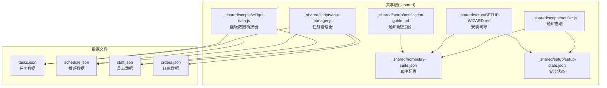
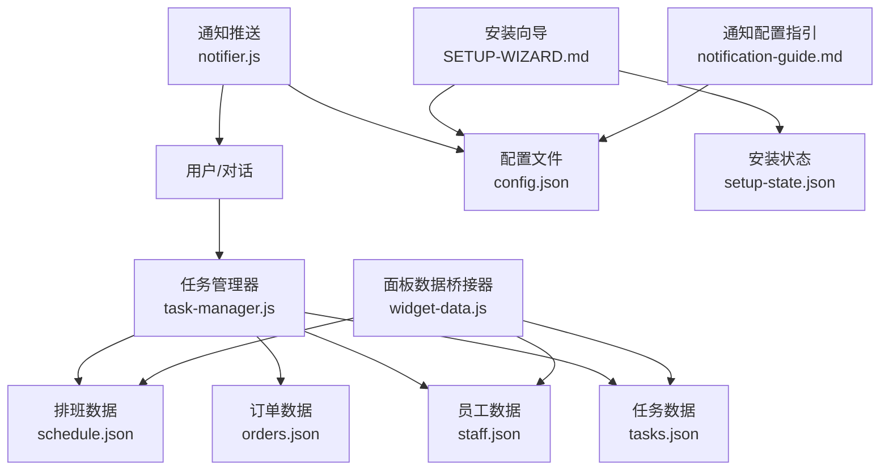
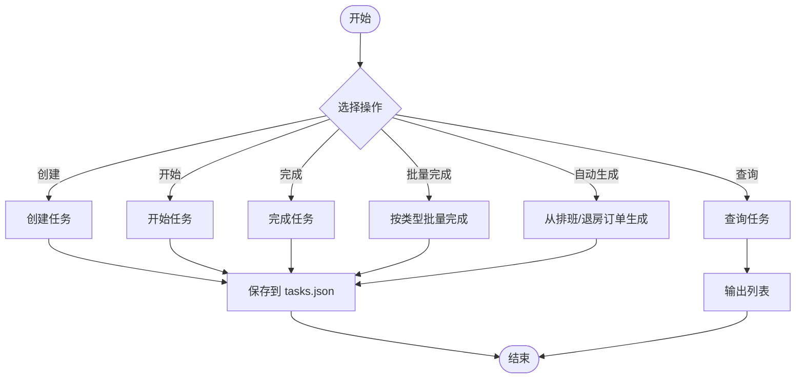
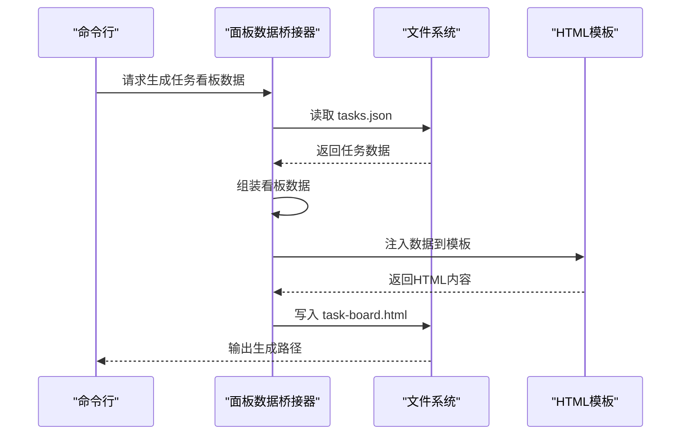
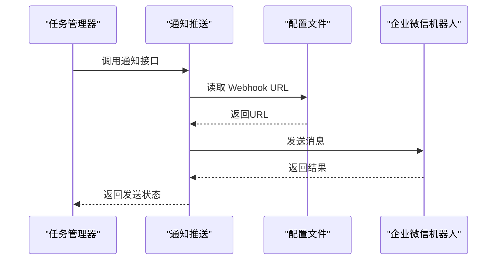
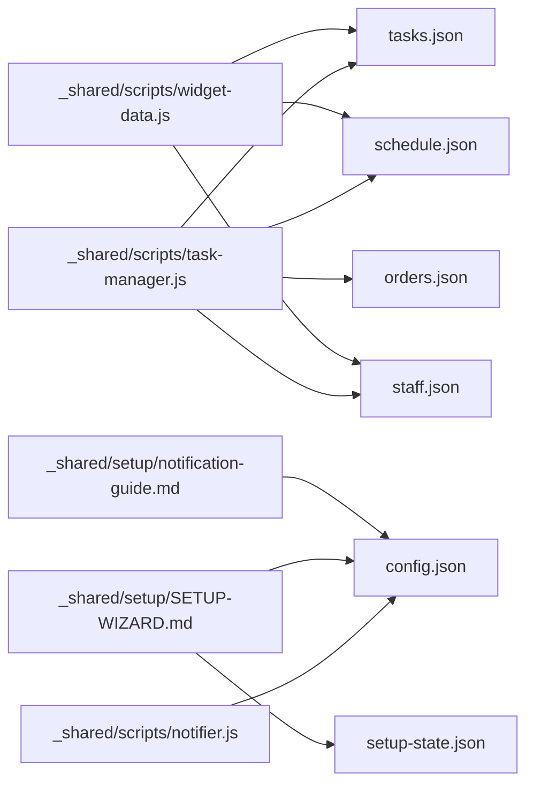

# 任务管理系统

<cite>
**本文档引用的文件**
- [README.md](file://README.md)
- [SKILL.md](file://SKILL.md)
- [_shared/scripts/task-manager.js](file://_shared/scripts/task-manager.js)
- [_shared/scripts/widget-data.js](file://_shared/scripts/widget-data.js)
- [_shared/scripts/notifier.js](file://_shared/scripts/notifier.js)
- [_shared/setup/SETUP-WIZARD.md](file://_shared/setup/SETUP-WIZARD.md)
- [_shared/setup/notification-guide.md](file://_shared/setup/notification-guide.md)
- [_shared/homestay-suite.json](file://_shared/homestay-suite.json)
- [_shared/setup/setup-state.json](file://_shared/setup/setup-state.json)
- [_shared/setup/questions/_common/basic-info.json](file://_shared/setup/questions/_common/basic-info.json)
- [_shared/setup/questions/_common/notification.json](file://_shared/setup/questions/_common/notification.json)
- [_shared/setup/questions/tcm-clinic/services.json](file://_shared/setup/questions/tcm-clinic/services.json)
</cite>

## 目录
1. [简介](#简介)
2. [项目结构](#项目结构)
3. [核心组件](#核心组件)
4. [架构概览](#架构概览)
5. [详细组件分析](#详细组件分析)
6. [依赖关系分析](#依赖关系分析)
7. [性能考虑](#性能考虑)
8. [故障排查指南](#故障排查指南)
9. [结论](#结论)
10. [附录](#附录)

## 简介
本任务管理系统是民宿智能运营 Skill 套件的核心子系统之一，负责任务全生命周期管理，包括任务类型定义（保洁、维修、入住准备、通用）、任务创建与分配、状态跟踪、与排班系统的联动、智能排班建议、任务看板生成与展示、状态变更日志记录以及通知推送等功能。系统通过命令行工具与面板脚本实现可视化展示，支持从排班与退房订单自动创建任务，确保运营流程高效闭环。

## 项目结构
系统采用共享模块与功能模块分离的组织方式：
- 共享层（_shared/）：提供通用能力（任务管理、面板数据桥接、通知推送、安装向导等）
- 功能模块：围绕民宿运营场景提供具体能力（如排班、任务看板、工作台面板等）
- 配置与状态：通过 JSON 文件存储任务、排班、员工、订单等数据，便于持久化与跨模块共享

图表来源
- [_shared/scripts/task-manager.js:1-399](file://_shared/scripts/task-manager.js#L1-399)
- [_shared/scripts/widget-data.js:1-278](file://_shared/scripts/widget-data.js#L1-278)
- [_shared/scripts/notifier.js:1-274](file://_shared/scripts/notifier.js#L1-274)
- [_shared/setup/SETUP-WIZARD.md:1-631](file://_shared/setup/SETUP-WIZARD.md#L1-631)
- [_shared/setup/notification-guide.md:1-71](file://_shared/setup/notification-guide.md#L1-71)
- [_shared/homestay-suite.json:1-7](file://_shared/homestay-suite.json#L1-7)
- [_shared/setup/setup-state.json:1-17](file://_shared/setup/setup-state.json#L1-17)

章节来源
- [README.md:1-5](file://README.md#L1-L5)
- [SKILL.md:118-301](file://SKILL.md#L118-L301)

## 核心组件
- 任务管理器（task-manager.js）
  - 负责任务的创建、开始、完成、批量完成、查询与自动生成
  - 支持从排班与退房订单自动创建保洁任务，支持从新订单生成入住准备任务
  - 提供演示数据注入能力，便于快速验证
- 面板数据桥接器（widget-data.js）
  - 从本地 JSON 文件读取数据，组装为工作台、任务看板、排班面板、报表面板所需的数据结构
  - 支持生成可独立打开的 HTML 文件
- 通知推送（notifier.js）
  - 通过企业微信群机器人 Webhook 推送文本与 Markdown 消息
  - 提供测试消息发送、新订单通知、调价建议通知、告警通知、日报摘要通知等接口
- 安装向导与通知配置（SETUP-WIZARD.md、notification-guide.md）
  - 引导商户完成环境准备、信息采集、团队与通知配置
  - 提供通知配置步骤与可接收的通知类型说明

章节来源
- [_shared/scripts/task-manager.js:1-399](file://_shared/scripts/task-manager.js#L1-L399)
- [_shared/scripts/widget-data.js:1-278](file://_shared/scripts/widget-data.js#L1-L278)
- [_shared/scripts/notifier.js:1-274](file://_shared/scripts/notifier.js#L1-L274)
- [_shared/setup/SETUP-WIZARD.md:1-631](file://_shared/setup/SETUP-WIZARD.md#L1-L631)
- [_shared/setup/notification-guide.md:1-71](file://_shared/setup/notification-guide.md#L1-L71)

## 架构概览
系统以任务为中心，串联排班、订单、员工与通知模块，形成“数据驱动 + 可视化展示 + 自动通知”的闭环：

图表来源
- [_shared/scripts/task-manager.js:1-399](file://_shared/scripts/task-manager.js#L1-L399)
- [_shared/scripts/widget-data.js:1-278](file://_shared/scripts/widget-data.js#L1-L278)
- [_shared/scripts/notifier.js:1-274](file://_shared/scripts/notifier.js#L1-L274)
- [_shared/setup/SETUP-WIZARD.md:1-631](file://_shared/setup/SETUP-WIZARD.md#L1-L631)
- [_shared/setup/notification-guide.md:1-71](file://_shared/setup/notification-guide.md#L1-L71)
- [_shared/homestay-suite.json:1-7](file://_shared/homestay-suite.json#L1-7)
- [_shared/setup/setup-state.json:1-17](file://_shared/setup/setup-state.json#L1-17)

## 详细组件分析

### 任务管理器（task-manager.js）
- 任务类型与状态
  - 类型：保洁（clean）、维修（repair）、入住准备（checkin）、通用（general）
  - 状态：待开始（pending）、进行中（in_progress）、已完成（done）
- 生命周期与关键流程
  - 创建：支持手动创建与从排班/退房订单/新订单自动生成
  - 开始：将待开始任务标记为进行中
  - 完成：支持按房号/任务ID完成单个任务，或按类型批量完成
  - 查询：支持按状态/类型/日期过滤
- 自动生成逻辑
  - 从排班：遍历今日排班，为每个房间创建保洁任务（去重）
  - 从退房订单：筛选今日退房订单，为对应房间创建保洁任务
  - 从新订单：为入住准备生成任务，Deadline 为入住时间
- 数据持久化
  - 任务数据保存在 tasks.json，包含创建/更新/完成时间戳
  - 排班、员工、订单数据分别保存在 schedule.json、staff.json、orders.json

图表来源
- [_shared/scripts/task-manager.js:64-177](file://_shared/scripts/task-manager.js#L64-L177)
- [_shared/scripts/task-manager.js:184-265](file://_shared/scripts/task-manager.js#L184-L265)

章节来源
- [_shared/scripts/task-manager.js:64-265](file://_shared/scripts/task-manager.js#L64-L265)

### 任务看板生成与展示（widget-data.js）
- 数据来源
  - 从 tasks.json 读取任务列表，转换为看板所需字段（id、name、type、status、assignee、time）
- 输出形式
  - 生成独立 HTML 文件（task-board.html），可在浏览器中打开
  - 支持仅输出 JSON 数据用于调试或集成
- 与其他模块的关系
  - 与任务管理器协同：任务状态变化后，重新生成看板以反映最新状态
  - 与通知模块协同：任务创建/完成时可触发通知推送

图表来源
- [_shared/scripts/widget-data.js:92-105](file://_shared/scripts/widget-data.js#L92-L105)
- [_shared/scripts/widget-data.js:186-220](file://_shared/scripts/widget-data.js#L186-L220)

章节来源
- [_shared/scripts/widget-data.js:92-105](file://_shared/scripts/widget-data.js#L92-L105)
- [_shared/scripts/widget-data.js:186-220](file://_shared/scripts/widget-data.js#L186-L220)

### 通知推送（notifier.js）
- 配置与启用
  - 从 config.json 读取企业微信 Webhook URL
  - 当检测到 Webhook URL 已配置时自动启用通知
- 推送类型
  - 文本消息：notify(message, options)
  - Markdown 消息：notifyMarkdown(content)
  - 新订单通知：notifyNewOrder(orderInfo)
  - 调价建议通知：notifyPriceChange(details)
  - 告警通知：notifyAlert(alertInfo)
  - 日报摘要通知：notifyDailyReport(summary)
- 错误处理
  - Webhook URL 缺失时输出明确错误提示
  - 发送失败时返回错误信息，便于排查

图表来源
- [_shared/scripts/notifier.js:33-53](file://_shared/scripts/notifier.js#L33-L53)
- [_shared/scripts/notifier.js:108-136](file://_shared/scripts/notifier.js#L108-L136)
- [_shared/scripts/notifier.js:161-175](file://_shared/scripts/notifier.js#L161-L175)

章节来源
- [_shared/scripts/notifier.js:33-53](file://_shared/scripts/notifier.js#L33-L53)
- [_shared/scripts/notifier.js:108-175](file://_shared/scripts/notifier.js#L108-L175)

### 安装向导与通知配置（SETUP-WIZARD.md、notification-guide.md）
- 安装向导
  - 预选商户类型、环境检查与安装、5步信息采集、团队与通知配置、功能验证清单
  - 支持断点续传与数据修正流程
- 通知配置
  - 3步创建群聊→添加群机器人→复制 Webhook 地址
  - 支持测试消息验证与可接收通知类型说明

章节来源
- [_shared/setup/SETUP-WIZARD.md:1-631](file://_shared/setup/SETUP-WIZARD.md#L1-L631)
- [_shared/setup/notification-guide.md:1-71](file://_shared/setup/notification-guide.md#L1-L71)

## 依赖关系分析
- 模块耦合
  - 任务管理器与面板数据桥接器通过 JSON 文件解耦，便于独立演进
  - 通知模块依赖配置文件，避免硬编码
- 外部依赖
  - 企业微信 Webhook（HTTPS）
  - 文件系统（读写 JSON 文件）
- 潜在循环依赖
  - 当前模块间无直接循环导入，通过文件系统间接耦合

图表来源
- [_shared/scripts/task-manager.js:27-31](file://_shared/scripts/task-manager.js#L27-L31)
- [_shared/scripts/widget-data.js:32-34](file://_shared/scripts/widget-data.js#L32-L34)
- [_shared/scripts/notifier.js:23-31](file://_shared/scripts/notifier.js#L23-L31)
- [_shared/setup/SETUP-WIZARD.md:23-25](file://_shared/setup/SETUP-WIZARD.md#L23-L25)
- [_shared/setup/notification-guide.md:1-12](file://_shared/setup/notification-guide.md#L1-L12)

章节来源
- [_shared/scripts/task-manager.js:27-31](file://_shared/scripts/task-manager.js#L27-L31)
- [_shared/scripts/widget-data.js:32-34](file://_shared/scripts/widget-data.js#L32-L34)
- [_shared/scripts/notifier.js:23-31](file://_shared/scripts/notifier.js#L23-L31)
- [_shared/setup/SETUP-WIZARD.md:23-25](file://_shared/setup/SETUP-WIZARD.md#L23-L25)
- [_shared/setup/notification-guide.md:1-12](file://_shared/setup/notification-guide.md#L1-L12)

## 性能考虑
- I/O 模型
  - 任务与面板数据均通过 JSON 文件持久化，读写简单可靠，适合中小规模数据
- 扩展建议
  - 数据量增长时可引入轻量数据库替代 JSON 文件
  - 面板生成可增加缓存策略，避免频繁重复渲染
  - 通知发送可增加重试与限流机制，提升稳定性

## 故障排查指南
- 通知未发送
  - 检查 config.json 中企业微信 Webhook URL 是否配置
  - 使用测试命令验证配置有效性
- 任务看板空白
  - 确认 tasks.json 是否存在且格式正确
  - 重新生成看板 HTML 文件
- 自动生成任务失败
  - 检查 schedule.json 或 orders.json 是否存在且包含当日数据
  - 确认任务去重逻辑不会误判已有任务

章节来源
- [_shared/scripts/notifier.js:213-256](file://_shared/scripts/notifier.js#L213-L256)
- [_shared/scripts/widget-data.js:228-268](file://_shared/scripts/widget-data.js#L228-L268)
- [_shared/scripts/task-manager.js:184-251](file://_shared/scripts/task-manager.js#L184-L251)

## 结论
本任务管理系统以简洁的文件存储为核心，结合任务管理器、面板数据桥接器与通知模块，实现了从任务创建、分配、完成到看板展示与通知推送的完整闭环。通过与排班系统和订单系统的联动，系统能够自动派生任务，降低人工干预成本，提升运营效率。建议在生产环境中关注数据规模扩展与稳定性优化，持续完善日志与监控能力。

## 附录
- 快速上手
  - 安装与初始化：通过安装向导完成环境与配置
  - 创建任务：使用命令行或对话触发任务创建
  - 查看看板：生成任务看板 HTML 文件进行可视化查看
  - 配置通知：按指引完成企业微信通知配置
- 相关链接
  - 套件主页与技能地图
  - 中医馆智能运营套件与个人知识库

章节来源
- [SKILL.md:362-379](file://SKILL.md#L362-L379)
- [_shared/homestay-suite.json:1-7](file://_shared/homestay-suite.json#L1-L7)
- [_shared/setup/questions/_common/basic-info.json:1-10](file://_shared/setup/questions/_common/basic-info.json#L1-L10)
- [_shared/setup/questions/_common/notification.json:1-12](file://_shared/setup/questions/_common/notification.json#L1-L12)
- [_shared/setup/questions/tcm-clinic/services.json:1-8](file://_shared/setup/questions/tcm-clinic/services.json#L1-L8)
- [_shared/setup/setup-state.json:1-17](file://_shared/setup/setup-state.json#L1-L17)