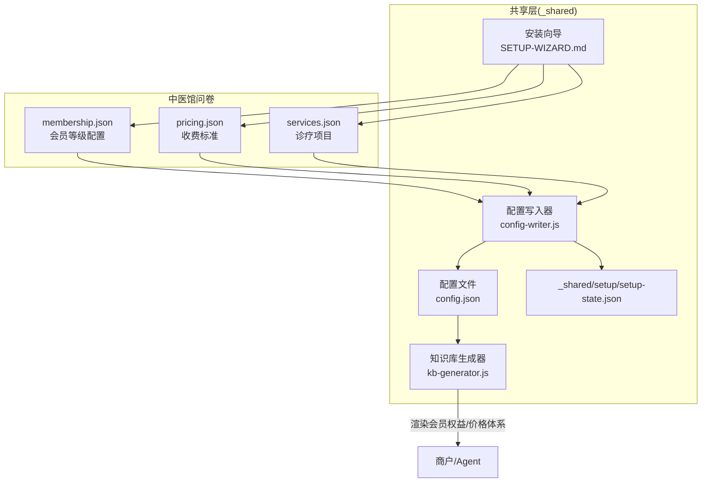
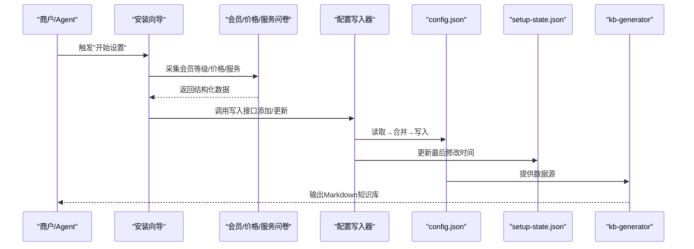
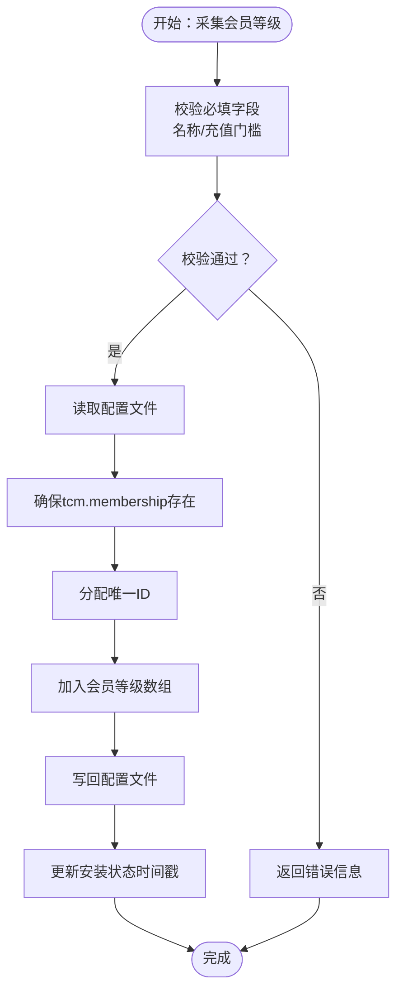
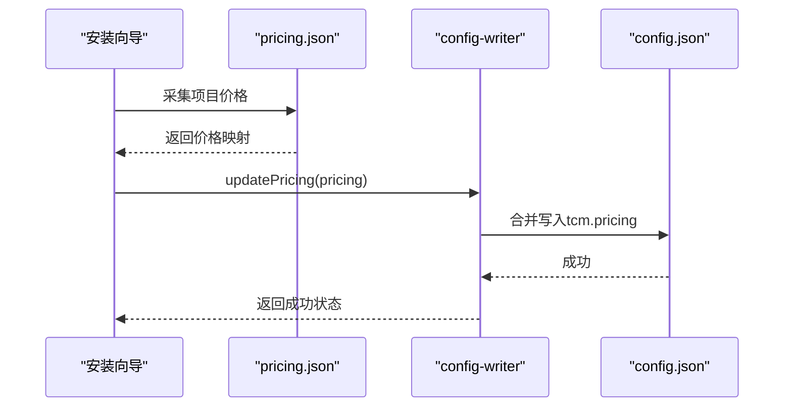
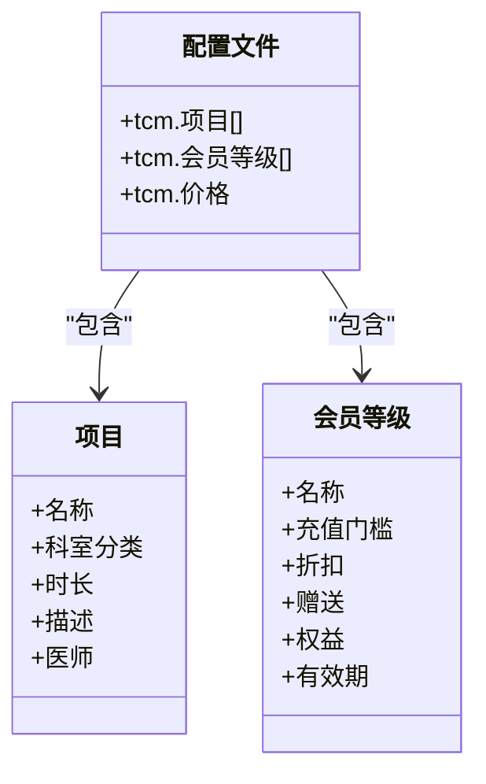
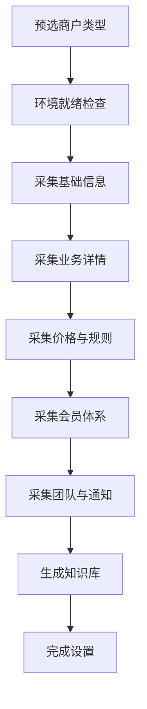
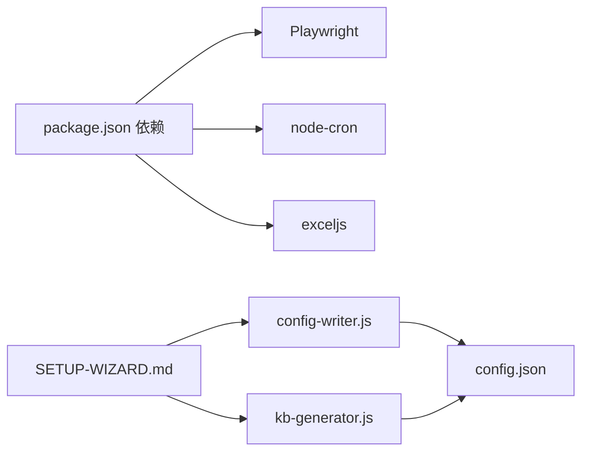

# 会员管理系统

<cite>
**本文档引用的文件**
- [README.md](file://README.md)
- [SKILL.md](file://SKILL.md)
- [_shared/setup/SETUP-WIZARD.md](file://_shared/setup/SETUP-WIZARD.md)
- [_shared/setup/questions/tcm-clinic/membership.json](file://_shared/setup/questions/tcm-clinic/membership.json)
- [_shared/setup/questions/tcm-clinic/pricing.json](file://_shared/setup/questions/tcm-clinic/pricing.json)
- [_shared/setup/questions/tcm-clinic/services.json](file://_shared/setup/questions/tcm-clinic/services.json)
- [_shared/setup/config-writer.js](file://_shared/setup/config-writer.js)
- [_shared/setup/kb-generator.js](file://_shared/setup/kb-generator.js)
- [_shared/homestay-suite.json](file://_shared/homestay-suite.json)
- [_shared/package.json](file://_shared/package.json)
- [_shared/setup/setup-state.json](file://_shared/setup/setup-state.json)
- [_shared/docs/USER-MANUAL.md](file://_shared/docs/USER-MANUAL.md)
</cite>

## 目录
1. [简介](#简介)
2. [项目结构](#项目结构)
3. [核心组件](#核心组件)
4. [架构概览](#架构概览)
5. [详细组件分析](#详细组件分析)
6. [依赖关系分析](#依赖关系分析)
7. [性能考虑](#性能考虑)
8. [故障排查指南](#故障排查指南)
9. [结论](#结论)
10. [附录](#附录)

## 简介
本文件面向“中医馆智能运营套件”中的会员管理子系统，围绕会员等级配置、积分与储值体系、会员权益管理等核心功能，系统梳理配置文件格式、数据结构与写入流程，并提供实际业务场景的操作示例与迁移注意事项。该系统以对话式安装向导为核心入口，通过标准化问卷采集会员体系相关信息，借助配置写入工具与知识库生成器实现零接触配置与动态知识库输出。

## 项目结构
- 套件定位：中医馆/诊所场景下的轻量收银、会员管理、微信智能客服、诊疗项目管理与进销存管理。
- 会员管理入口：安装向导第四步“环境与服务”中，针对“中医馆”类型采集会员体系。
- 配置与数据：通过配置写入工具将会员等级、价格体系、服务项目等写入共享配置文件，知识库生成器据此输出Markdown知识库，供Agent与商户使用。

图表来源
- [_shared/setup/SETUP-WIZARD.md:340-356](file://_shared/setup/SETUP-WIZARD.md#L340-L356)
- [_shared/setup/questions/tcm-clinic/membership.json:1-9](file://_shared/setup/questions/tcm-clinic/membership.json#L1-L9)
- [_shared/setup/questions/tcm-clinic/pricing.json:1-8](file://_shared/setup/questions/tcm-clinic/pricing.json#L1-L8)
- [_shared/setup/questions/tcm-clinic/services.json:1-8](file://_shared/setup/questions/tcm-clinic/services.json#L1-L8)
- [_shared/setup/config-writer.js:404-435](file://_shared/setup/config-writer.js#L404-L435)
- [_shared/setup/kb-generator.js:490-507](file://_shared/setup/kb-generator.js#L490-L507)

章节来源
- [README.md:1-5](file://README.md#L1-L5)
- [SKILL.md:62-115](file://SKILL.md#L62-L115)
- [_shared/setup/SETUP-WIZARD.md:340-356](file://_shared/setup/SETUP-WIZARD.md#L340-L356)

## 核心组件
- 安装向导（SETUP-WIZARD）：负责引导商户完成五步设置，第四步专门采集中医馆会员体系与价格、服务信息。
- 配置写入器（config-writer）：提供统一的写入接口，确保“读取→合并→写入”，并维护安装状态文件。
- 知识库生成器（kb-generator）：根据配置文件动态渲染Markdown知识库，包含会员权益与收费标准。
- 问卷定义（membership.json、pricing.json、services.json）：定义采集字段、示例与必填要求。
- 配置文件（config.json）：系统运行期的唯一权威数据源；安装状态文件（setup-state.json）记录设置进度与时间戳。

章节来源
- [_shared/setup/SETUP-WIZARD.md:340-356](file://_shared/setup/SETUP-WIZARD.md#L340-L356)
- [_shared/setup/config-writer.js:1-50](file://_shared/setup/config-writer.js#L1-L50)
- [_shared/setup/kb-generator.js:490-507](file://_shared/setup/kb-generator.js#L490-L507)
- [_shared/setup/questions/tcm-clinic/membership.json:1-9](file://_shared/setup/questions/tcm-clinic/membership.json#L1-L9)
- [_shared/setup/questions/tcm-clinic/pricing.json:1-8](file://_shared/setup/questions/tcm-clinic/pricing.json#L1-L8)
- [_shared/setup/questions/tcm-clinic/services.json:1-8](file://_shared/setup/questions/tcm-clinic/services.json#L1-L8)
- [_shared/setup/setup-state.json:1-17](file://_shared/setup/setup-state.json#L1-L17)

## 架构概览
会员管理的数据流从安装向导采集开始，经配置写入器持久化到配置文件，随后由知识库生成器渲染为可读的知识库内容，最终服务于Agent与商户的日常运营。

图表来源
- [_shared/setup/SETUP-WIZARD.md:340-356](file://_shared/setup/SETUP-WIZARD.md#L340-L356)
- [_shared/setup/config-writer.js:404-435](file://_shared/setup/config-writer.js#L404-L435)
- [_shared/setup/kb-generator.js:490-507](file://_shared/setup/kb-generator.js#L490-L507)

## 详细组件分析

### 1. 会员等级配置（membership.json）
- 字段定义与示例：包含等级名称、充值门槛、折扣、充值赠送、专属权益、有效期等，支持必填与选填组合。
- 写入流程：安装向导第四步逐级采集后，调用配置写入器的“添加会员等级”接口，生成唯一ID并写入配置文件。
- 知识库渲染：知识库生成器将会员等级信息渲染为Markdown，便于Agent与商户查阅。

图表来源
- [_shared/setup/questions/tcm-clinic/membership.json:1-9](file://_shared/setup/questions/tcm-clinic/membership.json#L1-L9)
- [_shared/setup/config-writer.js:404-417](file://_shared/setup/config-writer.js#L404-L417)

章节来源
- [_shared/setup/questions/tcm-clinic/membership.json:1-9](file://_shared/setup/questions/tcm-clinic/membership.json#L1-L9)
- [_shared/setup/config-writer.js:404-417](file://_shared/setup/config-writer.js#L404-L417)
- [_shared/setup/kb-generator.js:490-507](file://_shared/setup/kb-generator.js#L490-L507)

### 2. 收费标准与会员价（pricing.json）
- 字段定义：项目名称、单次价格、疗程价格、会员价、首次体验价等，要求与服务项目一一对应。
- 写入流程：安装向导第三步采集后，调用“更新收费标准”接口，合并到配置文件对应区块。
- 知识库渲染：渲染为Markdown表格，清晰展示各类价格策略。

图表来源
- [_shared/setup/questions/tcm-clinic/pricing.json:1-8](file://_shared/setup/questions/tcm-clinic/pricing.json#L1-L8)
- [_shared/setup/config-writer.js:427-435](file://_shared/setup/config-writer.js#L427-L435)
- [_shared/setup/kb-generator.js:478-488](file://_shared/setup/kb-generator.js#L478-L488)

章节来源
- [_shared/setup/questions/tcm-clinic/pricing.json:1-8](file://_shared/setup/questions/tcm-clinic/pricing.json#L1-L8)
- [_shared/setup/config-writer.js:427-435](file://_shared/setup/config-writer.js#L427-L435)
- [_shared/setup/kb-generator.js:478-488](file://_shared/setup/kb-generator.js#L478-L488)

### 3. 诊疗项目与会员权益联动（services.json + membership.json）
- 项目采集：名称、所属科室/分类、单次时长、描述/适应症、操作医师等。
- 权益联动：会员价与项目绑定，知识库同时渲染项目与会员权益，便于营销与服务匹配。

图表来源
- [_shared/setup/questions/tcm-clinic/services.json:1-8](file://_shared/setup/questions/tcm-clinic/services.json#L1-L8)
- [_shared/setup/questions/tcm-clinic/membership.json:1-9](file://_shared/setup/questions/tcm-clinic/membership.json#L1-L9)
- [_shared/setup/config-writer.js:404-435](file://_shared/setup/config-writer.js#L404-L435)

章节来源
- [_shared/setup/questions/tcm-clinic/services.json:1-8](file://_shared/setup/questions/tcm-clinic/services.json#L1-L8)
- [_shared/setup/questions/tcm-clinic/membership.json:1-9](file://_shared/setup/questions/tcm-clinic/membership.json#L1-L9)
- [_shared/setup/config-writer.js:404-435](file://_shared/setup/config-writer.js#L404-L435)

### 4. 安装向导与配置写入流程
- 类型预选：仅展示白名单内的商户类型，默认包含“中医馆/诊所”。
- 步骤四采集会员体系：等级、充值门槛、折扣、权益、有效期等。
- 写入与状态：每次写入后同步更新安装状态文件的时间戳，便于追踪配置变更。

图表来源
- [_shared/homestay-suite.json:1-7](file://_shared/homestay-suite.json#L1-L7)
- [_shared/setup/SETUP-WIZARD.md:340-356](file://_shared/setup/SETUP-WIZARD.md#L340-L356)
- [_shared/setup/config-writer.js:52-58](file://_shared/setup/config-writer.js#L52-L58)

章节来源
- [_shared/homestay-suite.json:1-7](file://_shared/homestay-suite.json#L1-L7)
- [_shared/setup/SETUP-WIZARD.md:340-356](file://_shared/setup/SETUP-WIZARD.md#L340-L356)
- [_shared/setup/config-writer.js:52-58](file://_shared/setup/config-writer.js#L52-L58)

## 依赖关系分析
- 运行时依赖：Playwright、node-cron、exceljs 等，用于浏览器初始化、定时任务与Excel处理。
- 共享依赖：配置写入器与知识库生成器依赖共享配置文件作为数据源。
- 环境脚本：package.json 提供浏览器初始化与检查脚本，保障竞品采集与OTA相关功能的前置条件。

图表来源
- [_shared/package.json:1-20](file://_shared/package.json#L1-L20)
- [_shared/setup/config-writer.js:26-31](file://_shared/setup/config-writer.js#L26-L31)
- [_shared/setup/kb-generator.js:478-507](file://_shared/setup/kb-generator.js#L478-L507)

章节来源
- [_shared/package.json:1-20](file://_shared/package.json#L1-L20)
- [_shared/setup/config-writer.js:26-31](file://_shared/setup/config-writer.js#L26-L31)
- [_shared/setup/kb-generator.js:478-507](file://_shared/setup/kb-generator.js#L478-L507)

## 性能考虑
- 写入策略：采用“读取→合并→写入”模式，避免字段覆盖，减少IO次数。
- 状态追踪：每次写入后更新安装状态时间戳，便于审计与回滚。
- 知识库渲染：按需渲染Markdown，避免重复计算，提升Agent响应速度。

## 故障排查指南
- 环境检查：通过环境自检脚本检查依赖、配置、向导与知识库状态，输出修复建议。
- 配置修复：若配置文件损坏，可通过修复脚本进行修复。
- 通知配置：若企业微信Webhook未配置，不影响核心功能，可在对话中随时配置并测试。

章节来源
- [_shared/docs/USER-MANUAL.md:38-105](file://_shared/docs/USER-MANUAL.md#L38-L105)
- [_shared/scripts/check-env.js:163-195](file://_shared/scripts/check-env.js#L163-L195)

## 结论
本会员管理系统通过安装向导与标准化问卷，将中医馆的会员等级、价格体系与服务项目纳入统一配置文件，配合配置写入器与知识库生成器，实现了零接触配置与动态知识库输出。系统具备良好的扩展性与可维护性，适用于中小规模中医馆/诊所的日常运营。

## 附录

### A. 配置文件格式说明（会员相关）
- 位置：共享配置文件（config.json）
- 结构要点：
  - tcm.membership：会员等级数组，包含等级名称、充值门槛、折扣、赠送、专属权益、有效期等字段。
  - tcm.pricing：价格策略映射，包含单次价、疗程价、会员价、首次体验价等。
  - tcm.treatments：服务项目数组，包含项目名称、科室分类、时长、描述、医师等。
- 写入约束：所有写入遵循“读取→合并→写入”，并更新安装状态时间戳。

章节来源
- [_shared/setup/config-writer.js:404-435](file://_shared/setup/config-writer.js#L404-L435)
- [_shared/setup/kb-generator.js:478-507](file://_shared/setup/kb-generator.js#L478-L507)

### B. 实际操作示例与业务场景
- 场景一：新增会员等级
  - 步骤：安装向导第四步采集“等级名称/充值门槛/折扣/权益/有效期”，写入后知识库自动渲染。
  - 触发词：安装向导中“会员体系”采集环节。
- 场景二：设置会员价
  - 步骤：安装向导第三步采集“项目名称/单次价/疗程价/会员价/首次体验价”，写入后知识库输出价格表。
  - 触发词：安装向导中“收费标准”采集环节。
- 场景三：查询会员权益
  - 步骤：Agent读取知识库，输出Markdown格式的会员权益说明，便于营销与客户服务。

章节来源
- [_shared/setup/SETUP-WIZARD.md:340-356](file://_shared/setup/SETUP-WIZARD.md#L340-L356)
- [_shared/setup/kb-generator.js:490-507](file://_shared/setup/kb-generator.js#L490-L507)

### C. 数据迁移注意事项
- 迁移前备份：在执行任何写入操作前，建议备份config.json与setup-state.json。
- 字段兼容：新增字段时，保持与既有字段的命名一致，避免破坏既有逻辑。
- 状态同步：每次写入后，安装状态文件会自动更新时间戳，迁移后需确保时间戳与配置一致。
- 知识库一致性：迁移后重新生成知识库，确保Agent与商户侧信息一致。

章节来源
- [_shared/setup/config-writer.js:52-58](file://_shared/setup/config-writer.js#L52-L58)
- [_shared/setup/kb-generator.js:490-507](file://_shared/setup/kb-generator.js#L490-L507)