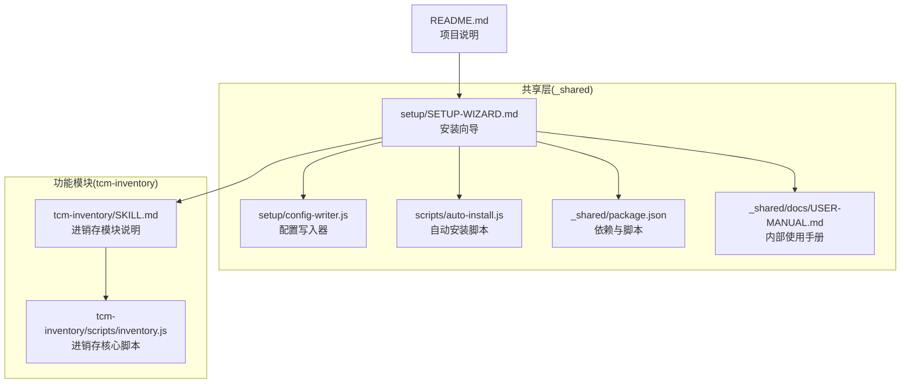
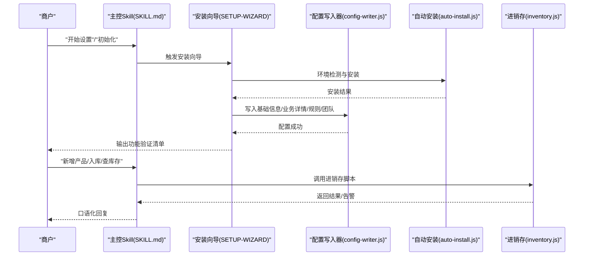
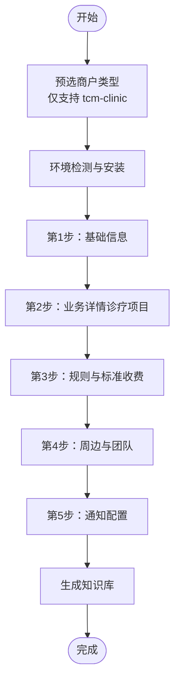
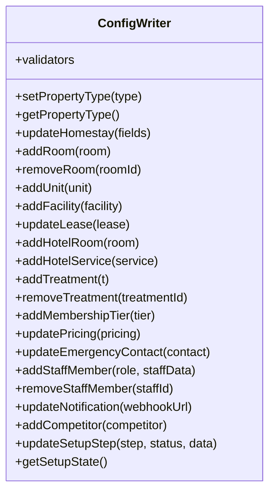
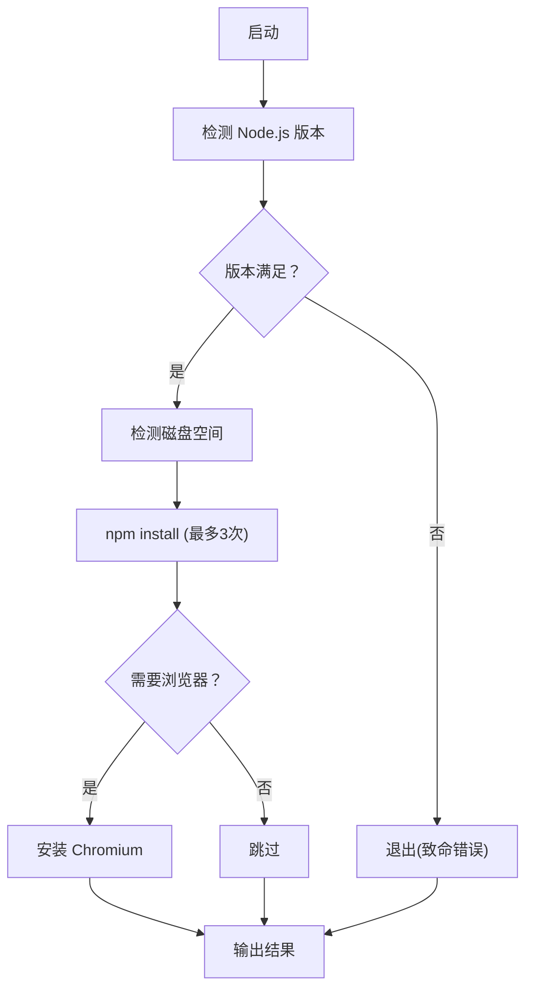
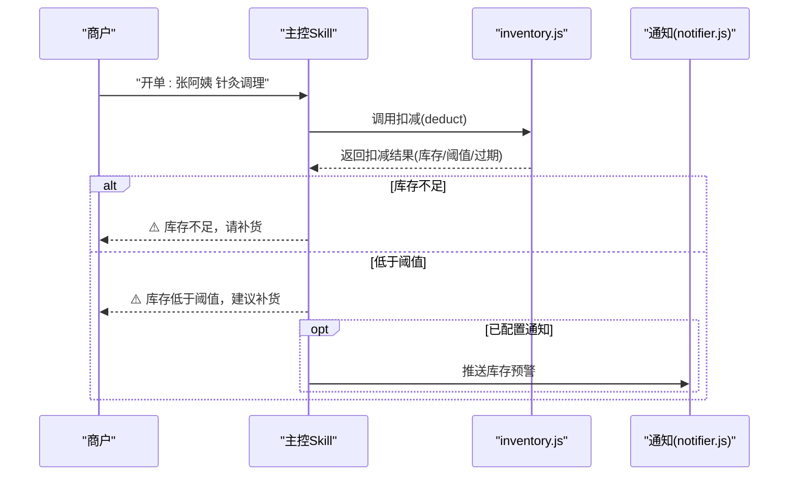
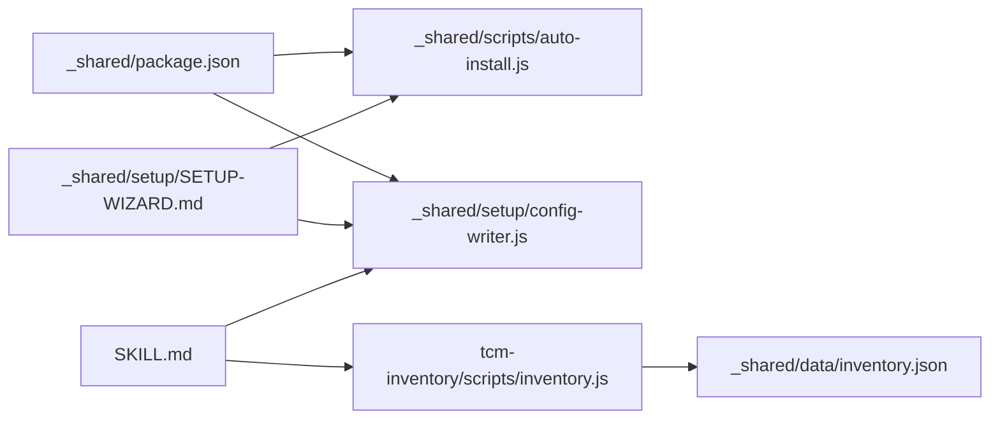

# 功能模块

<cite>
**本文档引用的文件**
- [README.md](file://README.md)
- [SKILL.md](file://SKILL.md)
- [_shared/docs/USER-MANUAL.md](file://_shared/docs/USER-MANUAL.md)
- [tcm-inventory/SKILL.md](file://tcm-inventory/SKILL.md)
- [_shared/setup/SETUP-WIZARD.md](file://_shared/setup/SETUP-WIZARD.md)
- [_shared/package.json](file://_shared/package.json)
- [_shared/setup/config-writer.js](file://_shared/setup/config-writer.js)
- [_shared/scripts/auto-install.js](file://_shared/scripts/auto-install.js)
- [_shared/homestay-suite.json](file://_shared/homestay-suite.json)
- [_shared/setup/setup-state.json](file://_shared/setup/setup-state.json)
- [_shared/setup/questions/tcm-clinic/services.json](file://_shared/setup/questions/tcm-clinic/services.json)
- [_shared/setup/questions/tcm-clinic/membership.json](file://_shared/setup/questions/tcm-clinic/membership.json)
- [_shared/setup/questions/tcm-clinic/pricing.json](file://_shared/setup/questions/tcm-clinic/pricing.json)
- [tcm-inventory/scripts/inventory.js](file://tcm-inventory/scripts/inventory.js)
</cite>

## 目录
1. [简介](#简介)
2. [项目结构](#项目结构)
3. [核心组件](#核心组件)
4. [架构总览](#架构总览)
5. [详细组件分析](#详细组件分析)
6. [依赖分析](#依赖分析)
7. [性能考虑](#性能考虑)
8. [故障排查指南](#故障排查指南)
9. [结论](#结论)
10. [附录](#附录)

## 简介
本套件为“中医馆智能运营”Skill套件，面向中医馆/诊所场景，提供轻量收银、会员管理、微信智能客服、诊疗项目管理、进销存管理等核心能力。系统以“对话即操作”的方式，通过安装向导完成环境与配置初始化，随后即可在对话中完成日常运营工作。

- 支持场景：中医馆/诊所
- 核心能力：轻量收银、会员管理、微信智能客服、诊疗项目管理、进销存管理
- 使用方式：在对话中直接触发相应功能，无需复杂操作

**章节来源**
- [README.md:1-5](file://README.md#L1-L5)

## 项目结构
仓库采用“共享层 + 功能模块”的组织方式：
- 共享层（_shared）：安装向导、配置写入器、通知推送、面板生成、环境检测、脚本工具等
- 功能模块（tcm-inventory）：中医馆进销存管理
- 套件主入口（SKILL.md）：定义触发词、功能说明、行为规则与使用方式
- 用户手册（_shared/docs/USER-MANUAL.md）：Agent内部参考，指导如何口语化回答商户问题

**图表来源**
- [README.md:1-5](file://README.md#L1-L5)
- [SKILL.md:1-379](file://SKILL.md#L1-L379)
- [_shared/setup/SETUP-WIZARD.md:1-631](file://_shared/setup/SETUP-WIZARD.md#L1-L631)
- [_shared/package.json:1-20](file://_shared/package.json#L1-L20)
- [_shared/docs/USER-MANUAL.md:1-155](file://_shared/docs/USER-MANUAL.md#L1-L155)
- [tcm-inventory/SKILL.md:1-210](file://tcm-inventory/SKILL.md#L1-L210)
- [tcm-inventory/scripts/inventory.js:1-178](file://tcm-inventory/scripts/inventory.js#L1-L178)

**章节来源**
- [README.md:1-5](file://README.md#L1-L5)
- [SKILL.md:1-379](file://SKILL.md#L1-L379)
- [_shared/docs/USER-MANUAL.md:1-155](file://_shared/docs/USER-MANUAL.md#L1-L155)
- [tcm-inventory/SKILL.md:1-210](file://tcm-inventory/SKILL.md#L1-L210)

## 核心组件
- 安装向导（SETUP-WIZARD）：引导商户完成环境检测、基础信息、业务详情、规则与标准、团队与通知等5步设置，生成知识库并输出功能验证清单
- 配置写入器（config-writer.js）：提供多商户类型的数据写入与校验，确保配置安全、一致
- 自动安装脚本（auto-install.js）：检测 Node/磁盘、自动安装依赖与浏览器（按需），输出安装结果
- 进销存模块（tcm-inventory）：产品/服务目录、库存入库、开单扣减、库存查询、库存预警、效期管理
- 用户手册（USER-MANUAL）：Agent内部参考，指导口语化回答与快速上手

**章节来源**
- [_shared/setup/SETUP-WIZARD.md:1-631](file://_shared/setup/SETUP-WIZARD.md#L1-L631)
- [_shared/setup/config-writer.js:1-603](file://_shared/setup/config-writer.js#L1-L603)
- [_shared/scripts/auto-install.js:1-230](file://_shared/scripts/auto-install.js#L1-L230)
- [tcm-inventory/SKILL.md:1-210](file://tcm-inventory/SKILL.md#L1-L210)
- [_shared/docs/USER-MANUAL.md:1-155](file://_shared/docs/USER-MANUAL.md#L1-L155)

## 架构总览
系统以“对话驱动 + 共享执行层 + 功能模块”的方式运行：
- 对话触发词进入主控Skill（SKILL.md），根据propertyType路由到对应功能
- 共享层负责环境初始化、配置管理、通知推送、面板生成等
- 功能模块（如tcm-inventory）提供具体业务能力，读写共享数据文件

**图表来源**
- [SKILL.md:1-379](file://SKILL.md#L1-L379)
- [_shared/setup/SETUP-WIZARD.md:1-631](file://_shared/setup/SETUP-WIZARD.md#L1-L631)
- [_shared/scripts/auto-install.js:1-230](file://_shared/scripts/auto-install.js#L1-L230)
- [_shared/setup/config-writer.js:1-603](file://_shared/setup/config-writer.js#L1-L603)
- [tcm-inventory/scripts/inventory.js:1-178](file://tcm-inventory/scripts/inventory.js#L1-L178)

## 详细组件分析

### 安装向导（SETUP-WIZARD）
- 设计理念：零技术门槛、可中断可恢复、10分钟内完成5步设置
- 关键流程：
  - 预选商户类型（仅支持“中医馆/诊所”）
  - 环境检测与自动安装
  - 采集基础信息、业务详情（诊疗项目）、规则与标准（收费）、周边与团队、通知配置
  - 生成知识库与功能验证清单
- 数据来源：homestay-suite.json限定setupTypes为“tcm-clinic”，questions目录提供问卷定义

**图表来源**
- [_shared/setup/SETUP-WIZARD.md:50-464](file://_shared/setup/SETUP-WIZARD.md#L50-L464)
- [_shared/homestay-suite.json:1-7](file://_shared/homestay-suite.json#L1-L7)

**章节来源**
- [_shared/setup/SETUP-WIZARD.md:1-631](file://_shared/setup/SETUP-WIZARD.md#L1-L631)
- [_shared/homestay-suite.json:1-7](file://_shared/homestay-suite.json#L1-L7)
- [_shared/setup/questions/tcm-clinic/services.json:1-8](file://_shared/setup/questions/tcm-clinic/services.json#L1-L8)
- [_shared/setup/questions/tcm-clinic/pricing.json:1-8](file://_shared/setup/questions/tcm-clinic/pricing.json#L1-L8)
- [_shared/setup/questions/tcm-clinic/membership.json:1-9](file://_shared/setup/questions/tcm-clinic/membership.json#L1-L9)

### 配置写入器（config-writer.js）
- 设计理念：所有配置变更通过统一工具执行，避免直接编辑JSON
- 能力范围：
  - 多商户类型支持：民宿、公寓、酒店、中医馆
  - 通用字段：紧急联系人、员工管理
  - 业务字段：民宿房型、公寓房源/设施、酒店房型/服务、中医馆项目/会员/价格
  - 通知配置：企业微信Webhook
  - 安装状态：记录设置进度与完成状态
- 校验规则：时间格式、电话格式、金额、必填字段等

**图表来源**
- [_shared/setup/config-writer.js:1-603](file://_shared/setup/config-writer.js#L1-L603)

**章节来源**
- [_shared/setup/config-writer.js:1-603](file://_shared/setup/config-writer.js#L1-L603)
- [_shared/setup/setup-state.json:1-17](file://_shared/setup/setup-state.json#L1-L17)

### 自动安装脚本（auto-install.js）
- 设计理念：一键安装，自动检测前置条件，按需安装浏览器
- 关键能力：
  - Node版本与磁盘空间检测
  - npm install（最多重试3次）
  - Playwright Chromium（按需安装）
  - 结果汇总与修复建议

**图表来源**
- [_shared/scripts/auto-install.js:1-230](file://_shared/scripts/auto-install.js#L1-L230)
- [_shared/package.json:1-20](file://_shared/package.json#L1-L20)

**章节来源**
- [_shared/scripts/auto-install.js:1-230](file://_shared/scripts/auto-install.js#L1-L230)
- [_shared/package.json:1-20](file://_shared/package.json#L1-L20)

### 进销存模块（tcm-inventory）
- 设计理念：与收银联动，自动扣减库存；支持低库存/临期预警；效期自动计算
- 核心能力：
  - 产品/服务目录：新增/修改/删除/查询
  - 库存入库：支持生产日期与有效期录入
  - 开单扣减：与收银单据联动，库存不足与低于阈值自动告警
  - 库存查询：实时库存、低库存/临期标记
  - 库存预警：阈值可配置，支持企业微信通知
  - 效期管理：自动计算到期日，提前30天预警
- 数据文件：_shared/data/inventory.json

**图表来源**
- [tcm-inventory/SKILL.md:1-210](file://tcm-inventory/SKILL.md#L1-L210)
- [tcm-inventory/scripts/inventory.js:1-178](file://tcm-inventory/scripts/inventory.js#L1-L178)

**章节来源**
- [tcm-inventory/SKILL.md:1-210](file://tcm-inventory/SKILL.md#L1-L210)
- [tcm-inventory/scripts/inventory.js:1-178](file://tcm-inventory/scripts/inventory.js#L1-L178)

### 智能客服系统（微信智能客服）
- 设计理念：基于知识库回答常见问题；情绪分级与差异化回复；差评模板自动生成；入住指引个性化
- 使用方式：在对话中直接提问，如“WiFi密码是什么”、“客人说房间太差了”、“帮我回一条差评”
- 与通知模块配合：任务派发/完成/告警自动推送至企业微信群

**章节来源**
- [SKILL.md:121-137](file://SKILL.md#L121-L137)
- [_shared/docs/USER-MANUAL.md:40-48](file://_shared/docs/USER-MANUAL.md#L40-L48)

### 会员管理系统
- 设计理念：支持多等级会员，储值门槛、折扣、权益与有效期配置
- 使用方式：录入会员等级与规则，对话中查询会员信息与消费记录
- 与通知模块配合：大额订单、新卡、余额不足自动通知

**章节来源**
- [_shared/setup/questions/tcm-clinic/membership.json:1-9](file://_shared/setup/questions/tcm-clinic/membership.json#L1-L9)
- [SKILL.md:532-556](file://SKILL.md#L532-L556)

### 诊疗项目管理
- 设计理念：按科室分类，支持时长、描述、适应症、操作医师等字段
- 使用方式：录入项目信息，与收银/库存建立关联
- 与收费模块配合：按项目定价，支持疗程价、会员价、首次体验价

**章节来源**
- [_shared/setup/questions/tcm-clinic/services.json:1-8](file://_shared/setup/questions/tcm-clinic/services.json#L1-L8)
- [_shared/setup/questions/tcm-clinic/pricing.json:1-8](file://_shared/setup/questions/tcm-clinic/pricing.json#L1-L8)
- [SKILL.md:532-556](file://SKILL.md#L532-L556)

### 任务管理系统（概念性说明）
- 设计理念：任务类型（保洁/维修/入住准备/通用），支持创建、完成、看板展示
- 与通知模块配合：任务派发/完成自动推送
- 与面板模块配合：生成任务看板HTML文件，便于可视化查看

**章节来源**
- [SKILL.md:147-156](file://SKILL.md#L147-L156)
- [_shared/docs/USER-MANUAL.md:56-62](file://_shared/docs/USER-MANUAL.md#L56-L62)

## 依赖分析
- 外部依赖：ExcelJS、node-cron、Playwright（按需）
- 内部依赖：
  - 安装向导依赖自动安装脚本与配置写入器
  - 进销存模块依赖共享数据文件与通知模块
  - 主控Skill根据propertyType路由到对应功能

**图表来源**
- [_shared/package.json:1-20](file://_shared/package.json#L1-L20)
- [_shared/scripts/auto-install.js:1-230](file://_shared/scripts/auto-install.js#L1-L230)
- [_shared/setup/config-writer.js:1-603](file://_shared/setup/config-writer.js#L1-L603)
- [_shared/setup/SETUP-WIZARD.md:1-631](file://_shared/setup/SETUP-WIZARD.md#L1-L631)
- [tcm-inventory/scripts/inventory.js:1-178](file://tcm-inventory/scripts/inventory.js#L1-L178)

**章节来源**
- [_shared/package.json:1-20](file://_shared/package.json#L1-L20)
- [_shared/setup/SETUP-WIZARD.md:1-631](file://_shared/setup/SETUP-WIZARD.md#L1-L631)
- [_shared/setup/config-writer.js:1-603](file://_shared/setup/config-writer.js#L1-L603)
- [tcm-inventory/scripts/inventory.js:1-178](file://tcm-inventory/scripts/inventory.js#L1-L178)

## 性能考虑
- 安装阶段：npm install与Playwright安装可能受网络影响，脚本内置重试与超时控制
- 数据读写：配置与库存数据采用本地JSON文件，建议定期备份；避免频繁并发写入
- 通知推送：企业微信Webhook为异步推送，建议在高并发场景下限流与去抖
- 面板生成：HTML文件生成为一次性操作，建议缓存常用视图

## 故障排查指南
- 环境自检：触发“检查环境”/“状态检查”等关键词，系统执行环境自检脚本，输出依赖/配置/向导/知识库/通知/竞品采集器等6项检查结果与修复建议
- 安装失败：根据自动安装脚本输出的提示修复（网络、权限、磁盘空间），必要时手动执行Playwright安装
- 配置错误：通过“修改信息”进入数据修正流程，按类型动态展示菜单，支持单字段修改与批量更新

**章节来源**
- [SKILL.md:341-351](file://SKILL.md#L341-L351)
- [_shared/scripts/auto-install.js:163-181](file://_shared/scripts/auto-install.js#L163-L181)
- [_shared/setup/SETUP-WIZARD.md:560-631](file://_shared/setup/SETUP-WIZARD.md#L560-L631)

## 结论
本套件以“对话即运营”为核心，通过安装向导与共享执行层，将中医馆的日常运营工作（收银、会员、客服、项目、进销存）整合为一套无需后台即可使用的AI Skill套件。模块间职责清晰、耦合度低，具备良好的扩展性与定制化能力，适合不同角色用户按需使用与逐步激活高级功能。

## 附录

### 快速上手（3步）
- 在对话中说“开始设置”，系统自动执行自动安装脚本并进入向导
- 按引导录入中医馆信息（5步约10分钟）
- 完成后立即可以使用：问WiFi密码、安排排班、创建任务、生成面板

**章节来源**
- [SKILL.md:362-370](file://SKILL.md#L362-L370)

### 配置选项与使用方法
- 安装与环境：自动安装脚本支持检查模式与指定商户类型
- 配置写入：统一通过config-writer.js写入，支持多商户类型字段
- 进销存：通过CLI或与收银联动使用，支持低库存/临期预警与效期管理

**章节来源**
- [_shared/scripts/auto-install.js:12-21](file://_shared/scripts/auto-install.js#L12-L21)
- [_shared/setup/config-writer.js:9-21](file://_shared/setup/config-writer.js#L9-L21)
- [tcm-inventory/SKILL.md:1-210](file://tcm-inventory/SKILL.md#L1-L210)