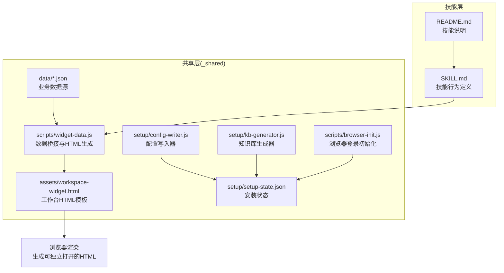
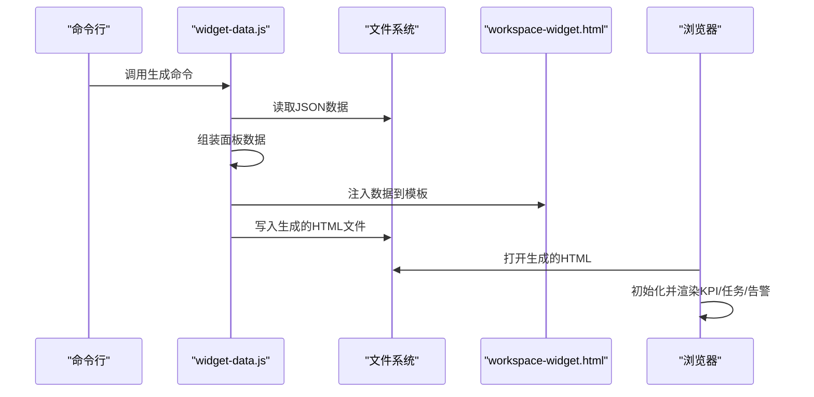
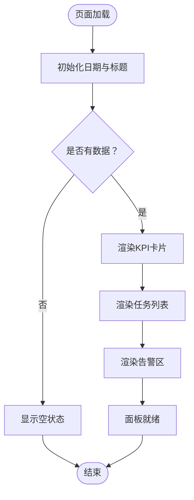
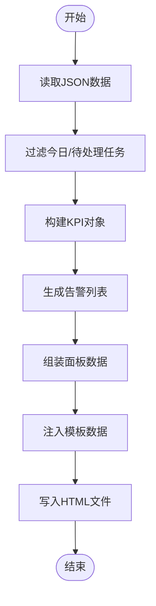
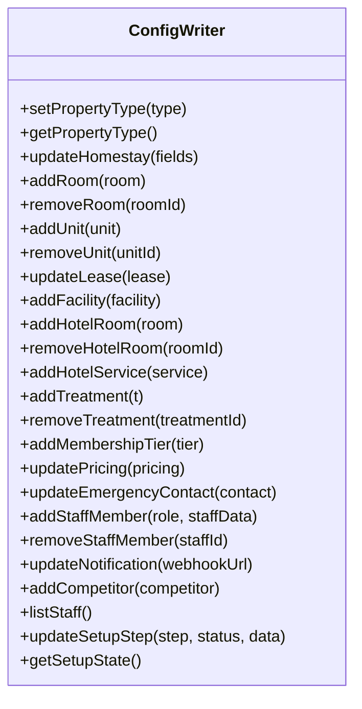
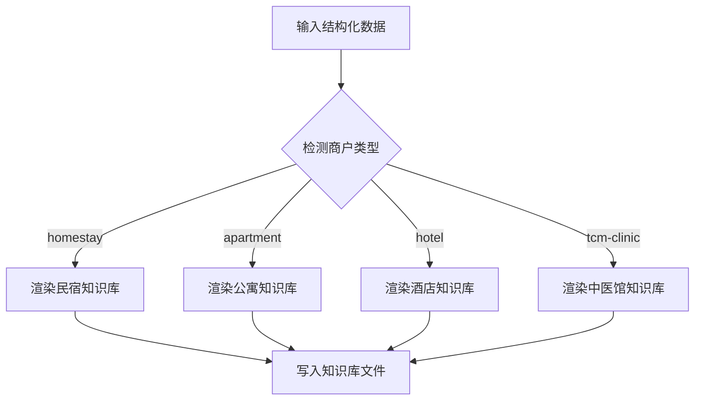
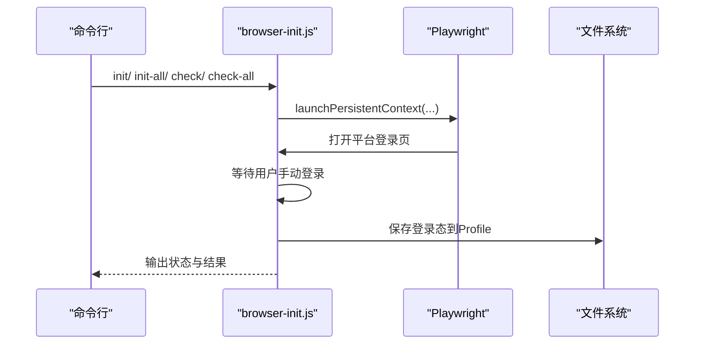
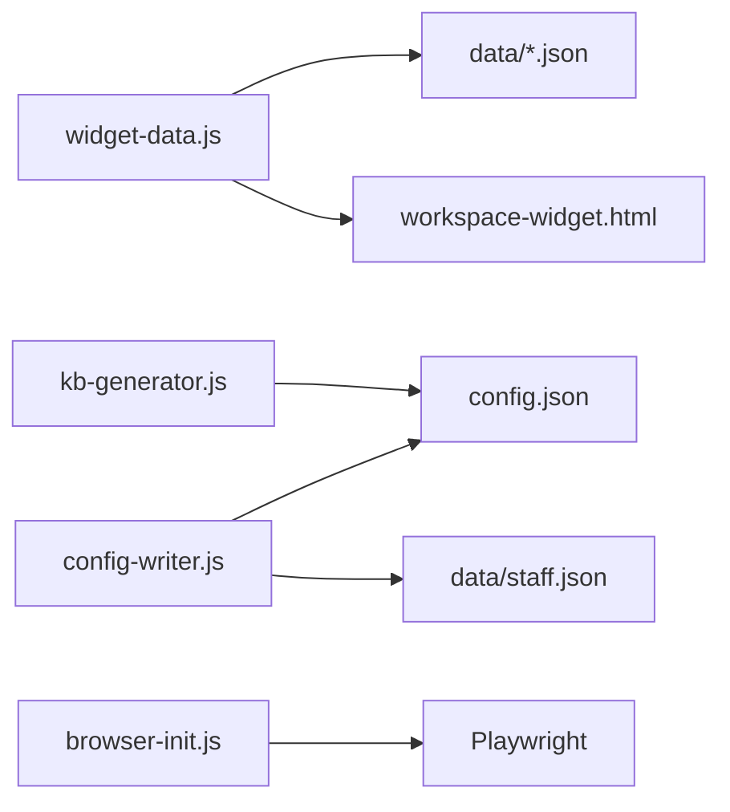

# 工作台面板系统

<cite>
**本文引用的文件**
- [workspace-widget.html](file://_shared/assets/workspace-widget.html)
- [widget-data.js](file://_shared/scripts/widget-data.js)
- [browser-init.js](file://_shared/scripts/browser-init.js)
- [kb-generator.js](file://_shared/setup/kb-generator.js)
- [config-writer.js](file://_shared/setup/config-writer.js)
- [package.json](file://_shared/package.json)
- [SKILL.md](file://SKILL.md)
- [README.md](file://README.md)
- [setup-state.json](file://_shared/setup/setup-state.json)
- [basic-info.json](file://_shared/setup/questions/_common/basic-info.json)
</cite>

## 目录
1. [简介](#简介)
2. [项目结构](#项目结构)
3. [核心组件](#核心组件)
4. [架构总览](#架构总览)
5. [详细组件分析](#详细组件分析)
6. [依赖关系分析](#依赖关系分析)
7. [性能考虑](#性能考虑)
8. [故障排查指南](#故障排查指南)
9. [结论](#结论)
10. [附录](#附录)

## 简介
本系统是一套面向民宿/公寓/酒店/中医馆等多商户类型的“工作台面板”解决方案，提供数据驱动的可视化界面，包含KPI卡片、待办任务列表、告警区域与快捷操作入口。系统通过数据桥接脚本从本地JSON数据源组装面板所需数据，注入HTML模板并生成可独立打开的静态页面，同时提供CLI命令用于快速生成与调试。此外，系统还配套知识库生成、配置写入、浏览器登录态管理等共享能力，支撑完整的运营工作流。

## 项目结构
- 共享层（_shared）：存放跨技能通用的脚本、模板与配置
  - assets：HTML模板与静态资源
  - scripts：数据桥接、浏览器登录初始化、通知、任务管理等
  - setup：安装向导、知识库生成、配置写入、问题集等
  - data：业务数据（tasks.json、revenue.json、room-status.json等）
  - docs：用户手册等文档
- 技能层（根目录）：不同商户类型的技能实现（如 tcm-inventory、homestay-workflow 等）

图表来源
- [workspace-widget.html:1-214](file://_shared/assets/workspace-widget.html#L1-L214)
- [widget-data.js:1-278](file://_shared/scripts/widget-data.js#L1-L278)
- [browser-init.js:1-392](file://_shared/scripts/browser-init.js#L1-L392)
- [kb-generator.js:1-573](file://_shared/setup/kb-generator.js#L1-L573)
- [config-writer.js:1-603](file://_shared/setup/config-writer.js#L1-L603)
- [setup-state.json:1-17](file://_shared/setup/setup-state.json#L1-L17)
- [SKILL.md:1-379](file://SKILL.md#L1-L379)
- [README.md:1-5](file://README.md#L1-L5)

章节来源
- [workspace-widget.html:1-214](file://_shared/assets/workspace-widget.html#L1-L214)
- [widget-data.js:1-278](file://_shared/scripts/widget-data.js#L1-L278)
- [browser-init.js:1-392](file://_shared/scripts/browser-init.js#L1-L392)
- [kb-generator.js:1-573](file://_shared/setup/kb-generator.js#L1-L573)
- [config-writer.js:1-603](file://_shared/setup/config-writer.js#L1-L603)
- [setup-state.json:1-17](file://_shared/setup/setup-state.json#L1-L17)
- [SKILL.md:1-379](file://SKILL.md#L1-L379)
- [README.md:1-5](file://README.md#L1-L5)

## 核心组件
- HTML模板引擎：workspace-widget.html 提供工作台的结构与样式，包含KPI网格、任务列表、告警区、快捷操作区与空状态占位。
- 数据桥接器：widget-data.js 负责从本地JSON数据源读取并组装为面板所需的JSON数据，支持工作台、任务看板、排班、报表四种面板类型；同时负责将数据注入模板并生成独立HTML文件。
- 面板渲染器：模板内的JavaScript负责初始化日期、标题、空状态判断，并根据数据渲染KPI、任务与告警。
- 配置与知识库：config-writer.js 提供零接触修改配置的能力；kb-generator.js 将安装向导采集的数据生成知识库Markdown。
- 浏览器登录态：browser-init.js 管理多OTA平台的登录态，使用Playwright持久化上下文，一次登录后状态长期保存。
- CLI与脚本：package.json 提供便捷脚本，一键初始化所有平台登录态；widget-data.js 提供多种面板生成命令行入口。

章节来源
- [workspace-widget.html:1-214](file://_shared/assets/workspace-widget.html#L1-L214)
- [widget-data.js:1-278](file://_shared/scripts/widget-data.js#L1-L278)
- [config-writer.js:1-603](file://_shared/setup/config-writer.js#L1-L603)
- [kb-generator.js:1-573](file://_shared/setup/kb-generator.js#L1-L573)
- [browser-init.js:1-392](file://_shared/scripts/browser-init.js#L1-L392)
- [package.json:1-20](file://_shared/package.json#L1-L20)

## 架构总览
工作台面板的生成与展示流程如下：
- 数据来源：从 _shared/data 下的JSON文件读取任务、营收、房态等数据。
- 数据组装：widget-data.js 根据面板类型组装数据对象（包含KPI、任务、告警等）。
- 模板注入：将数据注入 workspace-widget.html 的 window.__WIDGET_DATA__，并生成独立HTML文件。
- 渲染展示：浏览器加载HTML后，前端脚本根据数据渲染KPI卡片、任务列表、告警区与快捷操作按钮。

图表来源
- [widget-data.js:170-225](file://_shared/scripts/widget-data.js#L170-L225)
- [workspace-widget.html:129-211](file://_shared/assets/workspace-widget.html#L129-L211)

章节来源
- [widget-data.js:170-225](file://_shared/scripts/widget-data.js#L170-L225)
- [workspace-widget.html:129-211](file://_shared/assets/workspace-widget.html#L129-L211)

## 详细组件分析

### HTML模板与渲染逻辑
- 结构组成
  - 顶部标题与日期：根据数据动态更新标题，显示当前日期。
  - KPI网格：四宫格布局，展示今日营收、入住率、在住房间、待处理任务等指标。
  - 今日待办：任务列表，支持派发、进行中、已完成状态。
  - 告警区：根据KPI与任务逾期情况动态显示警告/错误/信息级别告警。
  - 快捷操作：8个常用操作按钮，点击后通过 window.sendToAgent 发送动作。
  - 空状态：当无数据时显示引导文案与“开始设置”按钮。
- 样式与主题
  - 默认浅色主题与深色主题适配（prefers-color-scheme: dark）。
  - 响应式网格布局，移动端友好。
- 交互与事件
  - 点击任务按钮派发任务或查看任务详情。
  - 点击快捷操作按钮发送动作到Agent。
  - 空状态下的“开始设置”按钮跳转到设置向导。

图表来源
- [workspace-widget.html:134-151](file://_shared/assets/workspace-widget.html#L134-L151)
- [workspace-widget.html:153-202](file://_shared/assets/workspace-widget.html#L153-L202)

章节来源
- [workspace-widget.html:1-214](file://_shared/assets/workspace-widget.html#L1-L214)

### 数据桥接器（widget-data.js）
- 数据来源
  - tasks.json：任务列表，过滤今日任务与待处理任务。
  - revenue.json：营收数据，提取当日/周数据与变化百分比。
  - room-status.json：房态数据，提取入住率、在住房间、变化百分比。
- KPI构建
  - 营收：当日总营收与变化百分比。
  - 入住率：当前入住率与变化百分比。
  - 在住房间：当前在住房间数。
  - 待处理：今日待处理任务数量。
- 告警规则
  - 入住率低于阈值时发出警告。
  - 存在逾期任务时发出错误告警。
- 面板数据
  - 工作台：返回包含标题、KPI、任务、告警的对象。
  - 任务看板：返回完整任务列表。
  - 排班：返回排班视图与每周统计。
  - 报表：返回KPI、趋势、渠道与告警。
- HTML生成
  - 读取模板文件，将 window.__WIDGET_DATA__ 替换为数据，输出独立HTML文件。

图表来源
- [widget-data.js:48-88](file://_shared/scripts/widget-data.js#L48-L88)
- [widget-data.js:186-220](file://_shared/scripts/widget-data.js#L186-L220)

章节来源
- [widget-data.js:1-278](file://_shared/scripts/widget-data.js#L1-L278)

### 配置写入器（config-writer.js）
- 作用：提供零接触修改配置的能力，所有写入遵循“读取→合并→写入”，避免覆盖其他字段。
- 支持的商户类型：homestay、apartment、hotel、tcm-clinic。
- 核心能力
  - 设置/读取商户类型 propertyType。
  - 更新民宿基本信息、添加/删除房型。
  - 添加/删除公寓房源、更新租约规则、添加公共设施。
  - 添加酒店房型/服务、添加中医馆诊疗项目/会员等级、更新收费。
  - 添加/删除员工、更新紧急联系人。
  - 更新通知Webhook、添加竞品、维护安装状态。
- 数据验证：提供时间格式、电话号码、金额等校验工具。

图表来源
- [config-writer.js:118-599](file://_shared/setup/config-writer.js#L118-L599)

章节来源
- [config-writer.js:1-603](file://_shared/setup/config-writer.js#L1-L603)

### 知识库生成器（kb-generator.js）
- 作用：将安装向导采集的结构化数据转换为知识库Markdown，支持多商户类型。
- 类型支持：homestay、apartment、hotel、tcm-clinic。
- 输出位置：根据类型映射到对应技能的 assets 目录。
- 生成流程：检测商户类型→选择渲染模板→写入Markdown文件。

图表来源
- [kb-generator.js:62-86](file://_shared/setup/kb-generator.js#L62-L86)

章节来源
- [kb-generator.js:1-573](file://_shared/setup/kb-generator.js#L1-L573)

### 浏览器登录初始化（browser-init.js）
- 作用：管理各OTA平台商家后台的浏览器登录态，使用Playwright持久化上下文，一次登录后状态长期保存。
- 支持平台：携程、美团、飞猪、去哪儿、同程；类型包括商家后台与消费者端。
- 核心流程：初始化登录（打开平台页面，等待用户手动登录并保存）、一键初始化所有平台、检查登录态、输出结果。

图表来源
- [browser-init.js:153-190](file://_shared/scripts/browser-init.js#L153-L190)
- [browser-init.js:226-287](file://_shared/scripts/browser-init.js#L226-L287)
- [browser-init.js:292-322](file://_shared/scripts/browser-init.js#L292-L322)

章节来源
- [browser-init.js:1-392](file://_shared/scripts/browser-init.js#L1-L392)

### 安装状态与配置
- 安装状态：setup-state.json 记录安装步骤、完成状态与时间戳，用于控制向导流程。
- 配置文件：config.json 存储商户类型、通知、联系人、各类业务配置等。
- 问题集：questions/_common/basic-info.json 定义安装向导的基础信息问题集合。

章节来源
- [setup-state.json:1-17](file://_shared/setup/setup-state.json#L1-L17)
- [basic-info.json:1-10](file://_shared/setup/questions/_common/basic-info.json#L1-L10)

## 依赖关系分析
- 外部依赖
  - Playwright：用于浏览器登录态管理。
  - exceljs、node-cron：用于报表与定时任务（在其他模块中使用）。
- 内部依赖
  - widget-data.js 依赖 data 目录下的JSON文件与模板文件。
  - config-writer.js 依赖 config.json 与 staff.json。
  - kb-generator.js 依赖安装向导采集的数据与配置。
  - browser-init.js 依赖 Playwright 与平台配置。

图表来源
- [widget-data.js:29-34](file://_shared/scripts/widget-data.js#L29-L34)
- [config-writer.js:23-29](file://_shared/setup/config-writer.js#L23-L29)
- [kb-generator.js:20-26](file://_shared/setup/kb-generator.js#L20-L26)
- [browser-init.js:19](file://_shared/scripts/browser-init.js#L19)

章节来源
- [package.json:14-18](file://_shared/package.json#L14-L18)
- [widget-data.js:29-34](file://_shared/scripts/widget-data.js#L29-L34)
- [config-writer.js:23-29](file://_shared/setup/config-writer.js#L23-L29)
- [kb-generator.js:20-26](file://_shared/setup/kb-generator.js#L20-L26)
- [browser-init.js:19](file://_shared/scripts/browser-init.js#L19)

## 性能考虑
- 数据读取与过滤
  - 任务过滤与告警生成均为O(n)扫描，建议控制任务规模在合理范围（例如限制今日任务数量）。
- 模板注入与HTML生成
  - 一次性读取模板、注入数据并写入文件，I/O成本低；建议缓存生成结果以减少重复生成。
- 前端渲染
  - DOM操作集中在初始化阶段，任务列表渲染采用拼接字符串的方式，建议在任务量较大时考虑虚拟滚动或分页。
- 响应式与主题
  - CSS Grid与媒体查询已内置，建议在移动端测试时关注字体大小与间距的可读性。
- 并发与稳定性
  - 浏览器登录初始化使用持久化上下文，避免频繁登录；建议在CI/CD中预热登录态以提升稳定性。

## 故障排查指南
- 面板为空状态
  - 检查 data 目录下是否存在 tasks.json、revenue.json、room-status.json。
  - 确认 widget-data.js 是否正确读取并组装数据。
- 生成HTML失败
  - 确认模板路径是否存在，且模板中包含 window.__WIDGET_DATA__ 注入点。
  - 检查输出目录权限与磁盘空间。
- 登录态失效
  - 使用 browser-init.js 的 check-all 检查各平台登录状态。
  - 如状态过期，使用 init 或 init-all 重新初始化。
- 配置写入失败
  - 检查 JSON 文件格式是否合法，字段是否符合校验规则。
  - 确认文件权限允许写入。

章节来源
- [widget-data.js:186-220](file://_shared/scripts/widget-data.js#L186-L220)
- [browser-init.js:226-322](file://_shared/scripts/browser-init.js#L226-L322)
- [config-writer.js:35-50](file://_shared/setup/config-writer.js#L35-L50)

## 结论
工作台面板系统通过清晰的职责分离与模块化设计，实现了从数据到可视化的完整闭环。HTML模板与数据桥接器解耦，便于扩展新的面板类型；配置写入器与知识库生成器保障了配置与知识的可维护性；浏览器登录初始化提供了稳定的多平台操作基础。结合CLI与脚本，系统具备良好的可运维性与可扩展性。

## 附录

### 面板数据结构与HTML模板生成过程
- 数据结构
  - 工作台：包含标题、KPI、任务、告警。
  - 任务看板：包含任务列表。
  - 排班：包含排班视图与每周统计。
  - 报表：包含KPI、趋势、渠道与告警。
- 模板生成
  - 读取模板文件，注入 window.__WIDGET_DATA__，写入独立HTML文件，支持双击打开与浏览器地址栏访问。

章节来源
- [widget-data.js:48-168](file://_shared/scripts/widget-data.js#L48-L168)
- [widget-data.js:170-225](file://_shared/scripts/widget-data.js#L170-L225)
- [workspace-widget.html:129-211](file://_shared/assets/workspace-widget.html#L129-L211)

### 组件配置与展示逻辑
- KPI卡片
  - 展示数值与变化百分比，支持上升/下降颜色标识。
- 待办任务列表
  - 支持派发、进行中、已完成状态，图标与按钮随状态变化。
- 告警区域
  - 根据入住率与任务逾期自动生成告警，支持警告/错误/信息级别。
- 快捷操作入口
  - 8个常用操作按钮，点击后通过 window.sendToAgent 发送动作。

章节来源
- [workspace-widget.html:153-202](file://_shared/assets/workspace-widget.html#L153-L202)

### 面板自定义与样式调整
- 自定义面板类型
  - 在 widget-data.js 中扩展新的面板类型，增加数据组装与模板映射。
- 样式调整
  - 修改 workspace-widget.html 中的CSS变量与网格布局，适配不同屏幕尺寸。
- 动态行为
  - 通过 window.sendToAgent 与 Agent 通信，扩展更多交互动作。

章节来源
- [widget-data.js:172-177](file://_shared/scripts/widget-data.js#L172-L177)
- [workspace-widget.html:7-77](file://_shared/assets/workspace-widget.html#L7-L77)

### 性能优化与响应式设计最佳实践
- 数据层面
  - 控制任务数量与告警生成频率，避免大规模DOM操作。
- 前端层面
  - 使用CSS Grid与媒体查询，确保在移动设备上的良好体验。
- 运维层面
  - 预热浏览器登录态，减少初始化耗时；缓存生成的HTML文件以提升访问速度。

章节来源
- [browser-init.js:153-190](file://_shared/scripts/browser-init.js#L153-L190)
- [workspace-widget.html:16-77](file://_shared/assets/workspace-widget.html#L16-L77)