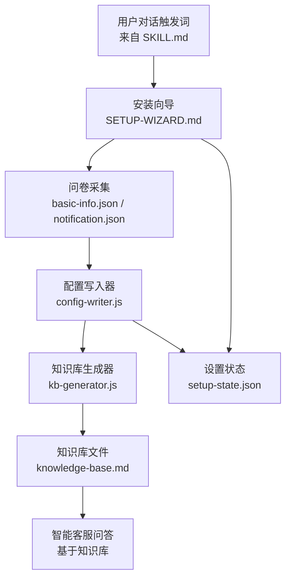
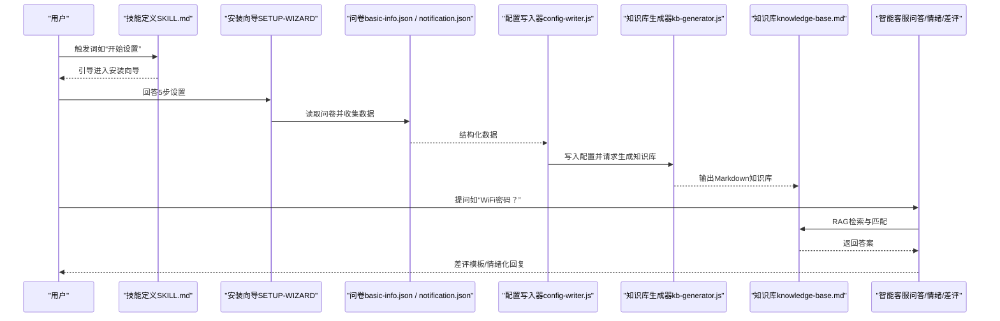
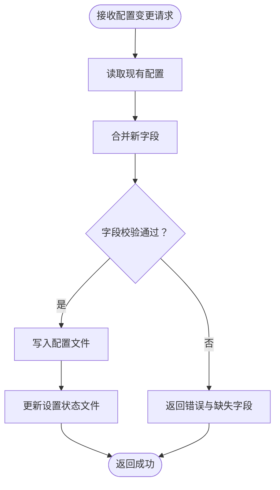
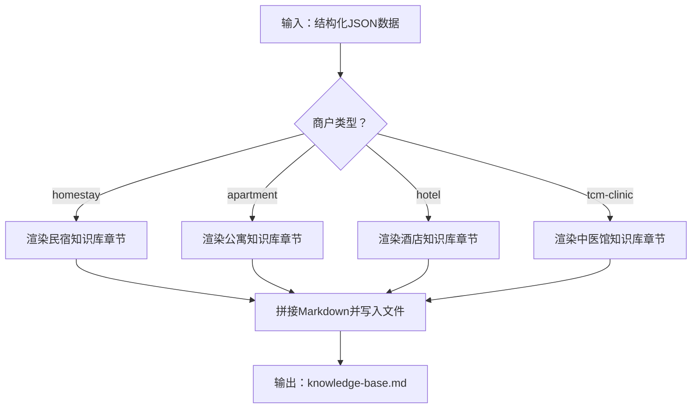

# 智能客服系统

<cite>
**本文引用的文件**
- [README.md](file://README.md)
- [SKILL.md](file://SKILL.md)
- [_shared/setup/kb-generator.js](file://_shared/setup/kb-generator.js)
- [_shared/setup/config-writer.js](file://_shared/setup/config-writer.js)
- [_shared/setup/setup-state.json](file://_shared/setup/setup-state.json)
- [_shared/docs/USER-MANUAL.md](file://_shared/docs/USER-MANUAL.md)
- [_shared/setup/SETUP-WIZARD.md](file://_shared/setup/SETUP-WIZARD.md)
- [_shared/setup/questions/_common/basic-info.json](file://_shared/setup/questions/_common/basic-info.json)
- [_shared/setup/questions/_common/notification.json](file://_shared/setup/questions/_common/notification.json)
- [_shared/setup/notification-guide.md](file://_shared/setup/notification-guide.md)
</cite>

## 目录
1. [简介](#简介)
2. [项目结构](#项目结构)
3. [核心组件](#核心组件)
4. [架构总览](#架构总览)
5. [详细组件分析](#详细组件分析)
6. [依赖关系分析](#依赖关系分析)
7. [性能考虑](#性能考虑)
8. [故障排查指南](#故障排查指南)
9. [结论](#结论)
10. [附录](#附录)

## 简介
本文件面向“智能客服系统”，围绕基于知识库的问答能力，系统性阐述以下主题：
- 触发词配置与行为映射
- 情绪识别与分级机制（平和/不满/愤怒）及差异化回复策略
- 差评回复模板与生成流程
- 知识库生成器的工作原理与JSON到Markdown的转换过程
- 实际使用场景示例（WiFi密码查询、入住指引生成、差评自动回复等）
- 配置选项说明与最佳实践

该系统以“民宿智能运营 Skill 套件”为核心载体，提供无需后台账号即可使用的8项核心功能，其中“智能客服”作为即用型能力，结合知识库与触发词实现高命中率的问答与情绪化处理。

## 项目结构
仓库采用“共享模块 + 多技能套件”的组织方式：
- 共享层（_shared/）：提供安装向导、知识库生成器、配置写入器、通知推送、环境检查等通用能力
- 技能层（homestay-* 等）：按业务类型（民宿、公寓、酒店、中医馆）提供具体技能与资产
- 文档与配置：用户手册、安装向导说明、问卷与通知配置指引

图表来源
- [SKILL.md: 6-36:6-36](file://SKILL.md#L6-L36)
- [_shared/setup/SETUP-WIZARD.md: 1-25:1-25](file://_shared/setup/SETUP-WIZARD.md#L1-L25)
- [_shared/setup/questions/_common/basic-info.json: 1-10:1-10](file://_shared/setup/questions/_common/basic-info.json#L1-L10)
- [_shared/setup/questions/_common/notification.json: 1-12:1-12](file://_shared/setup/questions/_common/notification.json#L1-L12)
- [_shared/setup/config-writer.js: 26-31:26-31](file://_shared/setup/config-writer.js#L26-L31)
- [_shared/setup/kb-generator.js: 26-32:26-32](file://_shared/setup/kb-generator.js#L26-L32)
- [_shared/setup/setup-state.json: 1-17:1-17](file://_shared/setup/setup-state.json#L1-L17)

章节来源
- [README.md: 1-5:1-5](file://README.md#L1-L5)
- [SKILL.md: 42-58:42-58](file://SKILL.md#L42-L58)
- [_shared/setup/SETUP-WIZARD.md: 27-58:27-58](file://_shared/setup/SETUP-WIZARD.md#L27-L58)

## 核心组件
- 触发词与行为映射：在技能定义文件中集中声明触发词集合，用于识别用户意图并路由到相应处理流程
- 安装向导：引导商户完成5步设置，采集基础信息、房型/规则、周边/安全、团队与通知配置
- 配置写入器：提供统一的字段校验与“读取→合并→写入”模式，保障配置变更的安全与一致性
- 知识库生成器：将结构化JSON数据渲染为Markdown知识库，支撑RAG问答与差评模板
- 智能客服：基于知识库回答常见问题，结合情绪识别进行差异化回复，并支持差评模板生成

章节来源
- [SKILL.md: 6-36:6-36](file://SKILL.md#L6-L36)
- [_shared/setup/SETUP-WIZARD.md: 33-47:33-47](file://_shared/setup/SETUP-WIZARD.md#L33-L47)
- [_shared/setup/config-writer.js: 20-21:20-21](file://_shared/setup/config-writer.js#L20-L21)
- [_shared/setup/kb-generator.js: 18-18:18-18](file://_shared/setup/kb-generator.js#L18-L18)

## 架构总览
下图展示了从用户触发到知识库生成与问答闭环的关键交互：

图表来源
- [SKILL.md: 6-36:6-36](file://SKILL.md#L6-L36)
- [_shared/setup/SETUP-WIZARD.md: 33-47:33-47](file://_shared/setup/SETUP-WIZARD.md#L33-L47)
- [_shared/setup/questions/_common/basic-info.json: 1-10:1-10](file://_shared/setup/questions/_common/basic-info.json#L1-L10)
- [_shared/setup/questions/_common/notification.json: 1-12:1-12](file://_shared/setup/questions/_common/notification.json#L1-L12)
- [_shared/setup/config-writer.js: 46-50:46-50](file://_shared/setup/config-writer.js#L46-L50)
- [_shared/setup/kb-generator.js: 62-86:62-86](file://_shared/setup/kb-generator.js#L62-L86)

## 详细组件分析

### 触发词与行为映射
- 触发词集合在技能定义文件中集中声明，涵盖“开始设置/初始化”“功能清单/能用什么/有什么功能/能干什么”“修改信息/改一下/修改配置”“安装/重新安装”等
- 系统通过这些触发词识别用户意图，进而调用安装向导、功能查询、配置修改或环境检查等流程

章节来源
- [SKILL.md: 6-36:6-36](file://SKILL.md#L6-L36)
- [SKILL.md: 62-108:62-108](file://SKILL.md#L62-L108)

### 安装向导与问卷采集
- 安装向导以“零技术术语、每步≤3个核心问题、可中断可恢复、即时反馈、10分钟内完成”为原则
- 问卷分为“基础信息”“通知配置”等模块，支持跳过信号与格式校验
- 设置完成后输出“功能验证清单”，明确立即可用与待激活功能

章节来源
- [_shared/setup/SETUP-WIZARD.md: 40-47:40-47](file://_shared/setup/SETUP-WIZARD.md#L40-L47)
- [_shared/setup/questions/_common/basic-info.json: 1-10:1-10](file://_shared/setup/questions/_common/basic-info.json#L1-L10)
- [_shared/setup/questions/_common/notification.json: 1-12:1-12](file://_shared/setup/questions/_common/notification.json#L1-L12)
- [_shared/setup/SETUP-WIZARD.md: 416-416:416-416](file://_shared/setup/SETUP-WIZARD.md#L416-L416)

### 配置写入器（多商户类型支持）
- 统一的“读取→合并→写入”模式，避免覆盖其他字段
- 支持多种商户类型（homestay/apartment/hotel/tcm-clinic），提供针对性的字段校验与写入方法
- 与设置状态文件联动，记录最后修改时间、完成状态与步骤推进

图表来源
- [_shared/setup/config-writer.js: 35-50:35-50](file://_shared/setup/config-writer.js#L35-L50)
- [_shared/setup/config-writer.js: 60-110:60-110](file://_shared/setup/config-writer.js#L60-L110)
- [_shared/setup/setup-state.json: 1-17:1-17](file://_shared/setup/setup-state.json#L1-L17)

章节来源
- [_shared/setup/config-writer.js: 20-21:20-21](file://_shared/setup/config-writer.js#L20-L21)
- [_shared/setup/config-writer.js: 118-135:118-135](file://_shared/setup/config-writer.js#L118-L135)
- [_shared/setup/config-writer.js: 176-196:176-196](file://_shared/setup/config-writer.js#L176-L196)
- [_shared/setup/setup-state.json: 1-17:1-17](file://_shared/setup/setup-state.json#L1-L17)

### 知识库生成器（JSON→Markdown）
- 支持多商户类型，默认输出到对应技能资产目录下的知识库文件
- 根据采集的数据动态生成“房源介绍/入住规则/周边信息/安全与紧急/联系方式/常见问题/差评模板”等章节
- 常见问题章节自动从规则与周边信息中抽取高频问答，形成标准化问答对

图表来源
- [_shared/setup/kb-generator.js: 62-86:62-86](file://_shared/setup/kb-generator.js#L62-L86)
- [_shared/setup/kb-generator.js: 92-103:92-103](file://_shared/setup/kb-generator.js#L92-L103)
- [_shared/setup/kb-generator.js: 105-229:105-229](file://_shared/setup/kb-generator.js#L105-L229)

章节来源
- [_shared/setup/kb-generator.js: 18-18:18-18](file://_shared/setup/kb-generator.js#L18-L18)
- [_shared/setup/kb-generator.js: 62-86:62-86](file://_shared/setup/kb-generator.js#L62-L86)
- [_shared/setup/kb-generator.js: 105-229:105-229](file://_shared/setup/kb-generator.js#L105-L229)

### 智能客服：触发词、情绪识别与差评模板
- 触发词与行为：系统支持“WiFi密码？”“客人说房间太差了”“帮我回一条差评，客人说卫生差”等触发词，分别对应精准问答、情绪处理与差评模板生成
- 情绪识别与分级：系统具备“平和/不满/愤怒”三级识别能力，并据此采用差异化回复策略（如共情、降温、转人工）
- 差评模板：内置四类模板（卫生/设施/服务/噪音），可直接生成并发送给客人

章节来源
- [SKILL.md: 121-136:121-136](file://SKILL.md#L121-L136)
- [_shared/docs/USER-MANUAL.md: 40-48:40-48](file://_shared/docs/USER-MANUAL.md#L40-L48)

### 实际使用场景示例
- WiFi密码查询：触发“WiFi密码是什么”，系统从知识库中检索并返回准确答案
- 入住指引生成：结合“入住规则/周边信息/交通方式”生成个性化指引
- 差评自动回复：当用户表达不满或投诉时，系统自动生成对应类别的差评回复模板，便于快速响应

章节来源
- [SKILL.md: 133-136:133-136](file://SKILL.md#L133-L136)
- [_shared/docs/USER-MANUAL.md: 129-143:129-143](file://_shared/docs/USER-MANUAL.md#L129-L143)

## 依赖关系分析
- 触发词依赖：技能定义文件集中声明触发词，决定系统行为分支
- 安装向导依赖：问卷与通知配置模块驱动配置写入器，最终触发知识库生成器
- 配置写入器依赖：读取与写入共享配置文件与设置状态文件
- 知识库生成器依赖：读取配置文件中的商户类型与数据，输出Markdown文件

图表来源
- [SKILL.md: 6-36:6-36](file://SKILL.md#L6-L36)
- [_shared/setup/SETUP-WIZARD.md: 1-25:1-25](file://_shared/setup/SETUP-WIZARD.md#L1-L25)
- [_shared/setup/questions/_common/basic-info.json: 1-10:1-10](file://_shared/setup/questions/_common/basic-info.json#L1-L10)
- [_shared/setup/questions/_common/notification.json: 1-12:1-12](file://_shared/setup/questions/_common/notification.json#L1-L12)
- [_shared/setup/config-writer.js: 26-31:26-31](file://_shared/setup/config-writer.js#L26-L31)
- [_shared/setup/setup-state.json: 1-17:1-17](file://_shared/setup/setup-state.json#L1-L17)
- [_shared/setup/kb-generator.js: 26-32:26-32](file://_shared/setup/kb-generator.js#L26-L32)

章节来源
- [SKILL.md: 6-36:6-36](file://SKILL.md#L6-L36)
- [_shared/setup/SETUP-WIZARD.md: 1-25:1-25](file://_shared/setup/SETUP-WIZARD.md#L1-L25)
- [_shared/setup/config-writer.js: 26-31:26-31](file://_shared/setup/config-writer.js#L26-L31)
- [_shared/setup/kb-generator.js: 26-32:26-32](file://_shared/setup/kb-generator.js#L26-L32)

## 性能考虑
- 知识库生成：采用一次性渲染与写入，适合在设置向导完成后执行，避免频繁I/O
- 配置写入：统一的“读取→合并→写入”减少磁盘访问次数，降低并发冲突风险
- 问答检索：知识库为静态Markdown，建议在RAG检索前进行分段与索引优化，提升响应速度

## 故障排查指南
- 环境自检：当用户询问“检查环境/状态检查/系统正常吗”等触发词时，系统执行环境自检脚本，输出依赖/配置/向导/知识库/通知/竞品采集器的检查结果与修复建议
- 通知配置：若通知未生效，可通过“配置通知”流程重新添加群机器人并复制Webhook地址
- 设置状态：检查设置状态文件的完成标志与最后修改时间，确认向导是否完整执行

章节来源
- [SKILL.md: 343-351:343-351](file://SKILL.md#L343-L351)
- [_shared/setup/notification-guide.md: 9-32:9-32](file://_shared/setup/notification-guide.md#L9-L32)
- [_shared/setup/setup-state.json: 1-17:1-17](file://_shared/setup/setup-state.json#L1-L17)

## 结论
本智能客服系统以“安装向导+知识库生成+触发词映射+情绪识别+差评模板”为核心，构建了从配置采集到问答闭环的完整链路。通过统一的配置写入器与多商户类型的知识库模板，系统实现了高可扩展性与易维护性；结合情绪分级与差评模板，显著提升了客户满意度与运营效率。

## 附录

### 配置选项说明与最佳实践
- 商户类型：通过配置写入器设置，影响知识库生成器的章节与字段
- 房源/规则/周边/联系方式：在安装向导中按步骤采集，确保知识库完整性
- 通知配置：建议在设置向导第5步完成，便于后续自动推送
- 最佳实践：
  - 保持知识库数据与实际一致，定期复核常见问题章节
  - 在情绪处理流程中优先共情与降噪，必要时转人工
  - 差评模板生成后建议由人工复核后再发送，确保语气与品牌一致

章节来源
- [_shared/setup/config-writer.js: 118-135:118-135](file://_shared/setup/config-writer.js#L118-L135)
- [_shared/setup/SETUP-WIZARD.md: 388-400:388-400](file://_shared/setup/SETUP-WIZARD.md#L388-L400)
- [_shared/docs/USER-MANUAL.md: 40-48:40-48](file://_shared/docs/USER-MANUAL.md#L40-L48)