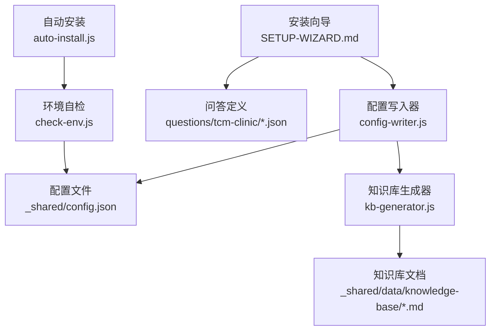
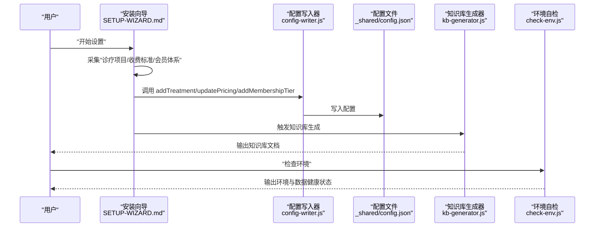
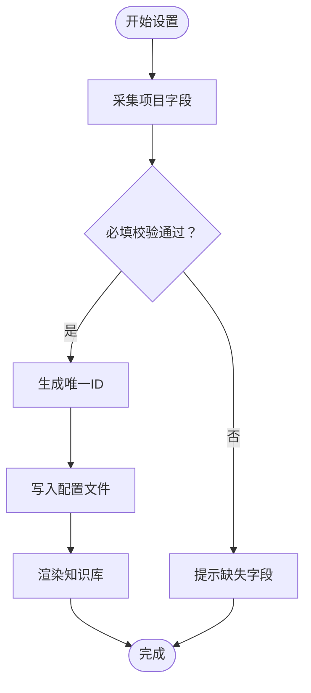
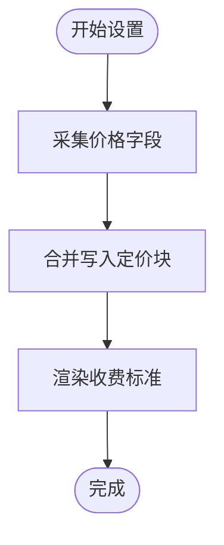
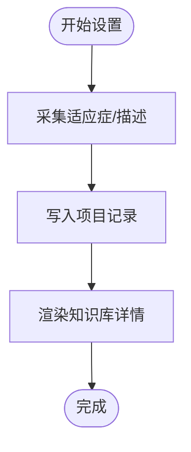
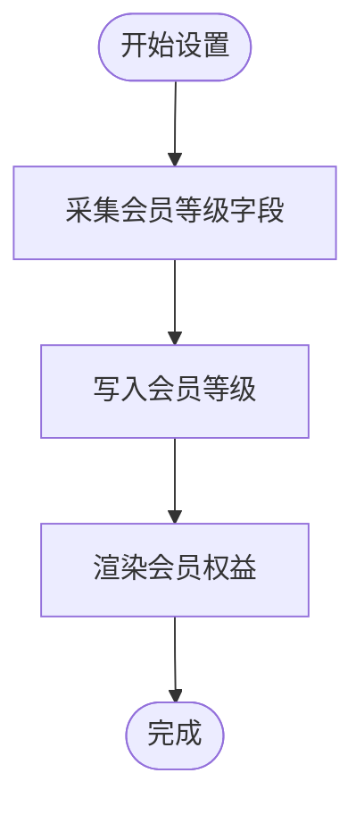
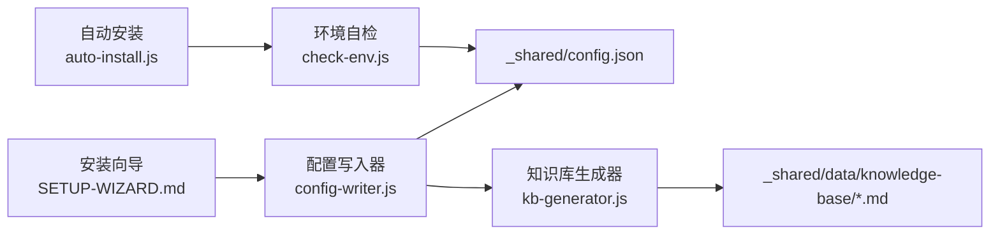

# 诊疗项目管理

<cite>
**本文档引用的文件**
- [README.md](file://README.md)
- [SKILL.md](file://SKILL.md)
- [USER-MANUAL.md](file://_shared/docs/USER-MANUAL.md)
- [SETUP-WIZARD.md](file://_shared/setup/SETUP-WIZARD.md)
- [config-writer.js](file://_shared/setup/config-writer.js)
- [kb-generator.js](file://_shared/setup/kb-generator.js)
- [services.json](file://_shared/setup/questions/tcm-clinic/services.json)
- [pricing.json](file://_shared/setup/questions/tcm-clinic/pricing.json)
- [membership.json](file://_shared/setup/questions/tcm-clinic/membership.json)
- [contacts.json](file://_shared/setup/questions/tcm-clinic/contacts.json)
- [inventory.js](file://tcm-inventory/scripts/inventory.js)
- [check-env.js](file://_shared/scripts/check-env.js)
- [auto-install.js](file://_shared/scripts/auto-install.js)
</cite>

## 目录
1. [简介](#简介)
2. [项目结构](#项目结构)
3. [核心组件](#核心组件)
4. [架构总览](#架构总览)
5. [详细组件分析](#详细组件分析)
6. [依赖分析](#依赖分析)
7. [性能考虑](#性能考虑)
8. [故障排查指南](#故障排查指南)
9. [结论](#结论)
10. [附录](#附录)

## 简介
本文件面向“中医馆智能运营套件”中的“诊疗项目管理”能力，系统性阐述项目分类体系、价格管理机制、适应症管理、项目数据存储与查询优化、实际应用场景与操作流程，以及维护最佳实践与数据一致性保障措施。该套件支持通过对话完成“开始设置”后，进入安装向导，采集“诊疗项目”“收费标准”“会员体系”等信息，并自动生成知识库，支撑后续的收银、客服、通知等场景。

## 项目结构
围绕“诊疗项目管理”，系统的关键文件与职责如下：
- 安装向导与问答：SETUP-WIZARD.md 定义“中医馆”类型下的采集流程，包括“诊疗项目”“收费标准”“会员体系”“联系人”等。
- 配置写入：config-writer.js 提供 addTreatment、updatePricing、addMembershipTier 等方法，将采集数据持久化到配置文件。
- 知识库渲染：kb-generator.js 将配置数据渲染为 Markdown 知识库，便于客服与运营使用。
- 问答定义：services.json、pricing.json、membership.json、contacts.json 定义采集字段与示例。
- 环境与数据健康：check-env.js、auto-install.js 保障运行环境与数据文件完整性。

**图表来源**
- [SETUP-WIZARD.md](file://_shared/setup/SETUP-WIZARD.md)
- [config-writer.js](file://_shared/setup/config-writer.js)
- [kb-generator.js](file://_shared/setup/kb-generator.js)
- [services.json](file://_shared/setup/questions/tcm-clinic/services.json)
- [pricing.json](file://_shared/setup/questions/tcm-clinic/pricing.json)
- [membership.json](file://_shared/setup/questions/tcm-clinic/membership.json)
- [contacts.json](file://_shared/setup/questions/tcm-clinic/contacts.json)
- [check-env.js](file://_shared/scripts/check-env.js)
- [auto-install.js](file://_shared/scripts/auto-install.js)

**章节来源**
- [README.md:1-5](file://README.md#L1-L5)
- [SKILL.md:1-379](file://SKILL.md#L1-L379)
- [SETUP-WIZARD.md:1-631](file://_shared/setup/SETUP-WIZARD.md#L1-L631)

## 核心组件
- 诊疗项目采集与写入
  - 采集字段：项目名称、所属科室/分类、单次时长、简要描述/适应症、操作医师等。
  - 写入方法：addTreatment，校验必填字段与价格有效性，生成唯一ID并写入配置。
- 收费标准管理
  - 采集字段：诊金、单次价、疗程价、会员价说明、首次体验价。
  - 写入方法：updatePricing，合并更新定价块。
- 会员体系管理
  - 采集字段：等级名称、充值金额、折扣、充值赠送、专属权益、有效期。
  - 写入方法：addMembershipTier，生成唯一ID并写入配置。
- 知识库渲染
  - renderTcmTreatments、renderTcmPricing、renderTcmMembership 将配置渲染为 Markdown，便于客服与运营查阅。

**章节来源**
- [config-writer.js:355-437](file://_shared/setup/config-writer.js#L355-L437)
- [kb-generator.js:452-507](file://_shared/setup/kb-generator.js#L452-L507)
- [services.json:1-8](file://_shared/setup/questions/tcm-clinic/services.json#L1-L8)
- [pricing.json:1-8](file://_shared/setup/questions/tcm-clinic/pricing.json#L1-L8)
- [membership.json:1-9](file://_shared/setup/questions/tcm-clinic/membership.json#L1-L9)

## 架构总览
诊疗项目管理的端到端流程如下：
- 用户触发“开始设置”，系统进入安装向导；
- 向导按步骤采集“诊疗项目”“收费标准”“会员体系”等；
- 配置写入器将数据写入配置文件；
- 知识库生成器根据配置生成知识库；
- 运营可通过“功能清单”“修改信息”等触发词查询/修正配置；
- 环境自检脚本保障数据文件完整性与运行环境。

**图表来源**
- [SETUP-WIZARD.md](file://_shared/setup/SETUP-WIZARD.md)
- [config-writer.js](file://_shared/setup/config-writer.js)
- [kb-generator.js](file://_shared/setup/kb-generator.js)
- [check-env.js](file://_shared/scripts/check-env.js)

## 详细组件分析

### 诊疗项目采集与存储
- 采集维度
  - 项目名称、所属科室/分类、单次时长、简要描述/适应症、操作医师。
- 写入策略
  - 自动生成唯一ID，校验必填字段与价格有效性，写入配置块。
- 知识库渲染
  - 渲染为表格与详情，便于客服与运营检索。

**图表来源**
- [SETUP-WIZARD.md](file://_shared/setup/SETUP-WIZARD.md)
- [config-writer.js](file://_shared/setup/config-writer.js)
- [kb-generator.js](file://_shared/setup/kb-generator.js)

**章节来源**
- [services.json:1-8](file://_shared/setup/questions/tcm-clinic/services.json#L1-L8)
- [config-writer.js:355-407](file://_shared/setup/config-writer.js#L355-L407)
- [kb-generator.js:452-475](file://_shared/setup/kb-generator.js#L452-L475)

### 价格管理机制
- 采集维度
  - 诊金、单次价、疗程价、会员价说明、首次体验价。
- 写入策略
  - updatePricing 合并更新定价块，支持增量配置。
- 知识库呈现
  - 渲染为“收费标准”章节，便于对外展示与内部核对。

**图表来源**
- [pricing.json:1-8](file://_shared/setup/questions/tcm-clinic/pricing.json#L1-L8)
- [config-writer.js:427-435](file://_shared/setup/config-writer.js#L427-L435)
- [kb-generator.js:478-487](file://_shared/setup/kb-generator.js#L478-L487)

**章节来源**
- [pricing.json:1-8](file://_shared/setup/questions/tcm-clinic/pricing.json#L1-L8)
- [config-writer.js:427-435](file://_shared/setup/config-writer.js#L427-L435)
- [kb-generator.js:478-487](file://_shared/setup/kb-generator.js#L478-L487)

### 适应症管理
- 采集维度
  - 诊疗项目简要描述/适应症，用于客服与运营快速理解项目适用人群与症状。
- 知识库呈现
  - 在“诊疗项目”详情中展示，便于对外说明与内部培训。

**图表来源**
- [services.json](file://_shared/setup/questions/tcm-clinic/services.json)
- [kb-generator.js](file://_shared/setup/kb-generator.js)

**章节来源**
- [services.json:1-8](file://_shared/setup/questions/tcm-clinic/services.json#L1-L8)
- [kb-generator.js:452-475](file://_shared/setup/kb-generator.js#L452-L475)

### 会员体系与价格联动
- 采集维度
  - 等级名称、充值金额、折扣、充值赠送、专属权益、有效期。
- 写入策略
  - addMembershipTier 生成唯一ID并写入配置。
- 知识库呈现
  - 渲染为“会员权益”章节，便于对外展示与内部核对。

**图表来源**
- [membership.json:1-9](file://_shared/setup/questions/tcm-clinic/membership.json#L1-L9)
- [config-writer.js:404-417](file://_shared/setup/config-writer.js#L404-L417)
- [kb-generator.js:490-507](file://_shared/setup/kb-generator.js#L490-L507)

**章节来源**
- [membership.json:1-9](file://_shared/setup/questions/tcm-clinic/membership.json#L1-L9)
- [config-writer.js:404-417](file://_shared/setup/config-writer.js#L404-L417)
- [kb-generator.js:490-507](file://_shared/setup/kb-generator.js#L490-L507)

### 项目数据存储结构与查询优化
- 存储位置
  - 配置文件：_shared/config.json（包含 tcm.treatments、tcm.pricing、tcm.membership 等块）。
  - 知识库：_shared/data/knowledge-base/*.md（由 kb-generator.js 生成）。
- 查询与优化建议
  - 项目列表：遍历 tcm.treatments，按科室/名称筛选。
  - 价格查询：读取 tcm.pricing 对应字段。
  - 会员权益：遍历 tcm.membership，按等级筛选。
  - 优化策略
    - 以内存对象缓存配置文件，减少频繁IO。
    - 为常用查询建立索引（如按科室、等级）。
    - 对大规模列表采用分页与懒加载。
    - 定期清理无效/停用项目，保持数据整洁。

**章节来源**
- [config-writer.js:355-437](file://_shared/setup/config-writer.js#L355-L437)
- [kb-generator.js:452-507](file://_shared/setup/kb-generator.js#L452-L507)

### 实际应用场景与操作流程示例
- 场景一：新增诊疗项目
  - 触发词：“开始设置” → “新增诊疗项目”
  - 采集字段：项目名称、所属科室、单次时长、适应症、操作医师
  - 结果：项目写入配置，知识库更新
- 场景二：调整收费标准
  - 触发词：“修改信息” → “收费标准”
  - 采集字段：单次价、疗程价、会员价说明、首次体验价
  - 结果：定价块合并更新，知识库同步
- 场景三：维护会员体系
  - 触发词：“修改信息” → “会员体系”
  - 采集字段：等级名称、充值金额、折扣、充值赠送、专属权益、有效期
  - 结果：会员等级写入配置，知识库更新
- 场景四：查询项目与价格
  - 触发词：“功能清单” → 查看“诊疗项目/收费标准”
  - 结果：知识库输出，便于客服与运营使用

**章节来源**
- [SETUP-WIZARD.md:160-300](file://_shared/setup/SETUP-WIZARD.md#L160-L300)
- [USER-MANUAL.md:38-155](file://_shared/docs/USER-MANUAL.md#L38-L155)

## 依赖分析
- 组件耦合
  - 安装向导依赖配置写入器与知识库生成器。
  - 知识库生成器依赖配置文件。
  - 环境自检脚本依赖配置文件与数据文件完整性。
- 外部依赖
  - Node.js 运行时与 npm 依赖（通过自动安装脚本管理）。
  - 可选浏览器依赖（民宿/酒店场景，中医馆场景可选）。

**图表来源**
- [SETUP-WIZARD.md](file://_shared/setup/SETUP-WIZARD.md)
- [config-writer.js](file://_shared/setup/config-writer.js)
- [kb-generator.js](file://_shared/setup/kb-generator.js)
- [check-env.js](file://_shared/scripts/check-env.js)
- [auto-install.js](file://_shared/scripts/auto-install.js)

**章节来源**
- [check-env.js:1-464](file://_shared/scripts/check-env.js#L1-L464)
- [auto-install.js:1-230](file://_shared/scripts/auto-install.js#L1-L230)

## 性能考虑
- 配置读取
  - 将配置文件缓存到内存，避免重复IO；变更时统一落盘。
- 知识库生成
  - 仅在配置变更后触发生成，避免频繁渲染。
- 列表查询
  - 对大列表采用分页与前端过滤，降低渲染压力。
- 数据文件
  - 定期自检与修复，确保 JSON 语法正确，避免解析失败导致的性能损耗。

## 故障排查指南
- 环境自检
  - 使用“检查环境”触发词，执行 check-env.js，输出基础环境、配置状态、功能组件、数据健康四项检查结果。
  - 关注“依赖包安装”“数据文件完整性”“企业微信通知”等关键项。
- 常见问题
  - 配置文件损坏：执行 JSON 修复脚本或重新完成安装向导。
  - 知识库未生成：完成安装向导或手动触发知识库生成。
  - 价格/项目未生效：确认配置写入成功并刷新知识库。
- 自动安装
  - 如依赖缺失，使用 auto-install.js 一键安装，支持检查模式与指定商户类型。

**章节来源**
- [check-env.js:95-326](file://_shared/scripts/check-env.js#L95-L326)
- [auto-install.js:48-98](file://_shared/scripts/auto-install.js#L48-L98)

## 结论
“诊疗项目管理”通过安装向导采集项目、价格、会员等关键信息，借助配置写入器与知识库生成器形成闭环，既满足运营日常使用，又为后续收银、客服、通知等功能提供数据基础。配合环境自检与自动安装脚本，系统具备良好的可维护性与稳定性。建议在实际使用中遵循“先采集、后写入、再渲染”的流程，定期进行数据健康检查，确保项目数据准确、一致、可用。

## 附录
- 相关链接
  - 套件主页与技能地图：SKILL.md
  - 用户手册：USER-MANUAL.md
  - 安装向导：SETUP-WIZARD.md
- 术语
  - 诊金：初诊费用
  - 单次价：单次治疗价格
  - 疗程价：多次治疗组合价格
  - 首次体验价：新客优惠价格
  - 会员价说明：会员折扣或优惠政策说明