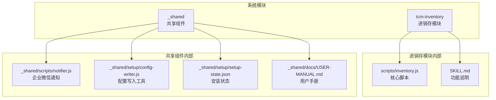
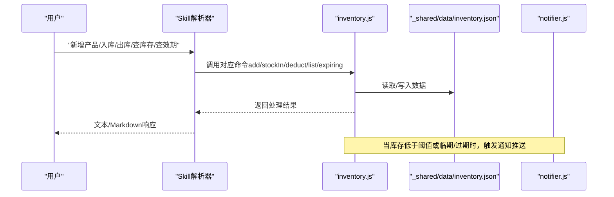
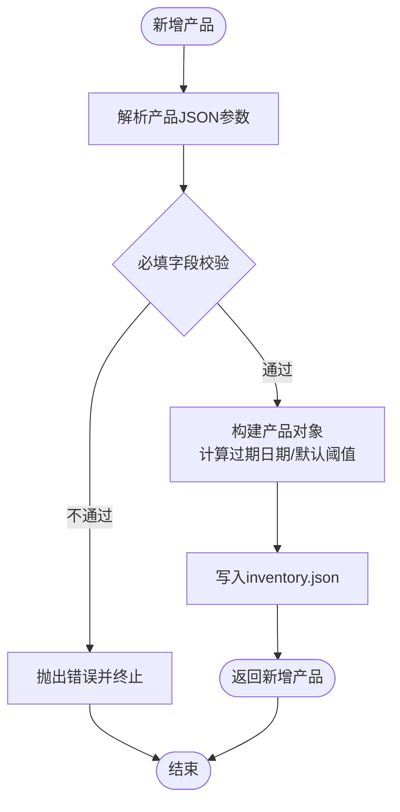
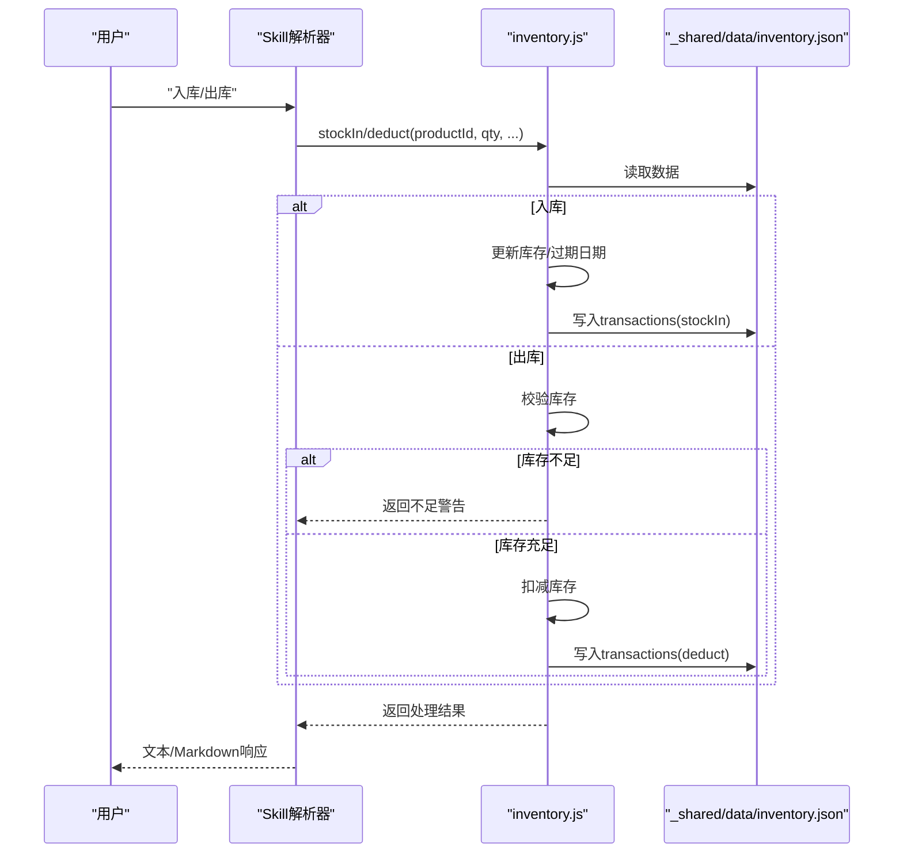
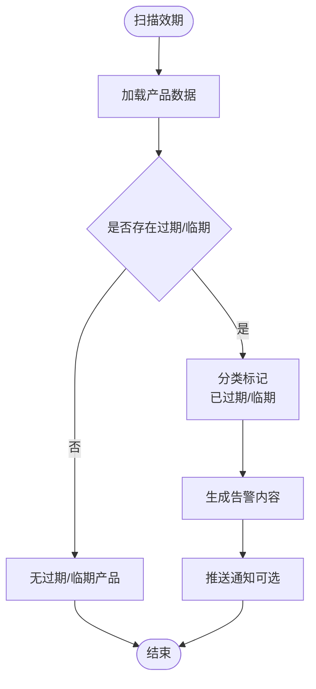
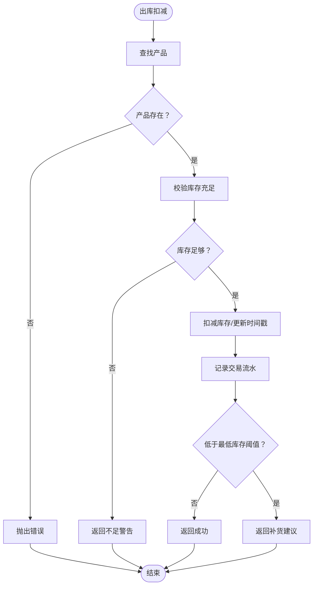
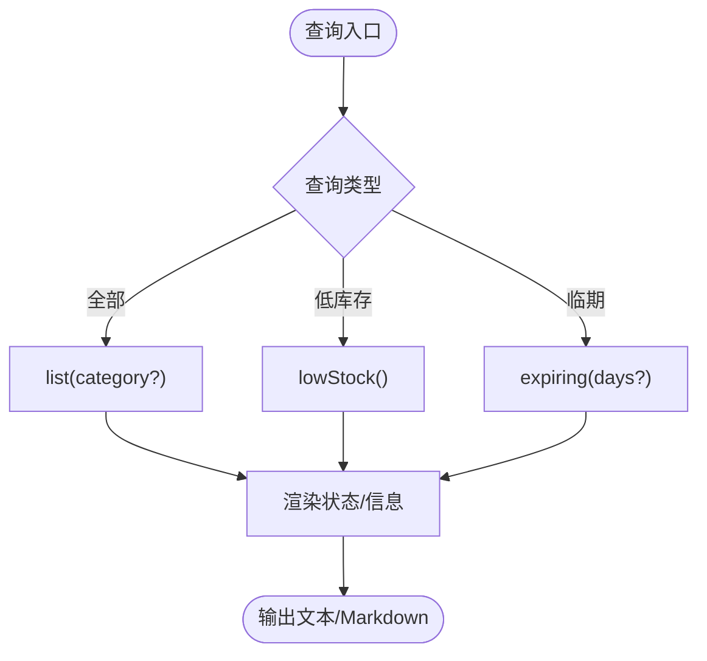
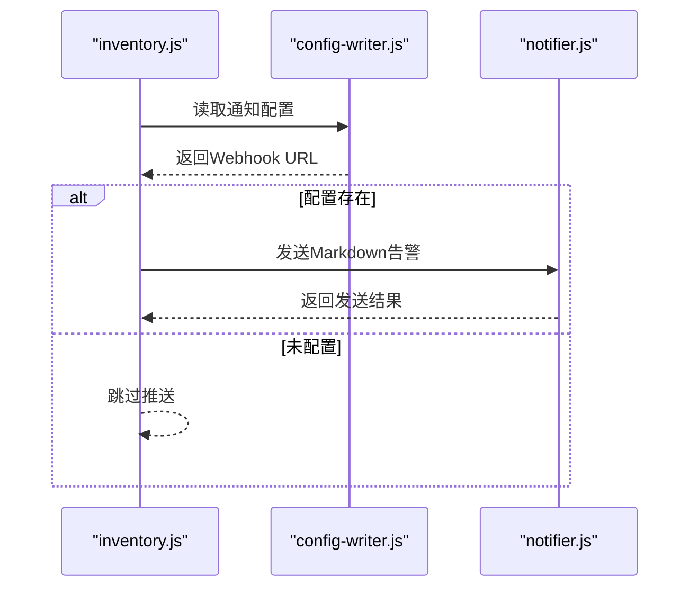
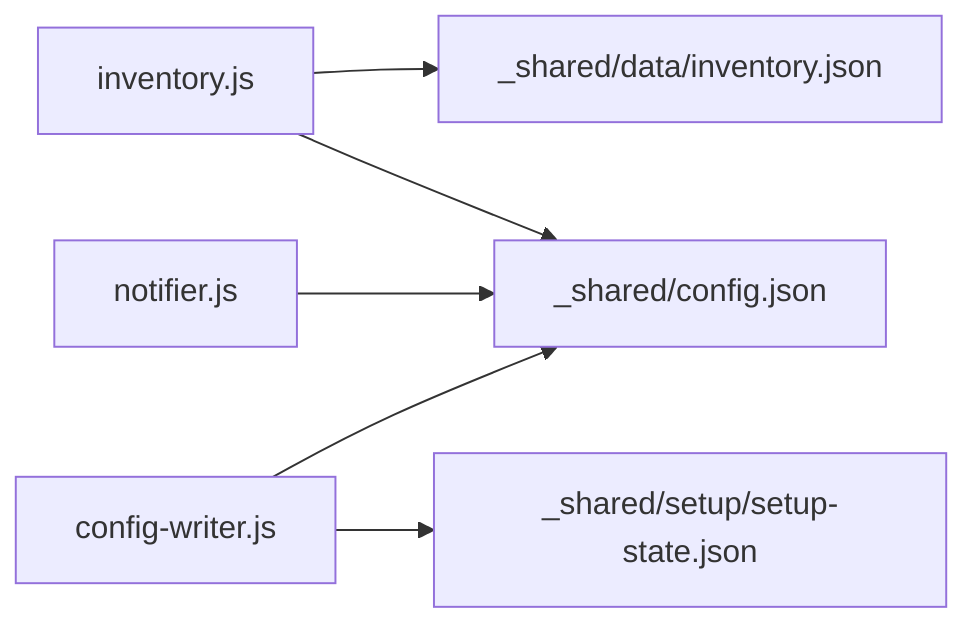

# 进销存管理系统

<cite>
**本文档引用的文件**
- [README.md](file://README.md)
- [SKILL.md](file://SKILL.md)
- [tcm-inventory/SKILL.md](file://tcm-inventory/SKILL.md)
- [tcm-inventory/scripts/inventory.js](file://tcm-inventory/scripts/inventory.js)
- [_shared/scripts/notifier.js](file://_shared/scripts/notifier.js)
- [_shared/setup/config-writer.js](file://_shared/setup/config-writer.js)
- [_shared/setup/setup-state.json](file://_shared/setup/setup-state.json)
- [_shared/docs/USER-MANUAL.md](file://_shared/docs/USER-MANUAL.md)
</cite>

## 目录
1. [简介](#简介)
2. [项目结构](#项目结构)
3. [核心组件](#核心组件)
4. [架构总览](#架构总览)
5. [详细组件分析](#详细组件分析)
6. [依赖关系分析](#依赖关系分析)
7. [性能考虑](#性能考虑)
8. [故障排查指南](#故障排查指南)
9. [结论](#结论)
10. [附录](#附录)

## 简介
本系统为中医馆智能运营 Skill 套件中的进销存管理模块，提供产品目录管理、库存出入库流程、效期预警机制、库存扣减逻辑等核心能力。系统以对话交互方式驱动，支持产品新增/修改/删除、入库登记、销售出库自动扣减、实时库存查询、低库存与临期预警、过期自动扫描等功能。数据持久化采用本地 JSON 文件存储，配合企业微信通知实现告警推送。

## 项目结构
仓库采用模块化组织，核心进销存功能位于 tcm-inventory 目录，共享组件位于 _shared 目录。整体结构如下：
- tcm-inventory：进销存模块，包含功能说明与核心脚本
- _shared：共享组件，包含通知、配置写入、安装向导等
- README：项目总体说明与入口

图表来源
- [tcm-inventory/SKILL.md:1-210](file://tcm-inventory/SKILL.md#L1-L210)
- [tcm-inventory/scripts/inventory.js:1-178](file://tcm-inventory/scripts/inventory.js#L1-L178)
- [_shared/scripts/notifier.js:1-274](file://_shared/scripts/notifier.js#L1-L274)
- [_shared/setup/config-writer.js:1-603](file://_shared/setup/config-writer.js#L1-L603)
- [_shared/setup/setup-state.json:1-17](file://_shared/setup/setup-state.json#L1-L17)
- [_shared/docs/USER-MANUAL.md:1-155](file://_shared/docs/USER-MANUAL.md#L1-L155)

章节来源
- [README.md:1-5](file://README.md#L1-L5)
- [SKILL.md:1-379](file://SKILL.md#L1-L379)

## 核心组件
- 进销存核心脚本：提供产品管理、库存出入库、库存查询、低库存与临期预警、效期检查等命令行接口与模块导出。
- 通知模块：提供企业微信 Webhook 推送能力，用于库存预警与告警通知。
- 配置写入工具：支持多商户类型配置写入与属性类型设置，确保系统运行参数正确。
- 安装状态：记录安装向导完成状态，确保首次使用流程正确引导。

章节来源
- [tcm-inventory/scripts/inventory.js:1-178](file://tcm-inventory/scripts/inventory.js#L1-L178)
- [_shared/scripts/notifier.js:1-274](file://_shared/scripts/notifier.js#L1-L274)
- [_shared/setup/config-writer.js:1-603](file://_shared/setup/config-writer.js#L1-L603)
- [_shared/setup/setup-state.json:1-17](file://_shared/setup/setup-state.json#L1-L17)

## 架构总览
系统采用“对话触发 + 模块化脚本 + 本地数据存储”的架构。用户通过对话触发功能，Skill 解析意图后调用相应脚本，脚本读写本地 JSON 数据文件，并在需要时通过通知模块推送告警。

图表来源
- [tcm-inventory/SKILL.md:25-174](file://tcm-inventory/SKILL.md#L25-L174)
- [tcm-inventory/scripts/inventory.js:149-157](file://tcm-inventory/scripts/inventory.js#L149-L157)
- [_shared/scripts/notifier.js:108-192](file://_shared/scripts/notifier.js#L108-L192)

## 详细组件分析

### 产品/服务目录管理
- 新增产品：支持设置产品名称、分类、进货价、售价、单位、当前库存、生产日期、有效期、最低库存阈值等字段。若提供生产日期与有效期，系统自动计算过期日期。
- 修改/删除产品：通过产品名称或 ID 进行匹配，支持部分字段更新与删除。
- 产品分类：默认可选分类包括艾灸耗材、中药饮片、中成药、医疗器械、保健品、其他。

图表来源
- [tcm-inventory/scripts/inventory.js:47-67](file://tcm-inventory/scripts/inventory.js#L47-L67)

章节来源
- [tcm-inventory/SKILL.md:36-76](file://tcm-inventory/SKILL.md#L36-L76)
- [tcm-inventory/scripts/inventory.js:47-67](file://tcm-inventory/scripts/inventory.js#L47-L67)

### 库存出入库流程
- 入库：根据产品 ID 或名称查找产品，增加库存数量；若提供生产日期与有效期，则更新过期日期；记录交易流水。
- 出库扣减：根据产品 ID 或名称查找产品，校验库存是否充足；不足时返回警告；扣减后记录交易流水；若扣减后低于最低库存阈值，返回补货建议。
- 交易流水：每次出入库均写入 transactions 数组，包含类型、产品 ID、数量、时间、批次（入库）或订单号/备注（出库）。

图表来源
- [tcm-inventory/SKILL.md:78-104](file://tcm-inventory/SKILL.md#L78-L104)
- [tcm-inventory/scripts/inventory.js:69-105](file://tcm-inventory/scripts/inventory.js#L69-L105)

章节来源
- [tcm-inventory/SKILL.md:78-104](file://tcm-inventory/SKILL.md#L78-L104)
- [tcm-inventory/scripts/inventory.js:69-105](file://tcm-inventory/scripts/inventory.js#L69-L105)

### 效期管理与预警机制
- 效期录入：入库时可指定生产日期与有效期（月），系统自动计算过期日期。
- 效期查询：支持查询全部产品的效期状态，区分“已过期”“临期（30天内）”“正常”。
- 过期预警：系统扫描已过期与临近过期的产品，生成告警信息；当库存低于阈值时，同时触发低库存预警。

图表来源
- [tcm-inventory/SKILL.md:148-174](file://tcm-inventory/SKILL.md#L148-L174)
- [tcm-inventory/scripts/inventory.js:124-139](file://tcm-inventory/scripts/inventory.js#L124-L139)

章节来源
- [tcm-inventory/SKILL.md:148-174](file://tcm-inventory/SKILL.md#L148-L174)
- [tcm-inventory/scripts/inventory.js:124-139](file://tcm-inventory/scripts/inventory.js#L124-L139)

### 库存扣减逻辑与实时更新
- 扣减前置校验：严格校验产品存在性与库存充足性，不足时返回明确提示。
- 实时更新：每次操作后立即写入数据文件，保证库存数据一致性。
- 阈值联动：扣减后若低于最低库存阈值，返回补货建议，便于后续补货决策。

图表来源
- [tcm-inventory/scripts/inventory.js:85-105](file://tcm-inventory/scripts/inventory.js#L85-L105)

章节来源
- [tcm-inventory/scripts/inventory.js:85-105](file://tcm-inventory/scripts/inventory.js#L85-L105)

### 多维度查询功能
- 全量库存查询：支持按分类筛选，输出状态标识（断货/低库存/正常）、名称、数量、单价、过期日期等。
- 低库存查询：筛选库存小于等于最低库存阈值的产品，输出清单。
- 临期查询：默认30天内到期，输出“已过期”“临期”两类清单。

图表来源
- [tcm-inventory/scripts/inventory.js:107-147](file://tcm-inventory/scripts/inventory.js#L107-L147)

章节来源
- [tcm-inventory/scripts/inventory.js:107-147](file://tcm-inventory/scripts/inventory.js#L107-L147)

### 通知与告警集成
- 通知配置：通过配置写入工具设置企业微信 Webhook URL，系统自动启用通知。
- 告警类型：支持文本/Markdown消息发送，适用于库存预警、日终摘要等场景。
- 触发条件：低库存阈值触发、临期/过期扫描触发、日终流程触发等。

图表来源
- [_shared/scripts/notifier.js:33-53](file://_shared/scripts/notifier.js#L33-L53)
- [_shared/setup/config-writer.js:502-511](file://_shared/setup/config-writer.js#L502-L511)

章节来源
- [_shared/scripts/notifier.js:108-192](file://_shared/scripts/notifier.js#L108-L192)
- [_shared/setup/config-writer.js:502-511](file://_shared/setup/config-writer.js#L502-L511)

## 依赖关系分析
- inventory.js 依赖本地数据文件作为唯一持久化介质，提供命令行与模块两种使用方式。
- notifier.js 依赖配置文件中的 Webhook URL，用于企业微信通知推送。
- config-writer.js 提供统一的配置写入接口，确保多商户类型与属性类型的正确设置。
- setup-state.json 记录安装向导状态，确保首次使用流程正确引导。

图表来源
- [tcm-inventory/scripts/inventory.js:17-32](file://tcm-inventory/scripts/inventory.js#L17-L32)
- [_shared/scripts/notifier.js:23-53](file://_shared/scripts/notifier.js#L23-L53)
- [_shared/setup/config-writer.js:26-50](file://_shared/setup/config-writer.js#L26-L50)
- [_shared/setup/setup-state.json:1-17](file://_shared/setup/setup-state.json#L1-L17)

章节来源
- [tcm-inventory/scripts/inventory.js:17-32](file://tcm-inventory/scripts/inventory.js#L17-L32)
- [_shared/scripts/notifier.js:23-53](file://_shared/scripts/notifier.js#L23-L53)
- [_shared/setup/config-writer.js:26-50](file://_shared/setup/config-writer.js#L26-L50)
- [_shared/setup/setup-state.json:1-17](file://_shared/setup/setup-state.json#L1-L17)

## 性能考虑
- 数据存储：采用本地 JSON 文件，I/O 操作简单高效，适合中小规模数据与轻量并发场景。
- 查询复杂度：列表/过滤/扫描均为线性遍历，时间复杂度 O(n)，满足日常运营需求。
- 内存占用：脚本按需读取/写入，内存占用极低，适合长时间运行。
- 建议：若未来业务规模扩大，可考虑引入轻量数据库或缓存层以提升吞吐与查询效率。

## 故障排查指南
- 通知未推送
  - 检查配置文件中企业微信 Webhook URL 是否正确配置
  - 使用通知模块的测试命令验证配置有效性
- 库存扣减失败
  - 确认产品存在且库存充足
  - 检查输入的数量与产品单位是否一致
- 数据文件损坏
  - 备份并重建数据文件，确保字段完整性
- 安装向导未完成
  - 检查安装状态文件，按向导步骤逐步完成

章节来源
- [_shared/scripts/notifier.js:213-256](file://_shared/scripts/notifier.js#L213-L256)
- [_shared/setup/setup-state.json:1-17](file://_shared/setup/setup-state.json#L1-L17)

## 结论
本进销存系统以简洁可靠的架构实现了中医馆日常所需的库存管理需求。通过对话式交互与模块化脚本，系统提供了从产品目录到库存扣减、从效期管理到预警通知的完整闭环。对于当前规模而言，系统具备良好的易用性与稳定性；随着业务增长，可在保持现有接口不变的前提下扩展存储与查询能力。

## 附录

### 典型业务场景操作流程

- 库存盘点
  - 使用“查库存/低库存/查效期”等查询命令，结合“产品目录”查看产品清单与状态，形成盘点依据。
  
- 采购入库
  - 通过“入库”命令登记产品入库，系统自动更新库存与过期日期，并记录交易流水。
  
- 销售出库
  - 通过“出库”命令进行扣减，系统自动校验库存、记录流水，并在低于阈值时给出补货建议。

章节来源
- [tcm-inventory/SKILL.md:25-121](file://tcm-inventory/SKILL.md#L25-L121)