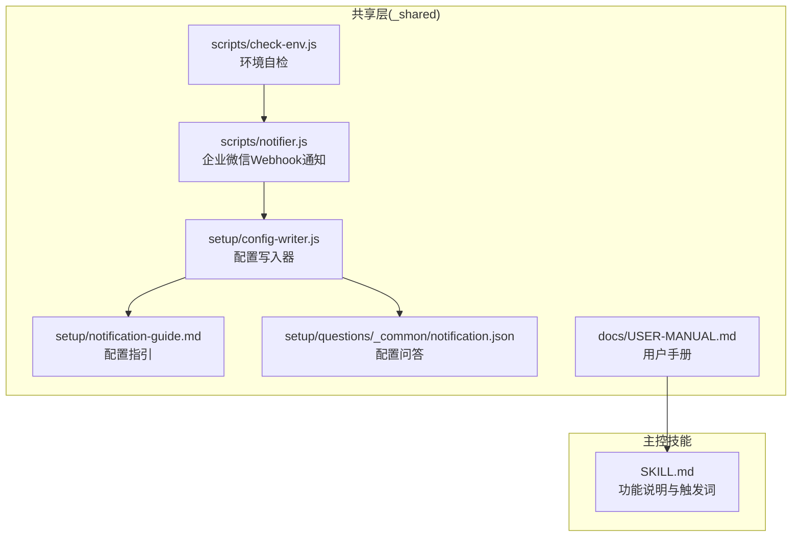
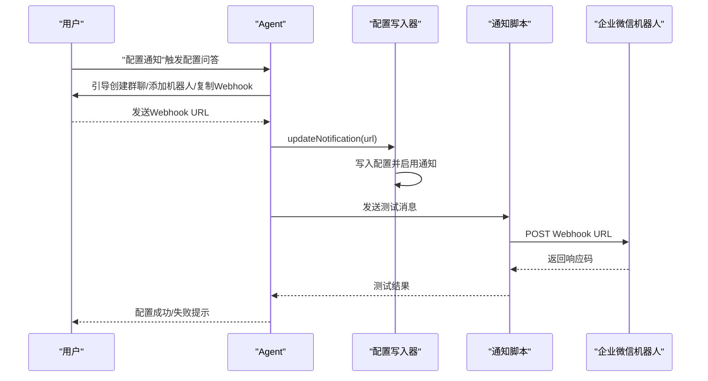
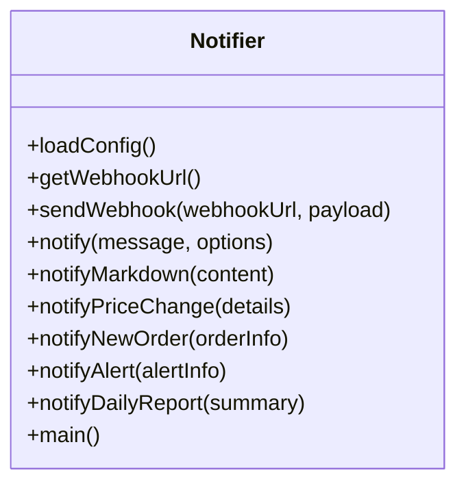
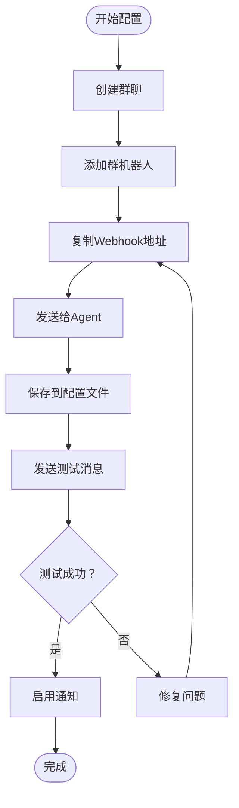
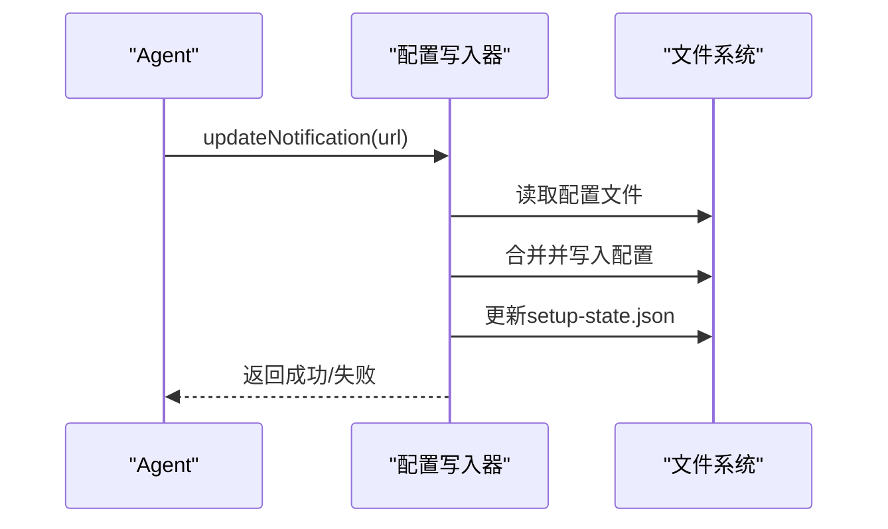
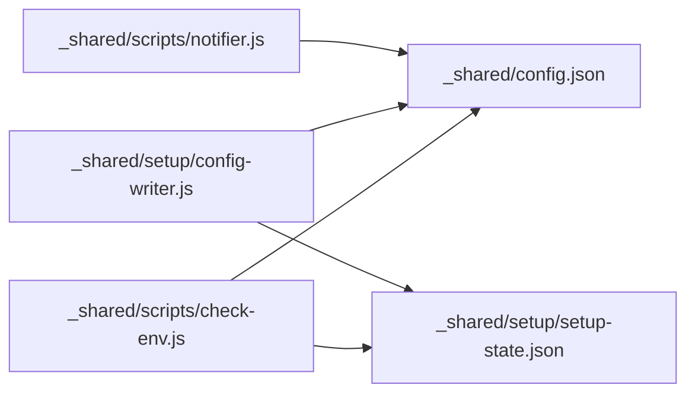

# 通知推送系统

<cite>
**本文档引用的文件**
- [notifier.js](file://_shared/scripts/notifier.js)
- [notification-guide.md](file://_shared/setup/notification-guide.md)
- [notification.json](file://_shared/setup/questions/_common/notification.json)
- [task-manager.js](file://_shared/scripts/task-manager.js)
- [config-writer.js](file://_shared/setup/config-writer.js)
- [check-env.js](file://_shared/scripts/check-env.js)
- [USER-MANUAL.md](file://_shared/docs/USER-MANUAL.md)
- [package.json](file://_shared/package.json)
- [SKILL.md](file://SKILL.md)
</cite>

## 目录
1. [简介](#简介)
2. [项目结构](#项目结构)
3. [核心组件](#核心组件)
4. [架构总览](#架构总览)
5. [详细组件分析](#详细组件分析)
6. [依赖关系分析](#依赖关系分析)
7. [性能考虑](#性能考虑)
8. [故障排查指南](#故障排查指南)
9. [结论](#结论)
10. [附录](#附录)

## 简介
本通知推送系统基于企业微信机器人 Webhook 实现，支持多种通知类型（文本、Markdown）、自动测试与配置验证、以及与任务管理器的联动推送。系统提供完整的配置流程、触发条件说明、消息格式规范、模板定制与样式调整建议，并包含故障排查与性能优化指南，帮助用户快速部署并稳定运行通知功能。

## 项目结构
通知系统主要位于共享层（_shared）中，核心文件包括：
- 通知脚本：_shared/scripts/notifier.js
- 配置与向导：_shared/setup/notification-guide.md、_shared/setup/questions/_common/notification.json
- 配置写入器：_shared/setup/config-writer.js
- 环境自检：_shared/scripts/check-env.js
- 用户手册：_shared/docs/USER-MANUAL.md
- 主控技能文档：SKILL.md

**图表来源**
- [notifier.js:1-274](file://_shared/scripts/notifier.js#L1-L274)
- [notification-guide.md:1-71](file://_shared/setup/notification-guide.md#L1-L71)
- [notification.json:1-12](file://_shared/setup/questions/_common/notification.json#L1-L12)
- [config-writer.js:1-603](file://_shared/setup/config-writer.js#L1-L603)
- [check-env.js:1-464](file://_shared/scripts/check-env.js#L1-L464)
- [USER-MANUAL.md:1-155](file://_shared/docs/USER-MANUAL.md#L1-L155)
- [SKILL.md:1-379](file://SKILL.md#L1-L379)

**章节来源**
- [notifier.js:1-274](file://_shared/scripts/notifier.js#L1-L274)
- [notification-guide.md:1-71](file://_shared/setup/notification-guide.md#L1-L71)
- [notification.json:1-12](file://_shared/setup/questions/_common/notification.json#L1-L12)
- [config-writer.js:1-603](file://_shared/setup/config-writer.js#L1-L603)
- [check-env.js:1-464](file://_shared/scripts/check-env.js#L1-L464)
- [USER-MANUAL.md:1-155](file://_shared/docs/USER-MANUAL.md#L1-L155)
- [SKILL.md:1-379](file://SKILL.md#L1-L379)

## 核心组件
- 通知脚本（notifier.js）
  - 提供企业微信 Webhook 推送能力，支持文本与 Markdown 消息类型
  - 自动加载配置、校验 Webhook URL、发送测试消息
  - 提供多种通知接口：文本、Markdown、调价通知、新订单通知、告警通知、日报摘要
- 配置与向导（notification-guide.md、notification.json）
  - 三步配置流程：创建群聊、添加机器人、复制 Webhook 地址
  - 配置问答定义验证规则与测试消息
- 配置写入器（config-writer.js）
  - 将 Webhook URL 写入配置文件并启用通知功能
  - 与安装向导协同工作，确保配置一致性
- 环境自检（check-env.js）
  - 检查通知配置状态，提供修复建议
- 用户手册与主控技能文档
  - 提供使用场景、触发词与功能说明

**章节来源**
- [notifier.js:105-210](file://_shared/scripts/notifier.js#L105-L210)
- [notification-guide.md:9-71](file://_shared/setup/notification-guide.md#L9-L71)
- [notification.json:1-12](file://_shared/setup/questions/_common/notification.json#L1-L12)
- [config-writer.js:500-511](file://_shared/setup/config-writer.js#L500-L511)
- [check-env.js:231-248](file://_shared/scripts/check-env.js#L231-L248)
- [USER-MANUAL.md:64-72](file://_shared/docs/USER-MANUAL.md#L64-L72)
- [SKILL.md:157-167](file://SKILL.md#L157-L167)

## 架构总览
通知系统采用“配置驱动 + Webhook 推送”的架构，核心流程如下：
- 配置阶段：用户在企业微信中创建群聊并添加机器人，复制 Webhook URL
- 写入阶段：Agent 通过配置写入器将 URL 写入配置文件并启用通知
- 验证阶段：执行测试消息发送，验证 Webhook 可用性
- 推送阶段：根据业务事件（任务派发/完成、日报、告警等）调用相应通知接口
- 监控阶段：环境自检脚本定期检查通知配置状态

**图表来源**
- [config-writer.js:500-511](file://_shared/setup/config-writer.js#L500-L511)
- [notifier.js:213-256](file://_shared/scripts/notifier.js#L213-L256)
- [notification.json:5-11](file://_shared/setup/questions/_common/notification.json#L5-L11)

**章节来源**
- [config-writer.js:500-511](file://_shared/setup/config-writer.js#L500-L511)
- [notifier.js:213-256](file://_shared/scripts/notifier.js#L213-L256)
- [notification.json:5-11](file://_shared/setup/questions/_common/notification.json#L5-L11)

## 详细组件分析

### 通知脚本（notifier.js）
- 配置加载与校验
  - 从共享配置文件加载通知配置，自动启用已配置的 Webhook URL
  - 若未配置 Webhook URL，输出错误提示并返回失败
- Webhook 发送
  - 解析 URL，构造 HTTP 请求头与请求体
  - 支持 HTTP/HTTPS，异步发送并解析响应
- 通知接口
  - 文本通知：支持@all提及
  - Markdown 通知：支持标题、列表、图标等格式
  - 业务通知：调价通知、新订单通知、告警通知、日报摘要
- CLI 入口
  - 支持 test 与 send 子命令，便于本地调试与验证

**图表来源**
- [notifier.js:25-53](file://_shared/scripts/notifier.js#L25-L53)
- [notifier.js:60-101](file://_shared/scripts/notifier.js#L60-L101)
- [notifier.js:108-210](file://_shared/scripts/notifier.js#L108-L210)
- [notifier.js:213-273](file://_shared/scripts/notifier.js#L213-L273)

**章节来源**
- [notifier.js:25-53](file://_shared/scripts/notifier.js#L25-L53)
- [notifier.js:60-101](file://_shared/scripts/notifier.js#L60-L101)
- [notifier.js:108-210](file://_shared/scripts/notifier.js#L108-L210)
- [notifier.js:213-273](file://_shared/scripts/notifier.js#L213-L273)

### 配置与向导
- 配置指引
  - 三步创建群聊、添加机器人、复制 Webhook 地址
  - Agent 自动保存并测试，成功后自动推送通知
- 配置问答
  - 定义验证规则（以 https://qyapi.weixin.qq.com/ 开头）
  - 提供测试消息模板，便于快速验证

**图表来源**
- [notification-guide.md:9-31](file://_shared/setup/notification-guide.md#L9-L31)
- [notification.json:5-11](file://_shared/setup/questions/_common/notification.json#L5-L11)

**章节来源**
- [notification-guide.md:9-31](file://_shared/setup/notification-guide.md#L9-L31)
- [notification.json:5-11](file://_shared/setup/questions/_common/notification.json#L5-L11)

### 配置写入器（config-writer.js）
- 更新通知配置
  - 将 Webhook URL 写入配置文件的 notification.wechatWork.webhookUrl
  - 自动启用通知开关
- 与安装向导协作
  - 与 setup-state.json 同步，确保配置一致性
- 通用验证
  - 提供多种数据验证方法（时间、电话、金额等）

**图表来源**
- [config-writer.js:500-511](file://_shared/setup/config-writer.js#L500-L511)
- [config-writer.js:544-558](file://_shared/setup/config-writer.js#L544-L558)

**章节来源**
- [config-writer.js:500-511](file://_shared/setup/config-writer.js#L500-L511)
- [config-writer.js:544-558](file://_shared/setup/config-writer.js#L544-L558)

### 环境自检（check-env.js）
- 检查通知配置状态
  - 读取配置文件中的 Webhook URL
  - 判断是否已配置并可使用
- 提供修复建议
  - 未配置时提示“配置通知”或提供引导
  - 可选功能，不影响核心功能使用

**章节来源**
- [check-env.js:231-248](file://_shared/scripts/check-env.js#L231-L248)

### 任务管理器联动
- 任务派发与完成
  - 任务创建/开始/完成时触发通知推送
  - 与任务管理器的数据文件（tasks.json）联动
- 自动生成任务
  - 从排班/退房订单自动生成保洁任务并推送通知

**章节来源**
- [task-manager.js:76-99](file://_shared/scripts/task-manager.js#L76-L99)
- [task-manager.js:104-124](file://_shared/scripts/task-manager.js#L104-L124)
- [task-manager.js:184-212](file://_shared/scripts/task-manager.js#L184-L212)
- [task-manager.js:217-251](file://_shared/scripts/task-manager.js#L217-L251)

## 依赖关系分析
- 通知脚本依赖
  - Node 内置模块：https、http、fs、path
  - 配置文件：_shared/config.json
- 配置写入器依赖
  - 文件系统：读取/写入配置文件与 setup-state.json
  - 验证器：提供数据格式校验
- 环境自检依赖
  - 读取配置文件与 setup-state.json
  - 输出结构化检查结果

**图表来源**
- [notifier.js:23-31](file://_shared/scripts/notifier.js#L23-L31)
- [config-writer.js:27-29](file://_shared/setup/config-writer.js#L27-L29)
- [check-env.js:25-26](file://_shared/scripts/check-env.js#L25-L26)

**章节来源**
- [notifier.js:23-31](file://_shared/scripts/notifier.js#L23-L31)
- [config-writer.js:27-29](file://_shared/setup/config-writer.js#L27-L29)
- [check-env.js:25-26](file://_shared/scripts/check-env.js#L25-L26)

## 性能考虑
- 异步发送与响应解析
  - 使用 Promise 包装 HTTP 请求，避免阻塞主线程
  - 解析响应体并根据 errcode 判断发送结果
- 配置缓存与自动启用
  - 首次检测到 Webhook URL 即自动启用通知，减少重复配置成本
- 轻量依赖
  - 仅使用 Node 内置模块，降低外部依赖带来的性能与安全风险

**章节来源**
- [notifier.js:60-101](file://_shared/scripts/notifier.js#L60-L101)
- [notifier.js:43-51](file://_shared/scripts/notifier.js#L43-L51)

## 故障排查指南
- 配置未生效
  - 检查配置文件是否存在与格式是否正确
  - 确认 Webhook URL 是否以 https://qyapi.weixin.qq.com/ 开头
- 发送失败
  - 查看响应中的 errcode 与 errmsg，定位具体错误
  - 确认网络连通性与企业微信机器人状态
- 环境自检
  - 运行环境自检脚本，查看通知配置状态与修复建议
  - 未配置通知不影响核心功能，可在对话中继续使用

**章节来源**
- [notifier.js:80-90](file://_shared/scripts/notifier.js#L80-L90)
- [check-env.js:231-248](file://_shared/scripts/check-env.js#L231-L248)

## 结论
通知推送系统通过简洁的配置流程与完善的验证机制，实现了与企业微信机器人的无缝对接。系统支持多种通知类型与业务场景，具备良好的扩展性与稳定性。结合任务管理器的联动与环境自检工具，能够满足民宿日常运营中的通知需求，并为后续功能扩展提供坚实基础。

## 附录
- 使用场景与触发词
  - 通知推送：配置后自动推送任务派发、完成、日报、告警等
  - 用户手册与主控技能文档提供了详细的使用说明与触发词
- 依赖与版本
  - 项目使用 Node.js 与 Playwright、node-cron 等依赖

**章节来源**
- [USER-MANUAL.md:64-72](file://_shared/docs/USER-MANUAL.md#L64-L72)
- [SKILL.md:157-167](file://SKILL.md#L157-L167)
- [package.json:14-18](file://_shared/package.json#L14-L18)