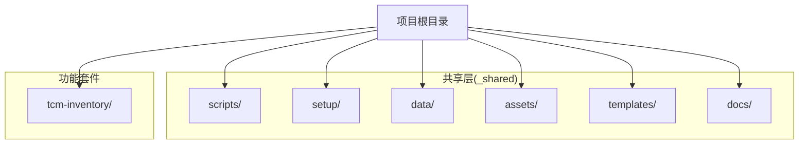
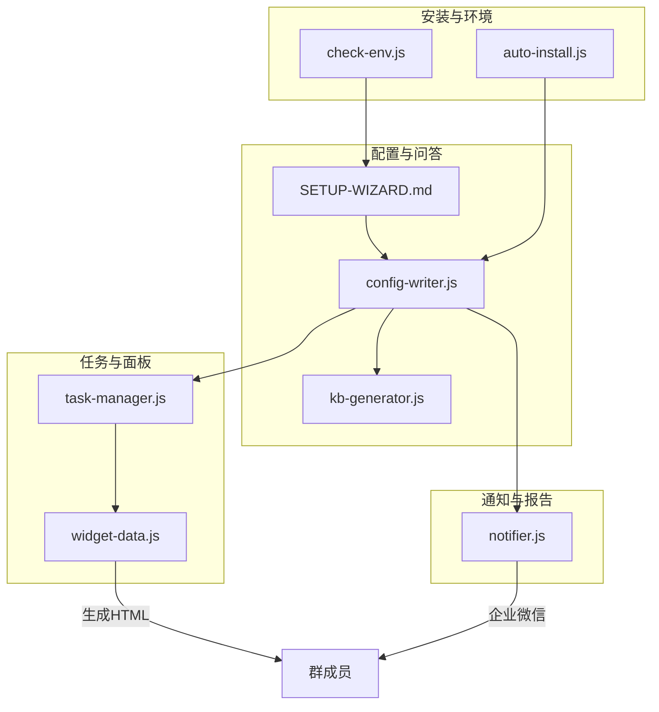
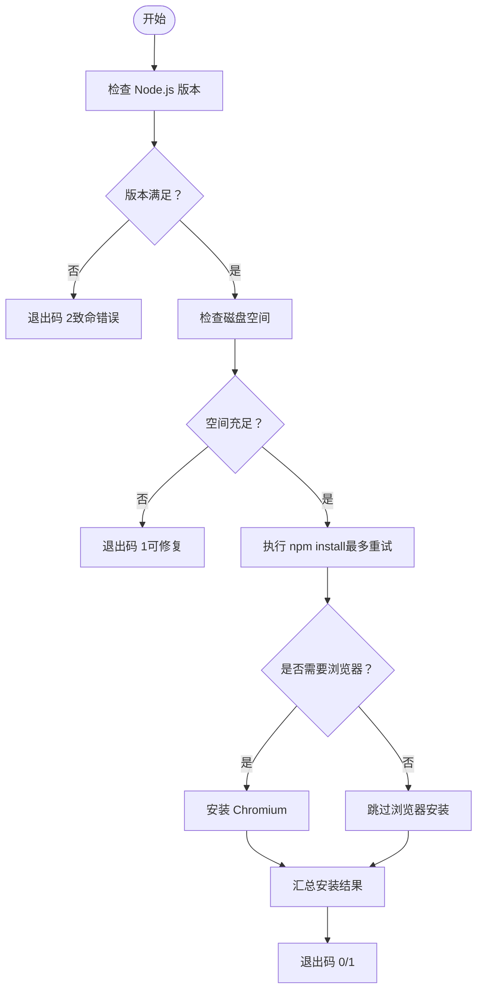
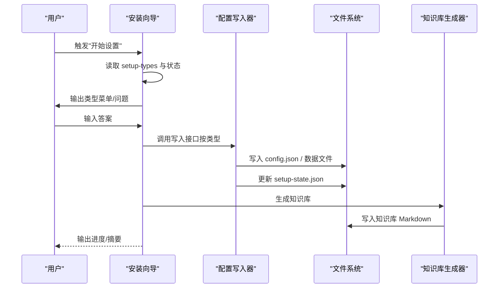
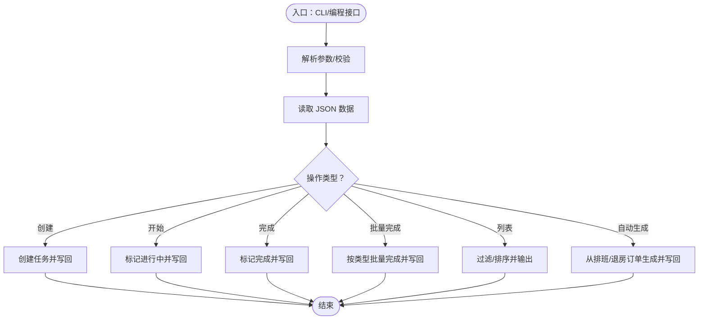
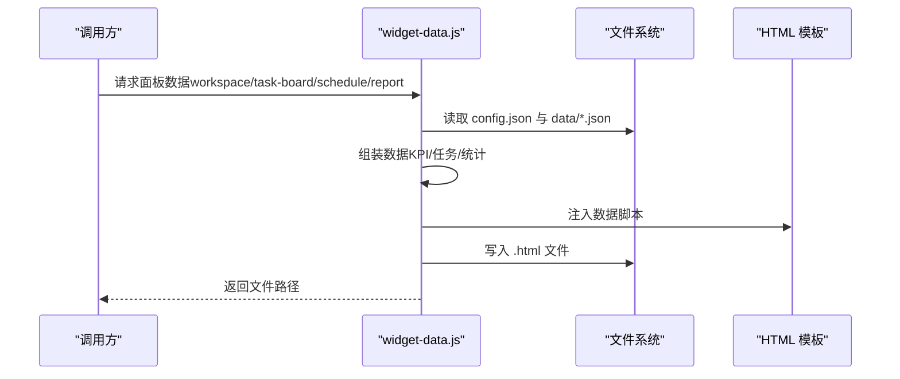
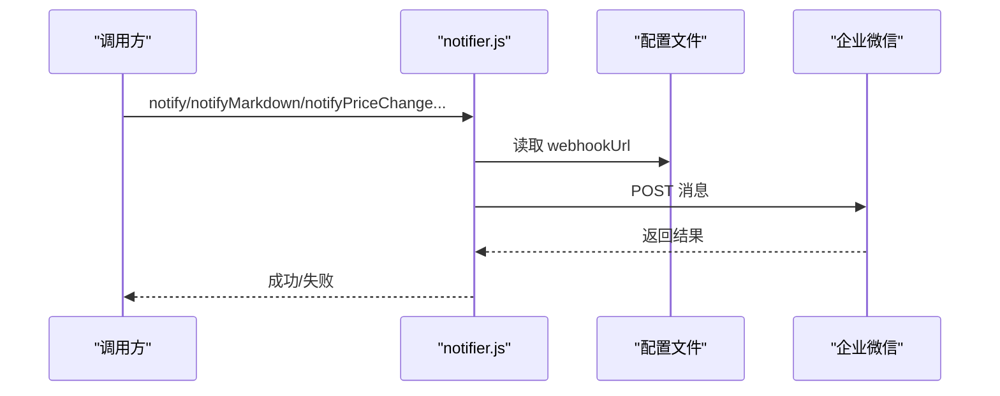
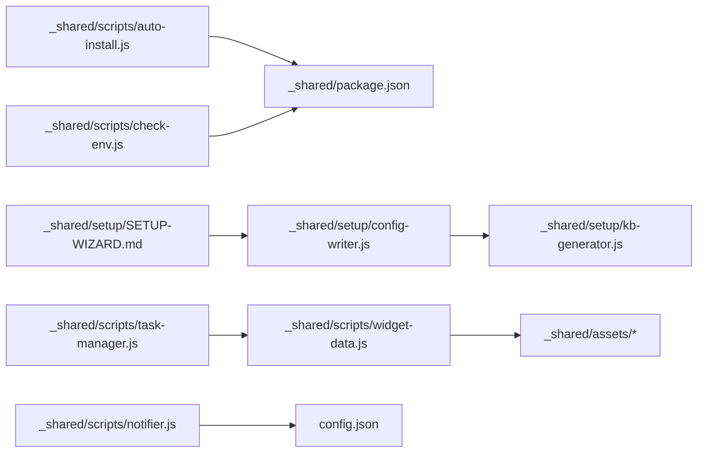

# 代码结构与模块组织

<cite>
**本文档引用的文件**
- [README.md](file://README.md)
- [SKILL.md](file://SKILL.md)
- [_shared/package.json](file://_shared/package.json)
- [_shared/scripts/task-manager.js](file://_shared/scripts/task-manager.js)
- [_shared/scripts/widget-data.js](file://_shared/scripts/widget-data.js)
- [_shared/scripts/notifier.js](file://_shared/scripts/notifier.js)
- [_shared/scripts/auto-install.js](file://_shared/scripts/auto-install.js)
- [_shared/scripts/check-env.js](file://_shared/scripts/check-env.js)
- [_shared/setup/SETUP-WIZARD.md](file://_shared/setup/SETUP-WIZARD.md)
- [_shared/setup/questions/_common/basic-info.json](file://_shared/setup/questions/_common/basic-info.json)
- [_shared/setup/setup-state.json](file://_shared/setup/setup-state.json)
- [_shared/setup/kb-generator.js](file://_shared/setup/kb-generator.js)
</cite>

## 目录
1. [引言](#引言)
2. [项目结构](#项目结构)
3. [核心组件](#核心组件)
4. [架构总览](#架构总览)
5. [详细组件分析](#详细组件分析)
6. [依赖分析](#依赖分析)
7. [性能考量](#性能考量)
8. [故障排查指南](#故障排查指南)
9. [结论](#结论)
10. [附录](#附录)

## 引言
本文件面向开发者，系统化梳理 Skills 3 套件的代码结构与模块组织，聚焦共享层（_shared/）的设计理念与核心脚本职责，阐明模块边界、依赖关系与数据流，提供可操作的重构与扩展建议，帮助快速理解并高效维护现有代码。

## 项目结构
项目采用“共享层 + 功能套件”的分层组织方式：
- 共享层（_shared/）：提供跨套件复用的能力，包括安装与环境检测、配置写入、知识库生成、任务与面板数据桥接、通知推送等。
- 功能套件：以“技能”为单位的子目录（例如 tcm-inventory/），承载具体业务实现与文档。
- 顶层文档：README.md 与 SKILL.md 提供使用说明与行为定义。

图表来源
- [README.md:1-5](file://README.md#L1-L5)
- [SKILL.md:1-379](file://SKILL.md#L1-L379)

章节来源
- [README.md:1-5](file://README.md#L1-L5)
- [SKILL.md:1-379](file://SKILL.md#L1-L379)

## 核心组件
共享层的核心组件围绕“安装与环境”“配置与问答”“任务与面板”“通知与报告”四大主题展开，职责清晰、边界明确：

- 安装与环境检测
  - 自动安装脚本：统一执行 Node 版本与磁盘空间检查、依赖安装、浏览器安装（按需）。
  - 环境自检脚本：10项检查（基础环境/配置状态/功能组件/数据健康），按商户类型动态调整。
- 配置与问答
  - 安装向导：引导式采集基础信息、业务详情、规则与标准、周边/设施、团队与通知，支持断点续传与数据修正。
  - 配置写入器：提供多类型字段的写入接口，保证“读取→合并→写入”，避免覆盖。
  - 知识库生成器：将结构化数据渲染为各套件知识库 Markdown。
- 任务与面板
  - 任务管理器：任务生命周期管理（创建/开始/完成/批量完成），并支持从排班/退房订单自动生成任务。
  - 面板数据桥接器：从本地 JSON 读取数据，组装为工作台/任务看板/排班/报表面板所需数据，并生成可独立打开的 HTML。
- 通知与报告
  - 通知推送：企业微信 Webhook 推送，支持文本与 Markdown，内置多种通知模板。
  - Cron 调度：定时任务调度（由套件内脚本负责，共享层提供依赖与脚本入口约定）。

章节来源
- [_shared/scripts/auto-install.js:1-230](file://_shared/scripts/auto-install.js#L1-L230)
- [_shared/scripts/check-env.js:1-464](file://_shared/scripts/check-env.js#L1-L464)
- [_shared/setup/SETUP-WIZARD.md:1-631](file://_shared/setup/SETUP-WIZARD.md#L1-L631)
- [_shared/setup/kb-generator.js:1-573](file://_shared/setup/kb-generator.js#L1-L573)
- [_shared/scripts/task-manager.js:1-399](file://_shared/scripts/task-manager.js#L1-L399)
- [_shared/scripts/widget-data.js:1-278](file://_shared/scripts/widget-data.js#L1-L278)
- [_shared/scripts/notifier.js:1-274](file://_shared/scripts/notifier.js#L1-L274)

## 架构总览
下图展示了共享层与各功能模块之间的交互关系与数据流向，强调“安装向导 → 配置写入 → 知识库生成 → 任务/面板/通知”的主路径，以及“环境自检/自动安装”对系统健康度的保障。

图表来源
- [_shared/scripts/auto-install.js:1-230](file://_shared/scripts/auto-install.js#L1-L230)
- [_shared/scripts/check-env.js:1-464](file://_shared/scripts/check-env.js#L1-L464)
- [_shared/setup/SETUP-WIZARD.md:1-631](file://_shared/setup/SETUP-WIZARD.md#L1-L631)
- [_shared/setup/kb-generator.js:1-573](file://_shared/setup/kb-generator.js#L1-L573)
- [_shared/scripts/task-manager.js:1-399](file://_shared/scripts/task-manager.js#L1-L399)
- [_shared/scripts/widget-data.js:1-278](file://_shared/scripts/widget-data.js#L1-L278)
- [_shared/scripts/notifier.js:1-274](file://_shared/scripts/notifier.js#L1-L274)

## 详细组件分析

### 安装与环境检测（auto-install.js 与 check-env.js）
- 设计要点
  - 自动安装：版本/磁盘空间检查、npm install（重试）、Playwright 按需安装，输出结构化结果与修复建议。
  - 环境自检：10项检查（基础环境/配置状态/功能组件/数据健康），按 propertyType 调整“必要/推荐/可选”，输出可读性良好的诊断报告。
- 数据流
  - 输入：命令行参数、当前目录、配置文件、状态文件。
  - 输出：控制台报告、退出码、必要时触发安装或提示修复。
- 错误处理
  - 对网络/权限/磁盘空间等典型失败场景给出明确提示与建议。
- 优化建议
  - 将“网络连通性”检查从 DNS 主机名解析迁移到可配置的探测目标，减少离线环境误判。
  - 将“依赖安装”与“浏览器安装”拆分为独立步骤，便于并行与重试。

图表来源
- [_shared/scripts/auto-install.js:48-98](file://_shared/scripts/auto-install.js#L48-L98)

章节来源
- [_shared/scripts/auto-install.js:1-230](file://_shared/scripts/auto-install.js#L1-L230)
- [_shared/scripts/check-env.js:95-326](file://_shared/scripts/check-env.js#L95-L326)

### 安装向导（SETUP-WIZARD.md 与配置写入器）
- 设计要点
  - 引导式采集：按商户类型动态展示问卷，支持断点续传、数据修正、功能清单动态查询。
  - 配置写入：统一字段校验与合并策略，避免覆盖其他字段；同时更新 setup-state.json。
  - 知识库生成：根据 propertyType 与结构化数据生成对应套件知识库 Markdown。
- 数据流
  - 用户输入 → 向导解析 → 调用配置写入器 → 写入 config.json 与数据文件 → 触发知识库生成。
- 交互机制
  - 通过触发词驱动（开始设置/继续设置/修改信息/功能清单），结合状态文件推进流程。
- 优化建议
  - 将问卷定义与逻辑分离，便于多语言与多套件复用。
  - 增加“字段级校验失败回滚”与“批量写入事务”以提升健壮性。

图表来源
- [_shared/setup/SETUP-WIZARD.md:31-46](file://_shared/setup/SETUP-WIZARD.md#L31-L46)
- [_shared/setup/SETUP-WIZARD.md:560-586](file://_shared/setup/SETUP-WIZARD.md#L560-L586)
- [_shared/setup/kb-generator.js:62-86](file://_shared/setup/kb-generator.js#L62-L86)

章节来源
- [_shared/setup/SETUP-WIZARD.md:1-631](file://_shared/setup/SETUP-WIZARD.md#L1-L631)
- [_shared/setup/questions/_common/basic-info.json:1-10](file://_shared/setup/questions/_common/basic-info.json#L1-L10)
- [_shared/setup/setup-state.json:1-17](file://_shared/setup/setup-state.json#L1-L17)
- [_shared/setup/kb-generator.js:1-573](file://_shared/setup/kb-generator.js#L1-L573)

### 任务管理器（task-manager.js）
- 设计要点
  - 任务生命周期：创建/开始/完成/批量完成/列表查询；支持从排班/退房订单自动生成任务。
  - 数据持久化：tasks.json/schedule.json/staff.json/orders.json，统一读写与校验。
- 数据流
  - CLI/编程接口 → 校验参数 → 读取 JSON → 生成/更新任务 → 写回 JSON。
- 优化建议
  - 引入任务变更事件与订阅机制，降低模块间耦合。
  - 增加分页/索引/缓存以提升大规模数据场景下的查询性能。

图表来源
- [_shared/scripts/task-manager.js:315-399](file://_shared/scripts/task-manager.js#L315-L399)

章节来源
- [_shared/scripts/task-manager.js:1-399](file://_shared/scripts/task-manager.js#L1-L399)

### 面板数据桥接器（widget-data.js）
- 设计要点
  - 从本地 JSON 读取数据，组装为工作台/任务看板/排班/报表面板所需数据。
  - 将数据注入 HTML 模板，生成可独立打开的 .html 文件。
- 数据流
  - 读取 config.json 与 data/*.json → 组装 KPI/任务/统计 → 注入模板 → 写入 HTML。
- 优化建议
  - 将模板注入过程抽象为插件化，便于扩展新的面板类型。
  - 增加数据校验与默认值填充，提升健壮性。

图表来源
- [_shared/scripts/widget-data.js:186-220](file://_shared/scripts/widget-data.js#L186-L220)

章节来源
- [_shared/scripts/widget-data.js:1-278](file://_shared/scripts/widget-data.js#L1-L278)

### 通知推送（notifier.js）
- 设计要点
  - 通过企业微信 Webhook 推送文本/Markdown 消息，内置多种通知模板（价格变动/新订单/告警/日报）。
  - 自动启用：检测到 webhookUrl 后自动设置 enabled=true。
- 数据流
  - 读取配置 → 构造 payload → 发送 HTTP 请求 → 返回结果。
- 优化建议
  - 引入重试与退避策略，增强网络不稳定场景的可靠性。
  - 增加消息去重与幂等处理，避免重复推送。

图表来源
- [_shared/scripts/notifier.js:108-192](file://_shared/scripts/notifier.js#L108-L192)

章节来源
- [_shared/scripts/notifier.js:1-274](file://_shared/scripts/notifier.js#L1-L274)

## 依赖分析
- 模块内聚与耦合
  - 共享层内部高内聚：安装、配置、知识库、任务、面板、通知各自职责清晰，低耦合。
  - 与功能套件的耦合：通过约定的文件路径与接口（如知识库输出路径、面板模板路径）实现松耦合。
- 外部依赖
  - Node 标准库为主，依赖 playwright（浏览器）、node-cron（定时任务）、exceljs（报表导出）。
- 潜在循环依赖
  - 当前结构未发现循环依赖；若未来扩展面板模板引擎或通知适配器，需避免双向引用。

图表来源
- [_shared/package.json:1-20](file://_shared/package.json#L1-L20)
- [_shared/scripts/auto-install.js:23-44](file://_shared/scripts/auto-install.js#L23-L44)
- [_shared/scripts/check-env.js:21-40](file://_shared/scripts/check-env.js#L21-L40)
- [_shared/setup/SETUP-WIZARD.md:626-628](file://_shared/setup/SETUP-WIZARD.md#L626-L628)
- [_shared/setup/kb-generator.js:23-32](file://_shared/setup/kb-generator.js#L23-L32)
- [_shared/scripts/task-manager.js:24-31](file://_shared/scripts/task-manager.js#L24-L31)
- [_shared/scripts/widget-data.js:32-34](file://_shared/scripts/widget-data.js#L32-L34)
- [_shared/scripts/notifier.js:23-31](file://_shared/scripts/notifier.js#L23-L31)

章节来源
- [_shared/package.json:1-20](file://_shared/package.json#L1-L20)
- [_shared/scripts/auto-install.js:1-230](file://_shared/scripts/auto-install.js#L1-L230)
- [_shared/scripts/check-env.js:1-464](file://_shared/scripts/check-env.js#L1-L464)
- [_shared/setup/SETUP-WIZARD.md:1-631](file://_shared/setup/SETUP-WIZARD.md#L1-L631)
- [_shared/setup/kb-generator.js:1-573](file://_shared/setup/kb-generator.js#L1-L573)
- [_shared/scripts/task-manager.js:1-399](file://_shared/scripts/task-manager.js#L1-L399)
- [_shared/scripts/widget-data.js:1-278](file://_shared/scripts/widget-data.js#L1-L278)
- [_shared/scripts/notifier.js:1-274](file://_shared/scripts/notifier.js#L1-L274)

## 性能考量
- I/O 与序列化
  - 任务与面板数据均以 JSON 文件形式存储，建议在高频写入场景下引入缓冲与批量写入，减少频繁落盘。
- 网络请求
  - 通知推送与浏览器自动化可能成为性能瓶颈，建议引入连接池、重试与并发限制。
- 模板注入
  - 面板 HTML 注入为一次性操作，建议缓存模板与数据，避免重复解析。

## 故障排查指南
- 环境自检常用命令
  - “检查环境/状态检查/帮我检查/系统正常吗”触发环境自检，输出 10 项检查结果与修复建议。
- 常见问题定位
  - 依赖缺失：执行自动安装或手动 npm install。
  - 配置缺失：通过安装向导向导补齐，或使用配置写入器接口。
  - 数据文件损坏：使用 JSON 修复工具（由自检脚本提示）。
- 通知失败
  - 校验 webhook URL 格式与可达性，必要时重新配置。

章节来源
- [_shared/scripts/check-env.js:413-461](file://_shared/scripts/check-env.js#L413-L461)
- [_shared/scripts/notifier.js:213-273](file://_shared/scripts/notifier.js#L213-L273)

## 结论
Skills 3 套件通过共享层实现了安装、配置、任务、面板与通知的标准化与模块化，具备良好的扩展性与可维护性。建议在保持现有职责边界的基础上，进一步完善数据一致性、错误恢复与可观测性，持续提升用户体验与系统稳定性。

## 附录
- 最佳实践
  - 严格遵循“读取→合并→写入”的配置更新模式，避免覆盖。
  - 将 UI 与数据解耦，通过模板注入与数据桥接器实现灵活扩展。
  - 对外暴露稳定接口，内部实现可演进。
- 重构指导
  - 将问卷定义与逻辑分离，支持多语言与多套件复用。
  - 引入事件总线与中间件，降低模块间耦合。
  - 增加单元测试与集成测试，覆盖关键路径与边界条件。