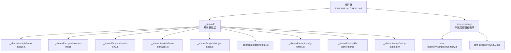
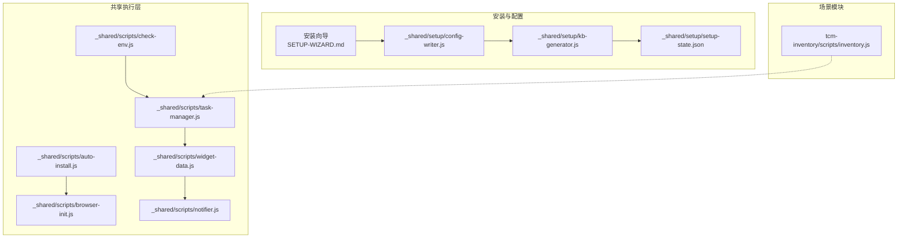
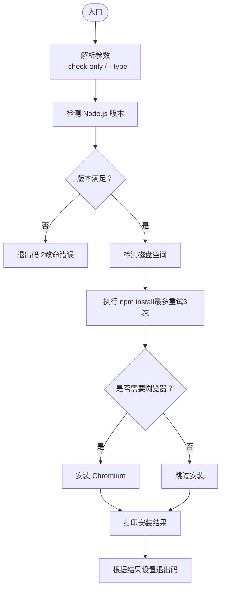
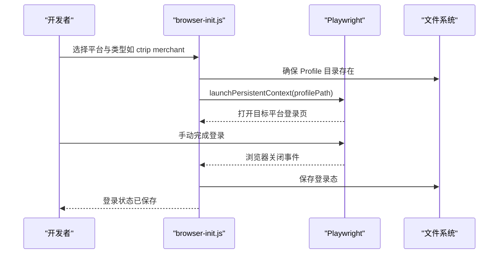
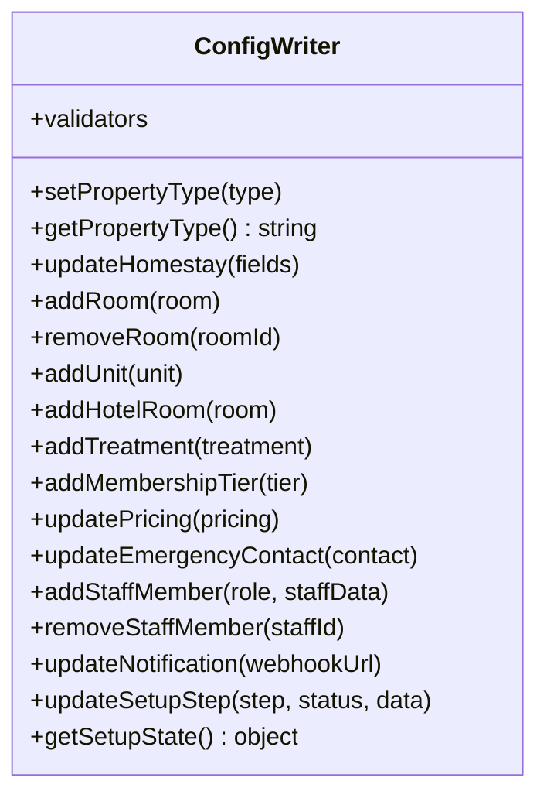
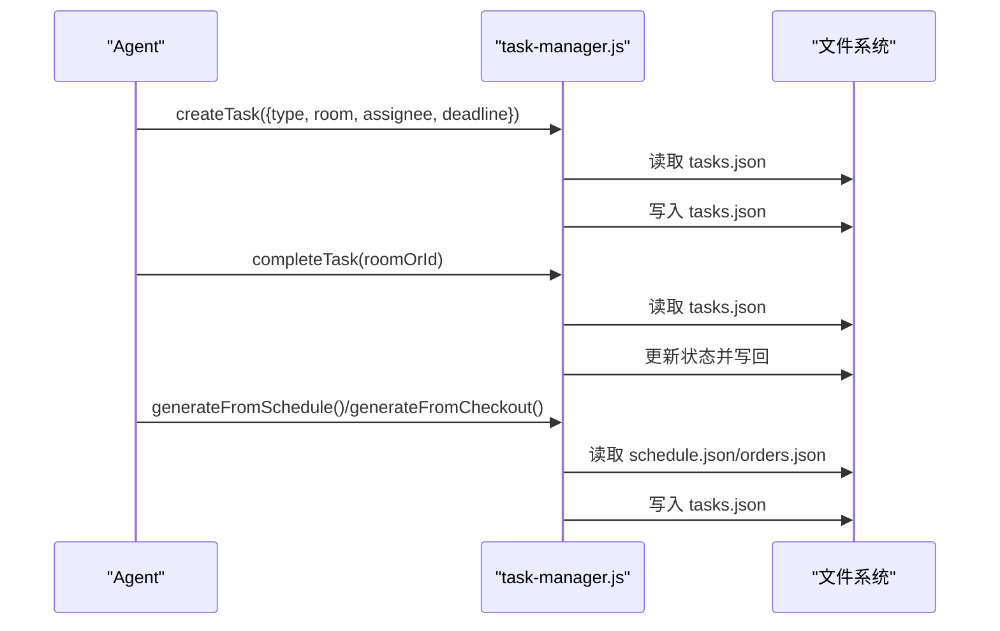
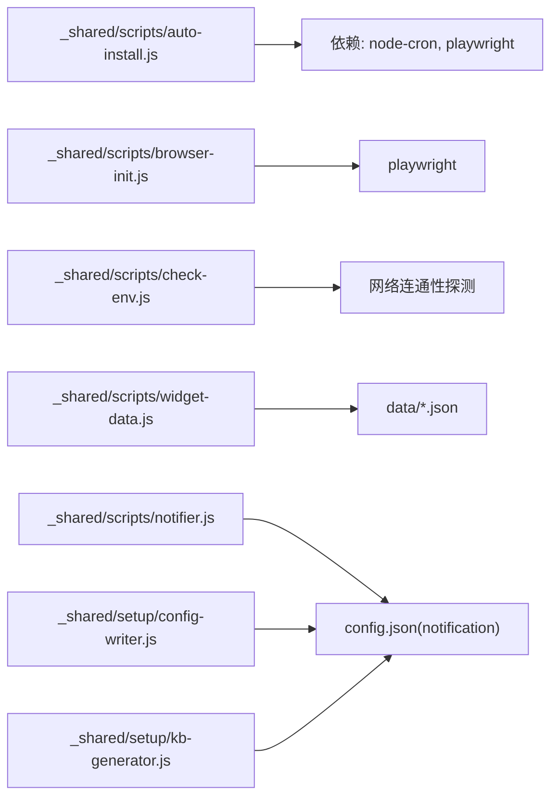

# 开发者指南

<cite>
**本文档引用的文件**
- [README.md](file://README.md)
- [SKILL.md](file://SKILL.md)
- [_shared/package.json](file://_shared/package.json)
- [tcm-inventory/SKILL.md](file://tcm-inventory/SKILL.md)
- [_shared/setup/SETUP-WIZARD.md](file://_shared/setup/SETUP-WIZARD.md)
- [_shared/scripts/auto-install.js](file://_shared/scripts/auto-install.js)
- [_shared/scripts/browser-init.js](file://_shared/scripts/browser-init.js)
- [_shared/scripts/check-env.js](file://_shared/scripts/check-env.js)
- [_shared/scripts/task-manager.js](file://_shared/scripts/task-manager.js)
- [_shared/scripts/widget-data.js](file://_shared/scripts/widget-data.js)
- [_shared/scripts/notifier.js](file://_shared/scripts/notifier.js)
- [_shared/setup/config-writer.js](file://_shared/setup/config-writer.js)
- [_shared/setup/kb-generator.js](file://_shared/setup/kb-generator.js)
- [tcm-inventory/scripts/inventory.js](file://tcm-inventory/scripts/inventory.js)
- [_shared/setup/setup-state.json](file://_shared/setup/setup-state.json)
</cite>

## 目录
1. [简介](#简介)
2. [项目结构](#项目结构)
3. [核心组件](#核心组件)
4. [架构总览](#架构总览)
5. [详细组件分析](#详细组件分析)
6. [依赖分析](#依赖分析)
7. [性能考虑](#性能考虑)
8. [故障排查指南](#故障排查指南)
9. [结论](#结论)
10. [附录](#附录)

## 简介
本指南面向有经验的开发者，系统化阐述 Skills 3 套件的代码结构、模块依赖、扩展开发方法与最佳实践。项目以“共享层 + 多商户类型”为核心设计，围绕安装向导、知识库生成、任务与面板、通知、竞品采集、OTA 操作等能力构建，既支持民宿/公寓/酒店/中医馆等多场景，又提供可插拔的扩展点，便于二次开发与第三方集成。

## 项目结构
仓库采用“共享层 + 场景模块”的组织方式：
- 根目录包含顶层说明与技能元数据
- _shared/ 为共享基础层，包含安装、配置、通知、任务、面板、环境检查、知识库生成等通用脚本与工具
- 各场景模块（如 tcm-inventory）提供特定领域的功能脚本与说明
- README 与 SKILL.md 提供使用说明与功能清单

图表来源
- [README.md:1-5](file://README.md#L1-L5)
- [SKILL.md:1-379](file://SKILL.md#L1-L379)
- [_shared/package.json:1-20](file://_shared/package.json#L1-L20)

章节来源
- [README.md:1-5](file://README.md#L1-L5)
- [SKILL.md:1-379](file://SKILL.md#L1-L379)
- [_shared/package.json:1-20](file://_shared/package.json#L1-L20)

## 核心组件
- 安装与环境管理：auto-install.js 负责 Node/磁盘/依赖/浏览器安装；browser-init.js 管理各 OTA 平台登录态
- 配置与知识库：config-writer.js 提供多类型配置写入；kb-generator.js 将结构化数据渲染为知识库
- 任务与面板：task-manager.js 管理任务生命周期；widget-data.js 生成工作台/看板/排班/报表面板
- 通知：notifier.js 通过企业微信 Webhook 推送各类消息
- 环境自检：check-env.js 统一检查基础环境、配置状态、功能组件与数据健康
- 中医馆进销存：inventory.js 提供产品/库存/效期/预警等核心能力

章节来源
- [_shared/scripts/auto-install.js:1-230](file://_shared/scripts/auto-install.js#L1-L230)
- [_shared/scripts/browser-init.js:1-392](file://_shared/scripts/browser-init.js#L1-L392)
- [_shared/setup/config-writer.js:1-603](file://_shared/setup/config-writer.js#L1-L603)
- [_shared/setup/kb-generator.js:1-573](file://_shared/setup/kb-generator.js#L1-L573)
- [_shared/scripts/task-manager.js:1-399](file://_shared/scripts/task-manager.js#L1-L399)
- [_shared/scripts/widget-data.js:1-278](file://_shared/scripts/widget-data.js#L1-L278)
- [_shared/scripts/notifier.js:1-274](file://_shared/scripts/notifier.js#L1-L274)
- [_shared/scripts/check-env.js:1-464](file://_shared/scripts/check-env.js#L1-L464)
- [tcm-inventory/scripts/inventory.js:1-178](file://tcm-inventory/scripts/inventory.js#L1-L178)

## 架构总览
整体架构以“共享层”为中心，围绕安装向导驱动配置写入，生成知识库，再由各功能模块（任务/面板/通知/采集/OTA）协同工作。核心流程包括：安装向导 → 配置写入 → 知识库生成 → 功能启用 → 数据驱动面板与通知。

图表来源
- [_shared/setup/SETUP-WIZARD.md:1-631](file://_shared/setup/SETUP-WIZARD.md#L1-L631)
- [_shared/setup/config-writer.js:1-603](file://_shared/setup/config-writer.js#L1-L603)
- [_shared/setup/kb-generator.js:1-573](file://_shared/setup/kb-generator.js#L1-L573)
- [_shared/scripts/auto-install.js:1-230](file://_shared/scripts/auto-install.js#L1-L230)
- [_shared/scripts/browser-init.js:1-392](file://_shared/scripts/browser-init.js#L1-L392)
- [_shared/scripts/check-env.js:1-464](file://_shared/scripts/check-env.js#L1-L464)
- [_shared/scripts/task-manager.js:1-399](file://_shared/scripts/task-manager.js#L1-L399)
- [_shared/scripts/widget-data.js:1-278](file://_shared/scripts/widget-data.js#L1-L278)
- [_shared/scripts/notifier.js:1-274](file://_shared/scripts/notifier.js#L1-L274)
- [tcm-inventory/scripts/inventory.js:1-178](file://tcm-inventory/scripts/inventory.js#L1-L178)

## 详细组件分析

### 安装与环境管理（auto-install.js）
- 功能：检测 Node/磁盘 → 依赖安装（含重试）→ 按需安装 Playwright 浏览器 → 结果汇总
- 关键点：支持 --check-only 仅检测；按商户类型决定是否安装浏览器；失败时输出修复建议；退出码区分致命与可修复
- 适用场景：首次使用或环境变化后的自动安装

图表来源
- [_shared/scripts/auto-install.js:1-230](file://_shared/scripts/auto-install.js#L1-L230)

章节来源
- [_shared/scripts/auto-install.js:1-230](file://_shared/scripts/auto-install.js#L1-L230)

### 浏览器登录态管理（browser-init.js）
- 功能：为携程/美团/飞猪/去哪儿/同程等平台初始化与检查登录态；基于 Playwright Persistent Context 持久化
- 关键点：支持 init/init-all/check/check-all；自动检测登录页/登录成功标识；登录态过期时提示重新初始化
- 适用场景：OTA 商家后台登录、竞品消费者端采集

图表来源
- [_shared/scripts/browser-init.js:1-392](file://_shared/scripts/browser-init.js#L1-L392)

章节来源
- [_shared/scripts/browser-init.js:1-392](file://_shared/scripts/browser-init.js#L1-L392)

### 配置写入器（config-writer.js）
- 功能：多商户类型配置写入（民宿/公寓/酒店/中医馆）；统一“读取→合并→写入”模式；提供数据校验与状态更新
- 关键点：setPropertyType/getPropertyType；addRoom/addUnit/addHotelRoom/addTreatment 等；addStaffMember/removeStaffMember；updateNotification；updateSetupStep/getSetupState
- 适用场景：安装向导采集数据后的结构化写入；运行期配置变更

图表来源
- [_shared/setup/config-writer.js:1-603](file://_shared/setup/config-writer.js#L1-L603)

章节来源
- [_shared/setup/config-writer.js:1-603](file://_shared/setup/config-writer.js#L1-L603)

### 知识库生成器（kb-generator.js）
- 功能：将结构化数据渲染为各类型知识库（Markdown），供 RAG 使用
- 关键点：按 propertyType 自动选择渲染器；默认输出映射到各场景资产目录；支持显式指定输出路径
- 适用场景：安装向导完成后自动生成知识库；运行期触发重新生成

章节来源
- [_shared/setup/kb-generator.js:1-573](file://_shared/setup/kb-generator.js#L1-L573)

### 任务管理器（task-manager.js）
- 功能：任务生命周期管理（创建/开始/完成/批量完成）；从排班/退房订单自动生成任务；演示数据注入
- 关键点：任务类型 clean/repair/checkin/general；来源标记 manual/schedule/checkout/order/cron；支持按类型批量完成
- 适用场景：保洁/维修/入住准备等运营任务编排

图表来源
- [_shared/scripts/task-manager.js:1-399](file://_shared/scripts/task-manager.js#L1-L399)

章节来源
- [_shared/scripts/task-manager.js:1-399](file://_shared/scripts/task-manager.js#L1-L399)

### 面板数据桥接器（widget-data.js）
- 功能：从 data/*.json 读取数据，组装为工作台/任务看板/排班/报表面板所需格式；支持生成独立 HTML 文件
- 关键点：工作台 KPI/告警/待办；任务看板列表；排班统计；报表 KPI/趋势/渠道
- 适用场景：生成可视化面板，供 Agent 调用 show_widget 展示

章节来源
- [_shared/scripts/widget-data.js:1-278](file://_shared/scripts/widget-data.js#L1-L278)

### 通知（notifier.js）
- 功能：通过企业微信 Webhook 推送文本/Markdown 消息；内置多种通知模板（价格变动/新订单/告警/日报）
- 关键点：自动启用：检测到 webhookUrl 即启用通知；支持 @all 提及；错误码解析
- 适用场景：任务派发/日报/告警/订单通知

章节来源
- [_shared/scripts/notifier.js:1-274](file://_shared/scripts/notifier.js#L1-L274)

### 环境自检（check-env.js）
- 功能：统一检查 10 项指标（基础环境/配置状态/功能组件/数据健康），按 propertyType 调整“必要/推荐/可选”
- 关键点：Node/磁盘/依赖/配置/向导/知识库/通知/竞品采集/数据文件完整性/网络连通性
- 适用场景：商户触发“检查环境”后的自助诊断

章节来源
- [_shared/scripts/check-env.js:1-464](file://_shared/scripts/check-env.js#L1-L464)

### 中医馆进销存（inventory.js）
- 功能：产品/库存/效期/预警；入库/扣减/列表/低库存/临期查询
- 关键点：最小库存阈值与效期预警；交易流水记录；CLI 与模块化导出
- 适用场景：与收银联动的耗材扣减；库存与效期管理

章节来源
- [tcm-inventory/scripts/inventory.js:1-178](file://tcm-inventory/scripts/inventory.js#L1-L178)
- [tcm-inventory/SKILL.md:1-210](file://tcm-inventory/SKILL.md#L1-L210)

## 依赖分析
- 外部依赖：node-cron（定时任务）、playwright（浏览器自动化）、exceljs（可选，用于报表）
- 内部耦合：共享层脚本被各模块与安装向导广泛依赖；config-writer 与 kb-generator 串联安装向导与知识库；widget-data 依赖 data/*.json；notifier 依赖 config.json 中的通知配置
- 潜在风险：browser-init 依赖 Playwright；auto-install 依赖 npm；check-env 依赖 DNS/网络连通性探测

图表来源
- [_shared/package.json:14-18](file://_shared/package.json#L14-L18)
- [_shared/scripts/browser-init.js:19](file://_shared/scripts/browser-init.js#L19)
- [_shared/scripts/check-env.js:322-411](file://_shared/scripts/check-env.js#L322-L411)
- [_shared/scripts/widget-data.js:32-34](file://_shared/scripts/widget-data.js#L32-L34)
- [_shared/scripts/notifier.js:23-31](file://_shared/scripts/notifier.js#L23-L31)
- [_shared/setup/config-writer.js:26-29](file://_shared/setup/config-writer.js#L26-L29)
- [_shared/setup/kb-generator.js:24](file://_shared/setup/kb-generator.js#L24)

章节来源
- [_shared/package.json:14-18](file://_shared/package.json#L14-L18)

## 性能考虑
- I/O 优化：批量读取/写入 JSON 文件；任务与面板数据按需组装；避免重复解析
- 并发与重试：auto-install 的 npm install 最多重试 3 次；browser-init 的登录态检查使用 headless 模式
- 资源占用：按商户类型决定是否安装浏览器；竞品采集器仅在初始化后启用
- 建议：在高频调用处增加缓存（如配置/知识库路径）；对网络请求（通知）增加超时与指数退避

## 故障排查指南
- 环境检查：使用 check-env.js 输出 10 项检查结果，逐项修复依赖/配置/知识库/通知/数据文件
- 安装失败：auto-install.js 输出详细失败原因与修复建议（权限/磁盘/网络/超时）
- 通知失败：notifier.js 返回 errcode/errmsg；确认 webhook URL 格式与企业微信机器人配置
- 登录态失效：browser-init.js 检查所有平台登录态，提示重新初始化
- 数据异常：使用 inventory.js 的 low-stock/expiring/check 辅助定位库存与效期问题

章节来源
- [_shared/scripts/check-env.js:1-464](file://_shared/scripts/check-env.js#L1-L464)
- [_shared/scripts/auto-install.js:143-181](file://_shared/scripts/auto-install.js#L143-L181)
- [_shared/scripts/notifier.js:57-101](file://_shared/scripts/notifier.js#L57-L101)
- [_shared/scripts/browser-init.js:223-322](file://_shared/scripts/browser-init.js#L223-L322)
- [tcm-inventory/scripts/inventory.js:117-139](file://tcm-inventory/scripts/inventory.js#L117-L139)

## 结论
Skills 3 套件通过“共享层 + 多类型场景”的设计实现了高内聚、低耦合的可扩展架构。开发者可基于共享脚本快速扩展新功能（如新增商户类型、面板/通知/采集模块），并通过安装向导与知识库生成实现零接触配置与即用能力。建议在二次开发中遵循统一的数据校验、状态管理与错误处理规范，确保系统稳定性与可维护性。

## 附录

### 扩展开发方法
- 新增商户类型：在 config-writer.js 中扩展 addXxx/removeXxx/updateXxx 方法族；在 kb-generator.js 中新增渲染器；在 setup-state.json 中维护步骤状态
- 新增面板：在 widget-data.js 中新增数据组装函数；在 _shared/assets 下提供模板；通过 show_widget 调用
- 新增通知模板：在 notifier.js 中新增 notifyXxx 方法；在 Agent 中调用
- 新增采集器：在 _shared/scripts 下新增脚本；在 setup-state.json 中维护状态；在 check-env.js 中纳入健康检查

章节来源
- [_shared/setup/config-writer.js:111-599](file://_shared/setup/config-writer.js#L111-L599)
- [_shared/setup/kb-generator.js:62-86](file://_shared/setup/kb-generator.js#L62-L86)
- [_shared/scripts/widget-data.js:46-168](file://_shared/scripts/widget-data.js#L46-L168)
- [_shared/scripts/notifier.js:105-210](file://_shared/scripts/notifier.js#L105-L210)
- [_shared/scripts/check-env.js:95-325](file://_shared/scripts/check-env.js#L95-L325)

### 脚本开发最佳实践
- 参数解析与校验：使用 argv 解析参数；结合 config-writer 的 validators 进行输入校验
- 错误处理：捕获异常并输出结构化错误；区分可修复与致命错误（auto-install 退出码）
- 幂等与一致性：采用“读取→合并→写入”模式；对关键文件写入前后进行校验
- 日志与可观测：在关键路径输出状态信息；在 notifier 中发送告警

章节来源
- [_shared/scripts/auto-install.js:33-43](file://_shared/scripts/auto-install.js#L33-L43)
- [_shared/setup/config-writer.js:60-110](file://_shared/setup/config-writer.js#L60-L110)
- [_shared/scripts/notifier.js:57-101](file://_shared/scripts/notifier.js#L57-L101)

### API 与参数说明（节选）
- 安装与环境
  - auto-install.js：--check-only、--type homestay 等
  - browser-init.js：init/init-all/check/check-all + 平台/类型参数
- 配置与知识库
  - config-writer.js：setPropertyType/getPropertyType、addRoom/addUnit/addHotelRoom/addTreatment、addStaffMember/removeStaffMember、updateNotification、updateSetupStep/getSetupState
  - kb-generator.js：generateKnowledgeBase(data, propertyType?, outputPath?)
- 任务与面板
  - task-manager.js：create/complete/complete-all/start/list/from-schedule/from-checkout/demo
  - widget-data.js：workspace/task-board/schedule/report（支持 --json 输出）
- 通知
  - notifier.js：test/send（--type/--msg）、notify/notifyMarkdown/notifyPriceChange/notifyNewOrder/notifyAlert/notifyDailyReport
- 环境自检
  - check-env.js：check/render/detectMerchantType
- 进销存
  - inventory.js：add/stockIn/deduct/list/low-stock/expiring/check

章节来源
- [_shared/scripts/auto-install.js:12-21](file://_shared/scripts/auto-install.js#L12-L21)
- [_shared/scripts/browser-init.js:7-17](file://_shared/scripts/browser-init.js#L7-L17)
- [_shared/setup/config-writer.js:9-21](file://_shared/setup/config-writer.js#L9-L21)
- [_shared/setup/kb-generator.js:9-18](file://_shared/setup/kb-generator.js#L9-L18)
- [_shared/scripts/task-manager.js:7-22](file://_shared/scripts/task-manager.js#L7-L22)
- [_shared/scripts/widget-data.js:7-27](file://_shared/scripts/widget-data.js#L7-L27)
- [_shared/scripts/notifier.js:7-14](file://_shared/scripts/notifier.js#L7-L14)
- [_shared/scripts/check-env.js:11-16](file://_shared/scripts/check-env.js#L11-L16)
- [tcm-inventory/scripts/inventory.js:4-12](file://tcm-inventory/scripts/inventory.js#L4-L12)

### 调试技巧与测试策略
- 单元测试：对 config-writer 的 validators 与 kb-generator 的渲染器进行单元测试
- 集成测试：通过 CLI 调用 task-manager.js/widget-data.js/notifier.js，验证数据流与输出
- 端到端：使用 setup-state.json 模拟安装向导流程，验证从配置写入到知识库生成的链路
- 性能压测：对 inventory.js 的批量扣减与 widget-data 的数据组装进行压力测试

章节来源
- [_shared/setup/config-writer.js:601-602](file://_shared/setup/config-writer.js#L601-L602)
- [_shared/setup/kb-generator.js:547-554](file://_shared/setup/kb-generator.js#L547-L554)
- [_shared/scripts/task-manager.js:315-399](file://_shared/scripts/task-manager.js#L315-L399)
- [_shared/scripts/widget-data.js:228-278](file://_shared/scripts/widget-data.js#L228-L278)
- [_shared/scripts/notifier.js:213-274](file://_shared/scripts/notifier.js#L213-L274)

### 版本控制、发布与 CI 实践
- 版本管理：package.json 与 SKILL.md 中的 version 字段保持一致；变更日志记录关键改动
- 发布流程：先在 _shared/ 执行 npm install，再运行 auto-install.js --check-only 确认环境，最后生成知识库与面板
- CI 建议：在流水线中执行 check-env.js 与关键脚本的 CLI 测试；对新增模块增加集成测试

章节来源
- [_shared/package.json:1-20](file://_shared/package.json#L1-L20)
- [SKILL.md:1-379](file://SKILL.md#L1-L379)
- [_shared/scripts/check-env.js:95-325](file://_shared/scripts/check-env.js#L95-L325)
- [_shared/scripts/auto-install.js:71-98](file://_shared/scripts/auto-install.js#L71-L98)

### 错误处理、日志与监控
- 错误处理：统一 try/catch 与结构化错误对象；对网络/权限/磁盘等错误给出明确修复建议
- 日志：在关键步骤输出状态信息；通知失败时记录 errcode/errmsg
- 监控：通过 notifier 发送告警；check-env.js 输出汇总结果；setup-state.json 记录安装进度与完成时间

章节来源
- [_shared/scripts/auto-install.js:163-181](file://_shared/scripts/auto-install.js#L163-L181)
- [_shared/scripts/notifier.js:80-100](file://_shared/scripts/notifier.js#L80-L100)
- [_shared/scripts/check-env.js:413-461](file://_shared/scripts/check-env.js#L413-L461)
- [_shared/setup/setup-state.json:1-17](file://_shared/setup/setup-state.json#L1-L17)