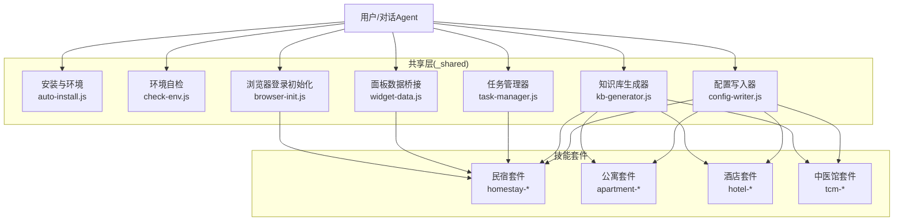
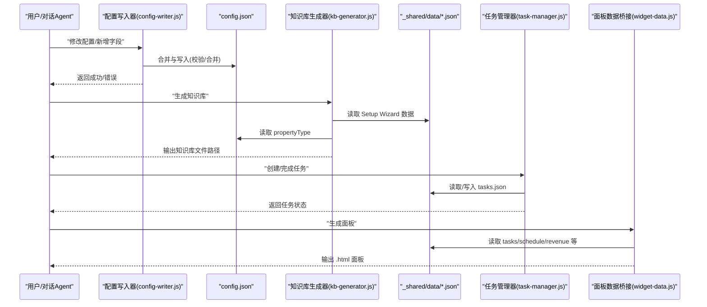
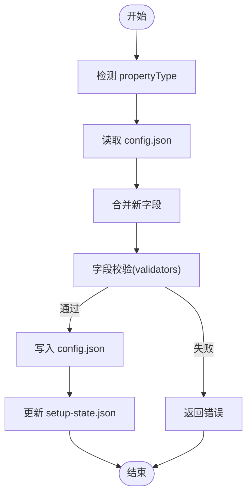
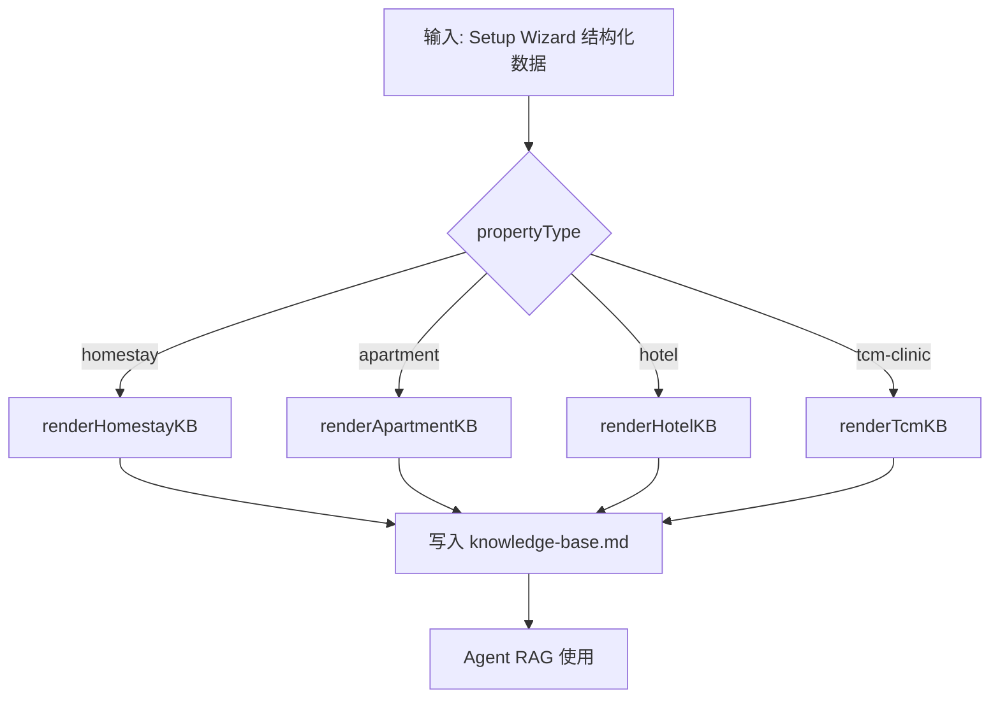
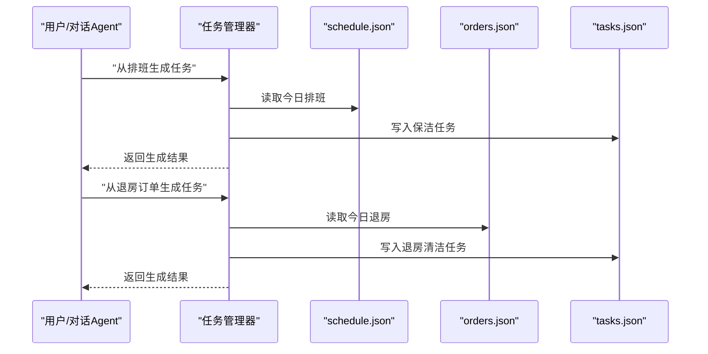
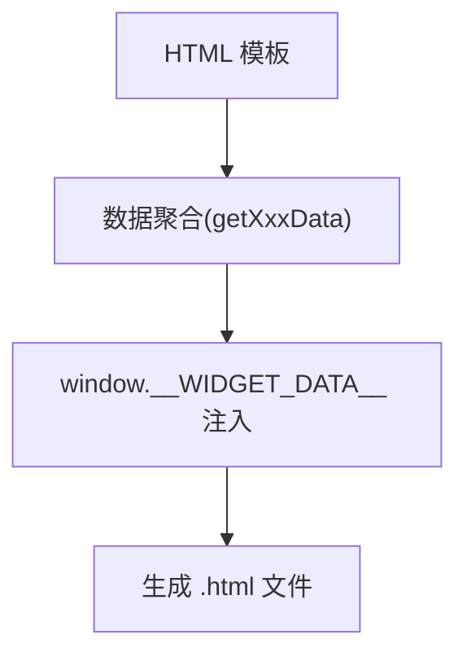
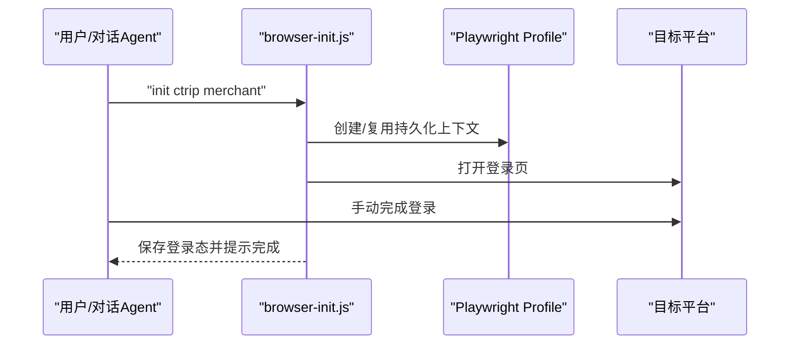
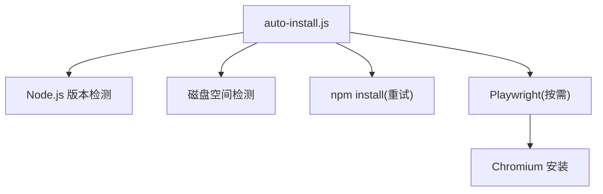
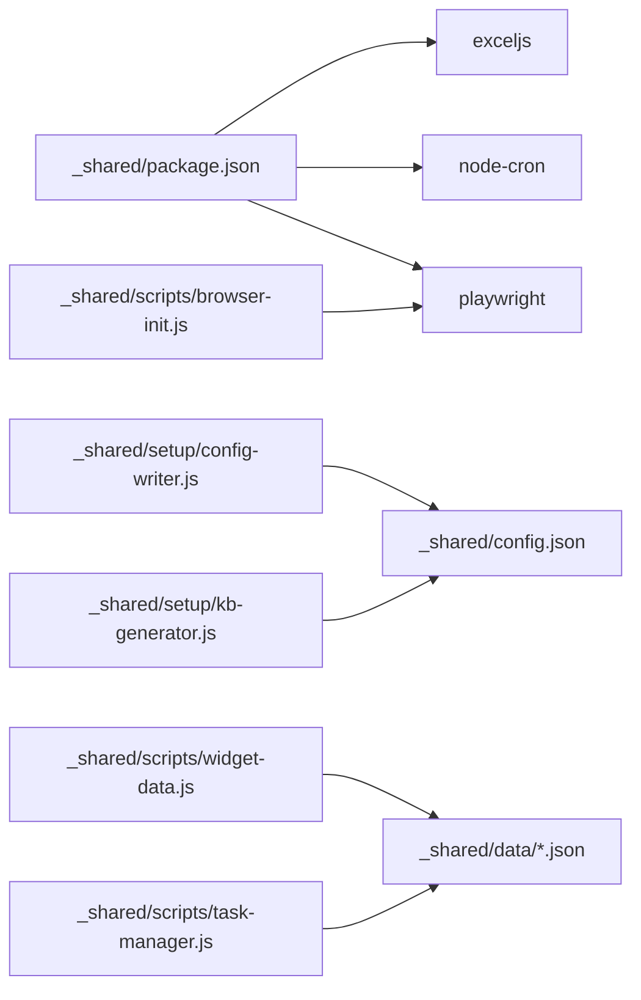

# 扩展开发与定制

<cite>
**本文引用的文件**
- [README.md](file://README.md)
- [SKILL.md](file://SKILL.md)
- [_shared/package.json](file://_shared/package.json)
- [_shared/setup/kb-generator.js](file://_shared/setup/kb-generator.js)
- [_shared/setup/config-writer.js](file://_shared/setup/config-writer.js)
- [_shared/setup/setup-state.json](file://_shared/setup/setup-state.json)
- [_shared/setup/questions/_common/basic-info.json](file://_shared/setup/questions/_common/basic-info.json)
- [_shared/setup/questions/tcm-clinic/contacts.json](file://_shared/setup/questions/tcm-clinic/contacts.json)
- [_shared/scripts/auto-install.js](file://_shared/scripts/auto-install.js)
- [_shared/scripts/check-env.js](file://_shared/scripts/check-env.js)
- [_shared/scripts/browser-init.js](file://_shared/scripts/browser-init.js)
- [_shared/scripts/task-manager.js](file://_shared/scripts/task-manager.js)
- [_shared/scripts/widget-data.js](file://_shared/scripts/widget-data.js)
</cite>

## 目录
1. [简介](#简介)
2. [项目结构](#项目结构)
3. [核心组件](#核心组件)
4. [架构总览](#架构总览)
5. [详细组件分析](#详细组件分析)
6. [依赖关系分析](#依赖关系分析)
7. [性能考量](#性能考量)
8. [故障排查指南](#故障排查指南)
9. [结论](#结论)
10. [附录](#附录)

## 简介
本指南面向开发者，系统讲解 Skills 3 套件的扩展开发与深度定制方法。内容涵盖：
- 如何扩展现有功能模块与添加新功能
- 配置系统的扩展机制与自定义配置项添加方法
- 知识库生成器的扩展点与自定义问答规则
- 新业务逻辑与工作流程的开发模板与最佳实践
- 第三方集成与 API 扩展方法
- 插件架构设计与实现思路
- 面向生产环境的性能与稳定性建议

## 项目结构
仓库采用“共享层 + 多技能套件”的组织方式：
- 共享层（_shared）：安装/环境检测、配置写入、知识库生成、任务管理、面板数据桥接、浏览器登录态管理等通用能力
- 技能套件：homestay-*、apartment-*、hotel-*、tcm-* 等，每个套件包含各自的资产与技能定义
- 顶层 SKILL.md 描述了整体能力边界、触发词、功能状态与使用方式

图表来源
- [_shared/scripts/auto-install.js:1-230](file://_shared/scripts/auto-install.js#L1-L230)
- [_shared/scripts/check-env.js:1-464](file://_shared/scripts/check-env.js#L1-L464)
- [_shared/setup/config-writer.js:1-603](file://_shared/setup/config-writer.js#L1-L603)
- [_shared/setup/kb-generator.js:1-573](file://_shared/setup/kb-generator.js#L1-L573)
- [_shared/scripts/task-manager.js:1-399](file://_shared/scripts/task-manager.js#L1-L399)
- [_shared/scripts/widget-data.js:1-278](file://_shared/scripts/widget-data.js#L1-L278)
- [_shared/scripts/browser-init.js:1-392](file://_shared/scripts/browser-init.js#L1-L392)

章节来源
- [README.md:1-5](file://README.md#L1-L5)
- [SKILL.md:286-302](file://SKILL.md#L286-L302)

## 核心组件
- 安装与环境检测：自动安装依赖、按需安装浏览器、环境自检与修复建议
- 配置写入器：零接触修改配置，支持多商户类型字段校验与合并写入
- 知识库生成器：将 Setup Wizard 结构化数据渲染为多商户类型的 Markdown 知识库
- 任务管理器：任务生命周期管理、自动任务生成（排班/退房/订单）
- 面板数据桥接：从本地数据组装为 Widget HTML 模板，生成可独立打开的面板
- 浏览器登录初始化：基于 Playwright 的持久化登录态管理，支持多平台

章节来源
- [_shared/scripts/auto-install.js:1-230](file://_shared/scripts/auto-install.js#L1-L230)
- [_shared/scripts/check-env.js:1-464](file://_shared/scripts/check-env.js#L1-L464)
- [_shared/setup/config-writer.js:1-603](file://_shared/setup/config-writer.js#L1-L603)
- [_shared/setup/kb-generator.js:1-573](file://_shared/setup/kb-generator.js#L1-L573)
- [_shared/scripts/task-manager.js:1-399](file://_shared/scripts/task-manager.js#L1-L399)
- [_shared/scripts/widget-data.js:1-278](file://_shared/scripts/widget-data.js#L1-L278)
- [_shared/scripts/browser-init.js:1-392](file://_shared/scripts/browser-init.js#L1-L392)

## 架构总览
Skills 3 的扩展点主要集中在共享层，通过“配置驱动 + 数据驱动 + 脚本驱动”的方式实现：
- 配置驱动：config.json 作为单一事实源，承载 propertyType 与各套件的业务配置
- 数据驱动：_shared/data 下的 JSON 文件作为任务、排班、订单、收入等业务数据载体
- 脚本驱动：CLI 脚本提供一键安装、面板生成、任务生成、浏览器初始化等能力

图表来源
- [_shared/setup/config-writer.js:1-603](file://_shared/setup/config-writer.js#L1-L603)
- [_shared/setup/kb-generator.js:1-573](file://_shared/setup/kb-generator.js#L1-L573)
- [_shared/scripts/task-manager.js:1-399](file://_shared/scripts/task-manager.js#L1-L399)
- [_shared/scripts/widget-data.js:1-278](file://_shared/scripts/widget-data.js#L1-L278)

## 详细组件分析

### 配置系统扩展与自定义配置项添加
- 配置文件：_shared/config.json
- 扩展机制：
  - 通过配置写入器提供的方法族（setPropertyType、updateHomestay、addRoom、addTreatment 等）进行零接触写入
  - 写入采用“读取→合并→写入”模式，避免覆盖其他字段
  - 提供字段校验（时间格式、电话、金额等），失败返回结构化错误
- 自定义配置项添加步骤：
  1) 在 config-writer.js 中新增方法，封装字段校验与合并逻辑
  2) 在 kb-generator.js 中新增渲染函数，将新字段纳入知识库模板
  3) 在 widget-data.js 中新增数据聚合逻辑，用于面板展示
  4) 在 Setup Wizard 的问题定义中增加新字段采集（questions/*）

图表来源
- [_shared/setup/config-writer.js:1-603](file://_shared/setup/config-writer.js#L1-L603)
- [_shared/setup/setup-state.json:1-17](file://_shared/setup/setup-state.json#L1-L17)

章节来源
- [_shared/setup/config-writer.js:118-144](file://_shared/setup/config-writer.js#L118-L144)
- [_shared/setup/config-writer.js:564-602](file://_shared/setup/config-writer.js#L564-L602)
- [_shared/setup/setup-state.json:1-17](file://_shared/setup/setup-state.json#L1-L17)

### 知识库生成器扩展与自定义问答规则
- 支持多商户类型：homestay、apartment、hotel、tcm-clinic
- 扩展点：
  - 新增渲染函数（renderXxxKB），在主入口 switch 中注册
  - 新增 QA 模板（如 FAQSection），在渲染函数中拼接
  - 输出路径映射（KB_OUTPUT_MAP）可按需覆盖
- 自定义问答规则：
  - 在对应渲染函数中追加问答对
  - 通过 kb-generator.js 的测试入口快速验证

图表来源
- [_shared/setup/kb-generator.js:62-86](file://_shared/setup/kb-generator.js#L62-L86)
- [_shared/setup/kb-generator.js:88-103](file://_shared/setup/kb-generator.js#L88-L103)

章节来源
- [_shared/setup/kb-generator.js:62-86](file://_shared/setup/kb-generator.js#L62-L86)
- [_shared/setup/kb-generator.js:547-554](file://_shared/setup/kb-generator.js#L547-L554)

### 任务管理器扩展与工作流开发
- 能力范围：任务创建/开始/完成/批量完成、从排班/退房/订单自动生成任务
- 扩展点：
  - 新增任务类型：在 createTask 的 type 字段枚举中加入新类型
  - 新增自动任务生成：在 generateFromSchedule/generateFromCheckout/generateCheckinPrep 中扩展
  - 新增数据聚合：在 widget-data.js 的 getTaskBoardData/getScheduleData 中补充展示字段
- 最佳实践：
  - 保持 source 字段清晰，便于追踪任务来源
  - 为新类型提供 deadline/assignee 等关键字段
  - 通过 demo 数据注入快速验证

图表来源
- [_shared/scripts/task-manager.js:184-251](file://_shared/scripts/task-manager.js#L184-L251)

章节来源
- [_shared/scripts/task-manager.js:76-99](file://_shared/scripts/task-manager.js#L76-L99)
- [_shared/scripts/task-manager.js:184-251](file://_shared/scripts/task-manager.js#L184-L251)
- [_shared/scripts/widget-data.js:92-105](file://_shared/scripts/widget-data.js#L92-L105)

### 面板数据桥接与可视化扩展
- 能力范围：工作台、任务看板、排班面板、报表面板
- 扩展点：
  - 新增面板类型：在 WIDGET_TEMPLATES 中注册模板路径
  - 新增数据聚合：在 getWorkspaceData/getTaskBoardData/getScheduleData/getReportData 中扩展
  - 生成独立 HTML：通过 generateWidgetFile 注入数据并输出 .html
- 最佳实践：
  - 保持数据结构稳定，避免破坏前端模板
  - 为新字段提供默认值与空状态处理

图表来源
- [_shared/scripts/widget-data.js:186-220](file://_shared/scripts/widget-data.js#L186-L220)

章节来源
- [_shared/scripts/widget-data.js:172-177](file://_shared/scripts/widget-data.js#L172-L177)
- [_shared/scripts/widget-data.js:228-268](file://_shared/scripts/widget-data.js#L228-L268)

### 浏览器登录初始化与第三方集成
- 能力范围：基于 Playwright 的持久化登录态，支持多平台（携程/美团/飞猪/去哪儿/同程）
- 扩展点：
  - 新增平台：在 PLATFORMS 中添加新平台的 merchant/consumer 配置
  - 新增登录态检查：在 loginSuccessIndicators/loginPageIndicators 中补充判断依据
- 最佳实践：
  - 为消费者端与商家端分别维护登录态
  - 通过 init-all 一键初始化，check-all 校验有效性

图表来源
- [_shared/scripts/browser-init.js:153-190](file://_shared/scripts/browser-init.js#L153-L190)
- [_shared/scripts/browser-init.js:226-287](file://_shared/scripts/browser-init.js#L226-L287)

章节来源
- [_shared/scripts/browser-init.js:31-114](file://_shared/scripts/browser-init.js#L31-L114)
- [_shared/scripts/browser-init.js:195-221](file://_shared/scripts/browser-init.js#L195-L221)

### 安装与环境检测扩展
- 自动安装：版本/磁盘/依赖/浏览器按需安装
- 环境自检：10 项检查（基础环境/配置状态/功能组件/数据健康），支持类型感知
- 扩展点：
  - 新增检查项：在 check-env.js 中新增检查函数并归类到组
  - 新增安装步骤：在 auto-install.js 中新增安装流程与提示

图表来源
- [_shared/scripts/auto-install.js:48-98](file://_shared/scripts/auto-install.js#L48-L98)

章节来源
- [_shared/scripts/auto-install.js:100-141](file://_shared/scripts/auto-install.js#L100-L141)
- [_shared/scripts/check-env.js:95-326](file://_shared/scripts/check-env.js#L95-L326)

### Setup Wizard 问题定义与数据采集扩展
- 问题定义：questions/_common 与各套件下的 JSON 文件定义了采集字段与校验
- 扩展点：
  - 新增字段：在对应 JSON 中添加字段定义与示例
  - 新增套件类型：在 kb-generator.js 中新增渲染函数并在主入口注册
- 最佳实践：
  - 保持字段 id 唯一，避免与已有字段冲突
  - 为可选字段提供 endSignals，提升交互体验

章节来源
- [_shared/setup/questions/_common/basic-info.json:1-10](file://_shared/setup/questions/_common/basic-info.json#L1-L10)
- [_shared/setup/questions/tcm-clinic/contacts.json:1-36](file://_shared/setup/questions/tcm-clinic/contacts.json#L1-L36)
- [_shared/setup/kb-generator.js:62-86](file://_shared/setup/kb-generator.js#L62-L86)

## 依赖关系分析
- package.json 声明了核心依赖：exceljs、node-cron、playwright
- 脚本之间通过共享数据文件（_shared/data/*.json）耦合，降低跨模块耦合度
- 配置写入器集中管理配置变更，避免多处硬编码

图表来源
- [_shared/package.json:1-20](file://_shared/package.json#L1-L20)
- [_shared/setup/config-writer.js:26-29](file://_shared/setup/config-writer.js#L26-L29)
- [_shared/scripts/widget-data.js:32-35](file://_shared/scripts/widget-data.js#L32-L35)
- [_shared/scripts/task-manager.js:27-32](file://_shared/scripts/task-manager.js#L27-L32)
- [_shared/scripts/browser-init.js:19](file://_shared/scripts/browser-init.js#L19)

章节来源
- [_shared/package.json:1-20](file://_shared/package.json#L1-L20)

## 性能考量
- I/O 优化：批量读取/写入 JSON，避免频繁文件操作
- 数据缓存：widget-data.js 与 task-manager.js 在内存中聚合数据，减少重复解析
- 超时控制：安装与浏览器初始化设置合理超时，失败重试
- 建议：
  - 对高频读取的数据建立轻量缓存
  - 控制面板模板大小，避免一次性注入过多数据
  - 对第三方平台请求增加限流与降级策略

## 故障排查指南
- 环境自检：使用 check-env.js 输出 10 项检查结果，逐项修复
- 安装失败：关注 auto-install.js 的错误提示与重试机制
- 登录态失效：使用 browser-init.js 的 check-all 发现过期并重新 init
- 配置写入失败：查看 config-writer.js 的校验错误与返回结构
- 任务/面板异常：核对 _shared/data 下 JSON 文件的语法与完整性

章节来源
- [_shared/scripts/check-env.js:457-461](file://_shared/scripts/check-env.js#L457-L461)
- [_shared/scripts/auto-install.js:163-181](file://_shared/scripts/auto-install.js#L163-L181)
- [_shared/scripts/browser-init.js:292-322](file://_shared/scripts/browser-init.js#L292-L322)
- [_shared/setup/config-writer.js:107-109](file://_shared/setup/config-writer.js#L107-L109)

## 结论
Skills 3 套件以“共享层 + 多技能套件”的方式提供了高度可扩展的基础设施。通过配置写入器、知识库生成器、任务管理器与面板数据桥接等核心组件，开发者可以在不改动上层业务逻辑的前提下，快速扩展新功能、接入第三方平台并定制业务规则。建议在扩展过程中遵循“配置驱动 + 数据驱动 + 脚本驱动”的原则，确保变更的可控性与可维护性。

## 附录
- 快速上手
  - 安装：在对话中说“开始设置”，系统自动执行安装与初始化
  - 生成知识库：完成 Setup Wizard 后自动生成，也可手动触发
  - 生成面板：使用 widget-data.js 生成工作台/任务看板/排班/报表面板
- 常用命令
  - 安装：node _shared/scripts/auto-install.js
  - 环境自检：node _shared/scripts/check-env.js
  - 任务管理：node _shared/scripts/task-manager.js list
  - 面板生成：node _shared/scripts/widget-data.js workspace
  - 浏览器初始化：node _shared/scripts/browser-init.js init-all

章节来源
- [SKILL.md:362-379](file://SKILL.md#L362-L379)