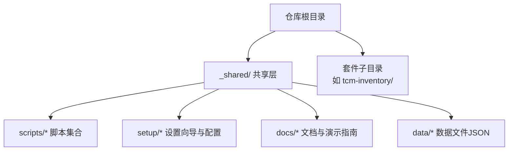
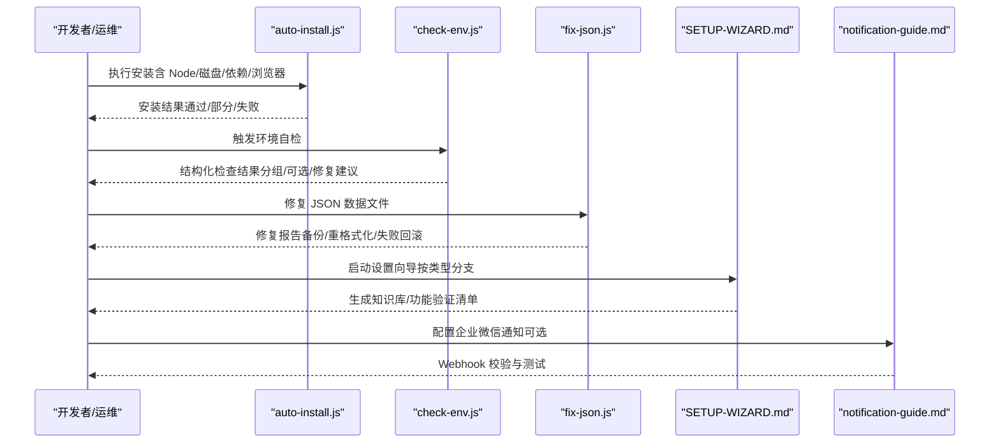
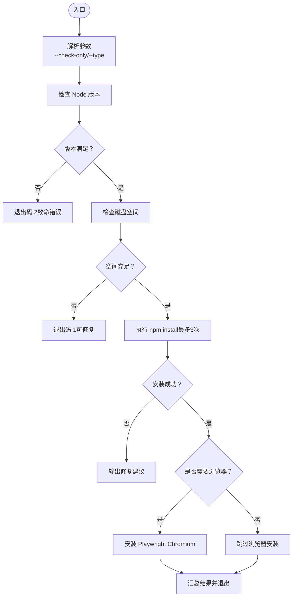
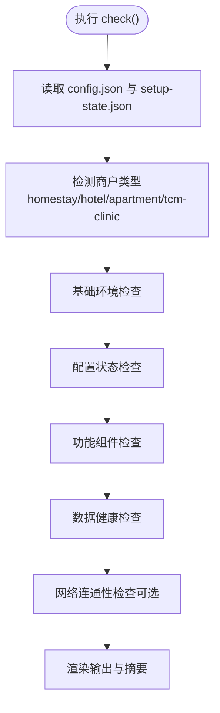
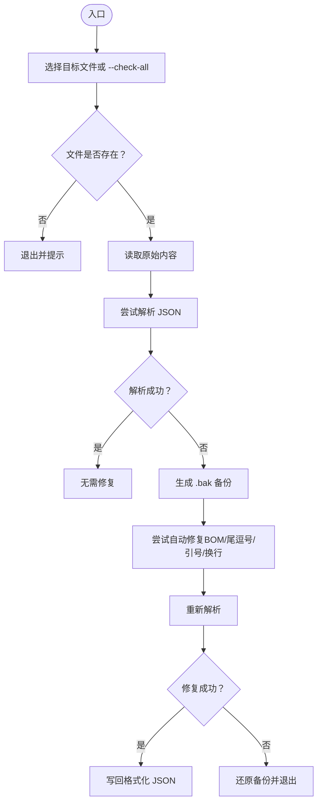
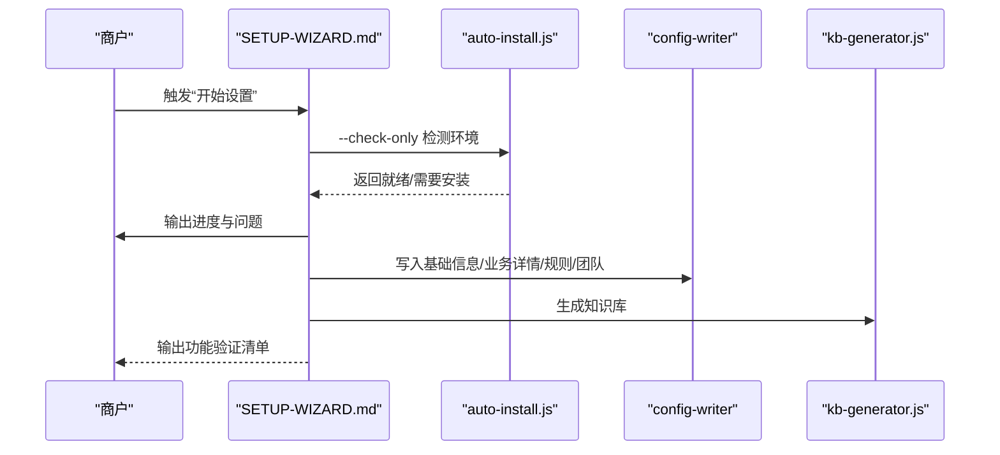
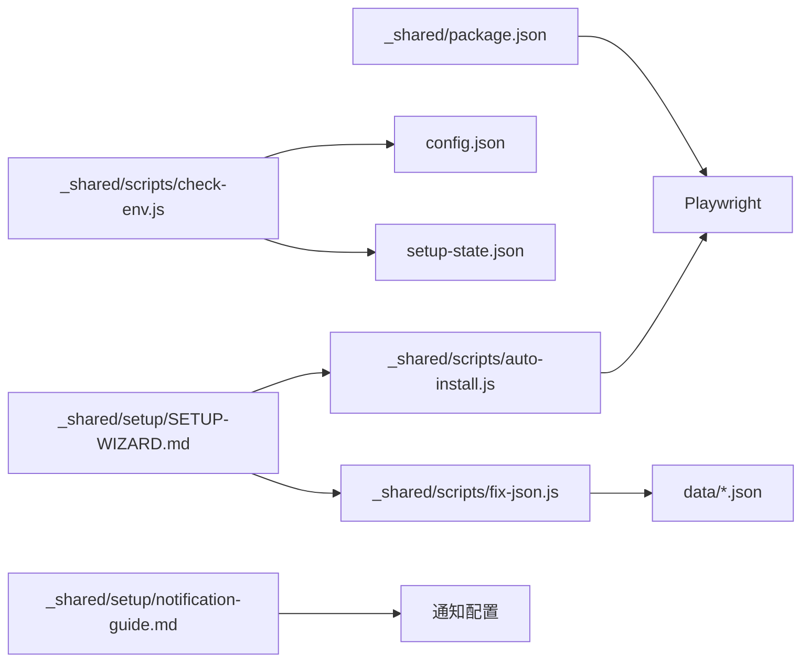

# 调试与测试

<cite>
**本文档引用的文件**
- [README.md](file://README.md)
- [SKILL.md](file://SKILL.md)
- [_shared/package.json](file://_shared/package.json)
- [_shared/scripts/auto-install.js](file://_shared/scripts/auto-install.js)
- [_shared/scripts/check-env.js](file://_shared/scripts/check-env.js)
- [_shared/scripts/fix-json.js](file://_shared/scripts/fix-json.js)
- [_shared/setup/SETUP-WIZARD.md](file://_shared/setup/SETUP-WIZARD.md)
- [_shared/setup/notification-guide.md](file://_shared/setup/notification-guide.md)
- [_shared/docs/USER-MANUAL.md](file://_shared/docs/USER-MANUAL.md)
- [_shared/docs/DEMO-GUIDE.md](file://_shared/docs/DEMO-GUIDE.md)
</cite>

## 目录
1. [简介](#简介)
2. [项目结构](#项目结构)
3. [核心组件](#核心组件)
4. [架构总览](#架构总览)
5. [详细组件分析](#详细组件分析)
6. [依赖关系分析](#依赖关系分析)
7. [性能考虑](#性能考虑)
8. [故障排查指南](#故障排查指南)
9. [结论](#结论)
10. [附录](#附录)

## 简介
本文件面向开发者，系统化梳理 Skills 3 套件的调试与测试策略，覆盖开发环境搭建、Playwright 浏览器自动化测试、单元与集成测试方法、错误诊断与日志分析、常见问题排查流程、性能与压力测试方法，以及环境检查工具的使用与故障排除流程。文档以仓库现有脚本与配置为依据，提供可落地的实践建议。

## 项目结构
仓库采用“共享层 + 功能子套件”的组织方式：
- 共享层（_shared/）：提供跨套件的通用能力（安装、环境检查、通知、面板数据、任务与工作流等）
- 套件子目录（如 tcm-inventory/）：承载具体业务功能的 SKILL 定义与说明
- 根目录文档：README 与 SKILL.md 提供快速入门与功能总览

图表来源
- [README.md:1-5](file://README.md#L1-L5)
- [SKILL.md:286-302](file://SKILL.md#L286-L302)

章节来源
- [README.md:1-5](file://README.md#L1-L5)
- [SKILL.md:286-302](file://SKILL.md#L286-L302)

## 核心组件
- 环境安装与前置条件检查：auto-install.js、check-env.js
- 数据完整性修复：fix-json.js
- 设置向导与配置写入：SETUP-WIZARD.md、notification-guide.md
- 用户手册与演示指南：USER-MANUAL.md、DEMO-GUIDE.md
- 测试与调试工具：Playwright（package.json 中声明）

章节来源
- [_shared/scripts/auto-install.js:1-230](file://_shared/scripts/auto-install.js#L1-L230)
- [_shared/scripts/check-env.js:1-464](file://_shared/scripts/check-env.js#L1-L464)
- [_shared/scripts/fix-json.js:1-191](file://_shared/scripts/fix-json.js#L1-L191)
- [_shared/setup/SETUP-WIZARD.md:1-631](file://_shared/setup/SETUP-WIZARD.md#L1-L631)
- [_shared/setup/notification-guide.md:1-71](file://_shared/setup/notification-guide.md#L1-L71)
- [_shared/docs/USER-MANUAL.md:1-155](file://_shared/docs/USER-MANUAL.md#L1-L155)
- [_shared/docs/DEMO-GUIDE.md:1-91](file://_shared/docs/DEMO-GUIDE.md#L1-L91)
- [_shared/package.json:1-20](file://_shared/package.json#L1-L20)

## 架构总览
从“安装—配置—运行—自检—修复”的闭环视角，系统的关键控制流如下：

图表来源
- [_shared/scripts/auto-install.js:48-98](file://_shared/scripts/auto-install.js#L48-L98)
- [_shared/scripts/check-env.js:95-326](file://_shared/scripts/check-env.js#L95-L326)
- [_shared/scripts/fix-json.js:61-90](file://_shared/scripts/fix-json.js#L61-L90)
- [_shared/setup/SETUP-WIZARD.md:33-117](file://_shared/setup/SETUP-WIZARD.md#L33-L117)
- [_shared/setup/notification-guide.md:9-31](file://_shared/setup/notification-guide.md#L9-L31)

## 详细组件分析

### 组件A：环境安装与前置条件检查（auto-install.js）
- 目标：统一安装入口，自动检测 Node 版本与磁盘空间，执行 npm install 并按需安装 Playwright Chromium，输出结构化结果与修复建议
- 关键流程：
  - 参数解析（--check-only、--type）
  - 前置条件检查（Node≥18、磁盘空间≥500MB）
  - 依赖安装（最多重试3次，超时2分钟）
  - Playwright 安装（Chromium，超时5分钟）
  - 结果汇总与退出码（0/1/2）
- 适用场景：首次部署、CI 安装、离线环境准备

图表来源
- [_shared/scripts/auto-install.js:33-98](file://_shared/scripts/auto-install.js#L33-L98)
- [_shared/scripts/auto-install.js:100-200](file://_shared/scripts/auto-install.js#L100-L200)

章节来源
- [_shared/scripts/auto-install.js:1-230](file://_shared/scripts/auto-install.js#L1-L230)

### 组件B：环境自检与诊断（check-env.js）
- 目标：对基础环境、配置状态、功能组件、数据健康进行 10 项检查，输出结构化结果与修复建议
- 检查维度：
  - 基础环境：Node 版本、磁盘空间、依赖安装
  - 配置状态：基础配置、安装向导、知识库/业务规则
  - 功能组件：企业微信通知、竞品采集器（按类型标记“推荐/可选”）
  - 数据健康：数据文件完整性、缺失必需文件、网络连通性（可选）
- 适用场景：商户反馈异常、上线前巡检、CI 健康检查

图表来源
- [_shared/scripts/check-env.js:95-326](file://_shared/scripts/check-env.js#L95-L326)
- [_shared/scripts/check-env.js:413-461](file://_shared/scripts/check-env.js#L413-L461)

章节来源
- [_shared/scripts/check-env.js:1-464](file://_shared/scripts/check-env.js#L1-L464)

### 组件C：数据完整性修复（fix-json.js）
- 目标：检测并自动修复 JSON 语法错误（尾逗号、引号、BOM、换行），验证必填字段，输出修复报告
- 关键能力：
  - 单文件修复与全量检查
  - 自动备份（.bak），修复失败回滚
  - 常见修复策略：移除 BOM、尾逗号、单引号转双引号、统一换行
- 适用场景：数据文件损坏、编辑器编码问题、CI 数据校验

图表来源
- [_shared/scripts/fix-json.js:44-90](file://_shared/scripts/fix-json.js#L44-L90)
- [_shared/scripts/fix-json.js:92-168](file://_shared/scripts/fix-json.js#L92-L168)

章节来源
- [_shared/scripts/fix-json.js:1-191](file://_shared/scripts/fix-json.js#L1-L191)

### 组件D：设置向导与配置写入（SETUP-WIZARD.md）
- 目标：引导商户完成 5 步设置（类型预选、环境就绪、基础信息、业务详情、规则与团队），生成知识库并输出功能验证清单
- 关键流程：
  - 预选类型（按白名单过滤）
  - 环境就绪检测（调用 auto-install --check-only）
  - 问卷采集与写入（config-writer）
  - 生成知识库与功能清单
- 适用场景：首次部署、配置变更、断点续传

图表来源
- [_shared/setup/SETUP-WIZARD.md:33-117](file://_shared/setup/SETUP-WIZARD.md#L33-L117)
- [_shared/setup/SETUP-WIZARD.md:416-464](file://_shared/setup/SETUP-WIZARD.md#L416-L464)

章节来源
- [_shared/setup/SETUP-WIZARD.md:1-631](file://_shared/setup/SETUP-WIZARD.md#L1-L631)

### 组件E：通知配置与验证（notification-guide.md）
- 目标：提供企业微信通知配置的 3 步法与常见问题解答，支持 Webhook 校验与测试
- 适用场景：启用/变更通知渠道、排查推送失败

章节来源
- [_shared/setup/notification-guide.md:1-71](file://_shared/setup/notification-guide.md#L1-L71)

### 组件F：用户手册与演示指南（USER-MANUAL.md、DEMO-GUIDE.md）
- 目标：为 Agent 提供内部参考，规范回答口径；提供演示数据与路线，便于回归验证
- 适用场景：培训、回归测试、演示验证

章节来源
- [_shared/docs/USER-MANUAL.md:1-155](file://_shared/docs/USER-MANUAL.md#L1-L155)
- [_shared/docs/DEMO-GUIDE.md:1-91](file://_shared/docs/DEMO-GUIDE.md#L1-L91)

## 依赖关系分析
- Node 与 Playwright：package.json 声明 Playwright 作为依赖，auto-install.js 在需要时安装 Chromium
- 脚本耦合：check-env.js 依赖 config.json 与 setup-state.json；fix-json.js 依赖 data 目录下的 JSON 文件
- 文档与脚本：SETUP-WIZARD.md 与 notification-guide.md 为脚本使用的前置条件与配置依据

图表来源
- [_shared/package.json:14-18](file://_shared/package.json#L14-L18)
- [_shared/scripts/auto-install.js:183-200](file://_shared/scripts/auto-install.js#L183-L200)
- [_shared/scripts/check-env.js:25-26](file://_shared/scripts/check-env.js#L25-L26)
- [_shared/scripts/fix-json.js:23-40](file://_shared/scripts/fix-json.js#L23-L40)
- [_shared/setup/SETUP-WIZARD.md:626-628](file://_shared/setup/SETUP-WIZARD.md#L626-L628)
- [_shared/setup/notification-guide.md:23-31](file://_shared/setup/notification-guide.md#L23-L31)

章节来源
- [_shared/package.json:1-20](file://_shared/package.json#L1-L20)
- [_shared/scripts/auto-install.js:1-230](file://_shared/scripts/auto-install.js#L1-L230)
- [_shared/scripts/check-env.js:1-464](file://_shared/scripts/check-env.js#L1-L464)
- [_shared/scripts/fix-json.js:1-191](file://_shared/scripts/fix-json.js#L1-L191)
- [_shared/setup/SETUP-WIZARD.md:1-631](file://_shared/setup/SETUP-WIZARD.md#L1-L631)
- [_shared/setup/notification-guide.md:1-71](file://_shared/setup/notification-guide.md#L1-L71)

## 性能考虑
- 安装阶段
  - npm install 设置最大重试次数与超时，避免长时间阻塞
  - Playwright 安装超时较长，建议在具备网络条件的环境中执行
- 数据文件
  - fix-json.js 在修复失败时回滚备份，减少对生产数据的影响
- 环境检查
  - check-env.js 对网络连通性采用轻量探测，避免阻塞或长时间等待
- 建议
  - CI 中分阶段执行：安装（带缓存）→ 自检 → 修复（仅在失败时）→ 回归测试
  - 使用本地镜像源与代理优化 npm 与 Playwright 下载速度

[本节为通用性能建议，不直接分析具体文件]

## 故障排查指南
- 安装失败
  - 现象：npm install 多次失败
  - 排查：查看 auto-install.js 输出的错误提示（权限/空间/网络超时），优先清理磁盘空间、更换网络或代理
  - 处理：按提示执行 npx playwright install chromium 或手动重试
- 浏览器初始化失败
  - 现象：竞品采集器未初始化
  - 排查：确认 Node 版本满足要求（≥18），检查磁盘空间与网络
  - 处理：执行浏览器安装命令或在可联网环境重试
- 配置缺失
  - 现象：安装向导未完成或功能清单显示未配置
  - 排查：使用 check-env.js 检查“基础配置/安装向导/知识库/通知”
  - 处理：按提示完成设置向导或配置通知 Webhook
- 数据文件损坏
  - 现象：数据文件 JSON 解析失败
  - 排查：使用 fix-json.js --check-all 定位问题文件
  - 处理：执行修复，若自动修复失败，查看备份并手动修正
- 网络连通性
  - 现象：平台域名无法解析
  - 排查：check-env.js 的网络连通性检查结果
  - 处理：检查 DNS 设置或网络代理，必要时在独立工具中复测

章节来源
- [_shared/scripts/auto-install.js:163-181](file://_shared/scripts/auto-install.js#L163-L181)
- [_shared/scripts/auto-install.js:183-200](file://_shared/scripts/auto-install.js#L183-L200)
- [_shared/scripts/check-env.js:322-411](file://_shared/scripts/check-env.js#L322-L411)
- [_shared/scripts/fix-json.js:61-90](file://_shared/scripts/fix-json.js#L61-L90)
- [_shared/scripts/fix-json.js:160-168](file://_shared/scripts/fix-json.js#L160-L168)

## 结论
本文件基于仓库现有脚本与文档，构建了 Skills 3 套件的调试与测试闭环：以 auto-install.js 与 check-env.js 为核心，辅以 fix-json.js 与 SETUP-WIZARD.md，形成“安装—配置—自检—修复—验证”的完整流程。结合 DEMO-GUIDE.md 的演示数据与 USER-MANUAL.md 的使用规范，开发者可建立稳定可靠的本地与 CI 调试策略。

[本节为总结性内容，不直接分析具体文件]

## 附录

### A. Playwright 浏览器自动化测试（概念性说明）
- 适用范围：涉及浏览器交互的功能（如竞品采集器初始化与采集流程）
- 建议实践：
  - 在受控环境中安装 Chromium（auto-install.js 已内置）
  - 使用独立测试工程，隔离浏览器状态与数据
  - 通过页面对象与断言验证关键交互（登录、采集、结果展示）
  - 使用 headless 模式提升 CI 稳定性
- 注意：仓库未包含 Playwright 测试用例，以上为通用实践建议

[本节为概念性说明，不直接分析具体文件]

### B. 单元与集成测试编写方法（概念性说明）
- 单元测试
  - 针对纯函数与工具模块（如 JSON 修复逻辑、配置读取）
  - 使用最小化依赖与 mock，确保可重复性
- 集成测试
  - 覆盖端到端流程（安装→配置→功能验证）
  - 使用演示数据（DEMO-GUIDE.md）进行回归验证
- 建议
  - 将关键检查点（环境自检、数据完整性、通知发送）纳入测试矩阵
  - 在 CI 中分层执行：单元（快速）→ 集成（中等）→ E2E（慢）

[本节为概念性说明，不直接分析具体文件]

### C. 性能与压力测试方法（概念性说明）
- 性能测试
  - 使用基准工具测量关键路径（安装耗时、数据文件解析、面板生成）
  - 在不同硬件与网络条件下对比
- 压力测试
  - 模拟高并发场景（大量任务/订单/采集请求）
  - 关注内存占用、CPU 使用与 I/O 峰值
- 建议
  - 将性能指标纳入 CI 质量门禁
  - 结合日志与监控定位瓶颈

[本节为概念性说明，不直接分析具体文件]

### D. 环境检查工具使用清单
- 基础环境
  - Node 版本：满足 ≥18
  - 磁盘空间：≥500MB
  - 依赖安装：存在 node_modules
- 配置状态
  - 基础配置：商户名称等
  - 安装向导：已完成
  - 知识库/业务规则：已生成/已配置
- 功能组件
  - 企业微信通知：已配置
  - 竞品采集器：已初始化（按类型标记）
- 数据健康
  - 数据文件完整性：无语法错误
  - 必需文件：齐全
- 网络连通性（可选）
  - 平台域名可解析

章节来源
- [_shared/scripts/check-env.js:95-326](file://_shared/scripts/check-env.js#L95-L326)