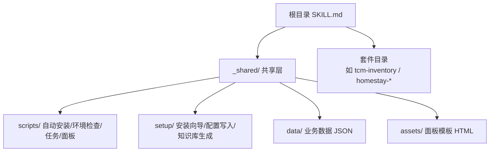
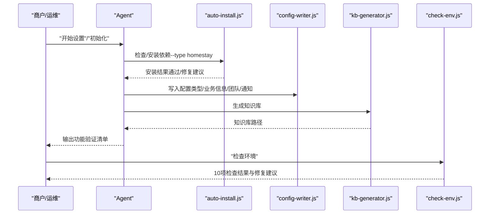
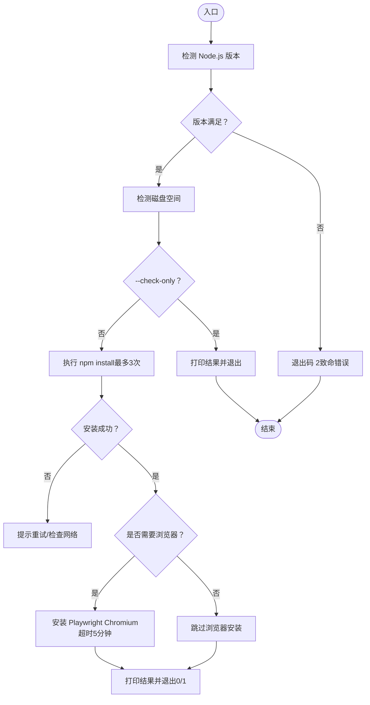
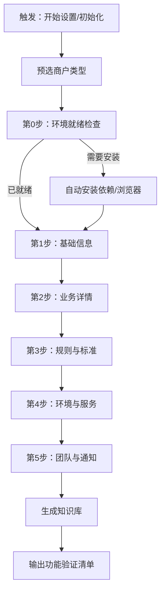
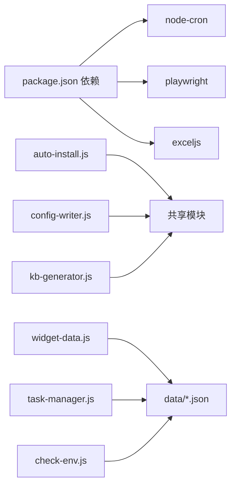

# 部署与运维

<cite>
**本文档引用的文件**
- [README.md](file://README.md)
- [SKILL.md](file://SKILL.md)
- [SETUP-WIZARD.md](file://_shared/setup/SETUP-WIZARD.md)
- [auto-install.js](file://_shared/scripts/auto-install.js)
- [check-env.js](file://_shared/scripts/check-env.js)
- [config-writer.js](file://_shared/setup/config-writer.js)
- [kb-generator.js](file://_shared/setup/kb-generator.js)
- [task-manager.js](file://_shared/scripts/task-manager.js)
- [widget-data.js](file://_shared/scripts/widget-data.js)
- [package.json](file://_shared/package.json)
- [homestay-suite.json](file://_shared/homestay-suite.json)
- [setup-state.json](file://_shared/setup/setup-state.json)
- [USER-MANUAL.md](file://_shared/docs/USER-MANUAL.md)
- [notification-guide.md](file://_shared/setup/notification-guide.md)
</cite>

## 目录
1. [简介](#简介)
2. [项目结构](#项目结构)
3. [核心组件](#核心组件)
4. [架构总览](#架构总览)
5. [详细组件分析](#详细组件分析)
6. [依赖关系分析](#依赖关系分析)
7. [性能考虑](#性能考虑)
8. [故障排查指南](#故障排查指南)
9. [结论](#结论)
10. [附录](#附录)

## 简介
本文件面向运维人员，提供 Skills 3 套件（以“中医馆智能运营”为例）的生产部署与运维指南。内容涵盖：
- 生产环境部署流程与前置条件
- 自动安装系统与环境初始化
- 定时任务配置与监控
- 数据备份与恢复
- 系统监控与告警配置
- 版本升级与回滚策略
- 日志管理与性能优化
- 常见故障处理

## 项目结构
仓库采用“共享层 + 技能套件”的组织方式：
- 共享层（_shared）：安装脚本、配置写入器、知识库生成器、任务管理、面板数据桥接、环境自检等
- 套件目录（如 tcm-inventory、homestay-* 等）：具体技能实现与资产
- 根目录 SKILL.md：技能入口与行为规则
- README.md：快速入门与安装提示

**图表来源**
- [SKILL.md: 1-379:1-379](file://SKILL.md#L1-L379)
- [README.md: 1-5:1-5](file://README.md#L1-L5)

**章节来源**
- [README.md: 1-5:1-5](file://README.md#L1-L5)
- [SKILL.md: 1-379:1-379](file://SKILL.md#L1-L379)

## 核心组件
- 自动安装系统：检测 Node.js 与磁盘空间、执行 npm install、按需安装 Playwright 浏览器
- 安装向导：引导商户完成 5 步配置，生成知识库与功能验证清单
- 配置写入器：统一写入 JSON 配置，保证字段校验与幂等更新
- 知识库生成器：将结构化配置渲染为各类型知识库 Markdown
- 任务管理器：任务生命周期管理、自动生成与批量处理
- 面板数据桥接器：从数据文件读取并注入 HTML 模板，生成可独立打开的面板
- 环境自检：10 项检查（基础环境/配置状态/功能组件/数据健康），输出可操作建议

**章节来源**
- [auto-install.js: 1-230:1-230](file://_shared/scripts/auto-install.js#L1-L230)
- [SETUP-WIZARD.md: 1-631:1-631](file://_shared/setup/SETUP-WIZARD.md#L1-L631)
- [config-writer.js: 1-603:1-603](file://_shared/setup/config-writer.js#L1-L603)
- [kb-generator.js: 1-573:1-573](file://_shared/setup/kb-generator.js#L1-L573)
- [task-manager.js: 1-399:1-399](file://_shared/scripts/task-manager.js#L1-L399)
- [widget-data.js: 1-278:1-278](file://_shared/scripts/widget-data.js#L1-L278)
- [check-env.js: 1-464:1-464](file://_shared/scripts/check-env.js#L1-L464)

## 架构总览
系统以“对话即服务”的方式运行，核心流程如下：
- 首次使用触发安装向导，自动执行环境检测与依赖安装
- 安装完成后生成知识库，输出功能验证清单
- 运维通过面板与定时任务进行日常运营与监控

**图表来源**
- [SETUP-WIZARD.md: 40-56:40-56](file://_shared/setup/SETUP-WIZARD.md#L40-L56)
- [auto-install.js: 48-98:48-98](file://_shared/scripts/auto-install.js#L48-L98)
- [config-writer.js: 118-135:118-135](file://_shared/setup/config-writer.js#L118-L135)
- [kb-generator.js: 62-86:62-86](file://_shared/setup/kb-generator.js#L62-L86)
- [check-env.js: 95-326:95-326](file://_shared/scripts/check-env.js#L95-L326)

## 详细组件分析

### 自动安装系统（auto-install.js）
- 功能要点
  - Node.js 版本检测（≥ 18）
  - 磁盘空间检测（≥ 500MB）
  - npm install（最多重试 3 次，超时 2 分钟）
  - 按需安装 Playwright Chromium（民宿/酒店类型）
  - 结果汇总输出与退出码语义
- 运维要点
  - 首次部署建议手动执行检查模式，确认通过后再进入向导
  - 网络不稳定时关注重试与超时提示，必要时手动执行 Playwright 安装
  - 退出码 0/1/2 用于区分“全部成功/部分失败/致命错误”

**图表来源**
- [auto-install.js: 48-98:48-98](file://_shared/scripts/auto-install.js#L48-L98)
- [auto-install.js: 143-200:143-200](file://_shared/scripts/auto-install.js#L143-L200)

**章节来源**
- [auto-install.js: 1-230:1-230](file://_shared/scripts/auto-install.js#L1-L230)

### 安装向导（SETUP-WIZARD.md）
- 功能要点
  - 预选商户类型（homestay、apartment、hotel、tcm-clinic）
  - 第 0 步：环境就绪检查与自动安装
  - 第 1-5 步：基础信息、业务详情、规则与标准、环境与服务、团队与通知
  - 生成知识库与功能验证清单
  - 断点续传与数据修正流程
- 运维要点
  - 首次部署务必完成向导，否则知识库与功能受限
  - 通知配置为可选，但强烈建议启用以提升运营效率

**图表来源**
- [SETUP-WIZARD.md: 35-464:35-464](file://_shared/setup/SETUP-WIZARD.md#L35-L464)

**章节来源**
- [SETUP-WIZARD.md: 1-631:1-631](file://_shared/setup/SETUP-WIZARD.md#L1-L631)

### 配置写入器（config-writer.js）
- 功能要点
  - 统一写入 JSON 配置，支持多商户类型
  - 字段校验（时间、电话、金额等）
  - 通用更新接口与类型特定方法
  - Setup 状态同步与最后修改时间
- 运维要点
  - 所有配置变更通过该工具执行，避免误改
  - 支持单项修正与批量更新，便于维护

**章节来源**
- [config-writer.js: 1-603:1-603](file://_shared/setup/config-writer.js#L1-L603)

### 知识库生成器（kb-generator.js）
- 功能要点
  - 将结构化数据渲染为各类型知识库 Markdown
  - 默认输出路径映射到对应技能资产目录
- 运维要点
  - 向导完成后自动生成；若配置变更需重新生成

**章节来源**
- [kb-generator.js: 1-573:1-573](file://_shared/setup/kb-generator.js#L1-L573)

### 任务管理器（task-manager.js）
- 功能要点
  - 任务生命周期：创建/开始/完成/批量完成
  - 自动生成：来自排班/退房订单/新订单
  - CLI 与编程接口
- 运维要点
  - 定期核对任务状态，确保闭环
  - 使用批量完成与演示数据辅助演练

**章节来源**
- [task-manager.js: 1-399:1-399](file://_shared/scripts/task-manager.js#L1-L399)

### 面板数据桥接器（widget-data.js）
- 功能要点
  - 从数据文件读取并组装面板数据
  - 注入 HTML 模板生成可独立打开的 .html 文件
  - 支持工作台、任务看板、排班、报表
- 运维要点
  - 生成文件位于 _shared/data/widgets 下，可直接双击打开
  - 可输出 JSON 以便调试与集成

**章节来源**
- [widget-data.js: 1-278:1-278](file://_shared/scripts/widget-data.js#L1-L278)

### 环境自检（check-env.js）
- 功能要点
  - 10 项检查：基础环境/配置状态/功能组件/数据健康
  - 类型感知：根据 propertyType 调整检查项与提示
  - 网络连通性轻量探测
- 运维要点
  - “检查环境/状态检查/帮我检查/系统正常吗”触发
  - 严格区分硬性失败与可选失败，指导修复优先级

**章节来源**
- [check-env.js: 1-464:1-464](file://_shared/scripts/check-env.js#L1-L464)

## 依赖关系分析
- 共享层依赖
  - node-cron：定时任务调度（用于日终等）
  - playwright：浏览器自动化（民宿/酒店场景）
  - exceljs：报表导出（如需要）
- 脚本与模块耦合
  - auto-install.js 与 config-writer.js、kb-generator.js 协作完成初始化
  - widget-data.js 依赖 data 目录下的 JSON 文件
  - task-manager.js 依赖 data 目录的任务/排班/员工/订单等文件

**图表来源**
- [package.json: 14-19:14-19](file://_shared/package.json#L14-L19)
- [auto-install.js: 23-31:23-31](file://_shared/scripts/auto-install.js#L23-L31)
- [widget-data.js: 32-34:32-34](file://_shared/scripts/widget-data.js#L32-L34)
- [task-manager.js: 27-31:27-31](file://_shared/scripts/task-manager.js#L27-L31)

**章节来源**
- [package.json: 1-20:1-20](file://_shared/package.json#L1-L20)

## 性能考虑
- 依赖安装
  - npm install 支持重试与超时控制，建议在稳定网络环境下执行
  - Playwright 安装耗时较长，建议在离线或内网环境中提前准备
- 数据读写
  - 任务/排班/员工/订单等 JSON 文件读写频繁，建议使用 SSD 与合理分片
- 面板生成
  - HTML 注入数据较大时，建议缓存近期数据并按需刷新
- 定时任务
  - cron 调度应避免与高负载时段冲突，确保日终流程在 22:00 执行

[本节为通用指导，无需特定文件引用]

## 故障排查指南
- 环境自检
  - 使用“检查环境”触发 check-env.js，按组查看结果与修复建议
  - 硬性失败优先处理（如 Node 版本、依赖安装、配置状态）
- 依赖问题
  - npm install 失败：检查网络、权限与磁盘空间
  - Playwright 安装失败：手动执行安装命令或更换网络
- 配置问题
  - 使用 config-writer 的校验能力定位字段错误
  - 如需回滚，删除或重命名配置文件后重新进入向导
- 数据问题
  - 使用 fix-json.js（由 check-env.js 引导）修复 JSON 语法错误
  - 缺失必需文件：参考向导补齐或迁移历史数据
- 通知问题
  - 按 notification-guide.md 重新配置 Webhook
  - 测试消息发送失败：检查链接有效性与网络连通

**章节来源**
- [check-env.js: 95-326:95-326](file://_shared/scripts/check-env.js#L95-L326)
- [notification-guide.md: 1-71:1-71](file://_shared/setup/notification-guide.md#L1-L71)

## 结论
Skills 3 套件通过自动安装与安装向导实现了“零接触”部署，结合配置写入器、知识库生成器与面板工具，形成完整的运营闭环。运维侧应重点关注环境稳定性、数据完整性与通知通道，配合定时任务与自检机制，确保系统持续可用。

[本节为总结，无需特定文件引用]

## 附录

### A. 生产环境部署流程
- 前置条件
  - Node.js ≥ 18，可用磁盘空间 ≥ 500MB
  - 稳定网络（npm registry、浏览器资源）
- 步骤
  1) 首次部署：执行自动安装（--check-only 检查，通过后再执行完整安装）
  2) 进入安装向导：完成 5 步配置，生成知识库
  3) 配置通知：按指引创建群机器人并复制 Webhook
  4) 核验环境：执行“检查环境”，确保 10 项检查通过
  5) 启动定时任务：配置日终流程等 cron 任务

**章节来源**
- [auto-install.js: 33-44:33-44](file://_shared/scripts/auto-install.js#L33-L44)
- [SETUP-WIZARD.md: 92-117:92-117](file://_shared/setup/SETUP-WIZARD.md#L92-L117)
- [notification-guide.md: 9-32:9-32](file://_shared/setup/notification-guide.md#L9-L32)
- [check-env.js: 95-326:95-326](file://_shared/scripts/check-env.js#L95-L326)

### B. 定时任务配置与监控
- 日终流程
  - 触发词：“日终”
  - 自动执行：每日 22:00（cron-scheduler）
  - 手动触发：node homestay-workflow/scripts/cron-scheduler.js run daily-close
- 监控建议
  - 记录 cron 执行日志
  - 核对任务看板与工作台 KPI，发现异常及时告警

**章节来源**
- [SKILL.md: 168-177:168-177](file://SKILL.md#L168-L177)

### C. 数据备份与恢复
- 备份范围
  - _shared/data 下的 tasks.json、orders.json、schedule.json、staff.json 等
  - _shared/config.json 与知识库文件
- 备份策略
  - 增量备份：每日对比差异
  - 定期快照：每周生成完整快照
- 恢复流程
  - 停止相关服务
  - 恢复目标文件
  - 重新生成知识库（如需）
  - 启动服务并执行“检查环境”验证

[本节为通用指导，无需特定文件引用]

### D. 系统监控与告警
- 监控指标
  - 环境健康：Node 版本、依赖安装、磁盘空间
  - 配置状态：安装向导完成、通知配置、知识库生成
  - 数据健康：JSON 语法、必需文件、网络连通
- 告警策略
  - 硬性失败：立即告警并阻断后续流程
  - 可选失败：纳入周报并跟踪修复

**章节来源**
- [check-env.js: 95-326:95-326](file://_shared/scripts/check-env.js#L95-L326)

### E. 版本升级与回滚
- 升级策略
  - 备份 config.json 与 data 目录
  - 执行 npm install（或 auto-install.js）更新依赖
  - 重新生成知识库并核验功能
- 回滚策略
  - 恢复备份的 config.json 与 data 目录
  - 重新执行安装向导（如必要）

**章节来源**
- [auto-install.js: 143-181:143-181](file://_shared/scripts/auto-install.js#L143-L181)
- [kb-generator.js: 62-86:62-86](file://_shared/setup/kb-generator.js#L62-L86)

### F. 日志管理
- 日志位置
  - 安装与自检脚本的标准输出
  - 面板生成输出文件路径（_shared/data/widgets/*.html）
- 管理建议
  - 将脚本输出重定向到文件
  - 按日期轮转日志，保留 30 天
  - 关键事件（安装、升级、回滚）记录摘要

**章节来源**
- [auto-install.js: 202-220:202-220](file://_shared/scripts/auto-install.js#L202-L220)
- [widget-data.js: 214-219:214-219](file://_shared/scripts/widget-data.js#L214-L219)

### G. 快速参考
- 安装与初始化
  - node _shared/scripts/auto-install.js --type homestay
  - 在对话中说“开始设置”启动向导
- 环境自检
  - node _shared/scripts/check-env.js
- 任务管理
  - node _shared/scripts/task-manager.js list
  - node _shared/scripts/task-manager.js from-schedule
- 面板生成
  - node _shared/scripts/widget-data.js workspace
  - node _shared/scripts/widget-data.js task-board

**章节来源**
- [auto-install.js: 12-16:12-16](file://_shared/scripts/auto-install.js#L12-L16)
- [SETUP-WIZARD.md: 40-56:40-56](file://_shared/setup/SETUP-WIZARD.md#L40-L56)
- [check-env.js: 11-13:11-13](file://_shared/scripts/check-env.js#L11-L13)
- [task-manager.js: 315-382:315-382](file://_shared/scripts/task-manager.js#L315-L382)
- [widget-data.js: 228-268:228-268](file://_shared/scripts/widget-data.js#L228-L268)