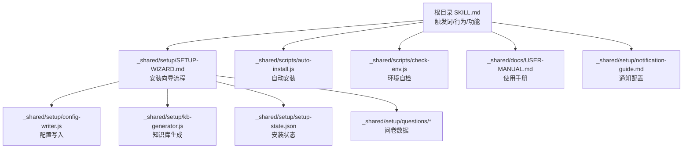
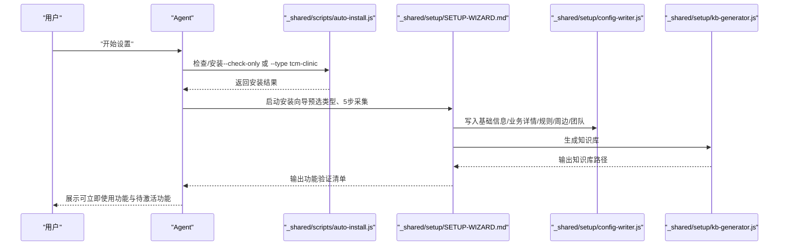
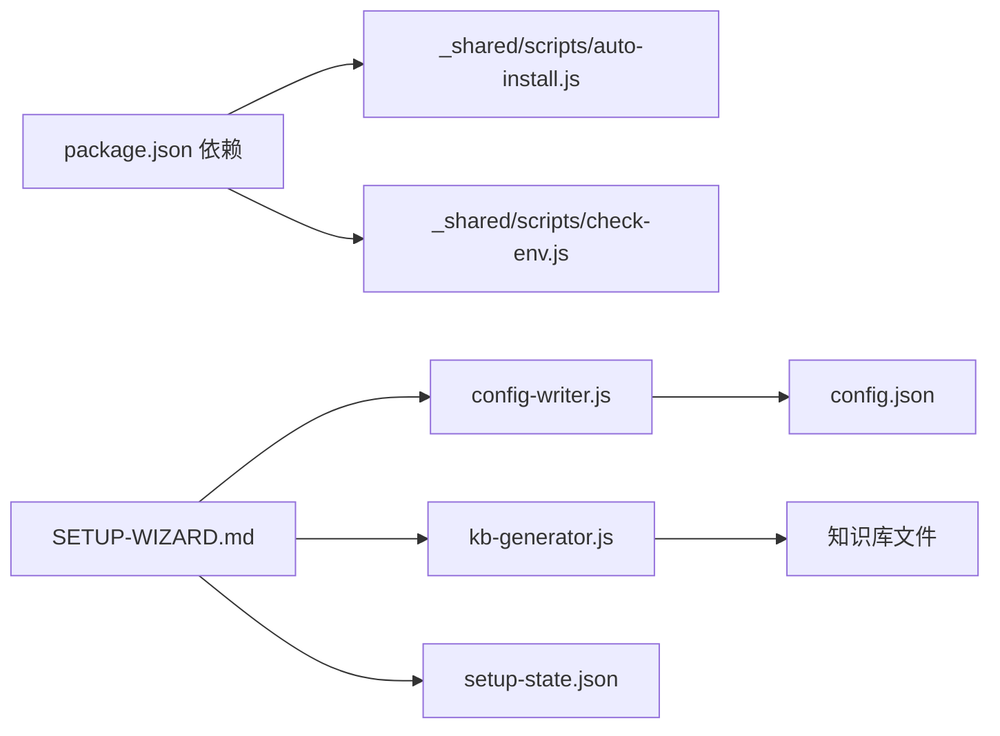

# 快速开始

<cite>
**本文引用的文件**
- [README.md](file://README.md)
- [SKILL.md](file://SKILL.md)
- [_shared/package.json](file://_shared/package.json)
- [_shared/setup/SETUP-WIZARD.md](file://_shared/setup/SETUP-WIZARD.md)
- [_shared/scripts/check-env.js](file://_shared/scripts/check-env.js)
- [_shared/scripts/auto-install.js](file://_shared/scripts/auto-install.js)
- [_shared/setup/config-writer.js](file://_shared/setup/config-writer.js)
- [_shared/setup/kb-generator.js](file://_shared/setup/kb-generator.js)
- [_shared/setup/setup-state.json](file://_shared/setup/setup-state.json)
- [_shared/setup/questions/_common/basic-info.json](file://_shared/setup/questions/_common/basic-info.json)
- [_shared/setup/questions/tcm-clinic/services.json](file://_shared/setup/questions/tcm-clinic/services.json)
- [_shared/docs/USER-MANUAL.md](file://_shared/docs/USER-MANUAL.md)
- [_shared/setup/notification-guide.md](file://_shared/setup/notification-guide.md)
</cite>

## 目录
1. [简介](#简介)
2. [项目结构](#项目结构)
3. [核心组件](#核心组件)
4. [架构总览](#架构总览)
5. [详细组件分析](#详细组件分析)
6. [依赖关系分析](#依赖关系分析)
7. [性能与稳定性](#性能与稳定性)
8. [故障排除指南](#故障排除指南)
9. [结论](#结论)
10. [附录](#附录)

## 简介
本指南面向首次使用 Skills 3 套件的新用户，帮助你在 30 分钟内完成环境准备、安装与初始化配置，并体验核心功能。你将学会：
- 环境要求与安装步骤
- 通过“开始设置”完成初始化
- 对话触发词的使用方法
- 常见问题排查与修复

Skills 3 套件支持多种商户类型，本次以“中医馆/诊所”为例，套件默认预设类型为 tcm-clinic，核心功能包括：轻量收银、会员管理、微信智能客服、诊疗项目管理、进销存管理等。

## 项目结构
仓库采用“共享层 + 多技能模块”的组织方式：
- 共享层（_shared）：安装向导、配置写入、知识库生成、通知、环境检查、脚本工具等
- 技能模块：如 tcm-inventory（中医馆库存/进销存）等
- 根目录 SKILL.md 定义触发词、Agent 行为与功能清单

图表来源
- [SKILL.md:1-379](file://SKILL.md#L1-L379)
- [_shared/setup/SETUP-WIZARD.md:1-631](file://_shared/setup/SETUP-WIZARD.md#L1-L631)
- [_shared/scripts/auto-install.js:1-200](file://_shared/scripts/auto-install.js#L1-L200)
- [_shared/scripts/check-env.js:1-464](file://_shared/scripts/check-env.js#L1-L464)
- [_shared/setup/config-writer.js:1-200](file://_shared/setup/config-writer.js#L1-L200)
- [_shared/setup/kb-generator.js:1-200](file://_shared/setup/kb-generator.js#L1-L200)
- [_shared/setup/setup-state.json:1-17](file://_shared/setup/setup-state.json#L1-L17)
- [_shared/docs/USER-MANUAL.md:1-155](file://_shared/docs/USER-MANUAL.md#L1-L155)
- [_shared/setup/notification-guide.md:1-71](file://_shared/setup/notification-guide.md#L1-L71)

章节来源
- [README.md:1-5](file://README.md#L1-L5)
- [SKILL.md:1-379](file://SKILL.md#L1-L379)

## 核心组件
- 安装向导（SETUP-WIZARD）：引导用户完成 5 步设置，自动写入配置并生成知识库
- 自动安装脚本（auto-install.js）：检测 Node.js 与磁盘空间，执行 npm install，按需安装 Playwright 浏览器
- 环境自检脚本（check-env.js）：输出 10 项检查结果，包含基础环境、配置状态、功能组件、数据健康
- 配置写入器（config-writer.js）：统一写入 JSON 配置，支持多商户类型字段校验
- 知识库生成器（kb-generator.js）：将结构化配置渲染为 Markdown 知识库
- 安装状态文件（setup-state.json）：记录当前步骤、完成状态与最后修改时间
- 使用手册与通知配置：提供功能清单、触发词与通知配置步骤

章节来源
- [_shared/setup/SETUP-WIZARD.md:1-631](file://_shared/setup/SETUP-WIZARD.md#L1-L631)
- [_shared/scripts/auto-install.js:1-200](file://_shared/scripts/auto-install.js#L1-L200)
- [_shared/scripts/check-env.js:1-464](file://_shared/scripts/check-env.js#L1-L464)
- [_shared/setup/config-writer.js:1-200](file://_shared/setup/config-writer.js#L1-L200)
- [_shared/setup/kb-generator.js:1-200](file://_shared/setup/kb-generator.js#L1-L200)
- [_shared/setup/setup-state.json:1-17](file://_shared/setup/setup-state.json#L1-L17)
- [_shared/docs/USER-MANUAL.md:1-155](file://_shared/docs/USER-MANUAL.md#L1-L155)
- [_shared/setup/notification-guide.md:1-71](file://_shared/setup/notification-guide.md#L1-L71)

## 架构总览
下面的序列图展示了“开始设置”触发后的典型流程：Agent 检测环境、执行自动安装、进入安装向导、写入配置、生成知识库并输出功能验证清单。

图表来源
- [SKILL.md:42-58](file://SKILL.md#L42-L58)
- [_shared/scripts/auto-install.js:33-98](file://_shared/scripts/auto-install.js#L33-L98)
- [_shared/setup/SETUP-WIZARD.md:33-117](file://_shared/setup/SETUP-WIZARD.md#L33-L117)
- [_shared/setup/config-writer.js:118-135](file://_shared/setup/config-writer.js#L118-L135)
- [_shared/setup/kb-generator.js:62-86](file://_shared/setup/kb-generator.js#L62-L86)

## 详细组件分析

### 环境要求与安装步骤
- Node.js 版本：最低 18（自动检测）
- 磁盘空间：至少 500MB（自动检测）
- 依赖安装：自动执行 npm install，支持重试
- 浏览器依赖：仅民宿/酒店类型需要安装 Playwright Chromium（中医馆默认跳过）

命令示例与预期输出要点（以“开始设置”触发的自动安装为例）：
- 检查环境：执行“检查环境”触发词，Agent 调用环境自检脚本，输出 10 项检查结果与修复建议
- 自动安装：Agent 调用自动安装脚本，输出安装进度与结果摘要（依赖状态/知识库状态/功能可用性）

章节来源
- [_shared/scripts/auto-install.js:100-141](file://_shared/scripts/auto-install.js#L100-L141)
- [_shared/scripts/check-env.js:95-326](file://_shared/scripts/check-env.js#L95-L326)
- [_shared/package.json:1-20](file://_shared/package.json#L1-L20)

### “开始设置”初始化流程
- 预选商户类型：中医馆/诊所（propertyType = tcm-clinic）
- 环境就绪检查：若未就绪，自动执行安装
- 5 步采集：基础信息、业务详情（如诊疗项目）、规则与标准、周边与服务、团队与通知
- 自动生成知识库：根据配置生成知识库文件
- 输出功能验证清单：立即可用与待激活功能一览

章节来源
- [SKILL.md:42-58](file://SKILL.md#L42-L58)
- [_shared/setup/SETUP-WIZARD.md:50-117](file://_shared/setup/SETUP-WIZARD.md#L50-L117)
- [_shared/setup/questions/_common/basic-info.json:1-10](file://_shared/setup/questions/_common/basic-info.json#L1-L10)
- [_shared/setup/questions/tcm-clinic/services.json:1-8](file://_shared/setup/questions/tcm-clinic/services.json#L1-L8)

### 对话触发词使用方法
- 首次使用：说“开始设置”或“初始化”
- 环境检查：说“检查环境”“状态检查”“帮我检查”“系统正常吗”
- 功能清单：说“功能清单”“我能用什么”“有什么功能”“能干什么”
- 修改信息：说“修改信息”“改一下”“修改配置”
- 安装与环境：说“安装”“重新安装”
- 通知配置：按通知配置指引完成企业微信 Webhook 配置

章节来源
- [SKILL.md:6-36](file://SKILL.md#L6-L36)
- [_shared/scripts/check-env.js:343-349](file://_shared/scripts/check-env.js#L343-L349)
- [_shared/setup/notification-guide.md:1-71](file://_shared/setup/notification-guide.md#L1-L71)

### 核心功能验证清单（中医馆）
- 轻量收银：通过“开单：{项目名}”创建消费单据
- 会员管理：通过“查会员：{手机号后四位}”查看余额/消费记录/充值建议
- 微信智能客服：企业微信群 @机器人提问，自动回答诊疗/价格/预约问题
- 通知推送：配置后自动推送大额订单/新卡/余额不足等通知
- 待激活功能：在线支付聚合、微信公众号自动回复（需相应资质/配置）

章节来源
- [_shared/docs/USER-MANUAL.md:108-124](file://_shared/docs/USER-MANUAL.md#L108-L124)
- [SKILL.md:532-556](file://SKILL.md#L532-L556)

## 依赖关系分析
- 共享层依赖：ExcelJS、node-cron、Playwright（按需）
- 安装向导依赖：配置写入器、知识库生成器、环境自检脚本
- 知识库生成器依赖：config.json 中的 propertyType 与结构化数据
- 通知配置依赖：企业微信 Webhook 地址

图表来源
- [_shared/package.json:1-20](file://_shared/package.json#L1-L20)
- [_shared/scripts/auto-install.js:23-46](file://_shared/scripts/auto-install.js#L23-L46)
- [_shared/scripts/check-env.js:21-44](file://_shared/scripts/check-env.js#L21-L44)
- [_shared/setup/SETUP-WIZARD.md:623-631](file://_shared/setup/SETUP-WIZARD.md#L623-L631)
- [_shared/setup/config-writer.js:26-31](file://_shared/setup/config-writer.js#L26-L31)
- [_shared/setup/kb-generator.js:23-32](file://_shared/setup/kb-generator.js#L23-L32)
- [_shared/setup/setup-state.json:1-17](file://_shared/setup/setup-state.json#L1-L17)

章节来源
- [_shared/package.json:1-20](file://_shared/package.json#L1-L20)
- [_shared/setup/SETUP-WIZARD.md:623-631](file://_shared/setup/SETUP-WIZARD.md#L623-L631)

## 性能与稳定性
- 自动安装脚本对 npm install 做了最多 3 次重试，超时时间合理，避免网络波动导致失败
- 环境自检脚本分组输出检查结果，便于快速定位问题
- 知识库生成器按类型渲染，避免冗余字段，提升检索效率
- 通知配置采用 Webhook，推送及时，支持后续扩展更多渠道

章节来源
- [_shared/scripts/auto-install.js:143-181](file://_shared/scripts/auto-install.js#L143-L181)
- [_shared/scripts/check-env.js:413-464](file://_shared/scripts/check-env.js#L413-L464)
- [_shared/setup/kb-generator.js:62-86](file://_shared/setup/kb-generator.js#L62-L86)

## 故障排除指南
- Node.js 版本过低：自动检测到低于 18 时会提示升级
- 磁盘空间不足：检测到小于 500MB 时提示清理空间
- 依赖安装失败：多次重试后仍失败，提示检查网络/权限/磁盘空间
- 浏览器安装失败：提示手动执行 Playwright 安装命令
- 配置缺失：环境自检输出“尚未录入/未生成/未配置”，按提示“开始设置”或“检查环境”继续
- 通知未生效：确认 Webhook 地址格式正确并已测试成功

章节来源
- [_shared/scripts/auto-install.js:164-181](file://_shared/scripts/auto-install.js#L164-L181)
- [_shared/scripts/auto-install.js:183-200](file://_shared/scripts/auto-install.js#L183-L200)
- [_shared/scripts/check-env.js:103-161](file://_shared/scripts/check-env.js#L103-L161)
- [_shared/scripts/check-env.js:232-274](file://_shared/scripts/check-env.js#L232-L274)
- [_shared/setup/notification-guide.md:61-71](file://_shared/setup/notification-guide.md#L61-L71)

## 结论
通过本快速开始指南，你可以在 30 分钟内完成环境准备、安装与初始化配置，并体验中医馆场景下的核心功能。建议优先完成“开始设置”，随后按“功能清单”逐步探索待激活能力。遇到问题时，使用“检查环境”与通知配置指引快速定位与修复。

## 附录

### 首次使用完整流程（3步）
- 步骤 1：在对话中说“开始设置”，系统自动执行自动安装脚本并进入安装向导
- 步骤 2：按引导录入中医馆信息（5 步约 10 分钟）
- 步骤 3：完成后立即可以使用：开单、查会员、微信智能客服、通知推送、日终流程、工作台面板、订单管理、竞品采集

章节来源
- [SKILL.md:362-368](file://SKILL.md#L362-L368)
- [_shared/docs/USER-MANUAL.md:17-35](file://_shared/docs/USER-MANUAL.md#L17-L35)