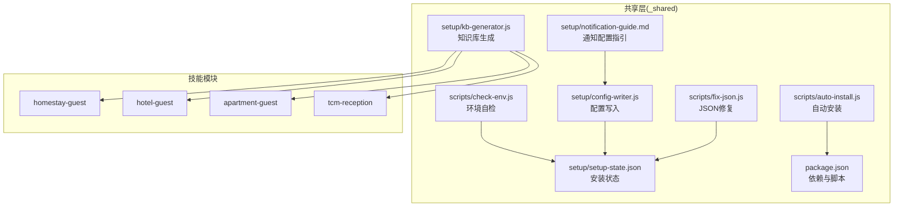
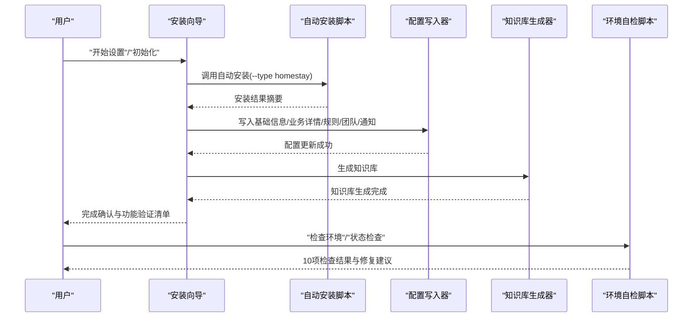
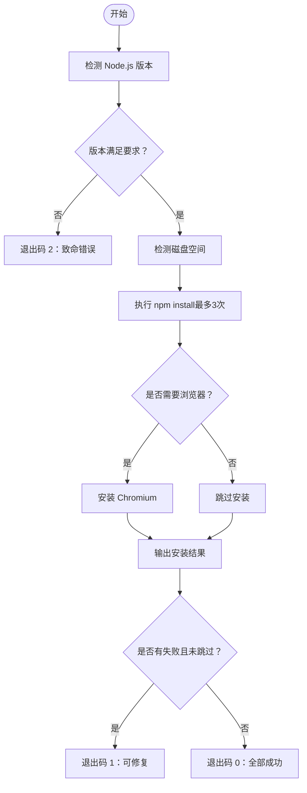
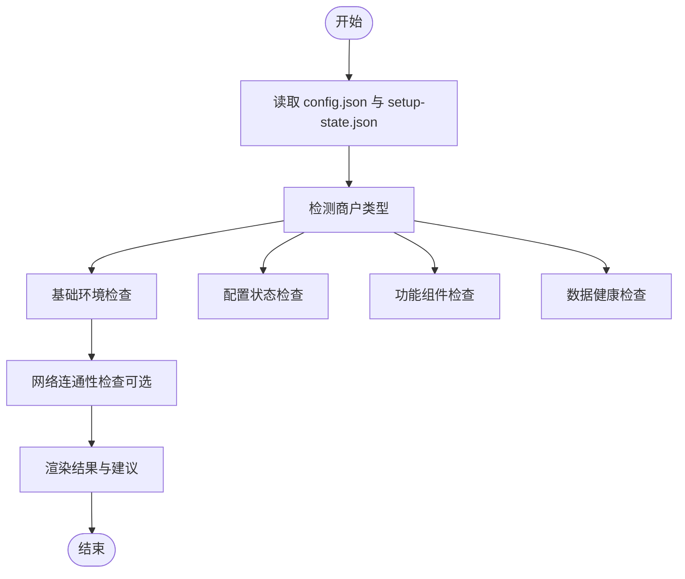
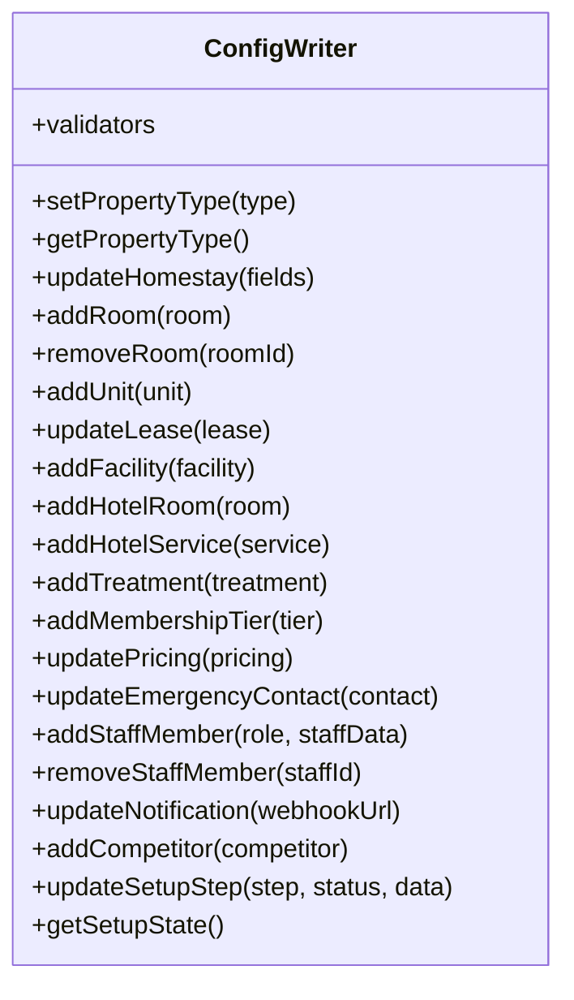
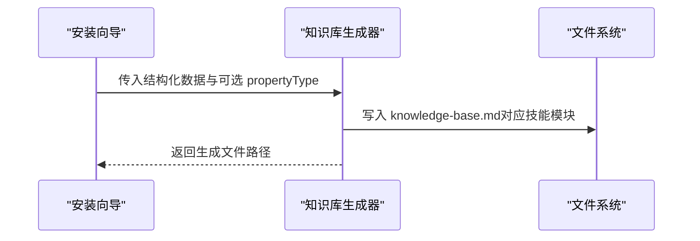
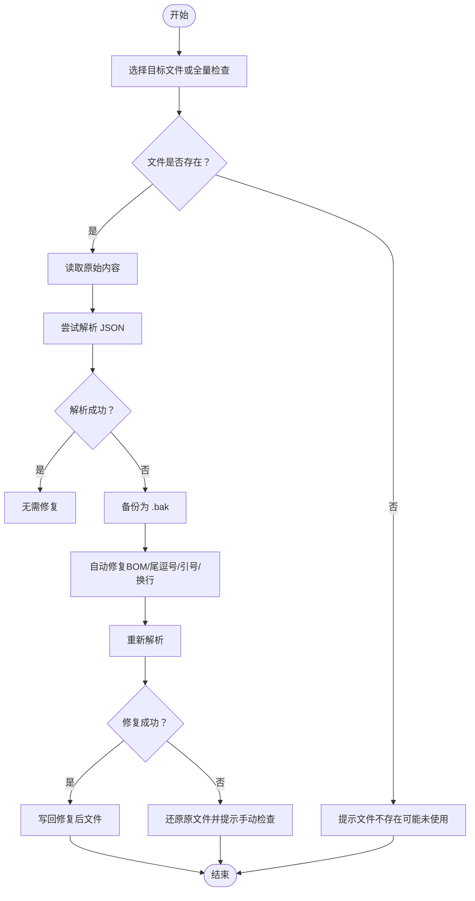
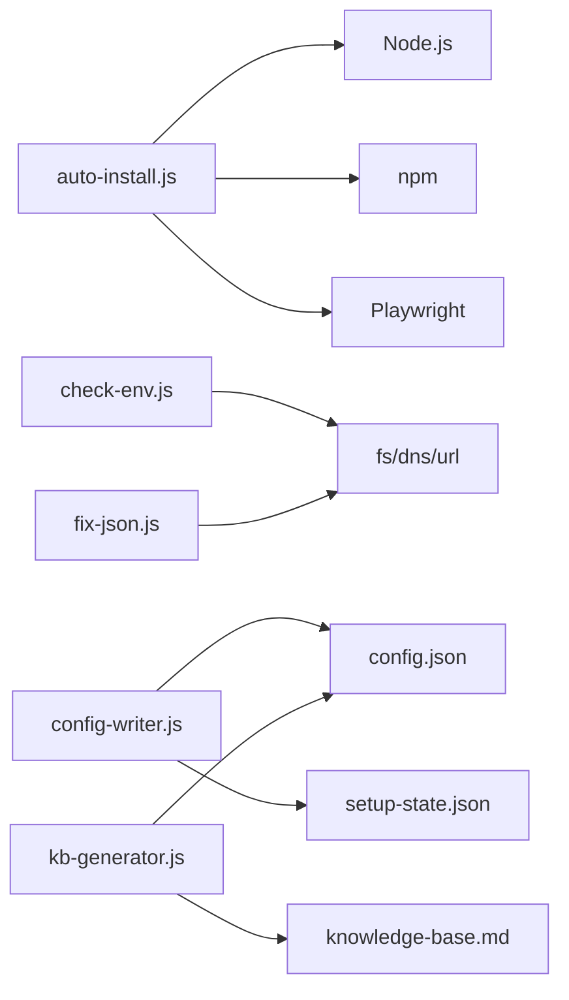

# 故障排除

<cite>
**本文档引用的文件**
- [README.md](file://README.md)
- [SKILL.md](file://SKILL.md)
- [USER-MANUAL.md](file://_shared/docs/USER-MANUAL.md)
- [SETUP-WIZARD.md](file://_shared/setup/SETUP-WIZARD.md)
- [package.json](file://_shared/package.json)
- [check-env.js](file://_shared/scripts/check-env.js)
- [auto-install.js](file://_shared/scripts/auto-install.js)
- [config-writer.js](file://_shared/setup/config-writer.js)
- [kb-generator.js](file://_shared/setup/kb-generator.js)
- [fix-json.js](file://_shared/scripts/fix-json.js)
- [setup-state.json](file://_shared/setup/setup-state.json)
- [homestay-suite.json](file://_shared/homestay-suite.json)
- [notification-guide.md](file://_shared/setup/notification-guide.md)
</cite>

## 目录
1. [简介](#简介)
2. [项目结构](#项目结构)
3. [核心组件](#核心组件)
4. [架构总览](#架构总览)
5. [详细组件分析](#详细组件分析)
6. [依赖关系分析](#依赖关系分析)
7. [性能考虑](#性能考虑)
8. [故障排除指南](#故障排除指南)
9. [结论](#结论)
10. [附录](#附录)

## 简介
本文件面向使用者与管理员，提供 Skills 3 套件的系统化故障排除与问题诊断指南。内容覆盖环境检查、安装问题、配置错误识别与修复、日志与错误追踪、性能诊断、网络与权限问题处理、依赖冲突排查，以及标准化的问题报告与反馈流程。文档以仓库内的脚本与配置为依据，结合安装向导与用户手册，给出可操作的步骤与建议。

## 项目结构
Skills 3 套件采用共享层与多技能模块的组织方式，核心位于 _shared 目录，包含安装、配置、知识库生成、通知、面板数据生成、环境检查与修复等工具脚本。套件支持多种商户类型（民宿、公寓、酒店、中医馆），并通过安装向导引导完成初始化与配置。

图表来源
- [auto-install.js:1-230](file://_shared/scripts/auto-install.js#L1-L230)
- [check-env.js:1-464](file://_shared/scripts/check-env.js#L1-L464)
- [config-writer.js:1-603](file://_shared/setup/config-writer.js#L1-L603)
- [kb-generator.js:1-573](file://_shared/setup/kb-generator.js#L1-L573)
- [fix-json.js:1-191](file://_shared/scripts/fix-json.js#L1-L191)
- [setup-state.json:1-17](file://_shared/setup/setup-state.json#L1-L17)
- [notification-guide.md:1-71](file://_shared/setup/notification-guide.md#L1-L71)
- [package.json:1-20](file://_shared/package.json#L1-L20)

章节来源
- [README.md:1-5](file://README.md#L1-L5)
- [SKILL.md:304-318](file://SKILL.md#L304-L318)

## 核心组件
- 自动安装脚本：负责 Node 版本与磁盘空间检测、npm 依赖安装、Playwright 浏览器按需安装，并输出安装结果摘要。
- 环境自检脚本：对基础环境、配置状态、功能组件、数据健康进行 10 项检查，输出分组结果与修复建议。
- 配置写入器：提供多商户类型字段写入与校验，保证配置变更的安全与一致性。
- 知识库生成器：将安装向导采集的结构化数据渲染为各技能模块使用的知识库 Markdown。
- JSON 修复工具：检测并自动修复常见 JSON 语法问题，备份原文件，输出修复报告。
- 安装状态文件：记录安装进度、完成时间与最后修改时间，支撑断点续传与状态查询。
- 通知配置指引：提供企业微信 Webhook 配置步骤与常见问题解答。
- 依赖与脚本：package.json 定义共享依赖与脚本（浏览器初始化、检查、安装浏览器）。

章节来源
- [auto-install.js:1-230](file://_shared/scripts/auto-install.js#L1-L230)
- [check-env.js:95-326](file://_shared/scripts/check-env.js#L95-L326)
- [config-writer.js:1-603](file://_shared/setup/config-writer.js#L1-L603)
- [kb-generator.js:62-86](file://_shared/setup/kb-generator.js#L62-L86)
- [fix-json.js:44-90](file://_shared/scripts/fix-json.js#L44-L90)
- [setup-state.json:1-17](file://_shared/setup/setup-state.json#L1-L17)
- [notification-guide.md:9-32](file://_shared/setup/notification-guide.md#L9-L32)
- [package.json:6-18](file://_shared/package.json#L6-L18)

## 架构总览
下图展示了从用户触发到系统响应的关键流程：安装向导、自动安装、配置写入、知识库生成与环境自检。

图表来源
- [SETUP-WIZARD.md:95-107](file://_shared/setup/SETUP-WIZARD.md#L95-L107)
- [auto-install.js:48-98](file://_shared/scripts/auto-install.js#L48-L98)
- [config-writer.js:118-135](file://_shared/setup/config-writer.js#L118-L135)
- [kb-generator.js:62-86](file://_shared/setup/kb-generator.js#L62-L86)
- [check-env.js:457-461](file://_shared/scripts/check-env.js#L457-L461)

## 详细组件分析

### 自动安装脚本（auto-install.js）
- 功能要点
  - 检测 Node.js 版本（≥18）与磁盘空间（≥500MB）。
  - 执行 npm install（最多重试3次），并输出每次尝试结果。
  - 按商户类型决定是否安装 Playwright Chromium（民宿/酒店需要）。
  - 输出安装结果摘要，按通过/失败/跳过分类。
- 退出码
  - 0：全部成功
  - 1：部分安装成功（可修复）
  - 2：致命错误（无法继续）

图表来源
- [auto-install.js:48-98](file://_shared/scripts/auto-install.js#L48-L98)
- [auto-install.js:143-181](file://_shared/scripts/auto-install.js#L143-L181)
- [auto-install.js:183-200](file://_shared/scripts/auto-install.js#L183-L200)

章节来源
- [auto-install.js:1-230](file://_shared/scripts/auto-install.js#L1-L230)

### 环境自检脚本（check-env.js）
- 检查维度（10项）
  - 基础环境：Node.js 版本、磁盘空间、依赖包安装。
  - 配置状态：基础配置、安装向导完成状态、知识库（住宿类）/业务规则（公寓/中医馆）。
  - 功能组件：企业微信通知、竞品采集器（住宿类为推荐，其他类型为可选）。
  - 数据健康：数据文件完整性、缺失必需文件、网络连通性（可选）。
- 输出
  - 分组显示检查项、通过/警告/失败图标、详细说明与修复建议。
  - 汇总统计与总体提示，区分核心功能可用与需修复场景。

图表来源
- [check-env.js:95-326](file://_shared/scripts/check-env.js#L95-L326)
- [check-env.js:413-461](file://_shared/scripts/check-env.js#L413-L461)

章节来源
- [check-env.js:1-464](file://_shared/scripts/check-env.js#L1-L464)

### 配置写入器（config-writer.js）
- 设计原则
  - 读取→合并→写入，避免覆盖其他字段。
  - 多商户类型支持，提供统一 API。
  - 内置字段校验（时间格式、电话、金额、必填字段）。
- 关键能力
  - 设置/读取商户类型。
  - 民宿/公寓/酒店/中医馆的业务字段写入与删除。
  - 员工与紧急联系人管理。
  - 通知配置（企业微信 Webhook）。
  - 安装向导状态更新与持久化。

图表来源
- [config-writer.js:118-135](file://_shared/setup/config-writer.js#L118-L135)
- [config-writer.js:176-196](file://_shared/setup/config-writer.js#L176-L196)
- [config-writer.js:238-247](file://_shared/setup/config-writer.js#L238-L247)
- [config-writer.js:319-330](file://_shared/setup/config-writer.js#L319-L330)
- [config-writer.js:383-392](file://_shared/setup/config-writer.js#L383-L392)
- [config-writer.js:404-417](file://_shared/setup/config-writer.js#L404-L417)
- [config-writer.js:468-484](file://_shared/setup/config-writer.js#L468-L484)
- [config-writer.js:502-511](file://_shared/setup/config-writer.js#L502-L511)
- [config-writer.js:544-558](file://_shared/setup/config-writer.js#L544-L558)

章节来源
- [config-writer.js:1-603](file://_shared/setup/config-writer.js#L1-L603)

### 知识库生成器（kb-generator.js）
- 功能
  - 将安装向导采集的结构化数据渲染为各技能模块的知识库 Markdown。
  - 支持多商户类型（民宿/公寓/酒店/中医馆），默认输出路径映射到对应技能模块。
- 使用
  - 可显式指定 propertyType，否则从 config.json 读取，缺省为 homestay。

图表来源
- [kb-generator.js:62-86](file://_shared/setup/kb-generator.js#L62-L86)
- [kb-generator.js:88-103](file://_shared/setup/kb-generator.js#L88-L103)

章节来源
- [kb-generator.js:1-573](file://_shared/setup/kb-generator.js#L1-L573)

### JSON 修复工具（fix-json.js）
- 功能
  - 检测 JSON 语法错误（尾逗号、引号问题、编码问题）。
  - 自动修复：移除 BOM、尾逗号、单引号转双引号、统一换行符。
  - 修复前自动备份（.bak），解析失败时还原。
  - 支持单文件修复与全量检查。
- 适用文件
  - orders、tasks、schedule、staff、cron-log、members、transactions、inventory、tenants、service-rules、tcm-config、config。

图表来源
- [fix-json.js:92-168](file://_shared/scripts/fix-json.js#L92-L168)
- [fix-json.js:170-188](file://_shared/scripts/fix-json.js#L170-L188)

章节来源
- [fix-json.js:1-191](file://_shared/scripts/fix-json.js#L1-L191)

### 安装向导与状态（SETUP-WIZARD.md、setup-state.json、homestay-suite.json）
- 安装向导
  - 预选商户类型（白名单来自 homestay-suite.json），按步骤采集基础信息、业务详情、规则与标准、环境与服务、团队与通知。
  - 支持断点续传与步骤回退。
  - 完成后生成知识库并输出功能验证清单。
- 安装状态
  - 记录 propertyType、完成状态、当前步骤、完成时间与最后修改时间。
- 商户类型白名单
  - 通过 setupTypes 控制支持的类型集合。

章节来源
- [SETUP-WIZARD.md:50-88](file://_shared/setup/SETUP-WIZARD.md#L50-L88)
- [SETUP-WIZARD.md:416-464](file://_shared/setup/SETUP-WIZARD.md#L416-L464)
- [setup-state.json:1-17](file://_shared/setup/setup-state.json#L1-L17)
- [homestay-suite.json:4-6](file://_shared/homestay-suite.json#L4-L6)

## 依赖关系分析
- 自动安装依赖 Node 与 npm，按需安装 Playwright Chromium。
- 环境自检依赖 Node 内置模块（fs、dns、url、child_process）进行检测与网络连通性评估。
- 配置写入器与知识库生成器依赖共享配置与数据文件。
- JSON 修复工具依赖文件系统与 JSON 解析。

图表来源
- [auto-install.js:23-31](file://_shared/scripts/auto-install.js#L23-L31)
- [check-env.js:18-22](file://_shared/scripts/check-env.js#L18-L22)
- [fix-json.js:19-24](file://_shared/scripts/fix-json.js#L19-L24)
- [config-writer.js:26-29](file://_shared/setup/config-writer.js#L26-L29)
- [kb-generator.js:23-32](file://_shared/setup/kb-generator.js#L23-L32)

章节来源
- [package.json:14-18](file://_shared/package.json#L14-L18)
- [auto-install.js:1-230](file://_shared/scripts/auto-install.js#L1-L230)
- [check-env.js:1-464](file://_shared/scripts/check-env.js#L1-L464)
- [fix-json.js:1-191](file://_shared/scripts/fix-json.js#L1-L191)
- [config-writer.js:1-603](file://_shared/setup/config-writer.js#L1-L603)
- [kb-generator.js:1-573](file://_shared/setup/kb-generator.js#L1-L573)

## 性能考虑
- 安装阶段
  - npm install 与 Playwright 下载耗时较长，建议在网络稳定时执行，必要时重试。
  - 磁盘空间不足会导致安装失败，需清理后重试。
- 运行阶段
  - 环境自检脚本对网络连通性采用轻量探测，避免长时间等待。
  - 知识库生成与配置写入为本地文件操作，通常快速完成。
- 建议
  - 定期使用环境自检脚本进行健康巡检。
  - 对频繁写入的 JSON 数据，使用 JSON 修复工具保持文件健康。

[本节为通用建议，不直接分析具体文件]

## 故障排除指南

### 一、系统环境检查
- 使用环境自检脚本进行 10 项检查，包括 Node 版本、磁盘空间、依赖安装、配置状态、知识库/业务规则、通知、竞品采集器、数据文件完整性与网络连通性。
- 根据输出的修复建议逐项处理，完成后再次自检确认。

章节来源
- [check-env.js:95-326](file://_shared/scripts/check-env.js#L95-L326)
- [check-env.js:413-461](file://_shared/scripts/check-env.js#L413-L461)

### 二、安装过程中常见问题
- Node 版本不满足要求
  - 现象：自动安装脚本提示版本过低。
  - 处理：升级 Node.js 至 18+ 后重试。
- 磁盘空间不足
  - 现象：磁盘空间检测失败。
  - 处理：清理磁盘空间后重试。
- npm 安装失败
  - 现象：多次尝试均失败，提示网络超时或权限不足。
  - 处理：检查网络与代理设置；若为权限问题，修正目录权限后重试。
- Playwright 浏览器安装失败
  - 现象：Chromium 安装超时。
  - 处理：手动执行安装命令，或更换网络环境后重试。

章节来源
- [auto-install.js:100-111](file://_shared/scripts/auto-install.js#L100-L111)
- [auto-install.js:113-141](file://_shared/scripts/auto-install.js#L113-L141)
- [auto-install.js:143-181](file://_shared/scripts/auto-install.js#L143-L181)
- [auto-install.js:183-200](file://_shared/scripts/auto-install.js#L183-L200)

### 三、配置错误的识别与修复
- 配置写入失败
  - 现象：字段校验失败（如电话格式、金额为负、必填字段缺失）。
  - 处理：根据错误信息修正字段值后重试。
- 安装向导状态异常
  - 现象：安装未完成或断点续传无效。
  - 处理：检查安装状态文件，按向导提示继续或重新开始。
- 通知配置无效
  - 现象：Webhook 地址格式不正确或测试失败。
  - 处理：按通知配置指引重新生成 Webhook 并测试。

章节来源
- [config-writer.js:67-105](file://_shared/setup/config-writer.js#L67-L105)
- [config-writer.js:502-511](file://_shared/setup/config-writer.js#L502-L511)
- [SETUP-WIZARD.md:384-398](file://_shared/setup/SETUP-WIZARD.md#L384-L398)
- [notification-guide.md:23-31](file://_shared/setup/notification-guide.md#L23-L31)

### 四、日志分析与错误追踪
- 环境自检输出包含检查项、详细说明与修复建议，可据此定位问题。
- JSON 修复工具在修复失败时会还原原文件并保留备份，便于人工检查。
- 安装脚本输出安装过程中的错误信息与建议，便于快速定位网络或权限问题。

章节来源
- [check-env.js:413-461](file://_shared/scripts/check-env.js#L413-L461)
- [fix-json.js:160-167](file://_shared/scripts/fix-json.js#L160-L167)
- [auto-install.js:163-181](file://_shared/scripts/auto-install.js#L163-L181)

### 五、性能问题诊断与优化
- 安装阶段
  - 使用自动安装脚本的重试机制与超时控制，避免长时间挂起。
  - 确保磁盘空间充足，减少安装失败重试次数。
- 运行阶段
  - 定期使用环境自检脚本进行健康巡检，及时发现并修复问题。
  - 对频繁写入的 JSON 数据，使用 JSON 修复工具保持文件健康。

章节来源
- [auto-install.js:143-181](file://_shared/scripts/auto-install.js#L143-L181)
- [check-env.js:95-326](file://_shared/scripts/check-env.js#L95-L326)
- [fix-json.js:92-168](file://_shared/scripts/fix-json.js#L92-L168)

### 六、网络连接、权限配置与依赖冲突
- 网络连接
  - 环境自检脚本对平台域名进行主机名解析检查，网络异常时提示检查 DNS 与网络设置。
- 权限配置
  - npm 安装失败提示权限不足时，修正目录权限后重试。
- 依赖冲突
  - 使用自动安装脚本统一管理依赖，避免手动干预导致的版本冲突。

章节来源
- [check-env.js:333-411](file://_shared/scripts/check-env.js#L333-L411)
- [auto-install.js:168-173](file://_shared/scripts/auto-install.js#L168-L173)

### 七、获取详细错误信息与调试输出
- 环境自检脚本输出结构化结果与修复建议，便于快速定位问题。
- JSON 修复工具输出修复报告与备份文件路径，便于回溯。
- 安装脚本输出安装过程中的错误信息与建议，便于快速定位网络或权限问题。

章节来源
- [check-env.js:413-461](file://_shared/scripts/check-env.js#L413-L461)
- [fix-json.js:150-167](file://_shared/scripts/fix-json.js#L150-L167)
- [auto-install.js:163-181](file://_shared/scripts/auto-install.js#L163-L181)

### 八、自助问题解决流程
- 首先使用环境自检脚本进行系统健康检查。
- 根据检查结果执行相应修复步骤（升级 Node、清理磁盘、重装依赖、修复 JSON、重新配置通知）。
- 如仍无法解决，使用安装向导的断点续传功能继续完成安装。
- 必要时参考通知配置指引或知识库生成器的输出进行进一步调整。

章节来源
- [check-env.js:95-326](file://_shared/scripts/check-env.js#L95-L326)
- [SETUP-WIZARD.md:606-620](file://_shared/setup/SETUP-WIZARD.md#L606-L620)
- [notification-guide.md:9-32](file://_shared/setup/notification-guide.md#L9-L32)
- [kb-generator.js:62-86](file://_shared/setup/kb-generator.js#L62-L86)

### 九、标准化问题报告与反馈流程
- 收集信息
  - 系统环境：Node 版本、磁盘空间、依赖安装状态。
  - 安装状态：安装向导完成情况、配置文件与知识库状态。
  - 错误日志：环境自检输出、安装脚本错误信息、JSON 修复工具报告。
- 填写报告
  - 问题现象、复现步骤、期望结果、实际结果。
  - 环境信息与收集到的日志。
- 提交与跟进
  - 通过既定渠道提交报告，关注后续反馈与修复进展。

[本节为流程性建议，不直接分析具体文件]

## 结论
通过系统化的环境检查、自动安装与配置写入、知识库生成与数据健康维护，Skills 3 套件提供了完善的自助故障排除能力。建议用户与管理员定期使用环境自检脚本进行巡检，遇到问题时按本指南的步骤逐一排查与修复，必要时参考安装向导与通知配置指引，确保系统稳定运行。

[本节为总结性内容，不直接分析具体文件]

## 附录
- 快速入口
  - 环境自检：在终端执行环境自检脚本。
  - 重新安装：在终端执行自动安装脚本。
  - 修复 JSON：在终端执行 JSON 修复工具。
  - 配置通知：按通知配置指引完成 Webhook 设置。
- 相关文件
  - 自动安装脚本、环境自检脚本、配置写入器、知识库生成器、JSON 修复工具、安装状态文件、通知配置指引、依赖与脚本。

章节来源
- [check-env.js:457-461](file://_shared/scripts/check-env.js#L457-L461)
- [auto-install.js:48-98](file://_shared/scripts/auto-install.js#L48-L98)
- [fix-json.js:44-90](file://_shared/scripts/fix-json.js#L44-L90)
- [notification-guide.md:9-32](file://_shared/setup/notification-guide.md#L9-L32)
- [package.json:6-18](file://_shared/package.json#L6-L18)