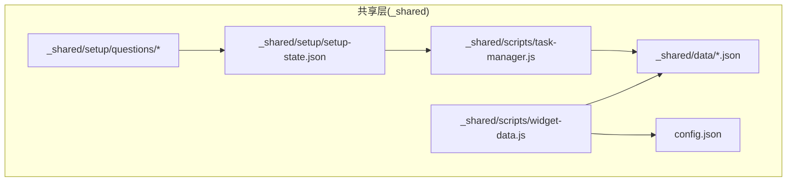
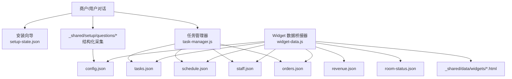
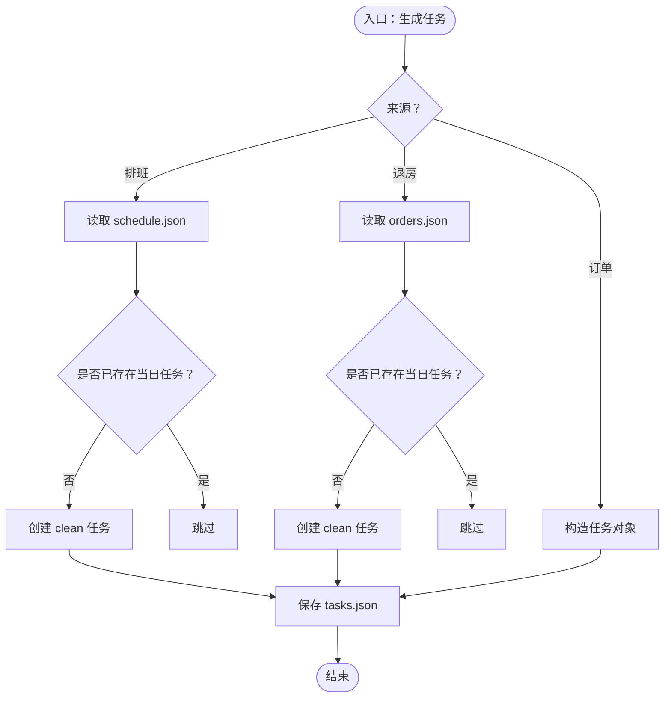
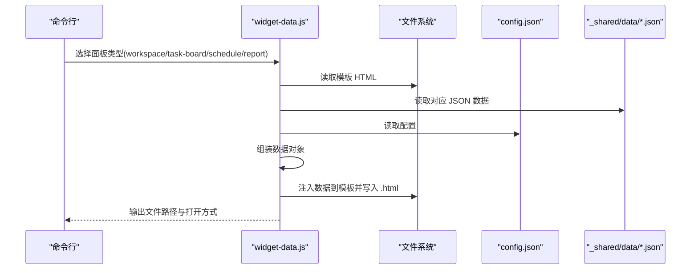
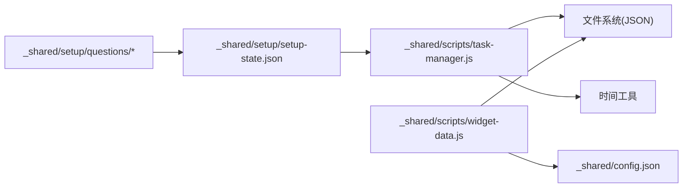

# 数据存储

<cite>
**本文引用的文件**
- [README.md](file://README.md)
- [SKILL.md](file://SKILL.md)
- [_shared/package.json](file://_shared/package.json)
- [_shared/setup/setup-state.json](file://_shared/setup/setup-state.json)
- [_shared/setup/questions/_common/basic-info.json](file://_shared/setup/questions/_common/basic-info.json)
- [_shared/setup/questions/_common/notification.json](file://_shared/setup/questions/_common/notification.json)
- [_shared/setup/questions/tcm-clinic/contacts.json](file://_shared/setup/questions/tcm-clinic/contacts.json)
- [_shared/setup/questions/tcm-clinic/membership.json](file://_shared/setup/questions/tcm-clinic/membership.json)
- [_shared/setup/questions/tcm-clinic/pricing.json](file://_shared/setup/questions/tcm-clinic/pricing.json)
- [_shared/setup/questions/tcm-clinic/services.json](file://_shared/setup/questions/tcm-clinic/services.json)
- [_shared/scripts/task-manager.js](file://_shared/scripts/task-manager.js)
- [_shared/scripts/widget-data.js](file://_shared/scripts/widget-data.js)
</cite>

## 目录
1. [简介](#简介)
2. [项目结构](#项目结构)
3. [核心组件](#核心组件)
4. [架构总览](#架构总览)
5. [详细组件分析](#详细组件分析)
6. [依赖关系分析](#依赖关系分析)
7. [性能考虑](#性能考虑)
8. [故障排查指南](#故障排查指南)
9. [结论](#结论)
10. [附录](#附录)

## 简介
本文件面向开发者，系统化梳理 Skills 3 套件（民宿/中医馆场景）的数据存储体系，涵盖数据文件结构、存储策略、访问模式、数据模型字段定义与业务含义、生命周期与备份恢复、导入导出与格式规范、一致性与并发控制、迁移与版本兼容、缓存与性能优化、安全与隐私保护，以及扩展与自定义数据存储的实践指导。

## 项目结构
- 数据文件主要位于共享目录下的 data 子目录，采用 JSON 文本文件形式持久化，便于人类可读与工具链兼容。
- 配置文件 config.json 与安装状态 setup-state.json 位于共享根目录，用于运行态配置与安装向导状态。
- 问答与配置采集问题定义位于 _shared/setup/questions 下，按场景拆分（如 tcm-clinic），用于引导商户录入结构化信息。
- 核心数据访问与生成逻辑集中在共享脚本中：
  - 任务管理器：负责任务的创建、完成、批量处理与自动生成，并维护 tasks.json、schedule.json、staff.json、orders.json 等。
  - Widget 数据桥接器：从 data 目录读取 JSON，组装为面板所需数据，并注入 HTML 模板生成可独立打开的 .html 文件。

图表来源
- [_shared/scripts/task-manager.js](file://_shared/scripts/task-manager.js)
- [_shared/scripts/widget-data.js](file://_shared/scripts/widget-data.js)
- [_shared/setup/setup-state.json](file://_shared/setup/setup-state.json)
- [_shared/setup/questions/tcm-clinic/contacts.json](file://_shared/setup/questions/tcm-clinic/contacts.json)

章节来源
- [README.md:1-5](file://README.md#L1-L5)
- [SKILL.md:44-56](file://SKILL.md#L44-L56)
- [_shared/scripts/task-manager.js:27-31](file://_shared/scripts/task-manager.js#L27-L31)
- [_shared/scripts/widget-data.js:32-34](file://_shared/scripts/widget-data.js#L32-L34)

## 核心组件
- 任务管理器（task-manager.js）
  - 负责任务的增删改查、状态流转、批量完成、从排班/退房订单自动生成任务。
  - 数据文件：tasks.json、schedule.json、staff.json、orders.json。
- Widget 数据桥接器（widget-data.js）
  - 从 data 目录读取 JSON，组装 KPI、任务、排班、报表等数据，注入 HTML 模板生成面板文件。
  - 依赖 config.json 提供民宿名称等上下文信息。
- 安装与配置状态（setup-state.json）
  - 记录安装向导进度、属性类型、版本等，驱动首次安装与功能可用性判断。
- 结构化采集问题（questions/*）
  - 以 JSON 定义问答与字段约束，支撑商户信息录入与知识库生成。

章节来源
- [_shared/scripts/task-manager.js:64-177](file://_shared/scripts/task-manager.js#L64-L177)
- [_shared/scripts/widget-data.js:48-88](file://_shared/scripts/widget-data.js#L48-L88)
- [_shared/setup/setup-state.json:1-17](file://_shared/setup/setup-state.json#L1-L17)
- [_shared/setup/questions/_common/basic-info.json:1-10](file://_shared/setup/questions/_common/basic-info.json#L1-L10)

## 架构总览
下图展示了数据流从采集、持久化到读取与面板渲染的整体关系：

图表来源
- [_shared/scripts/task-manager.js](file://_shared/scripts/task-manager.js)
- [_shared/scripts/widget-data.js](file://_shared/scripts/widget-data.js)
- [_shared/setup/setup-state.json](file://_shared/setup/setup-state.json)
- [_shared/setup/questions/tcm-clinic/contacts.json](file://_shared/setup/questions/tcm-clinic/contacts.json)

## 详细组件分析

### 任务管理器（数据模型与访问模式）
- 数据文件与职责
  - tasks.json：任务集合，包含任务 ID、类型、房间号、负责人、状态、截止时间、来源、创建/更新/完成时间等。
  - schedule.json：排班数据，包含日期、人员分配及房间列表、历史等。
  - staff.json：员工信息与角色映射。
  - orders.json：订单数据，包含入住/退房日期、房号、客人信息等。
- 字段定义与业务含义（节选）
  - 任务对象（tasks.json 中的元素）
    - id：字符串，唯一标识。
    - type：枚举，如 clean、repair、checkin、general。
    - room：字符串，关联房间号。
    - assignee：字符串，负责人。
    - status：枚举，pending、in_progress、done。
    - deadline：字符串，截止时间。
    - source：枚举，manual、schedule、checkout、order、cron。
    - createdAt/updatedAt/completedAt：字符串，ISO 时间戳。
  - 排班对象（schedule.json）
    - date：字符串，排班日期。
    - assignments：数组，元素含 staff、rooms、status。
    - history：数组，历史记录。
  - 员工对象（staff.json）
    - staff：数组，元素含 id、name、role、phone。
    - roles：对象，role 映射到中文名称。
  - 订单对象（orders.json）
    - orders：数组，元素含 checkIn/checkin、checkOut/checkout、roomNumber/room、guestName 等。
- 访问模式
  - 读取：loadJSON(filepath) -> 解析 JSON；若文件不存在返回 null。
  - 写入：ensureDir -> stringify -> 写入 UTF-8 文件。
  - 生成：generateId() 基于时间戳与随机串生成唯一 ID；today()/now() 提供日期/时间。
- 自动生成功能
  - 从排班生成保洁任务：遍历当日排班，去重创建 clean 任务。
  - 从退房订单生成保洁任务：筛选当日退房订单，去重创建 clean 任务。
  - 从新订单生成入住准备任务：根据入住时间 deadline 生成 checkin 任务。

图表来源
- [_shared/scripts/task-manager.js:184-265](file://_shared/scripts/task-manager.js#L184-L265)

章节来源
- [_shared/scripts/task-manager.js:39-48](file://_shared/scripts/task-manager.js#L39-L48)
- [_shared/scripts/task-manager.js:64-177](file://_shared/scripts/task-manager.js#L64-L177)
- [_shared/scripts/task-manager.js:184-265](file://_shared/scripts/task-manager.js#L184-L265)

### Widget 数据桥接器（数据读取与面板生成）
- 数据读取
  - 从 data 目录读取 tasks.json、revenue.json、room-status.json、schedule.json、staff.json。
  - 从 config.json 读取民宿名称等上下文。
- 数据组装
  - 工作台：汇总今日任务、收入与入住率 KPI、告警。
  - 任务看板：输出全部任务的精简视图。
  - 排班：按人员聚合房间完成状态，统计本周完成量。
  - 报表：输出近7天 KPI、趋势、渠道分布等。
- 面板生成
  - 读取模板 HTML，注入 window.__WIDGET_DATA__，输出独立 .html 文件至 _shared/data/widgets。

图表来源
- [_shared/scripts/widget-data.js:186-220](file://_shared/scripts/widget-data.js#L186-L220)
- [_shared/scripts/widget-data.js:48-168](file://_shared/scripts/widget-data.js#L48-L168)

章节来源
- [_shared/scripts/widget-data.js:36-44](file://_shared/scripts/widget-data.js#L36-L44)
- [_shared/scripts/widget-data.js:48-168](file://_shared/scripts/widget-data.js#L48-L168)
- [_shared/scripts/widget-data.js:172-220](file://_shared/scripts/widget-data.js#L172-L220)

### 安装与配置状态（setup-state.json）
- 字段定义
  - version：套件版本。
  - propertyType：商户类型（如 tcm-clinic）。
  - completed：布尔，安装是否完成。
  - currentStep/steps：当前步骤与步骤完成状态。
  - startedAt/completedAt/lastModifiedAt：时间戳。
- 作用
  - 驱动首次安装向导与功能可用性判断。
  - 作为安装流程的状态机，避免重复安装与缺失配置。

章节来源
- [_shared/setup/setup-state.json:1-17](file://_shared/setup/setup-state.json#L1-L17)

### 结构化采集问题（questions/*）
- basic-info.json：基础信息采集，如店名、地址、房间数、诊所面积、营业时间等。
- notification.json：通知配置采集，包含三步引导与 Webhook 地址校验。
- tcm-clinic/*：中医馆场景专用问题集，包括医师/前台/顾问/紧急联系人、会员卡、价格与服务项目等。
- 作用
  - 以 JSON Schema 形式定义字段、示例、必填与适用范围，保障录入质量与后续知识库生成。

章节来源
- [_shared/setup/questions/_common/basic-info.json:1-10](file://_shared/setup/questions/_common/basic-info.json#L1-L10)
- [_shared/setup/questions/_common/notification.json:1-12](file://_shared/setup/questions/_common/notification.json#L1-L12)
- [_shared/setup/questions/tcm-clinic/contacts.json:1-36](file://_shared/setup/questions/tcm-clinic/contacts.json#L1-L36)
- [_shared/setup/questions/tcm-clinic/membership.json:1-9](file://_shared/setup/questions/tcm-clinic/membership.json#L1-L9)
- [_shared/setup/questions/tcm-clinic/pricing.json:1-8](file://_shared/setup/questions/tcm-clinic/pricing.json#L1-L8)
- [_shared/setup/questions/tcm-clinic/services.json:1-8](file://_shared/setup/questions/tcm-clinic/services.json#L1-L8)

## 依赖关系分析
- 任务管理器依赖
  - 文件系统：读写 data 目录下的 JSON 文件。
  - 时间工具：生成 ID、日期与时间戳。
- Widget 数据桥接器依赖
  - 文件系统：读取 data 目录与模板 HTML。
  - 配置：读取 config.json。
- 安装与采集
  - setup-state.json 与 questions/* 共同决定安装流程与数据采集范围。

图表来源
- [_shared/scripts/task-manager.js](file://_shared/scripts/task-manager.js)
- [_shared/scripts/widget-data.js](file://_shared/scripts/widget-data.js)
- [_shared/setup/setup-state.json](file://_shared/setup/setup-state.json)
- [_shared/setup/questions/tcm-clinic/contacts.json](file://_shared/setup/questions/tcm-clinic/contacts.json)

章节来源
- [_shared/scripts/task-manager.js:24-60](file://_shared/scripts/task-manager.js#L24-L60)
- [_shared/scripts/widget-data.js:29-44](file://_shared/scripts/widget-data.js#L29-L44)
- [_shared/setup/setup-state.json:1-17](file://_shared/setup/setup-state.json#L1-L17)

## 性能考虑
- 文件读写
  - 采用同步文件读写，简单可靠但不适合高并发写入场景。建议在需要高吞吐时引入异步 I/O 或轻量数据库。
- JSON 解析
  - 小规模数据解析成本低；若数据增长，建议分页/索引或引入列式存储。
- 面板生成
  - 模板注入为一次性操作，建议缓存生成结果并在数据变更时增量更新。
- 依赖
  - package.json 中包含 exceljs、node-cron、playwright 等，注意其对内存与 CPU 的影响，合理调度定时任务与浏览器实例。

章节来源
- [_shared/package.json:14-19](file://_shared/package.json#L14-L19)
- [_shared/scripts/task-manager.js:39-48](file://_shared/scripts/task-manager.js#L39-L48)
- [_shared/scripts/widget-data.js:202-220](file://_shared/scripts/widget-data.js#L202-L220)

## 故障排查指南
- 文件缺失或格式错误
  - 现象：读取 JSON 返回 null 或解析异常。
  - 排查：确认 data 目录下文件是否存在、JSON 格式是否正确、编码是否为 UTF-8。
- 任务状态不一致
  - 现象：任务完成但未更新状态。
  - 排查：核对 completeTask 的匹配逻辑（支持按 ID/房号），确认保存是否成功。
- 面板为空
  - 现象：工作台/报表面板无数据。
  - 排查：确认对应 JSON 文件是否存在且包含有效数据；检查 config.json 中民宿名称等上下文。
- 安装向导未完成
  - 现象：功能不可用或提示未完成设置。
  - 排查：检查 setup-state.json 的 completed 字段与 steps 状态。

章节来源
- [_shared/scripts/task-manager.js:39-48](file://_shared/scripts/task-manager.js#L39-L48)
- [_shared/scripts/widget-data.js:36-44](file://_shared/scripts/widget-data.js#L36-L44)
- [_shared/setup/setup-state.json:1-17](file://_shared/setup/setup-state.json#L1-L17)

## 结论
本套件采用轻量 JSON 文件作为数据存储介质，结合安装向导与结构化采集问题，形成从录入到持久化再到可视化呈现的闭环。任务管理器与 Widget 数据桥接器分别承担业务数据管理与前端展示职责，整体架构清晰、易维护。对于生产化部署，建议引入异步 I/O、数据库与缓存层，完善备份与版本迁移策略，强化并发控制与安全防护。

## 附录

### 数据文件结构与字段定义
- tasks.json（任务集合）
  - 字段：id、type、name、room、assignee、status、deadline、source、createdAt、updatedAt、completedAt。
  - 类型：字符串、枚举、可空字符串。
  - 业务含义：任务生命周期与来源追踪。
- schedule.json（排班）
  - 字段：date、assignments（staff、rooms、status）、history。
  - 类型：字符串、数组、对象。
  - 业务含义：人员与房间的排班映射。
- staff.json（员工）
  - 字段：staff（id、name、role、phone）、roles。
  - 类型：数组、对象。
  - 业务含义：员工角色与联系方式。
- orders.json（订单）
  - 字段：orders（checkIn/checkin、checkOut/checkout、roomNumber/room、guestName 等）。
  - 类型：数组、字符串。
  - 业务含义：入住/退房与房间绑定。
- config.json（配置）
  - 字段：homestay.name 等（示例）。
  - 类型：对象。
  - 业务含义：面板标题等上下文信息。
- setup-state.json（安装状态）
  - 字段：version、propertyType、completed、currentStep、steps、startedAt、completedAt、lastModifiedAt。
  - 类型：字符串、布尔、数字、对象。
  - 业务含义：安装流程状态机。

章节来源
- [_shared/scripts/task-manager.js:81-93](file://_shared/scripts/task-manager.js#L81-L93)
- [_shared/scripts/task-manager.js:184-265](file://_shared/scripts/task-manager.js#L184-L265)
- [_shared/scripts/widget-data.js:48-88](file://_shared/scripts/widget-data.js#L48-L88)
- [_shared/setup/setup-state.json:1-17](file://_shared/setup/setup-state.json#L1-L17)

### 生命周期管理、备份与恢复
- 生命周期
  - 创建：createTask 生成任务并写入 tasks.json。
  - 更新：completeTask/startTask 更新状态与时间戳。
  - 清理：可定期归档或删除过期数据（如超过一定周期的任务）。
- 备份
  - 建议对 data 目录进行周期性快照备份；可结合版本控制或云存储实现异地备份。
- 恢复
  - 从最近一次备份恢复 data 目录；验证 JSON 格式与关键文件完整性。

章节来源
- [_shared/scripts/task-manager.js:69-71](file://_shared/scripts/task-manager.js#L69-L71)
- [_shared/scripts/task-manager.js:104-124](file://_shared/scripts/task-manager.js#L104-L124)

### 导入导出与格式规范
- 导入
  - 通过命令行参数或交互式问答收集数据，写入对应 JSON 文件。
  - 注意字段类型与必填约束，参考 questions/* 中的定义。
- 导出
  - 读取 data 目录 JSON，生成面板 HTML 或结构化数据输出。
- 格式
  - 统一使用 UTF-8 编码的 JSON；时间戳使用 ISO 字符串；枚举值限定在预定义集合。

章节来源
- [_shared/scripts/task-manager.js:315-382](file://_shared/scripts/task-manager.js#L315-L382)
- [_shared/scripts/widget-data.js:228-268](file://_shared/scripts/widget-data.js#L228-L268)
- [_shared/setup/questions/_common/basic-info.json:1-10](file://_shared/setup/questions/_common/basic-info.json#L1-L10)

### 一致性保证与并发控制
- 一致性
  - 采用单文件 JSON 写入，写入前确保目录存在，写入后刷新磁盘。
- 并发
  - 当前实现为单进程同步写入，不适用于高并发写入场景。建议：
    - 引入文件锁或数据库事务；
    - 使用队列顺序化写入；
    - 对热点资源（如 tasks.json）进行分片或拆表。

章节来源
- [_shared/scripts/task-manager.js:45-48](file://_shared/scripts/task-manager.js#L45-L48)

### 数据迁移、版本升级与兼容
- 版本
  - setup-state.json 包含 version 字段，可用于判断是否需要迁移。
- 迁移
  - 新增字段：读取时提供默认值，写入时补齐。
  - 字段重命名：读取阶段做兼容映射，写入阶段写入新字段。
  - 删除字段：读取阶段忽略，不再写回。
- 兼容
  - 保持向后兼容的 JSON 结构；对新增功能采用可选字段与默认值策略。

章节来源
- [_shared/setup/setup-state.json:1-17](file://_shared/setup/setup-state.json#L1-L17)

### 缓存策略与性能优化
- 缓存
  - 面板数据：对常用视图（如工作台）进行内存缓存，数据变更时失效。
  - 模板注入：缓存已注入后的 HTML，减少重复 I/O。
- 优化
  - 异步读写：使用 Promise 包装 fs 操作，提升并发能力。
  - 分页/索引：对大文件进行分片或建立索引（如按日期、状态）。
  - 压缩：对静态面板文件启用 gzip 压缩传输。

章节来源
- [_shared/scripts/widget-data.js:202-220](file://_shared/scripts/widget-data.js#L202-L220)
- [_shared/package.json:14-19](file://_shared/package.json#L14-L19)

### 数据安全与隐私保护
- 最小化原则
  - 仅采集必要字段；对敏感信息（如电话、地址）进行脱敏或限制展示。
- 存储安全
  - 限制 data 目录访问权限；对备份文件进行加密存储。
- 传输安全
  - 使用 HTTPS 传输配置与数据；避免明文存储凭证。
- 审计
  - 记录关键写操作（如任务完成、面板生成）的时间与来源，便于审计。

章节来源
- [SKILL.md:320-327](file://SKILL.md#L320-L327)

### 扩展与自定义数据存储指导
- 新增数据模型
  - 在 data 目录新增 JSON 文件，定义字段与业务含义；在任务管理器或 Widget 数据桥接器中增加读取与组装逻辑。
- 自定义面板
  - 在 widget-data.js 中新增数据组装函数，并在模板目录提供 HTML 模板，通过 generateWidgetFile 生成独立文件。
- 配置扩展
  - 在 config.json 中新增键值，供面板与逻辑使用；确保默认值与兼容性。

章节来源
- [_shared/scripts/widget-data.js:172-220](file://_shared/scripts/widget-data.js#L172-L220)
- [_shared/scripts/task-manager.js:27-31](file://_shared/scripts/task-manager.js#L27-L31)