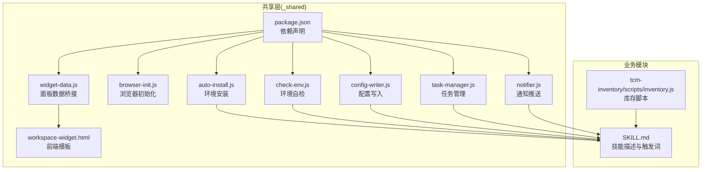
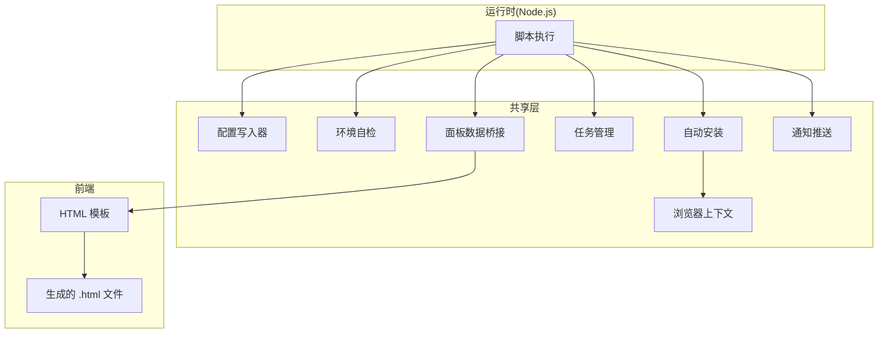
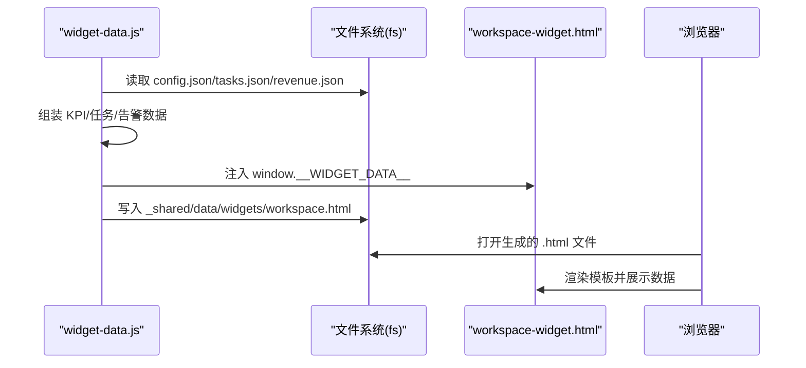
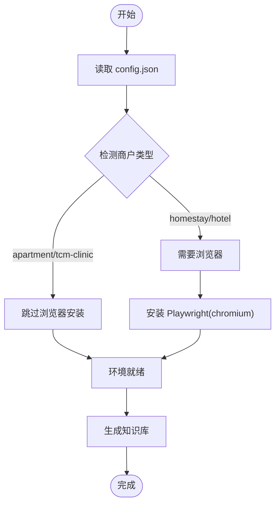
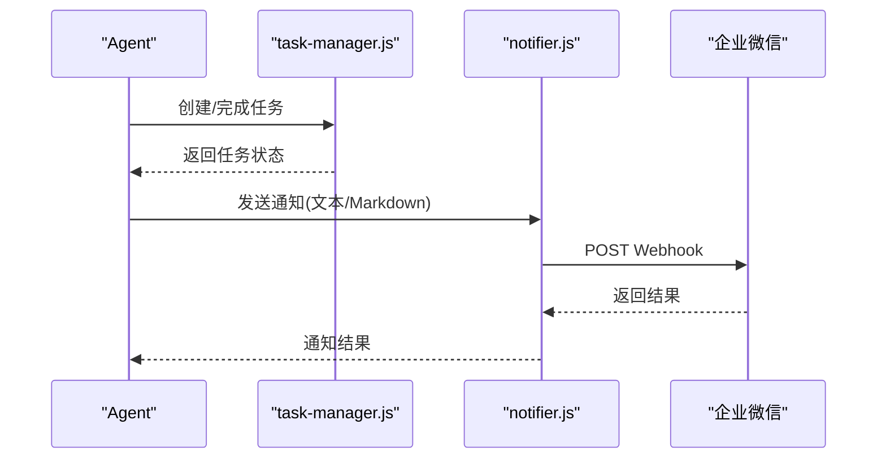
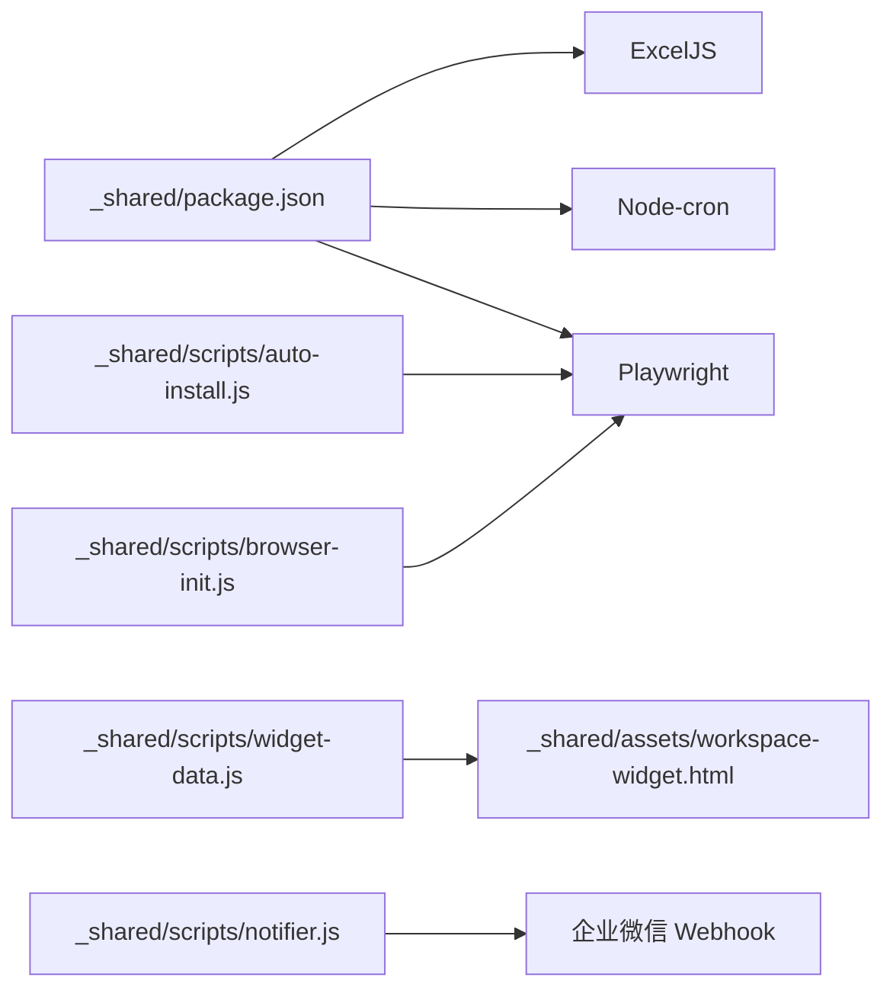

# 技术栈选型

<cite>
**本文档引用的文件**
- [README.md](file://README.md)
- [SKILL.md](file://SKILL.md)
- [_shared/package.json](file://_shared/package.json)
- [_shared/scripts/auto-install.js](file://_shared/scripts/auto-install.js)
- [_shared/scripts/browser-init.js](file://_shared/scripts/browser-init.js)
- [_shared/scripts/check-env.js](file://_shared/scripts/check-env.js)
- [_shared/scripts/config-writer.js](file://_shared/scripts/config-writer.js)
- [_shared/scripts/task-manager.js](file://_shared/scripts/task-manager.js)
- [_shared/scripts/widget-data.js](file://_shared/scripts/widget-data.js)
- [_shared/scripts/notifier.js](file://_shared/scripts/notifier.js)
- [_shared/assets/workspace-widget.html](file://_shared/assets/workspace-widget.html)
- [tcm-inventory/scripts/inventory.js](file://tcm-inventory/scripts/inventory.js)
- [_shared/setup/SETUP-WIZARD.md](file://_shared/setup/SETUP-WIZARD.md)
</cite>

## 目录
1. [引言](#引言)
2. [项目结构](#项目结构)
3. [核心组件](#核心组件)
4. [架构概览](#架构概览)
5. [详细组件分析](#详细组件分析)
6. [依赖关系分析](#依赖关系分析)
7. [性能考量](#性能考量)
8. [故障排查指南](#故障排查指南)
9. [结论](#结论)
10. [附录](#附录)

## 引言
本技术栈选型文档面向 Skills 3 套件，系统阐述后端运行时与关键依赖的选型理由，解释 Node.js 作为运行时的优势（异步 I/O、事件驱动模型），并深入分析 ExcelJS、Node-cron、Playwright 等关键库的应用场景与价值。同时说明前端 HTML 模板与后端数据桥接的配合方式，给出技术选型的约束条件（兼容性、性能、部署环境），并提供替代方案评估，帮助开发者理解架构决策。

## 项目结构
Skills 3 套件采用“共享层 + 多类型业务模块”的组织方式：
- 共享层（_shared）：提供通用安装、配置、通知、浏览器初始化、面板渲染、环境检查等能力
- 业务模块：如民宿（homestay-*）、酒店（hotel-*）、公寓（apartment-*）、中医馆（tcm-*）等
- 辅助脚本：如库存管理（tcm-inventory）

图表来源
- [_shared/package.json:1-20](file://_shared/package.json#L1-L20)
- [_shared/scripts/auto-install.js:1-230](file://_shared/scripts/auto-install.js#L1-L230)
- [_shared/scripts/browser-init.js:1-392](file://_shared/scripts/browser-init.js#L1-L392)
- [_shared/scripts/check-env.js:1-464](file://_shared/scripts/check-env.js#L1-L464)
- [_shared/scripts/config-writer.js:1-603](file://_shared/scripts/config-writer.js#L1-L603)
- [_shared/scripts/task-manager.js:1-399](file://_shared/scripts/task-manager.js#L1-L399)
- [_shared/scripts/widget-data.js:1-278](file://_shared/scripts/widget-data.js#L1-L278)
- [_shared/scripts/notifier.js:1-274](file://_shared/scripts/notifier.js#L1-L274)
- [_shared/assets/workspace-widget.html:1-214](file://_shared/assets/workspace-widget.html#L1-L214)
- [SKILL.md:1-379](file://SKILL.md#L1-L379)
- [tcm-inventory/scripts/inventory.js:1-178](file://tcm-inventory/scripts/inventory.js#L1-L178)

章节来源
- [README.md:1-5](file://README.md#L1-L5)
- [SKILL.md:1-379](file://SKILL.md#L1-L379)

## 核心组件
- 运行时与依赖
  - Node.js：作为统一运行时，提供事件循环、异步 I/O、模块化生态，适配本套件的脚本化与自动化需求
  - 关键依赖：ExcelJS（数据处理）、Node-cron（定时任务）、Playwright（浏览器自动化）
- 共享执行层
  - auto-install.js：环境检测、依赖安装、Playwright 按需安装
  - browser-init.js：基于 Playwright 的持久化浏览器上下文，实现多平台商家后台登录态管理
  - check-env.js：10 项环境自检，覆盖基础环境、配置状态、功能组件、数据健康
  - config-writer.js：零接触配置变更，支持多商户类型与字段校验
  - task-manager.js：任务生命周期管理，连接排班、看板、通知等模块
  - widget-data.js：数据桥接器，将 JSON 数据注入 HTML 模板生成可独立打开的面板
  - notifier.js：企业微信 Webhook 推送，支持文本与 Markdown
  - workspace-widget.html：前端模板，用于工作台面板渲染
  - inventory.js：中医馆库存管理脚本，提供增删改查与临期/低库存检查

章节来源
- [_shared/package.json:1-20](file://_shared/package.json#L1-L20)
- [_shared/scripts/auto-install.js:1-230](file://_shared/scripts/auto-install.js#L1-L230)
- [_shared/scripts/browser-init.js:1-392](file://_shared/scripts/browser-init.js#L1-L392)
- [_shared/scripts/check-env.js:1-464](file://_shared/scripts/check-env.js#L1-L464)
- [_shared/scripts/config-writer.js:1-603](file://_shared/scripts/config-writer.js#L1-L603)
- [_shared/scripts/task-manager.js:1-399](file://_shared/scripts/task-manager.js#L1-L399)
- [_shared/scripts/widget-data.js:1-278](file://_shared/scripts/widget-data.js#L1-L278)
- [_shared/scripts/notifier.js:1-274](file://_shared/scripts/notifier.js#L1-L274)
- [_shared/assets/workspace-widget.html:1-214](file://_shared/assets/workspace-widget.html#L1-L214)
- [tcm-inventory/scripts/inventory.js:1-178](file://tcm-inventory/scripts/inventory.js#L1-L178)

## 架构概览
本套件以 Node.js 为核心，围绕“配置即代码”“数据即资产”“界面即产物”的理念构建：
- 配置与数据：通过 JSON 文件承载配置与业务数据，配置写入器保证字段安全与一致性
- 自动化：通过 Playwright 实现浏览器自动化，通过 Node-cron 实现定时任务
- 可视化：通过 widget-data.js 将数据注入 HTML 模板，生成可独立打开的面板文件
- 通知：通过企业微信 Webhook 实现自动推送

图表来源
- [_shared/scripts/config-writer.js:1-603](file://_shared/scripts/config-writer.js#L1-L603)
- [_shared/scripts/check-env.js:1-464](file://_shared/scripts/check-env.js#L1-L464)
- [_shared/scripts/auto-install.js:1-230](file://_shared/scripts/auto-install.js#L1-L230)
- [_shared/scripts/browser-init.js:1-392](file://_shared/scripts/browser-init.js#L1-L392)
- [_shared/scripts/task-manager.js:1-399](file://_shared/scripts/task-manager.js#L1-L399)
- [_shared/scripts/widget-data.js:1-278](file://_shared/scripts/widget-data.js#L1-L278)
- [_shared/scripts/notifier.js:1-274](file://_shared/scripts/notifier.js#L1-L274)
- [_shared/assets/workspace-widget.html:1-214](file://_shared/assets/workspace-widget.html#L1-L214)

## 详细组件分析

### Node.js 运行时选型
- 优势
  - 异步 I/O 与事件驱动模型：适合高并发脚本执行与浏览器自动化场景
  - 丰富的内置模块（fs、path、child_process、https/http 等）：减少外部依赖
  - 跨平台与生态成熟：便于部署与维护
- 本套件应用
  - 自动安装与环境检查：利用 child_process 执行 npm install 与 Playwright 安装
  - 通知推送：使用 http/https 模块发送 Webhook
  - 数据处理：通过 JSON 文件与内置 fs 模块进行读写

章节来源
- [_shared/scripts/auto-install.js:143-181](file://_shared/scripts/auto-install.js#L143-L181)
- [_shared/scripts/notifier.js:16-101](file://_shared/scripts/notifier.js#L16-L101)

### ExcelJS 选型与应用场景
- 选型理由
  - 专注于 Excel 文件读写，支持复杂样式与公式，适合生成报表与数据导出
  - 与 Node.js 生态契合，API 稳定，社区活跃
- 本套件应用
  - 报表生成：结合 widget-data.js 的数据桥接，将 KPI、趋势、渠道等数据写入 Excel
  - 数据迁移：将 JSON 数据转换为 Excel，便于人工审阅与二次加工

章节来源
- [_shared/package.json:14-16](file://_shared/package.json#L14-L16)
- [_shared/scripts/widget-data.js:141-168](file://_shared/scripts/widget-data.js#L141-L168)

### Node-cron 选型与应用场景
- 选型理由
  - 轻量、易用、支持标准 Cron 表达式，适合定时任务调度
  - 与 Node.js 深度集成，无需额外进程或服务
- 本套件应用
  - 日终流程：每日 22:00 自动执行日终统计与通知
  - 通知与任务联动：定时检查任务状态并推送摘要

章节来源
- [_shared/package.json:16-16](file://_shared/package.json#L16-L16)
- [SKILL.md:168-177](file://SKILL.md#L168-L177)

### Playwright 选型与应用场景
- 选型理由
  - 提供稳定、跨平台的浏览器自动化能力，支持多种浏览器与设备模拟
  - 持久化上下文（Persistent Context）可长期保存登录态，降低重复登录成本
  - 与 Node.js 集成良好，适合竞品采集与商家后台自动化
- 本套件应用
  - 多平台商家后台登录态管理：携程、美团、飞猪、去哪儿、同程
  - 竞品价格采集：消费者端账号登录后自动采集价格与库存信息

章节来源
- [_shared/package.json:17-17](file://_shared/package.json#L17-L17)
- [_shared/scripts/browser-init.js:1-392](file://_shared/scripts/browser-init.js#L1-L392)
- [SKILL.md:196-225](file://SKILL.md#L196-L225)

### 前后端技术栈配合
- 后端（Node.js）
  - 通过 widget-data.js 读取 JSON 数据，组装为前端模板所需的数据结构
  - 生成可独立打开的 .html 文件，便于在浏览器中查看与分享
- 前端（HTML/CSS/JS）
  - workspace-widget.html 作为工作台面板模板，注入 window.__WIDGET_DATA__ 后渲染
  - 支持暗色模式、响应式布局与交互按钮

图表来源
- [_shared/scripts/widget-data.js:48-88](file://_shared/scripts/widget-data.js#L48-L88)
- [_shared/assets/workspace-widget.html:1-214](file://_shared/assets/workspace-widget.html#L1-L214)

章节来源
- [_shared/scripts/widget-data.js:170-220](file://_shared/scripts/widget-data.js#L170-L220)
- [_shared/assets/workspace-widget.html:1-214](file://_shared/assets/workspace-widget.html#L1-L214)

### 配置与数据治理
- 配置写入器（config-writer.js）
  - 多商户类型支持：homestay、apartment、hotel、tcm-clinic
  - 字段校验与错误处理：时间格式、电话、金额等
  - “读取→合并→写入”模式，避免覆盖其他字段
- 环境自检（check-env.js）
  - 10 项检查：基础环境、配置状态、功能组件、数据健康
  - 类型感知：根据 propertyType 调整检查项的“必要/推荐/可选”
- 安装向导（SETUP-WIZARD.md）
  - 5 步引导：环境就绪、基础信息、业务详情、规则与标准、团队与通知
  - 断点续传与数据修正流程

图表来源
- [_shared/scripts/check-env.js:69-77](file://_shared/scripts/check-env.js#L69-L77)
- [_shared/scripts/auto-install.js:46-91](file://_shared/scripts/auto-install.js#L46-L91)
- [_shared/setup/SETUP-WIZARD.md:92-117](file://_shared/setup/SETUP-WIZARD.md#L92-L117)

章节来源
- [_shared/scripts/config-writer.js:1-603](file://_shared/scripts/config-writer.js#L1-L603)
- [_shared/scripts/check-env.js:1-464](file://_shared/scripts/check-env.js#L1-L464)
- [_shared/setup/SETUP-WIZARD.md:1-631](file://_shared/setup/SETUP-WIZARD.md#L1-L631)

### 通知与任务联动
- 通知推送（notifier.js）
  - 企业微信 Webhook：支持文本与 Markdown
  - 自动启用：检测到 webhookUrl 后自动启用通知
- 任务管理（task-manager.js）
  - 生命周期：创建→派发→开始→完成
  - 自动生成：从排班与退房订单自动生成任务
- 日终流程
  - 每日定时执行：统计任务完成情况、推送摘要、生成明日待办

图表来源
- [_shared/scripts/task-manager.js:76-124](file://_shared/scripts/task-manager.js#L76-L124)
- [_shared/scripts/notifier.js:108-136](file://_shared/scripts/notifier.js#L108-L136)

章节来源
- [_shared/scripts/notifier.js:1-274](file://_shared/scripts/notifier.js#L1-L274)
- [_shared/scripts/task-manager.js:1-399](file://_shared/scripts/task-manager.js#L1-L399)
- [SKILL.md:168-177](file://SKILL.md#L168-L177)

### 中医馆库存管理
- 功能范围：增删改查、入库/出库、低库存与临期检查
- 数据结构：products 与 transactions，支持生产日期与效期计算
- 与套件集成：通过 JSON 文件与 widget-data.js 的数据桥接生成面板

章节来源
- [tcm-inventory/scripts/inventory.js:1-178](file://tcm-inventory/scripts/inventory.js#L1-L178)
- [_shared/scripts/widget-data.js:48-88](file://_shared/scripts/widget-data.js#L48-L88)

## 依赖关系分析
- 直接依赖
  - ExcelJS：用于报表与数据导出
  - Node-cron：用于定时任务
  - Playwright：用于浏览器自动化
- 间接依赖
  - Node.js 内置模块：fs、path、child_process、https/http 等
- 耦合与内聚
  - 共享层高度内聚，业务模块通过脚本与 JSON 文件解耦
  - widget-data.js 与 HTML 模板松耦合，通过 window.__WIDGET_DATA__ 注入数据

图表来源
- [_shared/package.json:14-18](file://_shared/package.json#L14-L18)
- [_shared/scripts/auto-install.js:183-200](file://_shared/scripts/auto-install.js#L183-L200)
- [_shared/scripts/browser-init.js:19-190](file://_shared/scripts/browser-init.js#L19-L190)
- [_shared/scripts/widget-data.js:172-220](file://_shared/scripts/widget-data.js#L172-L220)
- [_shared/scripts/notifier.js:16-101](file://_shared/scripts/notifier.js#L16-L101)

章节来源
- [_shared/package.json:1-20](file://_shared/package.json#L1-L20)

## 性能考量
- 异步 I/O 与事件驱动：适合高并发脚本执行，避免阻塞主线程
- 文件系统访问：通过 JSON 文件读写，避免数据库开销；注意磁盘空间与 I/O 延迟
- 浏览器自动化：Playwright 持久化上下文减少重复登录成本，但需控制并发与内存占用
- 定时任务：合理设置 Cron 表达式，避免与高峰期冲突

## 故障排查指南
- 环境自检（check-env.js）
  - 10 项检查：Node.js 版本、磁盘空间、依赖安装、基础配置、安装向导、知识库、通知、竞品采集器、数据文件、网络连通
  - 类型感知：根据 propertyType 调整检查项的“必要/推荐/可选”
- 自动安装（auto-install.js）
  - Node.js 版本检测（≥18）、磁盘空间检测（≥500MB）、npm install 重试（最多 3 次）、Playwright 按需安装
- 浏览器初始化（browser-init.js）
  - 一键初始化所有平台登录态，支持检查所有平台登录状态
- 通知推送（notifier.js）
  - Webhook URL 校验与自动启用、发送测试消息、错误诊断

章节来源
- [_shared/scripts/check-env.js:95-326](file://_shared/scripts/check-env.js#L95-L326)
- [_shared/scripts/auto-install.js:48-98](file://_shared/scripts/auto-install.js#L48-L98)
- [_shared/scripts/browser-init.js:195-322](file://_shared/scripts/browser-init.js#L195-L322)
- [_shared/scripts/notifier.js:33-121](file://_shared/scripts/notifier.js#L33-L121)

## 结论
Skills 3 套件以 Node.js 为核心，结合 ExcelJS、Node-cron、Playwright 等关键依赖，构建了“配置即代码、数据即资产、界面即产物”的技术体系。该选型在兼容性、性能与部署环境方面具备良好平衡，既满足中小商户的零技术门槛使用，又为后续扩展（如 OTA 集成、报表增强）预留空间。替代方案评估表明：若更换运行时或自动化框架，将显著增加迁移成本与维护复杂度；因此建议在现有技术栈基础上持续优化与演进。

## 附录
- 技术选型对比与替代方案
  - ExcelJS vs. 其他 Excel 库：API 稳定、社区成熟，替代成本高
  - Node-cron vs. 其他定时库：轻量、易用、标准表达式，替代影响面小
  - Playwright vs. Puppeteer/Selenium：跨平台、稳定性更好，替代成本较高
- 部署与运维建议
  - 保持 Node.js 版本 ≥18，确保自动安装脚本与浏览器自动化正常运行
  - 定期执行环境自检，及时发现并修复依赖与配置问题
  - 控制浏览器自动化并发，避免内存与网络瓶颈