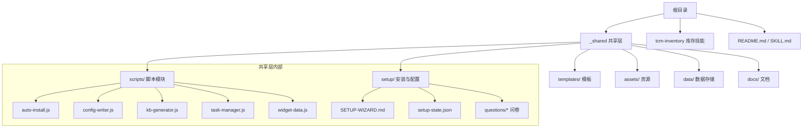
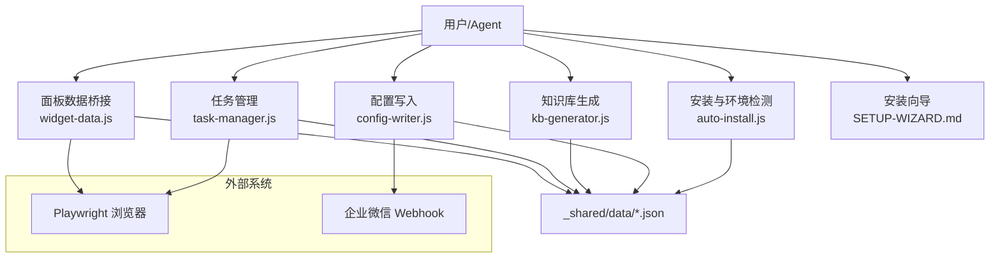
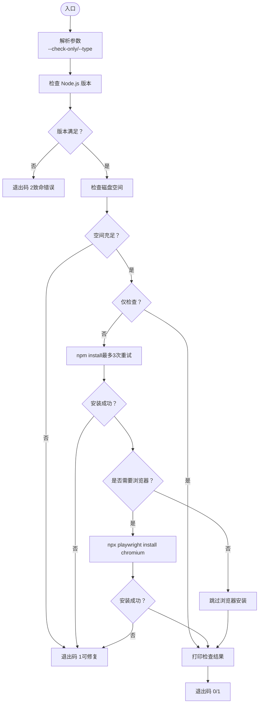
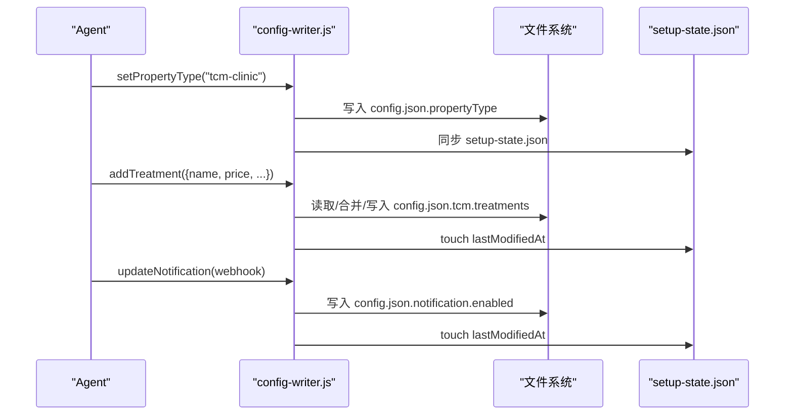
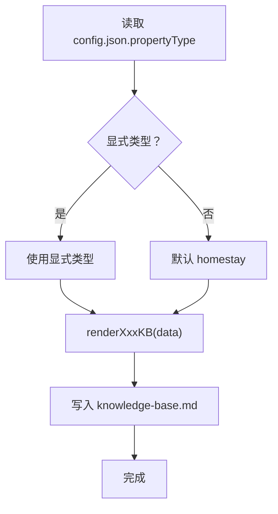
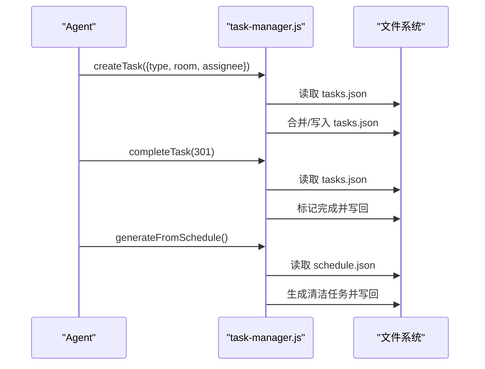
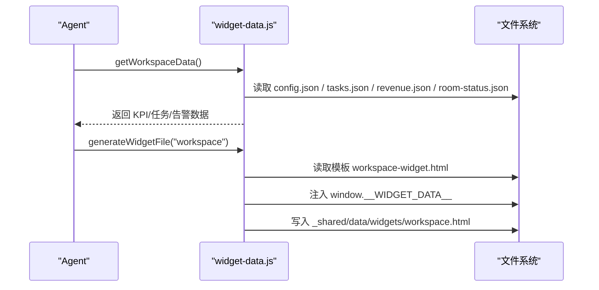
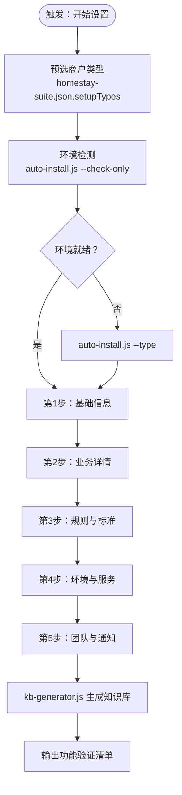
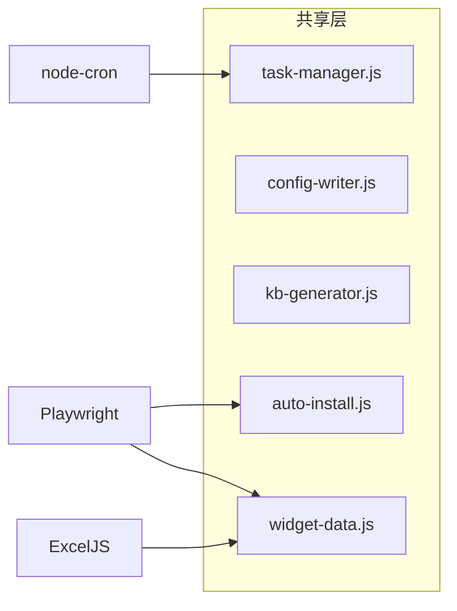

# 核心架构

<cite>
**本文档引用的文件**
- [README.md](file://README.md)
- [SKILL.md](file://SKILL.md)
- [_shared/package.json](file://_shared/package.json)
- [_shared/setup/SETUP-WIZARD.md](file://_shared/setup/SETUP-WIZARD.md)
- [_shared/docs/USER-MANUAL.md](file://_shared/docs/USER-MANUAL.md)
- [_shared/setup/setup-state.json](file://_shared/setup/setup-state.json)
- [_shared/homestay-suite.json](file://_shared/homestay-suite.json)
- [_shared/setup/questions/_common/basic-info.json](file://_shared/setup/questions/_common/basic-info.json)
- [_shared/scripts/auto-install.js](file://_shared/scripts/auto-install.js)
- [_shared/setup/config-writer.js](file://_shared/setup/config-writer.js)
- [_shared/setup/kb-generator.js](file://_shared/setup/kb-generator.js)
- [_shared/scripts/task-manager.js](file://_shared/scripts/task-manager.js)
- [_shared/scripts/widget-data.js](file://_shared/scripts/widget-data.js)
</cite>

## 目录
1. [引言](#引言)
2. [项目结构](#项目结构)
3. [核心组件](#核心组件)
4. [架构总览](#架构总览)
5. [详细组件分析](#详细组件分析)
6. [依赖分析](#依赖分析)
7. [性能考量](#性能考量)
8. [故障排查指南](#故障排查指南)
9. [结论](#结论)
10. [附录](#附录)

## 引言
本文件面向开发者系统化梳理 Skills 3 套件的核心架构，聚焦分层架构与模块化设计，阐明共享层（_shared）的职责边界与子模块协作关系，解释目录结构的设计原则与功能定位，给出系统边界与组件关系图，说明可扩展性与未来集成方向，并提供技术选型与约束条件的背景说明。

## 项目结构
项目采用“共享层 + 多技能套件”的模块化组织方式：
- 共享层（_shared）：提供跨套件复用的安装、配置、知识库、任务与面板等通用能力。
- 技能套件：以具体业务场景命名（如 homestay-*），通过共享层能力实现各自功能。
- README 与 SKILL.md：对外说明使用方式与功能清单，驱动用户交互与安装流程。

图表来源
- [README.md](file://README.md)
- [SKILL.md](file://SKILL.md)
- [_shared/setup/SETUP-WIZARD.md](file://_shared/setup/SETUP-WIZARD.md)
- [_shared/setup/setup-state.json](file://_shared/setup/setup-state.json)
- [_shared/homestay-suite.json](file://_shared/homestay-suite.json)

章节来源
- [README.md](file://README.md)
- [SKILL.md](file://SKILL.md)

## 核心组件
- 共享层（_shared）
  - 安装与环境检测：auto-install.js
  - 配置写入与校验：config-writer.js
  - 知识库生成：kb-generator.js
  - 任务管理：task-manager.js
  - 面板数据桥接：widget-data.js
  - 安装向导与问卷：SETUP-WIZARD.md、setup-state.json、questions/*
- 技能套件（示例：tcm-inventory）
  - 业务脚本：inventory.js
  - 套件说明：SKILL.md

章节来源
- [_shared/scripts/auto-install.js](file://_shared/scripts/auto-install.js)
- [_shared/setup/config-writer.js](file://_shared/setup/config-writer.js)
- [_shared/setup/kb-generator.js](file://_shared/setup/kb-generator.js)
- [_shared/scripts/task-manager.js](file://_shared/scripts/task-manager.js)
- [_shared/scripts/widget-data.js](file://_shared/scripts/widget-data.js)
- [_shared/setup/SETUP-WIZARD.md](file://_shared/setup/SETUP-WIZARD.md)
- [_shared/setup/setup-state.json](file://_shared/setup/setup-state.json)
- [_shared/homestay-suite.json](file://_shared/homestay-suite.json)
- [_shared/setup/questions/_common/basic-info.json](file://_shared/setup/questions/_common/basic-info.json)

## 架构总览
Skills 3 采用“共享层 + 业务套件”的分层架构：
- 表现层：Agent 通过 SKILL.md 的触发词与行为定义与用户交互。
- 控制层：共享层脚本负责安装、配置、知识库生成、任务与面板数据桥接。
- 数据层：_shared/data 下的 JSON 文件作为轻量持久化存储。
- 外部集成：浏览器自动化（Playwright）用于竞品采集；企业微信 Webhook 用于通知。

图表来源
- [_shared/scripts/auto-install.js](file://_shared/scripts/auto-install.js)
- [_shared/setup/config-writer.js](file://_shared/setup/config-writer.js)
- [_shared/setup/kb-generator.js](file://_shared/setup/kb-generator.js)
- [_shared/scripts/task-manager.js](file://_shared/scripts/task-manager.js)
- [_shared/scripts/widget-data.js](file://_shared/scripts/widget-data.js)
- [_shared/setup/SETUP-WIZARD.md](file://_shared/setup/SETUP-WIZARD.md)

## 详细组件分析

### 安装与环境检测（auto-install.js）
- 职责：统一执行环境前置检查与依赖安装，按商户类型决定是否安装浏览器。
- 关键流程：Node 版本检查 → 磁盘空间检查 → npm install（重试）→ Playwright（按需）→ 结果汇总。
- 错误处理：致命错误（Node 版本不满足）直接终止；可修复问题（网络/权限/空间）输出修复建议。

图表来源
- [_shared/scripts/auto-install.js](file://_shared/scripts/auto-install.js)

章节来源
- [_shared/scripts/auto-install.js](file://_shared/scripts/auto-install.js)

### 配置写入与校验（config-writer.js）
- 职责：提供多商户类型（民宿/公寓/酒店/中医馆）的配置写入接口，统一“读取→合并→写入”模式，保证字段完整性与格式校验。
- 关键能力：setPropertyType/getPropertyType、addRoom/addUnit/addHotelRoom/addTreatment、addStaffMember/removeStaffMember、updateNotification、updateSetupStep 等。
- 数据一致性：维护 setup-state.json 的完成状态与时间戳，触达后自动更新。

图表来源
- [_shared/setup/config-writer.js](file://_shared/setup/config-writer.js)
- [_shared/setup/setup-state.json](file://_shared/setup/setup-state.json)

章节来源
- [_shared/setup/config-writer.js](file://_shared/setup/config-writer.js)
- [_shared/setup/setup-state.json](file://_shared/setup/setup-state.json)

### 知识库生成（kb-generator.js）
- 职责：将 Setup Wizard 采集的结构化数据渲染为各套件的知识库 Markdown 文件，供 RAG 使用。
- 多类型支持：民宿/公寓/酒店/中医馆，映射到不同输出路径。
- 输出：默认写入对应技能套件的 assets/knowledge-base.md。

图表来源
- [_shared/setup/kb-generator.js](file://_shared/setup/kb-generator.js)

章节来源
- [_shared/setup/kb-generator.js](file://_shared/setup/kb-generator.js)

### 任务管理（task-manager.js）
- 职责：任务生命周期管理（创建/开始/完成/批量完成），并支持从排班与订单自动生成任务。
- 数据来源：_shared/data/tasks.json、schedule.json、staff.json、orders.json。
- 联动：与通知、面板、工作流模块协同。

图表来源
- [_shared/scripts/task-manager.js](file://_shared/scripts/task-manager.js)

章节来源
- [_shared/scripts/task-manager.js](file://_shared/scripts/task-manager.js)

### 面板数据桥接（widget-data.js）
- 职责：从本地 JSON 数据组装为 Widget 所需的数据结构，并将数据注入 HTML 模板生成可独立打开的 .html 文件。
- 支持：工作台、任务看板、排班、报表。
- 依赖：_shared/data/*.json、模板文件、config.json。

图表来源
- [_shared/scripts/widget-data.js](file://_shared/scripts/widget-data.js)

章节来源
- [_shared/scripts/widget-data.js](file://_shared/scripts/widget-data.js)

### 安装向导与问卷（SETUP-WIZARD.md、setup-state.json、questions/*）
- 职责：引导用户完成商户类型选择、环境检测、5步信息采集、知识库生成与功能验证。
- 设计要点：断点续传、可中断可恢复、零技术术语、10分钟内完成。
- 问卷：按类型划分，支持动态匹配与白名单过滤。

图表来源
- [_shared/setup/SETUP-WIZARD.md](file://_shared/setup/SETUP-WIZARD.md)
- [_shared/setup/setup-state.json](file://_shared/setup/setup-state.json)
- [_shared/homestay-suite.json](file://_shared/homestay-suite.json)
- [_shared/setup/questions/_common/basic-info.json](file://_shared/setup/questions/_common/basic-info.json)

章节来源
- [_shared/setup/SETUP-WIZARD.md](file://_shared/setup/SETUP-WIZARD.md)
- [_shared/setup/setup-state.json](file://_shared/setup/setup-state.json)
- [_shared/homestay-suite.json](file://_shared/homestay-suite.json)
- [_shared/setup/questions/_common/basic-info.json](file://_shared/setup/questions/_common/basic-info.json)

## 依赖分析
- 内部依赖
  - auto-install.js 依赖 Node.js 与 npm，按需调用 Playwright。
  - config-writer.js 依赖 JSON 文件读写与 setup-state.json。
  - kb-generator.js 依赖 config.json 与目标技能套件的 assets 目录。
  - task-manager.js 依赖 _shared/data 下的多类 JSON。
  - widget-data.js 依赖模板与 _shared/data 下的 JSON。
- 外部依赖
  - ExcelJS：用于报表/数据导出（package.json）。
  - node-cron：用于定时任务调度（package.json）。
  - Playwright：用于浏览器自动化（package.json）。

图表来源
- [_shared/package.json](file://_shared/package.json)
- [_shared/scripts/auto-install.js](file://_shared/scripts/auto-install.js)
- [_shared/scripts/widget-data.js](file://_shared/scripts/widget-data.js)
- [_shared/scripts/task-manager.js](file://_shared/scripts/task-manager.js)
- [_shared/setup/kb-generator.js](file://_shared/setup/kb-generator.js)
- [_shared/setup/config-writer.js](file://_shared/setup/config-writer.js)

章节来源
- [_shared/package.json](file://_shared/package.json)

## 性能考量
- I/O 与并发
  - JSON 文件读写为同步操作，建议控制单次批量写入规模，避免频繁 I/O。
  - widget-data.js 与 task-manager.js 在生成面板与任务时可能涉及多次文件读取，建议在 Agent 层合并调用，减少重复 I/O。
- 依赖安装
  - auto-install.js 对 npm install 与 Playwright 安装设置了超时与重试，网络不稳定时建议离线缓存依赖或使用私有镜像。
- 数据规模
  - 随着任务与订单增长，JSON 文件体积增大，建议引入分片或轮转策略（如按日期拆分）。

## 故障排查指南
- 环境自检
  - 触发词：“检查环境”“状态检查”“帮我检查”“系统正常吗”
  - 执行：node _shared/scripts/check-env.js
  - 输出：依赖/配置/向导/知识库/通知/竞品采集器的检查结果与修复建议。
- 常见问题
  - Node.js 版本过低：升级至 18+。
  - 磁盘空间不足：清理后重试。
  - npm 安装失败：检查网络/权限/代理，重试或更换镜像。
  - Playwright 下载失败：手动执行 npx playwright install chromium。
- 建议
  - 使用 --check-only 先行检测，再执行完整安装。
  - 修改配置后及时运行知识库生成脚本，确保 Agent 能力一致。

章节来源
- [SKILL.md](file://SKILL.md)

## 结论
Skills 3 套件通过“共享层 + 业务套件”的分层与模块化设计，实现了安装、配置、知识库、任务与面板的标准化与可复用。共享层以脚本化的方式统一了环境治理、数据写入与可视化输出，降低了业务套件的耦合度与学习成本。未来可在以下方面演进：
- 引入数据库替代 JSON 文件，提升大规模数据与并发场景下的稳定性。
- 将面板模板抽象为可插拔组件，增强主题与交互定制能力。
- 扩展 OTA 读写器与同步器，完善商家后台集成。
- 增强审计与日志能力，满足合规与追踪需求。

## 附录

### 目录结构设计原则
- 共享层集中复用：将安装、配置、知识库、任务、面板等通用能力收敛至 _shared，避免重复实现。
- 按类型隔离：不同商户类型的数据结构与知识库模板分离，通过配置与生成器解耦。
- 轻量化存储：以 JSON 文件作为默认持久化介质，降低部署复杂度。
- 模板化输出：面板以 HTML 模板注入数据生成，便于独立打开与分享。

### 系统边界与集成点
- 边界
  - 用户交互边界：Agent 通过 SKILL.md 的触发词与行为定义进行交互。
  - 数据边界：_shared/data 为共享数据域，各套件仅读写自身所需数据。
- 集成点
  - 浏览器自动化：竞品采集依赖 Playwright。
  - 通知系统：企业微信 Webhook。
  - 外部平台：OTA 平台（待激活）。

### 技术选型与约束
- Node.js 18+：确保现代语法与生态兼容。
- Playwright：跨平台浏览器自动化，满足竞品采集与 UI 交互。
- ExcelJS：报表与导出能力。
- node-cron：定时任务调度。
- 约束
  - 配置变更必须通过 config-writer.js，避免直接编辑 JSON。
  - 通知推送需经用户确认后执行，保障操作安全。
  - 未完成安装向导时禁止回答客人问题，确保知识库完备。