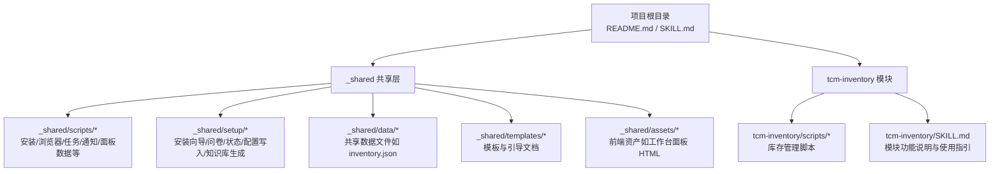
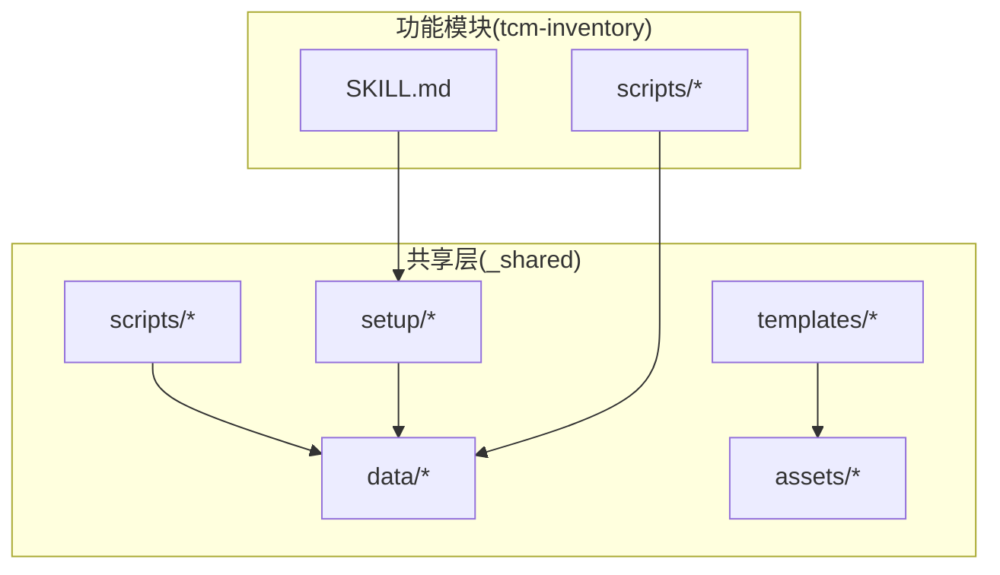
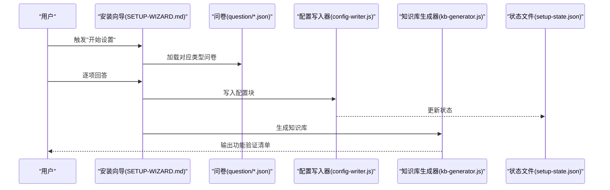
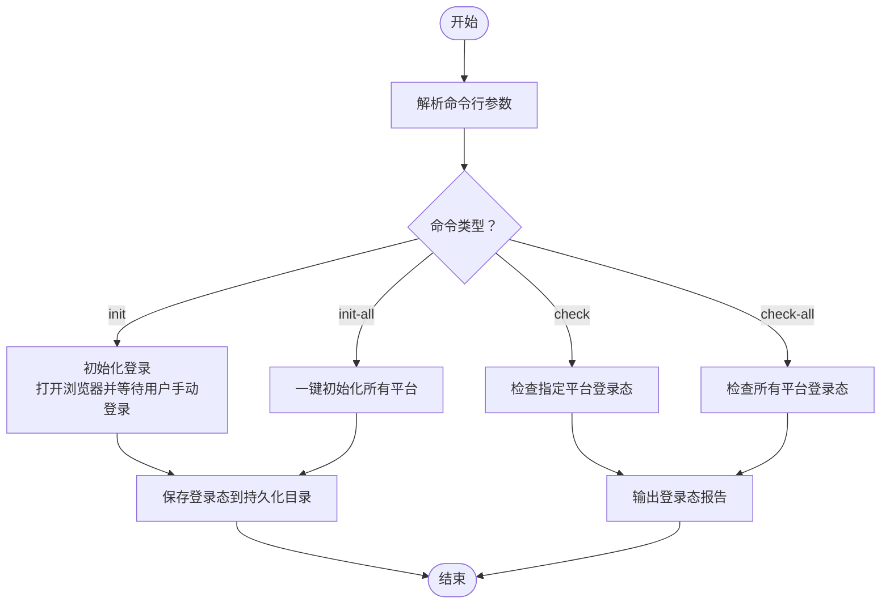
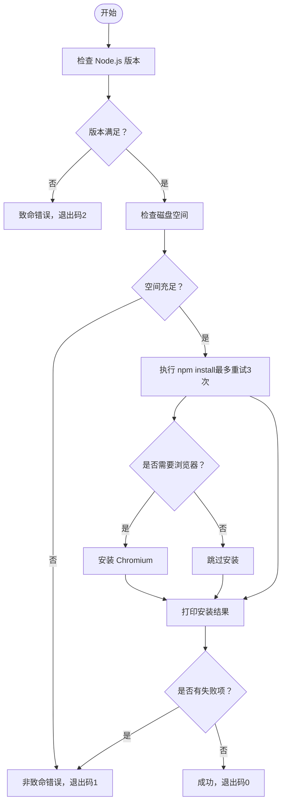
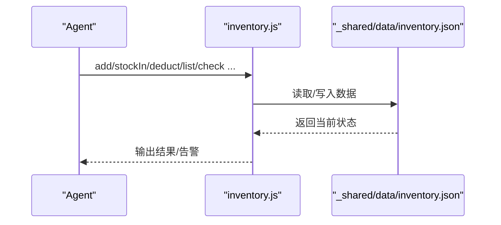
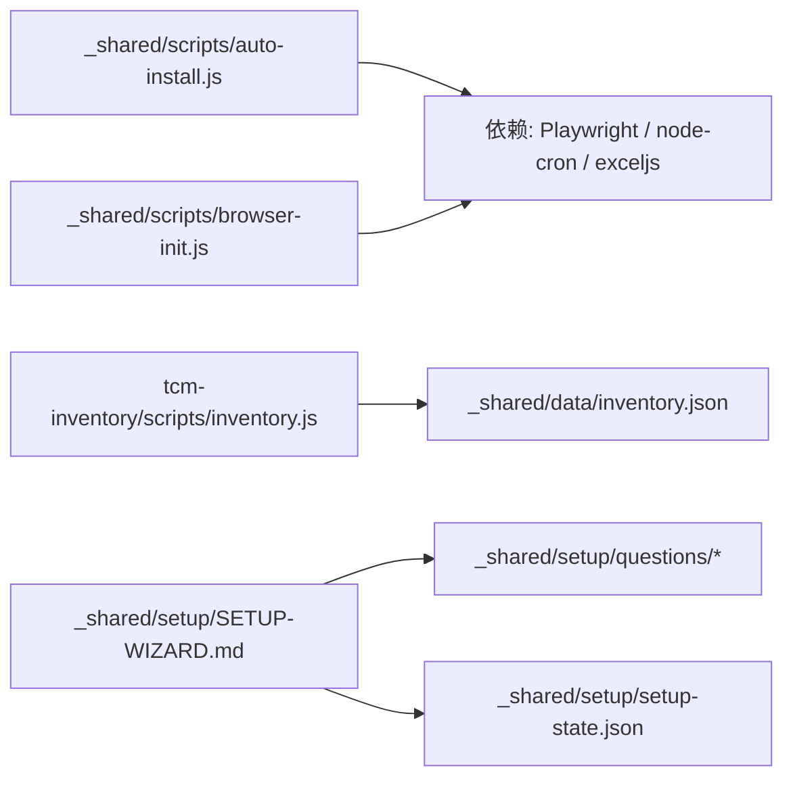
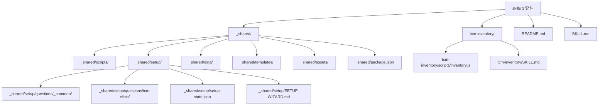

# 目录结构设计

<cite>
**本文档引用的文件**
- [README.md](file://README.md)
- [SKILL.md](file://SKILL.md)
- [_shared/package.json](file://_shared/package.json)
- [_shared/setup/SETUP-WIZARD.md](file://_shared/setup/SETUP-WIZARD.md)
- [_shared/setup/questions/_common/basic-info.json](file://_shared/setup/questions/_common/basic-info.json)
- [_shared/setup/questions/tcm-clinic/services.json](file://_shared/setup/questions/tcm-clinic/services.json)
- [_shared/scripts/auto-install.js](file://_shared/scripts/auto-install.js)
- [_shared/scripts/browser-init.js](file://_shared/scripts/browser-init.js)
- [tcm-inventory/SKILL.md](file://tcm-inventory/SKILL.md)
- [tcm-inventory/scripts/inventory.js](file://tcm-inventory/scripts/inventory.js)
- [_shared/setup/setup-state.json](file://_shared/setup/setup-state.json)
- [_shared/homestay-suite.json](file://_shared/homestay-suite.json)
- [_shared/setup/questions/_common/notification.json](file://_shared/setup/questions/_common/notification.json)
- [_shared/setup/questions/tcm-clinic/contacts.json](file://_shared/setup/questions/tcm-clinic/contacts.json)
</cite>

## 目录

1. [简介](#简介)
2. [项目结构](#项目结构)
3. [核心组件](#核心组件)
4. [架构总览](#架构总览)
5. [详细组件分析](#详细组件分析)
6. [依赖关系分析](#依赖关系分析)
7. [性能考虑](#性能考虑)
8. [故障排查指南](#故障排查指南)
9. [结论](#结论)
10. [附录](#附录)

## 简介
本设计文档面向 Skills 3 套件的目录结构，聚焦于项目根目录与子目录的设计理念、功能定位与协作关系。其中，_shared 共享层作为核心基础能力沉淀区，承载安装向导、配置写入、知识库生成、任务与通知、浏览器登录态管理、面板数据生成等通用能力；tcm-inventory 模块作为独立功能单元，与共享层通过约定的数据文件与脚本接口进行解耦协作。文档同时给出命名规范、文件组织原则、访问权限控制建议，以及如何通过目录结构支撑模块化开发、代码复用与功能扩展。

## 项目结构
项目采用“共享层 + 功能模块”的分层组织方式：
- 根目录：放置顶层说明与技能元数据，指导安装与使用。
- _shared：共享层，包含 scripts、setup、data、templates、assets 等子目录，提供跨模块通用能力与配置。
- tcm-inventory：独立功能模块，提供中医馆进销存管理能力，与共享层通过约定的数据文件与脚本接口协作。

图表来源
- [README.md:1-5](file://README.md#L1-L5)
- [SKILL.md:1-379](file://SKILL.md#L1-L379)
- [_shared/package.json:1-20](file://_shared/package.json#L1-L20)
- [tcm-inventory/SKILL.md:1-210](file://tcm-inventory/SKILL.md#L1-L210)

章节来源
- [README.md:1-5](file://README.md#L1-L5)
- [SKILL.md:1-379](file://SKILL.md#L1-L379)

## 核心组件
- 共享层（_shared）
  - scripts：通用执行脚本集合，涵盖自动安装、浏览器登录态初始化、任务管理、通知推送、面板数据生成等。
  - setup：安装向导与问卷体系，包含状态文件、配置写入器、知识库生成器与引导文档。
  - data：共享数据文件存放区，供模块间共享与持久化。
  - templates/assets/docs：模板与静态资源，支撑 UI 面板与用户手册。
- 功能模块（tcm-inventory）
  - scripts：独立的库存管理脚本，与共享层约定数据文件位置进行读写。
  - SKILL.md：模块功能说明、触发词、使用方式与数据结构定义。

章节来源
- [_shared/package.json:1-20](file://_shared/package.json#L1-L20)
- [tcm-inventory/SKILL.md:1-210](file://tcm-inventory/SKILL.md#L1-L210)

## 架构总览
共享层以“可插拔”为目标，通过统一的脚本接口与数据文件约定，为各功能模块提供一致的能力入口。tcm-inventory 作为独立模块，遵循共享层的数据文件命名与结构约定，实现与 Agent 的解耦集成。

图表来源
- [_shared/package.json:1-20](file://_shared/package.json#L1-L20)
- [tcm-inventory/SKILL.md:1-210](file://tcm-inventory/SKILL.md#L1-L210)

## 详细组件分析

### 共享层目录与职责
- scripts
  - auto-install.js：环境前置检查与依赖安装，按商户类型决定是否安装浏览器依赖。
  - browser-init.js：基于 Playwright 的浏览器登录态初始化与检查，支持多平台多类型。
  - 其他脚本：任务管理、通知推送、面板数据生成等。
- setup
  - SETUP-WIZARD.md：安装向导的完整交互流程与状态管理。
  - questions：按商户类型划分的问卷定义，驱动配置写入与知识库生成。
  - setup-state.json：安装向导的状态持久化文件。
  - config-writer.js / kb-generator.js：配置写入与知识库生成工具。
- data
  - 共享数据文件存放区，模块间通过约定文件进行数据交换。
- templates/assets/docs
  - 模板与静态资源，支撑工作台面板等可视化输出。

章节来源
- [_shared/scripts/auto-install.js:1-230](file://_shared/scripts/auto-install.js#L1-L230)
- [_shared/scripts/browser-init.js:1-392](file://_shared/scripts/browser-init.js#L1-L392)
- [_shared/setup/SETUP-WIZARD.md:1-631](file://_shared/setup/SETUP-WIZARD.md#L1-L631)
- [_shared/setup/setup-state.json:1-17](file://_shared/setup/setup-state.json#L1-L17)

### tcm-inventory 模块
- 独立性
  - 模块具备独立的 SKILL.md 与脚本目录，可单独部署与使用。
  - 与共享层通过约定的数据文件（如 inventory.json）进行数据交换，避免强耦合。
- 与共享层的关系
  - 依赖共享层的安装与环境检查能力（如自动安装脚本）。
  - 通过共享层的知识库生成与配置写入能力，参与整体配置闭环。
- 数据文件组织
  - 模块脚本明确指向共享层 data 目录下的 inventory.json，确保数据集中管理与版本隔离。

章节来源
- [tcm-inventory/SKILL.md:1-210](file://tcm-inventory/SKILL.md#L1-L210)
- [tcm-inventory/scripts/inventory.js:1-178](file://tcm-inventory/scripts/inventory.js#L1-L178)

### 安装向导与配置写入
安装向导通过 questions 下的问卷定义，结合 config-writer 与 kb-generator，将用户输入转化为结构化配置与知识库文件，并维护 setup-state.json 的状态流转。

图表来源
- [_shared/setup/SETUP-WIZARD.md:1-631](file://_shared/setup/SETUP-WIZARD.md#L1-L631)
- [_shared/setup/questions/_common/basic-info.json:1-10](file://_shared/setup/questions/_common/basic-info.json#L1-L10)
- [_shared/setup/questions/tcm-clinic/services.json:1-8](file://_shared/setup/questions/tcm-clinic/services.json#L1-L8)
- [_shared/setup/setup-state.json:1-17](file://_shared/setup/setup-state.json#L1-L17)

章节来源
- [_shared/setup/SETUP-WIZARD.md:1-631](file://_shared/setup/SETUP-WIZARD.md#L1-L631)
- [_shared/setup/questions/_common/basic-info.json:1-10](file://_shared/setup/questions/_common/basic-info.json#L1-L10)
- [_shared/setup/questions/tcm-clinic/services.json:1-8](file://_shared/setup/questions/tcm-clinic/services.json#L1-L8)
- [_shared/setup/setup-state.json:1-17](file://_shared/setup/setup-state.json#L1-L17)

### 浏览器登录态管理
browser-init.js 通过 Playwright Persistent Context 保存各平台登录态，支持初始化与检查，减少重复登录成本。

图表来源
- [_shared/scripts/browser-init.js:1-392](file://_shared/scripts/browser-init.js#L1-L392)

章节来源
- [_shared/scripts/browser-init.js:1-392](file://_shared/scripts/browser-init.js#L1-L392)

### 自动安装与环境检查
auto-install.js 负责前置环境检查与依赖安装，支持按商户类型决定是否安装浏览器依赖，并提供重试与诊断提示。

图表来源
- [_shared/scripts/auto-install.js:1-230](file://_shared/scripts/auto-install.js#L1-L230)

章节来源
- [_shared/scripts/auto-install.js:1-230](file://_shared/scripts/auto-install.js#L1-L230)

### tcm-inventory 数据文件与脚本接口
tcm-inventory 通过 inventory.js 与共享层 data 目录下的 inventory.json 进行数据交换，提供新增产品、入库、出库扣减、查询、低库存与临期检查等能力。

图表来源
- [tcm-inventory/scripts/inventory.js:1-178](file://tcm-inventory/scripts/inventory.js#L1-L178)
- [tcm-inventory/SKILL.md:176-203](file://tcm-inventory/SKILL.md#L176-L203)

章节来源
- [tcm-inventory/scripts/inventory.js:1-178](file://tcm-inventory/scripts/inventory.js#L1-L178)
- [tcm-inventory/SKILL.md:1-210](file://tcm-inventory/SKILL.md#L1-L210)

## 依赖关系分析
- 模块内聚与解耦
  - tcm-inventory 通过固定数据文件路径与脚本接口与共享层解耦，便于独立演进与替换。
- 外部依赖
  - 共享层依赖 Playwright、node-cron、exceljs 等库，用于浏览器自动化与定时任务。
- 环境与权限
  - 安装脚本对磁盘空间与 Node 版本进行前置检查，安装过程涉及 npm 与浏览器依赖安装，需相应权限与网络环境。

图表来源
- [_shared/package.json:1-20](file://_shared/package.json#L1-L20)
- [_shared/scripts/auto-install.js:1-230](file://_shared/scripts/auto-install.js#L1-L230)
- [_shared/scripts/browser-init.js:1-392](file://_shared/scripts/browser-init.js#L1-L392)
- [tcm-inventory/scripts/inventory.js:1-178](file://tcm-inventory/scripts/inventory.js#L1-L178)
- [_shared/setup/SETUP-WIZARD.md:1-631](file://_shared/setup/SETUP-WIZARD.md#L1-L631)
- [_shared/setup/setup-state.json:1-17](file://_shared/setup/setup-state.json#L1-L17)

章节来源
- [_shared/package.json:1-20](file://_shared/package.json#L1-L20)
- [_shared/scripts/auto-install.js:1-230](file://_shared/scripts/auto-install.js#L1-L230)
- [_shared/scripts/browser-init.js:1-392](file://_shared/scripts/browser-init.js#L1-L392)
- [tcm-inventory/scripts/inventory.js:1-178](file://tcm-inventory/scripts/inventory.js#L1-L178)
- [_shared/setup/SETUP-WIZARD.md:1-631](file://_shared/setup/SETUP-WIZARD.md#L1-L631)
- [_shared/setup/setup-state.json:1-17](file://_shared/setup/setup-state.json#L1-L17)

## 性能考虑
- 安装阶段
  - npm install 与浏览器依赖安装可能受网络与磁盘影响，脚本内置重试与超时控制，建议在稳定网络环境下执行。
- 数据读写
  - inventory.json 读写频率较低，建议在批量操作时合并写入，减少频繁 IO。
- 浏览器自动化
  - 登录态持久化避免重复登录，检查与初始化时尽量使用无头模式以降低资源占用。

## 故障排查指南
- 环境检查
  - 使用环境自检脚本输出依赖、配置、向导、知识库、通知、竞品采集器等六项检查结果，按提示修复。
- 安装失败
  - 检查 Node 版本与磁盘空间，关注权限与网络相关提示，按建议重试或调整。
- 登录态失效
  - 使用 browser-init.js 的检查与初始化功能，重新建立登录态。

章节来源
- [SKILL.md:341-351](file://SKILL.md#L341-L351)
- [_shared/scripts/auto-install.js:163-181](file://_shared/scripts/auto-install.js#L163-L181)
- [_shared/scripts/browser-init.js:226-287](file://_shared/scripts/browser-init.js#L226-L287)

## 结论
本目录结构通过“共享层 + 功能模块”的分层设计，实现了能力复用与模块解耦。_shared 作为共享层，沉淀通用能力与配置；tcm-inventory 作为独立模块，遵循约定进行数据交换与功能集成。配合安装向导与环境检查机制，整体具备良好的可维护性与扩展性。

## 附录

### 目录命名规范与文件组织原则
- 目录命名
  - 共享层：_shared
  - 功能模块：按业务域命名（如 tcm-inventory）
- 文件组织
  - 脚本：scripts/*，按功能拆分，CLI 入口清晰
  - 配置与状态：setup/*，包含问卷、状态文件、配置写入器、知识库生成器
  - 数据：data/*，集中存放共享数据文件
  - 模板与资产：templates/*、assets/*，用于前端输出与静态资源
- 访问权限控制
  - 安装与浏览器初始化需管理员权限与网络访问
  - 数据文件读写需确保进程具备相应权限

### 目录树结构图

图表来源
- [README.md:1-5](file://README.md#L1-L5)
- [SKILL.md:1-379](file://SKILL.md#L1-L379)
- [_shared/package.json:1-20](file://_shared/package.json#L1-L20)
- [_shared/setup/SETUP-WIZARD.md:1-631](file://_shared/setup/SETUP-WIZARD.md#L1-L631)
- [_shared/setup/questions/_common/basic-info.json:1-10](file://_shared/setup/questions/_common/basic-info.json#L1-L10)
- [_shared/setup/questions/tcm-clinic/services.json:1-8](file://_shared/setup/questions/tcm-clinic/services.json#L1-L8)
- [_shared/setup/setup-state.json:1-17](file://_shared/setup/setup-state.json#L1-L17)
- [tcm-inventory/SKILL.md:1-210](file://tcm-inventory/SKILL.md#L1-L210)
- [tcm-inventory/scripts/inventory.js:1-178](file://tcm-inventory/scripts/inventory.js#L1-L178)