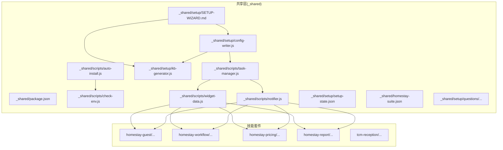
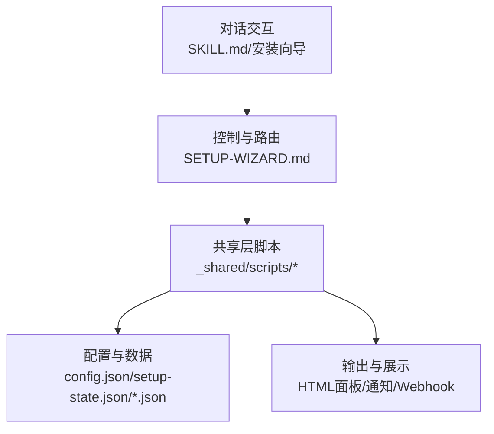
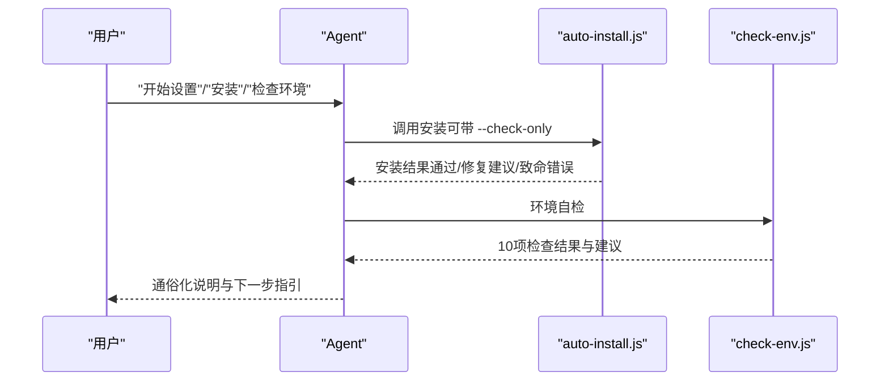
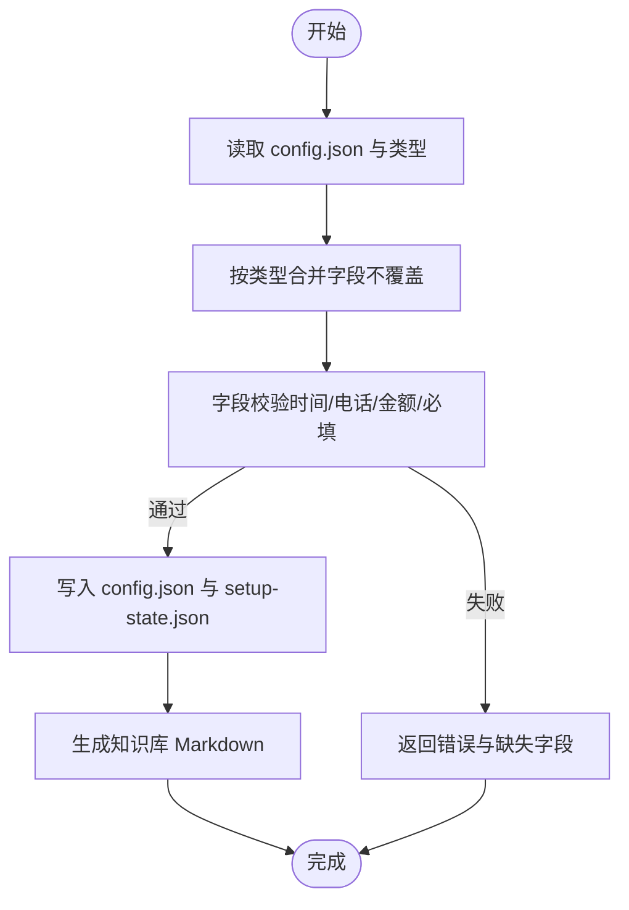
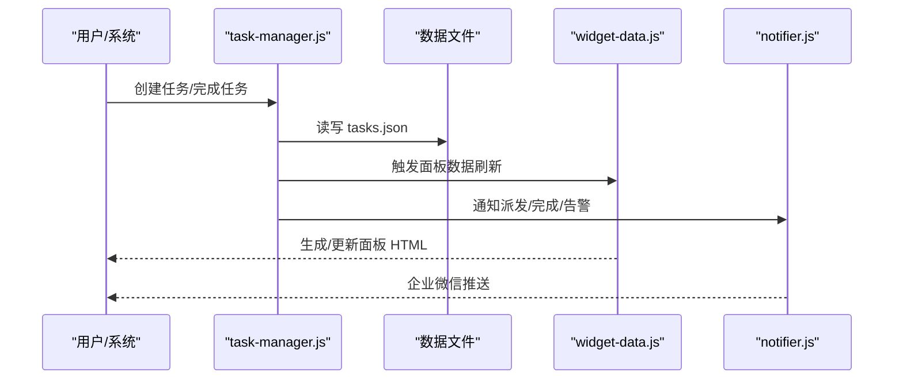
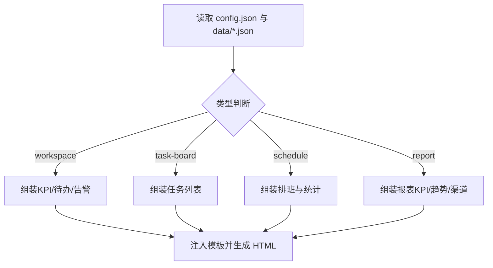
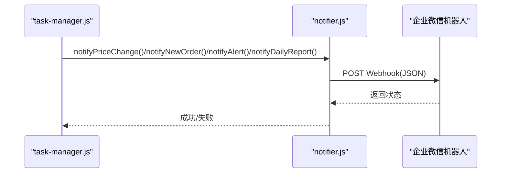
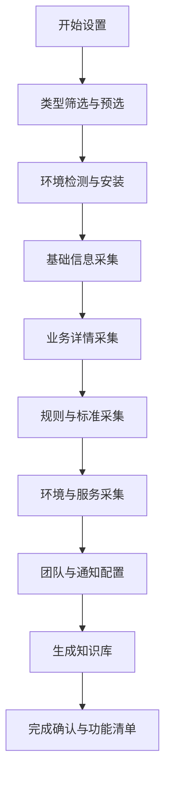
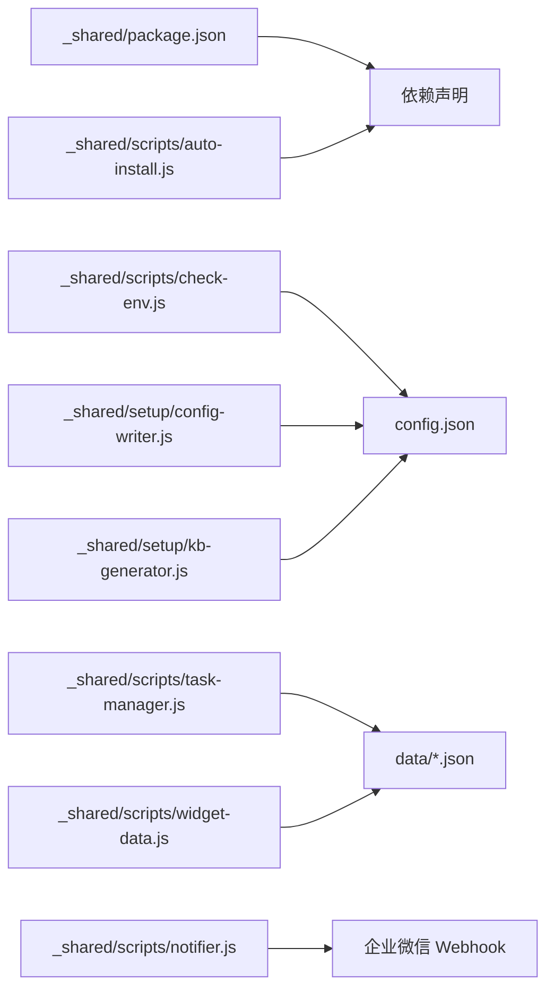

# 系统设计模式

<cite>
**本文档引用的文件**
- [README.md](file://README.md)
- [SKILL.md](file://SKILL.md)
- [_shared/package.json](file://_shared/package.json)
- [_shared/setup/SETUP-WIZARD.md](file://_shared/setup/SETUP-WIZARD.md)
- [_shared/docs/USER-MANUAL.md](file://_shared/docs/USER-MANUAL.md)
- [_shared/setup/config-writer.js](file://_shared/setup/config-writer.js)
- [_shared/setup/kb-generator.js](file://_shared/setup/kb-generator.js)
- [_shared/scripts/task-manager.js](file://_shared/scripts/task-manager.js)
- [_shared/scripts/widget-data.js](file://_shared/scripts/widget-data.js)
- [_shared/scripts/notifier.js](file://_shared/scripts/notifier.js)
- [_shared/scripts/auto-install.js](file://_shared/scripts/auto-install.js)
- [_shared/scripts/check-env.js](file://_shared/scripts/check-env.js)
- [_shared/setup/setup-state.json](file://_shared/setup/setup-state.json)
- [_shared/homestay-suite.json](file://_shared/homestay-suite.json)
- [_shared/setup/questions/_common/basic-info.json](file://_shared/setup/questions/_common/basic-info.json)
- [_shared/setup/questions/tcm-clinic/services.json](file://_shared/setup/questions/tcm-clinic/services.json)
</cite>

## 目录
1. [引言](#引言)
2. [项目结构](#项目结构)
3. [核心组件](#核心组件)
4. [架构总览](#架构总览)
5. [详细组件分析](#详细组件分析)
6. [依赖关系分析](#依赖关系分析)
7. [性能考虑](#性能考虑)
8. [故障排查指南](#故障排查指南)
9. [结论](#结论)
10. [附录](#附录)

## 引言
本文件面向 Skills 3 套件，系统化梳理其架构设计模式与实现要点，聚焦分层架构、模块化设计与脚本驱动模式，阐明共享层复用、功能模块独立、配置驱动、事件驱动等核心设计原则，并给出架构图表与组件交互示例，帮助读者快速理解与高效扩展。

## 项目结构
项目采用“共享层 + 多技能套件”的模块化组织方式：
- 共享层（_shared）：提供跨套件的通用能力（安装、配置、知识库、任务、面板、通知、环境检测等）
- 技能套件：以具体业务域命名（如 homestay-guest、homestay-workflow 等），复用共享层能力
- 文档与触发词：通过 SKILL.md 与 SETUP-WIZARD.md 定义对话行为与安装流程

**图表来源**
- [_shared/package.json:1-20](file://_shared/package.json#L1-L20)
- [_shared/scripts/auto-install.js:1-230](file://_shared/scripts/auto-install.js#L1-L230)
- [_shared/scripts/check-env.js:1-464](file://_shared/scripts/check-env.js#L1-L464)
- [_shared/setup/config-writer.js:1-603](file://_shared/setup/config-writer.js#L1-L603)
- [_shared/setup/kb-generator.js:1-573](file://_shared/setup/kb-generator.js#L1-L573)
- [_shared/scripts/task-manager.js:1-399](file://_shared/scripts/task-manager.js#L1-L399)
- [_shared/scripts/widget-data.js:1-278](file://_shared/scripts/widget-data.js#L1-L278)
- [_shared/scripts/notifier.js:1-274](file://_shared/scripts/notifier.js#L1-L274)
- [_shared/setup/SETUP-WIZARD.md:1-631](file://_shared/setup/SETUP-WIZARD.md#L1-L631)

**章节来源**
- [README.md:1-5](file://README.md#L1-L5)
- [SKILL.md:1-379](file://SKILL.md#L1-L379)

## 核心组件
- 安装与环境管理：auto-install.js、check-env.js
- 配置与知识库：config-writer.js、kb-generator.js
- 任务与工作流：task-manager.js
- 面板与数据桥接：widget-data.js
- 通知与集成：notifier.js
- 安装向导与问卷：SETUP-WIZARD.md、questions/*.json
- 套件元信息：homestay-suite.json、setup-state.json

**章节来源**
- [_shared/scripts/auto-install.js:1-230](file://_shared/scripts/auto-install.js#L1-L230)
- [_shared/scripts/check-env.js:1-464](file://_shared/scripts/check-env.js#L1-L464)
- [_shared/setup/config-writer.js:1-603](file://_shared/setup/config-writer.js#L1-L603)
- [_shared/setup/kb-generator.js:1-573](file://_shared/setup/kb-generator.js#L1-L573)
- [_shared/scripts/task-manager.js:1-399](file://_shared/scripts/task-manager.js#L1-L399)
- [_shared/scripts/widget-data.js:1-278](file://_shared/scripts/widget-data.js#L1-L278)
- [_shared/scripts/notifier.js:1-274](file://_shared/scripts/notifier.js#L1-L274)
- [_shared/setup/SETUP-WIZARD.md:1-631](file://_shared/setup/SETUP-WIZARD.md#L1-L631)
- [_shared/homestay-suite.json:1-7](file://_shared/homestay-suite.json#L1-L7)
- [_shared/setup/setup-state.json:1-17](file://_shared/setup/setup-state.json#L1-L17)

## 架构总览
Skills 3 采用“共享层 + 脚本驱动 + 配置驱动”的分层架构：
- 表现层（对话交互）：由各技能套件的 SKILL.md 与安装向导定义触发词与行为
- 业务层（功能逻辑）：共享层脚本封装业务能力（配置、任务、面板、通知）
- 数据层（配置存储）：JSON 文件作为主要持久化介质（config.json、setup-state.json、各业务数据）

**图表来源**
- [SKILL.md:1-379](file://SKILL.md#L1-L379)
- [_shared/setup/SETUP-WIZARD.md:1-631](file://_shared/setup/SETUP-WIZARD.md#L1-L631)
- [_shared/scripts/widget-data.js:1-278](file://_shared/scripts/widget-data.js#L1-L278)
- [_shared/scripts/notifier.js:1-274](file://_shared/scripts/notifier.js#L1-L274)

## 详细组件分析

### 安装与环境管理（脚本驱动）
- auto-install.js：统一执行环境检测、依赖安装、浏览器安装（按需），输出结构化结果
- check-env.js：10项检查（基础环境/配置状态/功能组件/数据健康），按类型调整“必要/推荐/可选”权重

**图表来源**
- [_shared/scripts/auto-install.js:1-230](file://_shared/scripts/auto-install.js#L1-L230)
- [_shared/scripts/check-env.js:1-464](file://_shared/scripts/check-env.js#L1-L464)

**章节来源**
- [_shared/scripts/auto-install.js:1-230](file://_shared/scripts/auto-install.js#L1-L230)
- [_shared/scripts/check-env.js:1-464](file://_shared/scripts/check-env.js#L1-L464)

### 配置与知识库（配置驱动）
- config-writer.js：统一写入接口，按类型聚合字段，保证不覆盖其他字段；提供验证与状态更新
- kb-generator.js：根据类型与结构化数据生成知识库 Markdown，供 RAG 使用

**图表来源**
- [_shared/setup/config-writer.js:1-603](file://_shared/setup/config-writer.js#L1-L603)
- [_shared/setup/kb-generator.js:1-573](file://_shared/setup/kb-generator.js#L1-L573)

**章节来源**
- [_shared/setup/config-writer.js:1-603](file://_shared/setup/config-writer.js#L1-L603)
- [_shared/setup/kb-generator.js:1-573](file://_shared/setup/kb-generator.js#L1-L573)

### 任务与工作流（事件驱动）
- task-manager.js：任务生命周期（创建/开始/完成/批量完成），支持从排班与订单自动生成任务，事件驱动联动通知与面板

**图表来源**
- [_shared/scripts/task-manager.js:1-399](file://_shared/scripts/task-manager.js#L1-L399)
- [_shared/scripts/widget-data.js:1-278](file://_shared/scripts/widget-data.js#L1-L278)
- [_shared/scripts/notifier.js:1-274](file://_shared/scripts/notifier.js#L1-L274)

**章节来源**
- [_shared/scripts/task-manager.js:1-399](file://_shared/scripts/task-manager.js#L1-L399)

### 面板与数据桥接（数据驱动）
- widget-data.js：从数据文件组装面板所需数据，注入 HTML 模板生成可独立打开的 .html 文件

**图表来源**
- [_shared/scripts/widget-data.js:1-278](file://_shared/scripts/widget-data.js#L1-L278)

**章节来源**
- [_shared/scripts/widget-data.js:1-278](file://_shared/scripts/widget-data.js#L1-L278)

### 通知与集成（事件驱动）
- notifier.js：通过企业微信 Webhook 推送文本/Markdown 消息，支持调价/新订单/告警/日报等事件模板

**图表来源**
- [_shared/scripts/notifier.js:1-274](file://_shared/scripts/notifier.js#L1-L274)

**章节来源**
- [_shared/scripts/notifier.js:1-274](file://_shared/scripts/notifier.js#L1-L274)

### 安装向导与问卷（脚本驱动 + 配置驱动）
- SETUP-WIZARD.md：定义安装流程、断点续传、数据修正、功能清单动态查询
- questions/*.json：按类型定义采集字段与适用范围
- config-writer.js 与 kb-generator.js：承接向导采集，写入配置并生成知识库

**图表来源**
- [_shared/setup/SETUP-WIZARD.md:1-631](file://_shared/setup/SETUP-WIZARD.md#L1-L631)
- [_shared/setup/questions/_common/basic-info.json:1-10](file://_shared/setup/questions/_common/basic-info.json#L1-L10)
- [_shared/setup/questions/tcm-clinic/services.json:1-8](file://_shared/setup/questions/tcm-clinic/services.json#L1-L8)
- [_shared/setup/config-writer.js:1-603](file://_shared/setup/config-writer.js#L1-L603)
- [_shared/setup/kb-generator.js:1-573](file://_shared/setup/kb-generator.js#L1-L573)

**章节来源**
- [_shared/setup/SETUP-WIZARD.md:1-631](file://_shared/setup/SETUP-WIZARD.md#L1-L631)
- [_shared/homestay-suite.json:1-7](file://_shared/homestay-suite.json#L1-L7)
- [_shared/setup/setup-state.json:1-17](file://_shared/setup/setup-state.json#L1-L17)

## 依赖关系分析
- 语言与工具：Node.js（版本要求）、npm 依赖（exceljs、node-cron、playwright）
- 运行时依赖：按需安装（民宿/酒店需要浏览器，公寓/中医馆可选）
- 脚本耦合：安装脚本与环境自检脚本相互配合；配置写入器与知识库生成器形成闭环；任务管理器驱动面板与通知

**图表来源**
- [_shared/package.json:1-20](file://_shared/package.json#L1-L20)
- [_shared/scripts/auto-install.js:1-230](file://_shared/scripts/auto-install.js#L1-L230)
- [_shared/scripts/check-env.js:1-464](file://_shared/scripts/check-env.js#L1-L464)
- [_shared/setup/config-writer.js:1-603](file://_shared/setup/config-writer.js#L1-L603)
- [_shared/setup/kb-generator.js:1-573](file://_shared/setup/kb-generator.js#L1-L573)
- [_shared/scripts/task-manager.js:1-399](file://_shared/scripts/task-manager.js#L1-L399)
- [_shared/scripts/widget-data.js:1-278](file://_shared/scripts/widget-data.js#L1-L278)
- [_shared/scripts/notifier.js:1-274](file://_shared/scripts/notifier.js#L1-L274)

**章节来源**
- [_shared/package.json:1-20](file://_shared/package.json#L1-L20)

## 性能考虑
- I/O 与并发：JSON 文件读写为主，避免高并发写冲突；建议在任务管理器中串行关键写操作或引入锁机制
- 网络请求：通知与浏览器相关功能采用异步请求，需设置合理超时与重试
- 模板渲染：面板 HTML 生成为一次性 I/O，建议缓存常用数据片段
- 可维护性：通过配置驱动与脚本驱动降低耦合，便于按需扩展新功能模块

## 故障排查指南
- 环境问题：使用 check-env.js 获取 10 项检查结果，按提示修复（依赖安装、磁盘空间、知识库、通知、竞品采集器、数据文件、网络连通）
- 安装失败：auto-install.js 提供重试与按需浏览器安装，关注错误码与网络/DNS
- 配置错误：config-writer.js 返回字段校验失败与缺失项，按提示修正
- 通知失败：notifier.js 返回 Webhook 错误码，核对 URL 与权限

**章节来源**
- [_shared/scripts/check-env.js:1-464](file://_shared/scripts/check-env.js#L1-L464)
- [_shared/scripts/auto-install.js:1-230](file://_shared/scripts/auto-install.js#L1-L230)
- [_shared/setup/config-writer.js:1-603](file://_shared/setup/config-writer.js#L1-L603)
- [_shared/scripts/notifier.js:1-274](file://_shared/scripts/notifier.js#L1-L274)

## 结论
Skills 3 套件通过“共享层复用 + 脚本驱动 + 配置驱动 + 事件驱动”的设计，实现了跨业务域的统一能力沉淀与灵活扩展。分层清晰、模块独立、数据可追踪，既保证了易用性，也为后续接入更多平台与功能提供了良好基座。

## 附录
- 设计原则
  - 共享层复用：_shared 下的脚本与工具被多套件共享
  - 功能模块独立：任务、面板、通知、安装、环境检测各自职责明确
  - 配置驱动：所有业务配置集中于 JSON，便于迁移与备份
  - 事件驱动：任务完成触发通知与面板更新，形成闭环
- 架构决策权衡
  - 性能：以脚本与 JSON 为主，部署简单、启动快；高并发场景建议引入数据库与缓存
  - 可维护性：脚本化与配置化降低耦合，便于迭代；需完善单元测试与错误日志
  - 扩展性：新增套件只需复用共享层脚本与遵循配置约定，扩展成本低