# 组件交互关系

<cite>
**本文引用的文件**   
- [task-manager.js](file://_shared/scripts/task-manager.js)
- [notifier.js](file://_shared/scripts/notifier.js)
- [widget-data.js](file://_shared/scripts/widget-data.js)
- [config-writer.js](file://_shared/setup/config-writer.js)
- [browser-init.js](file://_shared/scripts/browser-init.js)
- [ota-operator.js](file://_shared/scripts/ota-operator.js)
- [ota-reader.js](file://_shared/scripts/ota-reader.js)
- [setup-state.json](file://_shared/setup/setup-state.json)
- [package.json](file://_shared/package.json)
- [SKILL.md](file://SKILL.md)
- [README.md](file://README.md)
- [inventory.js](file://tcm-inventory/scripts/inventory.js)
</cite>

## 目录
1. [简介](#简介)
2. [项目结构](#项目结构)
3. [核心组件](#核心组件)
4. [架构总览](#架构总览)
5. [详细组件分析](#详细组件分析)
6. [依赖关系分析](#依赖关系分析)
7. [性能考量](#性能考量)
8. [故障排查指南](#故障排查指南)
9. [结论](#结论)
10. [附录](#附录)

## 简介
本文件面向 Skills 3 套件，系统化梳理共享脚本模块与各功能模块之间的依赖关系与交互模式，重点覆盖以下方面：
- 共享脚本模块如何被调用：task-manager.js、notifier.js、widget-data.js 等核心组件职责与接口
- 配置文件在组件间的传递机制：config.json、setup-state.json 的数据流向与同步策略
- 数据存储层与业务逻辑层的分离设计：数据文件与脚本的边界划分
- 事件驱动与回调使用模式：异步通知、截图存证、日志记录等
- 典型业务场景的组件协作时序与数据流图，帮助读者快速理解组件交互

## 项目结构
Skills 3 套件采用“共享层 + 功能域”的分层组织方式：
- 共享层（_shared）：提供跨功能域的通用能力（任务管理、通知、面板数据桥接、OTA读写、浏览器登录态管理、配置写入、安装与环境检查等）
- 功能域（如 tcm-inventory）：针对特定业务场景（如中医馆进销存）提供专用脚本与数据文件

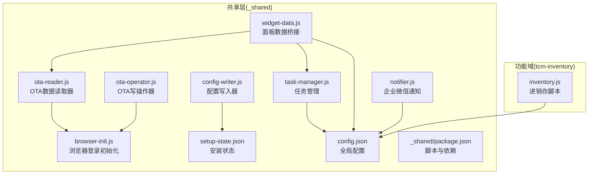

图表来源
- [_shared/scripts/task-manager.js:1-399](file://_shared/scripts/task-manager.js#L1-L399)
- [_shared/scripts/notifier.js:1-274](file://_shared/scripts/notifier.js#L1-L274)
- [_shared/scripts/widget-data.js:1-278](file://_shared/scripts/widget-data.js#L1-L278)
- [_shared/setup/config-writer.js:1-603](file://_shared/setup/config-writer.js#L1-L603)
- [_shared/scripts/browser-init.js:1-392](file://_shared/scripts/browser-init.js#L1-L392)
- [_shared/scripts/ota-reader.js:1-656](file://_shared/scripts/ota-reader.js#L1-L656)
- [_shared/scripts/ota-operator.js:1-778](file://_shared/scripts/ota-operator.js#L1-L778)
- [_shared/setup/setup-state.json:1-17](file://_shared/setup/setup-state.json#L1-L17)
- [_shared/package.json:1-20](file://_shared/package.json#L1-L20)
- [tcm-inventory/scripts/inventory.js:1-178](file://tcm-inventory/scripts/inventory.js#L1-L178)

章节来源
- [SKILL.md: 286–301:286-301](file://SKILL.md#L286-L301)
- [_shared/package.json: 1-L20:1-20](file://_shared/package.json#L1-L20)

## 核心组件
- 任务管理器（task-manager.js）
  - 职责：任务生命周期管理（创建/开始/完成/批量完成）、从排班/退房订单自动生成任务、演示数据注入、CLI入口
  - 数据存储：tasks.json、schedule.json、staff.json、orders.json
  - 交互：被 Agent/其他脚本调用；与 widget-data.js、ota-reader.js 等共享数据
- 通知器（notifier.js）
  - 职责：通过企业微信 Webhook 推送文本/Markdown 通知；支持价格变动、新订单、告警、日报摘要等模板
  - 配置来源：config.json.notification.wechatWork.webhookUrl
  - 交互：被业务流程（如任务完成、日终）触发
- 面板数据桥接器（widget-data.js）
  - 职责：从 data/*.json 组装工作台/任务看板/排班/报表数据；支持生成独立 HTML 文件
  - 依赖：config.json、data/*.json
  - 交互：被 Agent 调用以生成 Widget 数据或 HTML
- 配置写入器（config-writer.js）
  - 职责：零接触修改配置（民宿/公寓/酒店/中医馆），统一“读取→合并→写入”模式；维护 setup-state.json
  - 交互：被 Agent/Skill 调用以更新 propertyType、房型、员工、通知等
- 浏览器初始化器（browser-init.js）
  - 职责：Playwright 持久化上下文管理，初始化/检查各 OTA 平台登录态
  - 交互：为 ota-reader.js、ota-operator.js 提供登录态
- OTA 读取器（ota-reader.js）
  - 职责：采集订单/房态/营收/挂牌价；按平台合并存储；提供 daily/full 同步
  - 交互：依赖 browser-init.js 登录态；输出 data/*.json
- OTA 操作器（ota-operator.js）
  - 职责：改价/关房/开房写操作；截图存证；失败兜底指引；批量执行与节流
  - 交互：依赖 browser-init.js 登录态；读取 config.json.operationRules
- 安装与环境（auto-install.js、check-env.js、scripts 脚本）
  - 职责：自动安装依赖、环境检查、脚本快捷入口（package.json scripts）
  - 交互：被 Agent 内部调用或用户通过 package.json scripts 执行
- 进销存（tcm-inventory/inventory.js）
  - 职责：产品入库/出库/库存检查/临期预警；数据文件 inventory.json
  - 交互：独立于共享层，但可与共享层配置协同（如通过 config.json 控制阈值）

章节来源
- [_shared/scripts/task-manager.js: 1-L399:1-399](file://_shared/scripts/task-manager.js#L1-L399)
- [_shared/scripts/notifier.js: 1-L274:1-274](file://_shared/scripts/notifier.js#L1-L274)
- [_shared/scripts/widget-data.js: 1-L278:1-278](file://_shared/scripts/widget-data.js#L1-L278)
- [_shared/setup/config-writer.js: 1-L603:1-603](file://_shared/setup/config-writer.js#L1-L603)
- [_shared/scripts/browser-init.js: 1-L392:1-392](file://_shared/scripts/browser-init.js#L1-L392)
- [_shared/scripts/ota-reader.js: 1-L656:1-656](file://_shared/scripts/ota-reader.js#L1-L656)
- [_shared/scripts/ota-operator.js: 1-L778:1-778](file://_shared/scripts/ota-operator.js#L1-L778)
- [tcm-inventory/scripts/inventory.js: 1-L178:1-178](file://tcm-inventory/scripts/inventory.js#L1-L178)

## 架构总览
下图展示了组件间的主要依赖与数据流：

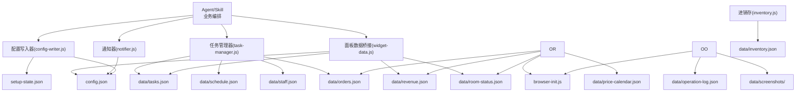

图表来源
- [_shared/scripts/task-manager.js:24-31](file://_shared/scripts/task-manager.js#L24-L31)
- [_shared/scripts/widget-data.js:32-53](file://_shared/scripts/widget-data.js#L32-L53)
- [_shared/scripts/notifier.js:23-31](file://_shared/scripts/notifier.js#L23-L31)
- [_shared/scripts/ota-reader.js:23-35](file://_shared/scripts/ota-reader.js#L23-L35)
- [_shared/scripts/ota-operator.js:18-26](file://_shared/scripts/ota-operator.js#L18-L26)
- [_shared/setup/config-writer.js:26-29](file://_shared/setup/config-writer.js#L26-L29)
- [tcm-inventory/scripts/inventory.js:17-26](file://tcm-inventory/scripts/inventory.js#L17-L26)

## 详细组件分析

### 任务管理器（task-manager.js）
- 数据结构与复杂度
  - 任务数组读写：O(n) 查找（按 id/房号/状态过滤），O(1) 写入（追加/更新）
  - 自动生成：遍历排班/订单，去重后创建任务，整体 O(n*m)，n 为分配数，m 为房间数
- 依赖与耦合
  - 依赖 data/*.json 文件；与 notifier.js、widget-data.js 通过数据文件间接耦合
- 错误处理
  - 未找到任务/无效参数时返回空或错误信息；演示数据注入失败时记录日志
- 性能影响
  - 大量任务时建议分页/分页过滤；批量完成使用单次写入减少 I/O

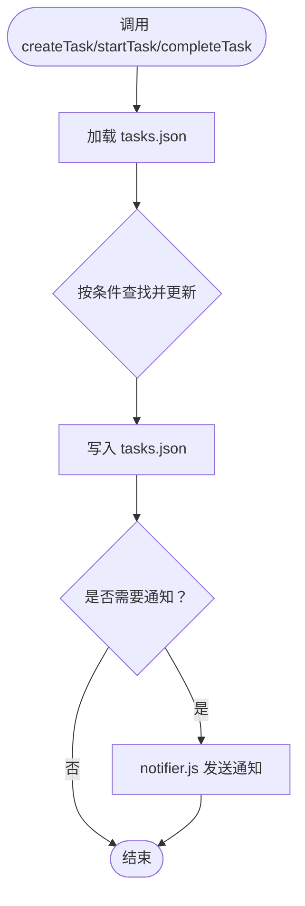

图表来源
- [_shared/scripts/task-manager.js: 64-L124:64-124](file://_shared/scripts/task-manager.js#L64-L124)
- [_shared/scripts/notifier.js: 108-L121:108-121](file://_shared/scripts/notifier.js#L108-L121)

章节来源
- [_shared/scripts/task-manager.js: 64-L177:64-177](file://_shared/scripts/task-manager.js#L64-L177)

### 通知器（notifier.js）
- 配置与自动启用
  - 从 config.json 读取 webhookUrl；若检测到 URL 存在而 enabled=false，则自动设为 true
- 通知模板
  - 文本/Markdown；支持价格变动、新订单、告警、日报摘要等
- 异步与错误处理
  - 通过 Promise 包装 HTTP 请求；解析响应体，区分 errcode 成功与失败
- 与任务管理器的协作
  - 任务状态变化时触发通知，实现事件驱动

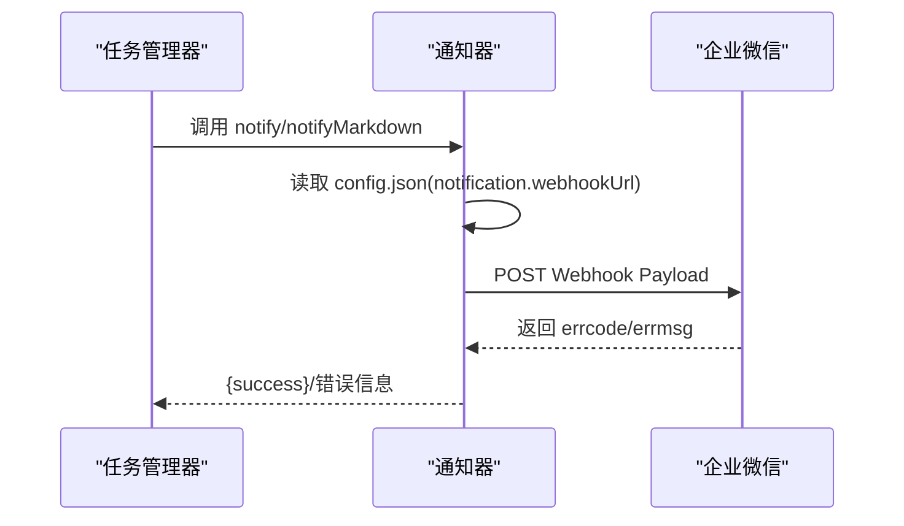

图表来源
- [_shared/scripts/notifier.js: 25-L53:25-53](file://_shared/scripts/notifier.js#L25-L53)
- [_shared/scripts/notifier.js: 108-L121:108-121](file://_shared/scripts/notifier.js#L108-L121)

章节来源
- [_shared/scripts/notifier.js: 25-L121:25-121](file://_shared/scripts/notifier.js#L25-L121)

### 面板数据桥接器（widget-data.js）
- 数据聚合
  - 从 config.json、data/*.json 组装工作台/任务看板/排班/报表数据
- HTML 生成
  - 将数据注入模板 HTML，生成可独立打开的 .html 文件
- 与任务管理器/读取器的协作
  - 任务看板依赖 tasks.json；排班面板依赖 schedule.json 与 staff.json；报表依赖 revenue.json、orders.json、room-status.json

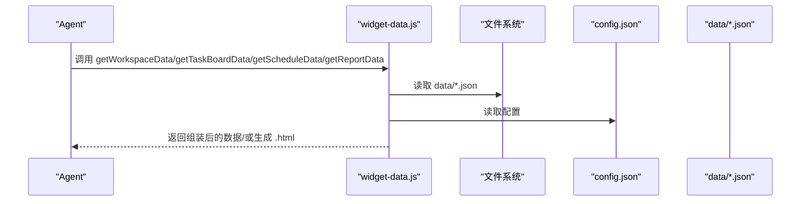

图表来源
- [_shared/scripts/widget-data.js: 48-L88:48-88](file://_shared/scripts/widget-data.js#L48-L88)
- [_shared/scripts/widget-data.js: 92-L105:92-105](file://_shared/scripts/widget-data.js#L92-L105)
- [_shared/scripts/widget-data.js: 109-L139:109-139](file://_shared/scripts/widget-data.js#L109-L139)
- [_shared/scripts/widget-data.js: 143-L168:143-168](file://_shared/scripts/widget-data.js#L143-L168)

章节来源
- [_shared/scripts/widget-data.js: 48-L168:48-168](file://_shared/scripts/widget-data.js#L48-L168)

### 配置写入器（config-writer.js）
- 统一写入模式
  - “读取→合并→写入”，避免覆盖其他字段；提供多商户类型支持（homestay/apartment/hotel/tcm-clinic）
- setup-state.json 同步
  - 更新 propertyType、步骤状态、最后修改时间；用于向导进度跟踪
- 校验与错误返回
  - 严格的字段校验（金额/电话/时间格式）与 fail() 统一错误返回

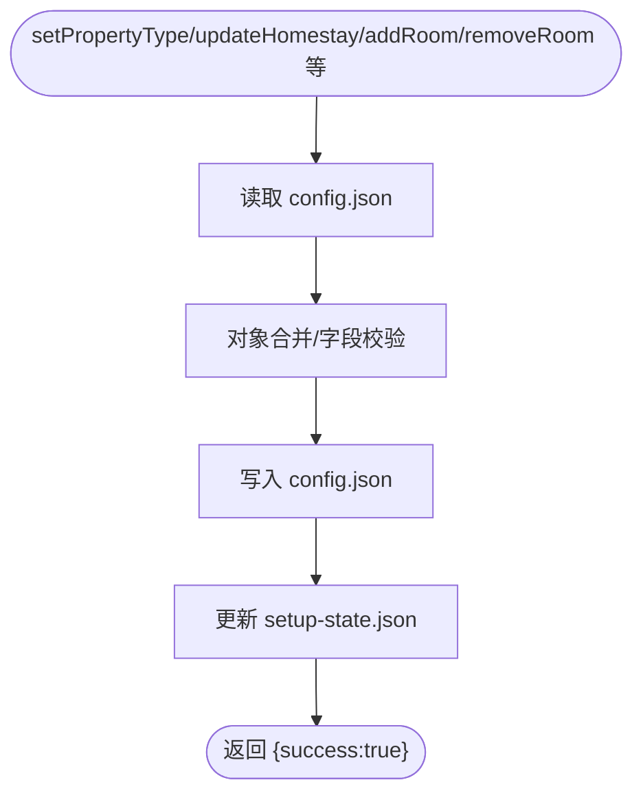

图表来源
- [_shared/setup/config-writer.js: 118-L135:118-135](file://_shared/setup/config-writer.js#L118-L135)
- [_shared/setup/config-writer.js: 152-L196:152-196](file://_shared/setup/config-writer.js#L152-L196)
- [_shared/setup/config-writer.js: 544-L558:544-558](file://_shared/setup/config-writer.js#L544-L558)

章节来源
- [_shared/setup/config-writer.js: 118-L196:118-196](file://_shared/setup/config-writer.js#L118-L196)
- [_shared/setup/config-writer.js: 544-L558:544-558](file://_shared/setup/config-writer.js#L544-L558)

### 浏览器初始化器（browser-init.js）
- Playwright 持久化上下文
  - 为各 OTA 平台保存登录态，避免重复登录
- 登录态检查
  - 通过页面文本特征判断登录状态；支持批量检查
- 与 OTA 读取器/操作器的协作
  - 为 ota-reader.js、ota-operator.js 提供已登录的浏览器上下文

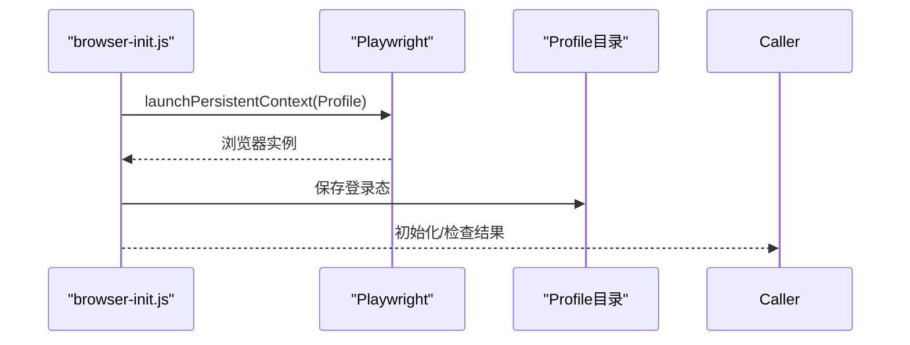

图表来源
- [_shared/scripts/browser-init.js: 153-L190:153-190](file://_shared/scripts/browser-init.js#L153-L190)
- [_shared/scripts/browser-init.js: 226-L287:226-287](file://_shared/scripts/browser-init.js#L226-L287)

章节来源
- [_shared/scripts/browser-init.js: 153-L287:153-287](file://_shared/scripts/browser-init.js#L153-L287)

### OTA 读取器（ota-reader.js）
- 平台适配
  - 携程/美团/飞猪/去哪儿/同程；DOM 结构待实测，当前返回“待实测”提示
- 数据合并存储
  - 将各平台数据按平台键合并写入 data/*.json
- 登录态校验与节流
  - 每平台采集间隔可配置；登录态过期时跳过该平台

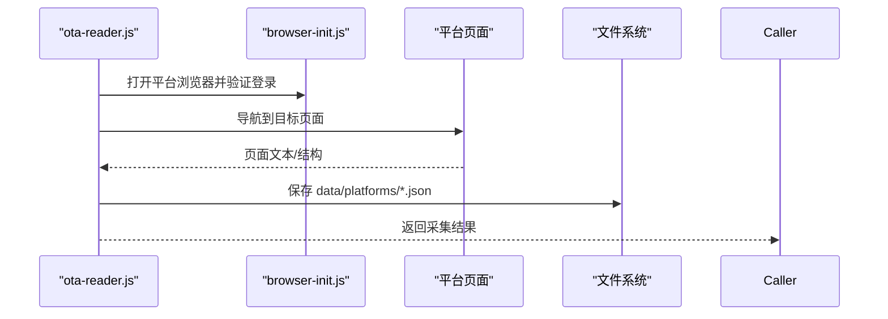

图表来源
- [_shared/scripts/ota-reader.js: 377-L394:377-394](file://_shared/scripts/ota-reader.js#L377-L394)
- [_shared/scripts/ota-reader.js: 412-L434:412-434](file://_shared/scripts/ota-reader.js#L412-L434)
- [_shared/scripts/ota-reader.js: 323-L345:323-345](file://_shared/scripts/ota-reader.js#L323-L345)

章节来源
- [_shared/scripts/ota-reader.js: 377-L434:377-434](file://_shared/scripts/ota-reader.js#L377-L434)
- [_shared/scripts/ota-reader.js: 323-L345:323-345](file://_shared/scripts/ota-reader.js#L323-L345)

### OTA 操作器（ota-operator.js）
- 写操作封装
  - 改价/关房/开房；每个操作前后截图存证；记录 operation-log.json
- 兜底策略
  - DOM 选择器未实测时返回 needsCalibration，并生成人工操作指引
- 批量执行与节流
  - 支持批量任务；受 operationRules 限制（最大批量、最小间隔）

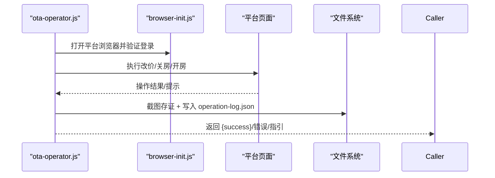

图表来源
- [_shared/scripts/ota-operator.js: 380-L450:380-450](file://_shared/scripts/ota-operator.js#L380-L450)
- [_shared/scripts/ota-operator.js: 658-L658:658-658](file://_shared/scripts/ota-operator.js#L658-L658)

章节来源
- [_shared/scripts/ota-operator.js: 380-L450:380-450](file://_shared/scripts/ota-operator.js#L380-L450)
- [_shared/scripts/ota-operator.js: 658-L658:658-658](file://_shared/scripts/ota-operator.js#L658-L658)

### 进销存（tcm-inventory/inventory.js）
- 数据文件
  - data/inventory.json；包含 products 与 transactions
- 核心能力
  - 新增产品、入库、出库扣减、低库存/临期检查、列表查询
- 与共享层的关系
  - 独立脚本，不直接依赖共享层配置；可在 Agent 中作为独立工具使用

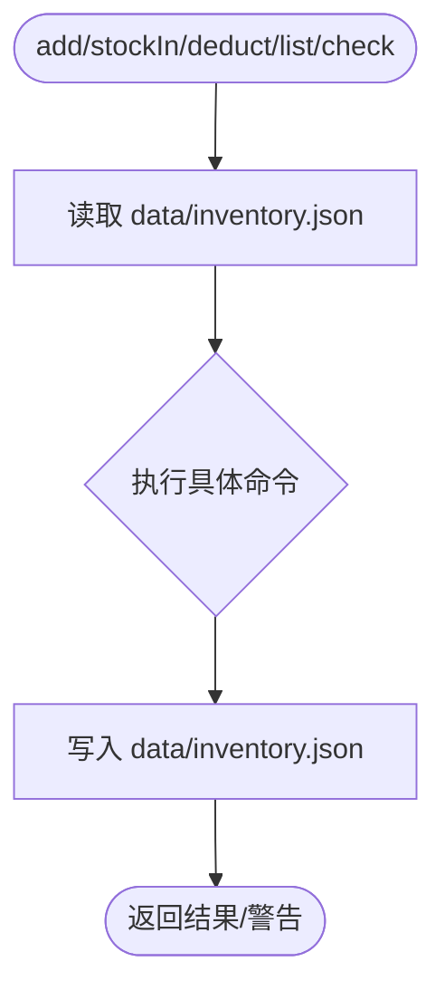

图表来源
- [tcm-inventory/scripts/inventory.js: 21-L32:21-32](file://tcm-inventory/scripts/inventory.js#L21-L32)
- [tcm-inventory/scripts/inventory.js: 47-L105:47-105](file://tcm-inventory/scripts/inventory.js#L47-L105)

章节来源
- [tcm-inventory/scripts/inventory.js: 21-L105:21-105](file://tcm-inventory/scripts/inventory.js#L21-L105)

## 依赖关系分析
- 组件内聚与耦合
  - task-manager.js、widget-data.js、notifier.js 通过 data/*.json 与 config.json 实现松耦合
  - ota-reader.js、ota-operator.js 依赖 browser-init.js 的登录态，形成“读/写器—初始化器”弱耦合
  - config-writer.js 与 setup-state.json 形成状态同步链路
- 外部依赖
  - Playwright 用于浏览器自动化（browser-init.js、ota-reader.js、ota-operator.js）
  - node-cron、exceljs 作为共享依赖（package.json）
- 循环依赖
  - 未发现循环依赖；数据文件单向流向清晰

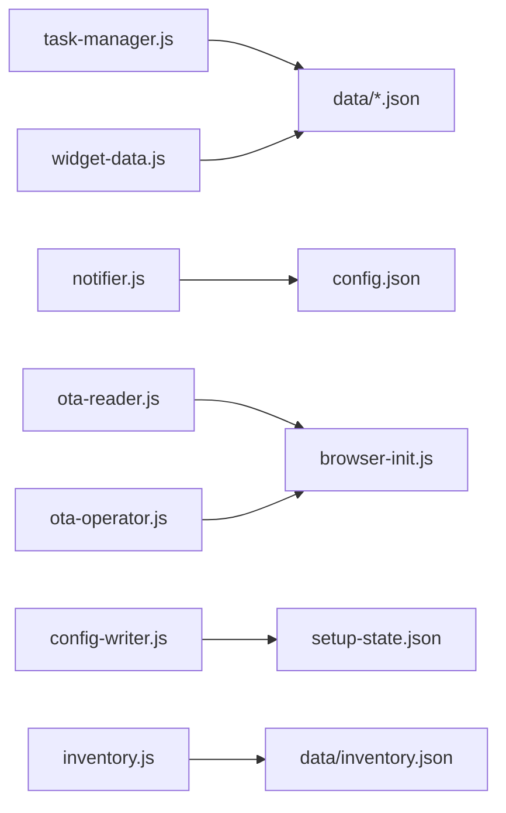

图表来源
- [_shared/scripts/task-manager.js:24-31](file://_shared/scripts/task-manager.js#L24-L31)
- [_shared/scripts/widget-data.js:32-34](file://_shared/scripts/widget-data.js#L32-L34)
- [_shared/scripts/notifier.js:23-31](file://_shared/scripts/notifier.js#L23-L31)
- [_shared/scripts/ota-reader.js:23-29](file://_shared/scripts/ota-reader.js#L23-L29)
- [_shared/scripts/ota-operator.js:18-26](file://_shared/scripts/ota-operator.js#L18-L26)
- [_shared/setup/config-writer.js:26-29](file://_shared/setup/config-writer.js#L26-L29)
- [tcm-inventory/scripts/inventory.js:17-26](file://tcm-inventory/scripts/inventory.js#L17-L26)

章节来源
- [_shared/package.json: 14-L18:14-18](file://_shared/package.json#L14-L18)

## 性能考量
- I/O 优化
  - 任务/面板/读取器均采用一次性读取/写入策略；建议在高频调用场景下增加内存缓存与批量写入
- 网络与浏览器
  - OTA 读取/操作涉及网络请求与页面渲染，建议合理设置等待与节流参数（config.json.operationRules/scraping）
- 存储与清理
  - operation-log.json 与 screenshots 需定期清理，避免磁盘膨胀

## 故障排查指南
- 通知未发送
  - 检查 config.json.notification.wechatWork.webhookUrl 是否配置；notifier.js 会在检测到 URL 时自动启用通知
- 登录态过期
  - 运行 browser-init.js check-all 检查；过期时重新 init
- OTA 操作失败
  - 查看 data/operation-log.json；关注 needsCalibration 标记；按兜底指引手动操作
- 配置写入失败
  - 使用 config-writer.js 的校验返回信息定位缺失字段或格式错误
- 环境问题
  - 运行 package.json scripts 中的检查脚本（如 check）获取环境状态

章节来源
- [_shared/scripts/notifier.js: 33-L53:33-53](file://_shared/scripts/notifier.js#L33-L53)
- [_shared/scripts/browser-init.js: 292-L322:292-322](file://_shared/scripts/browser-init.js#L292-L322)
- [_shared/scripts/ota-operator.js: 441-L449:441-449](file://_shared/scripts/ota-operator.js#L441-L449)
- [_shared/setup/config-writer.js: 107-L109:107-109](file://_shared/setup/config-writer.js#L107-L109)

## 结论
Skills 3 套件通过“共享层 + 功能域”的架构实现了高内聚、低耦合的组件交互：
- 共享脚本模块承担统一的数据与能力抽象，确保跨功能域的一致性
- 配置与状态通过 config.json 与 setup-state.json 串联，保障安装与运行状态的可视化与可追踪
- 事件驱动与回调模式贯穿通知、读取、操作等环节，提升自动化与可观测性
- 典型业务场景可通过上述组件协作图与时序图快速定位问题与扩展点

## 附录
- 典型业务场景：日终流程
  - 任务完成统计 → 通知推送 → 面板数据生成 → 下一步提醒
- 典型业务场景：竞品价格采集
  - browser-init.js 初始化消费者端登录 → ota-reader.js 采集 → widget-data.js 展示

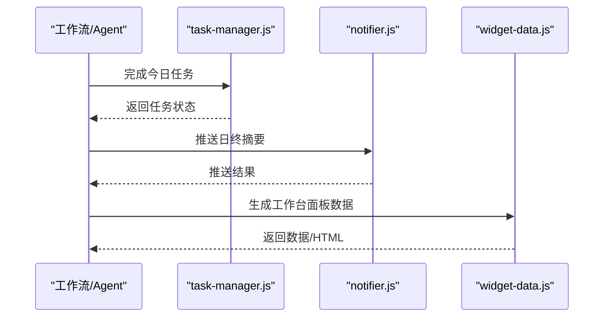

图表来源
- [_shared/scripts/task-manager.js: 104-L124:104-124](file://_shared/scripts/task-manager.js#L104-L124)
- [_shared/scripts/notifier.js: 197-L209:197-209](file://_shared/scripts/notifier.js#L197-L209)
- [_shared/scripts/widget-data.js: 48-L88:48-88](file://_shared/scripts/widget-data.js#L48-L88)