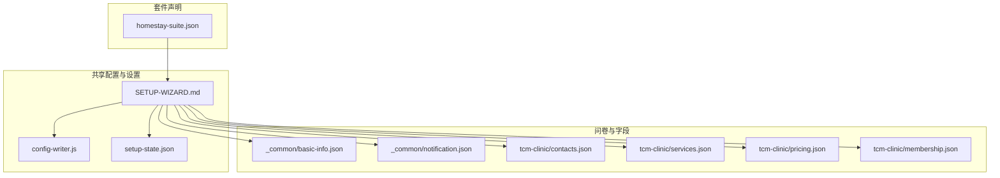
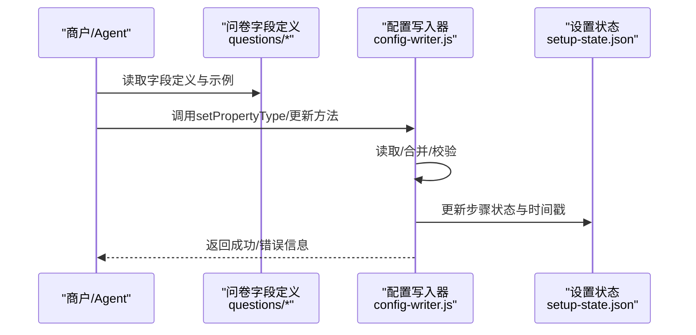
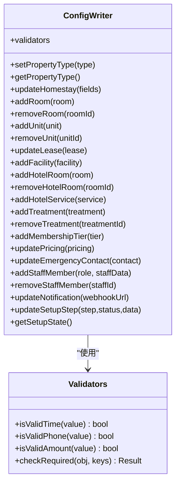
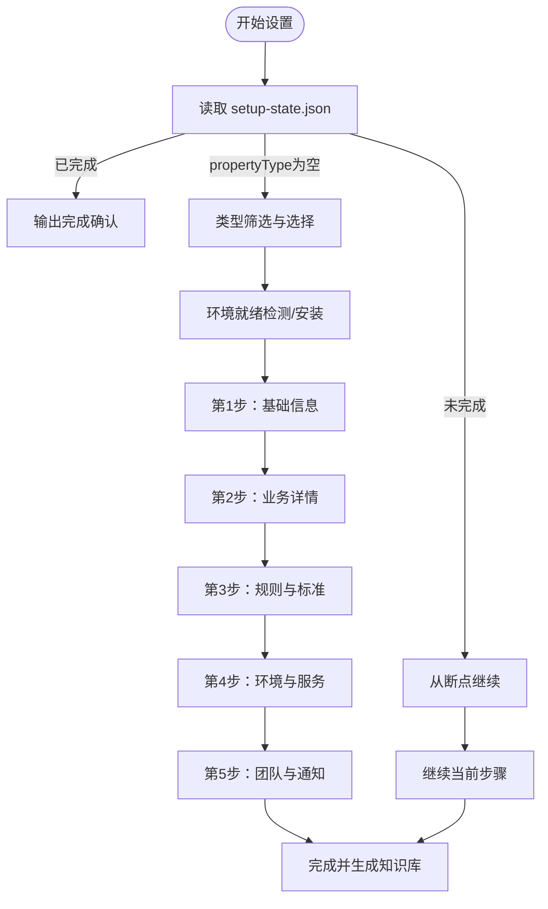
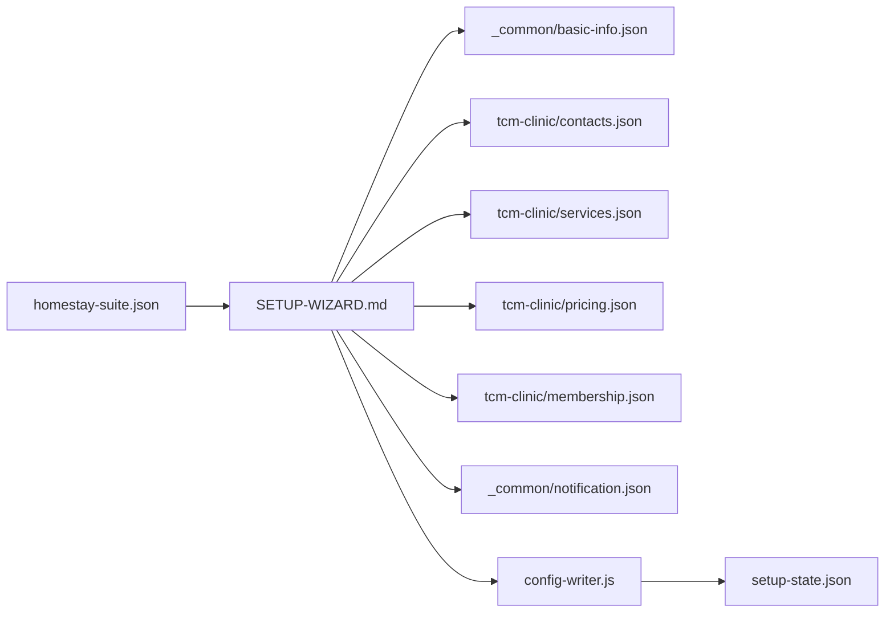

# 配置管理

<cite>
**本文档引用的文件**
- [config-writer.js](file://_shared/setup/config-writer.js)
- [setup-state.json](file://_shared/setup/setup-state.json)
- [SETUP-WIZARD.md](file://_shared/setup/SETUP-WIZARD.md)
- [basic-info.json](file://_shared/setup/questions/_common/basic-info.json)
- [notification.json](file://_shared/setup/questions/_common/notification.json)
- [contacts.json](file://_shared/setup/questions/tcm-clinic/contacts.json)
- [services.json](file://_shared/setup/questions/tcm-clinic/services.json)
- [pricing.json](file://_shared/setup/questions/tcm-clinic/pricing.json)
- [membership.json](file://_shared/setup/questions/tcm-clinic/membership.json)
- [homestay-suite.json](file://_shared/homestay-suite.json)
</cite>

## 目录
1. [简介](#简介)
2. [项目结构](#项目结构)
3. [核心组件](#核心组件)
4. [架构总览](#架构总览)
5. [详细组件分析](#详细组件分析)
6. [依赖分析](#依赖分析)
7. [性能考虑](#性能考虑)
8. [故障排查指南](#故障排查指南)
9. [结论](#结论)
10. [附录](#附录)

## 简介
本文件系统性阐述 Skills 3 套件的配置管理系统，涵盖配置文件结构、字段语义、配置规则、设置向导工作流、动态配置更新机制、版本与迁移策略、常见场景示例与最佳实践、验证与错误处理、备份恢复与调试方法，以及配置对业务逻辑的影响范围与优化建议。目标读者包括系统管理员、实施工程师与业务运营人员。

## 项目结构
配置管理涉及以下关键目录与文件：
- 配置写入器：_shared/setup/config-writer.js
- 设置状态：_shared/setup/setup-state.json
- 设置向导文档：_shared/setup/SETUP-WIZARD.md
- 问卷与字段定义：_shared/setup/questions/*
- 套件类型白名单：_shared/homestay-suite.json

图表来源
- [config-writer.js:1-603](file://_shared/setup/config-writer.js#L1-L603)
- [setup-state.json:1-17](file://_shared/setup/setup-state.json#L1-L17)
- [SETUP-WIZARD.md:1-631](file://_shared/setup/SETUP-WIZARD.md#L1-L631)
- [basic-info.json:1-10](file://_shared/setup/questions/_common/basic-info.json#L1-L10)
- [notification.json:1-12](file://_shared/setup/questions/_common/notification.json#L1-L12)
- [contacts.json:1-36](file://_shared/setup/questions/tcm-clinic/contacts.json#L1-L36)
- [services.json:1-8](file://_shared/setup/questions/tcm-clinic/services.json#L1-L8)
- [pricing.json:1-8](file://_shared/setup/questions/tcm-clinic/pricing.json#L1-L8)
- [membership.json:1-9](file://_shared/setup/questions/tcm-clinic/membership.json#L1-L9)
- [homestay-suite.json:1-7](file://_shared/homestay-suite.json#L1-L7)

章节来源
- [SETUP-WIZARD.md:27-48](file://_shared/setup/SETUP-WIZARD.md#L27-L48)
- [config-writer.js:23-30](file://_shared/setup/config-writer.js#L23-L30)

## 核心组件
- 配置写入器（config-writer.js）
  - 提供统一的“读取→合并→写入”模式，确保字段更新不互相覆盖。
  - 支持多商户类型：homestay、apartment、hotel、tcm-clinic。
  - 提供属性类型设置、通用联系人与员工管理、通知配置、以及各类业务实体的增删改方法。
  - 内置字段校验器：时间格式、电话号码、金额、必填字段检查。
  - 维护 setup-state.json 的最后修改时间与步骤状态。
- 设置状态（setup-state.json）
  - 记录版本、属性类型、完成状态、当前步骤、各步骤状态、时间戳等。
- 设置向导（SETUP-WIZARD.md）
  - 定义 5 步引导流程、类型筛选机制、断点续传、功能清单查询、一致性检查等。
- 问卷与字段（questions/*）
  - 以 JSON 结构定义每步采集的字段、适用类型、示例与结束信号。
- 套件类型白名单（homestay-suite.json）
  - 控制 Agent 展示的商户类型集合。

章节来源
- [config-writer.js:1-603](file://_shared/setup/config-writer.js#L1-L603)
- [setup-state.json:1-17](file://_shared/setup/setup-state.json#L1-L17)
- [SETUP-WIZARD.md:1-631](file://_shared/setup/SETUP-WIZARD.md#L1-L631)
- [homestay-suite.json:1-7](file://_shared/homestay-suite.json#L1-L7)

## 架构总览
配置管理采用“向导驱动 + 写入器集中管理”的架构：
- Agent 依据 SETUP-WIZARD.md 的流程与 questions/* 的字段定义，逐步采集商户信息。
- 采集完成后，Agent 调用 config-writer.js 的相应方法写入配置。
- 写入器保证字段合并与校验，同时更新 setup-state.json 的步骤与时间戳。
- 系统管理员可通过命令行或 Agent 操作进行动态配置更新与校验。

图表来源
- [SETUP-WIZARD.md:120-158](file://_shared/setup/SETUP-WIZARD.md#L120-L158)
- [config-writer.js:118-135](file://_shared/setup/config-writer.js#L118-L135)
- [config-writer.js:544-558](file://_shared/setup/config-writer.js#L544-L558)

## 详细组件分析

### 配置写入器（config-writer.js）
- 通用 IO
  - loadJSON：安全读取 JSON，空文件返回空对象，异常抛出明确错误。
  - saveJSON：确保目录存在，写入缩进格式 JSON。
  - touchSetupState：更新 setup-state.json 的 lastModifiedAt。
- 校验器
  - isValidTime：HH:MM 24 小时制。
  - isValidPhone：11 位手机号或带区号座机。
  - isValidAmount：正数（含字符串）。
  - checkRequired：检测必填字段缺失。
  - fail：统一返回 {success:false,error,...}。
- 属性类型管理
  - setPropertyType：写入 config.json.propertyType，并同步到 setup-state.json。
  - getPropertyType：读取当前属性类型。
- 民宿（homestay）
  - updateHomestay：合并基础信息块。
  - addRoom/removeRoom：校验必填与数值合法性，自动生成唯一 id。
- 公寓（apartment）
  - addUnit/removeUnit：校验必填与金额合法性。
  - updateLease：合并租约规则。
  - addFacility：校验必填。
- 酒店（hotel）
  - addHotelRoom/removeHotelRoom：校验价格与金额合法性。
  - addHotelService：校验必填与金额合法性。
- 中医馆（tcm-clinic）
  - addTreatment/removeTreatment：校验必填与金额合法性。
  - addMembershipTier：校验等级阈值金额。
  - updatePricing：合并收费标准。
- 通用
  - updateEmergencyContact：校验必填与电话格式。
  - addStaffMember/removeStaffMember：写入 staff.json，生成唯一 id。
  - updateNotification：启用通知并写入企业微信 Webhook。
- 设置状态
  - updateSetupStep/getSetupState：维护步骤完成状态与当前进度。

图表来源
- [config-writer.js:118-135](file://_shared/setup/config-writer.js#L118-L135)
- [config-writer.js:152-196](file://_shared/setup/config-writer.js#L152-L196)
- [config-writer.js:223-236](file://_shared/setup/config-writer.js#L223-L236)
- [config-writer.js:259-267](file://_shared/setup/config-writer.js#L259-L267)
- [config-writer.js:305-319](file://_shared/setup/config-writer.js#L305-L319)
- [config-writer.js:340-353](file://_shared/setup/config-writer.js#L340-L353)
- [config-writer.js:368-381](file://_shared/setup/config-writer.js#L368-L381)
- [config-writer.js:383-392](file://_shared/setup/config-writer.js#L383-L392)
- [config-writer.js:404-417](file://_shared/setup/config-writer.js#L404-L417)
- [config-writer.js:427-435](file://_shared/setup/config-writer.js#L427-L435)
- [config-writer.js:446-457](file://_shared/setup/config-writer.js#L446-L457)
- [config-writer.js:468-484](file://_shared/setup/config-writer.js#L468-L484)
- [config-writer.js:489-498](file://_shared/setup/config-writer.js#L489-L498)
- [config-writer.js:502-511](file://_shared/setup/config-writer.js#L502-L511)
- [config-writer.js:544-558](file://_shared/setup/config-writer.js#L544-L558)
- [config-writer.js:601](file://_shared/setup/config-writer.js#L601)

章节来源
- [config-writer.js:35-50](file://_shared/setup/config-writer.js#L35-L50)
- [config-writer.js:67-94](file://_shared/setup/config-writer.js#L67-L94)
- [config-writer.js:102-109](file://_shared/setup/config-writer.js#L102-L109)
- [config-writer.js:118-144](file://_shared/setup/config-writer.js#L118-L144)
- [config-writer.js:152-196](file://_shared/setup/config-writer.js#L152-L196)
- [config-writer.js:223-236](file://_shared/setup/config-writer.js#L223-L236)
- [config-writer.js:259-267](file://_shared/setup/config-writer.js#L259-L267)
- [config-writer.js:305-319](file://_shared/setup/config-writer.js#L305-L319)
- [config-writer.js:340-353](file://_shared/setup/config-writer.js#L340-L353)
- [config-writer.js:368-392](file://_shared/setup/config-writer.js#L368-L392)
- [config-writer.js:404-435](file://_shared/setup/config-writer.js#L404-L435)
- [config-writer.js:446-498](file://_shared/setup/config-writer.js#L446-L498)
- [config-writer.js:502-511](file://_shared/setup/config-writer.js#L502-L511)
- [config-writer.js:544-558](file://_shared/setup/config-writer.js#L544-L558)

### 设置向导（SETUP-WIZARD.md）
- 触发与原则
  - 首次对话、未完成设置、用户主动触发等条件自动进入引导。
  - 零技术术语、每步≤3 个核心问题、可中断可恢复、即时反馈、10 分钟内完成。
- 类型筛选
  - 读取 homestay-suite.json.setupTypes，仅展示白名单内的类型。
- 五步流程
  - 环境就绪、基础信息、业务详情、规则与标准、团队与通知。
- 断点续传与回退
  - 读取 setup-state.json，支持从断点继续与回退。
- 一致性检查
  - 引用脚本、问卷、状态文件与配置文件，缺失时输出诊断提示。

图表来源
- [SETUP-WIZARD.md:35-46](file://_shared/setup/SETUP-WIZARD.md#L35-L46)
- [SETUP-WIZARD.md:50-88](file://_shared/setup/SETUP-WIZARD.md#L50-L88)
- [SETUP-WIZARD.md:92-117](file://_shared/setup/SETUP-WIZARD.md#L92-L117)
- [SETUP-WIZARD.md:120-158](file://_shared/setup/SETUP-WIZARD.md#L120-L158)
- [SETUP-WIZARD.md:162-223](file://_shared/setup/SETUP-WIZARD.md#L162-L223)
- [SETUP-WIZARD.md:227-292](file://_shared/setup/SETUP-WIZARD.md#L227-L292)
- [SETUP-WIZARD.md:296-364](file://_shared/setup/SETUP-WIZARD.md#L296-L364)
- [SETUP-WIZARD.md:368-413](file://_shared/setup/SETUP-WIZARD.md#L368-L413)
- [SETUP-WIZARD.md:416-464](file://_shared/setup/SETUP-WIZARD.md#L416-L464)
- [SETUP-WIZARD.md:606-620](file://_shared/setup/SETUP-WIZARD.md#L606-L620)

章节来源
- [SETUP-WIZARD.md:1-631](file://_shared/setup/SETUP-WIZARD.md#L1-L631)
- [homestay-suite.json:1-7](file://_shared/homestay-suite.json#L1-L7)

### 问卷与字段定义（questions/*）
- 通用基础信息
  - merchantName、address、totalRooms、totalUnits、buildingCount、clinicArea、operatingHours。
- 通知配置
  - 企业微信群通知开关、Webhook 获取与测试消息。
- 中医馆联系人
  - 坐诊医师、前台电话、会员顾问、紧急联系人等。
- 中医馆业务与定价
  - 诊疗项目字段、收费标准字段、会员等级字段。

章节来源
- [basic-info.json:1-10](file://_shared/setup/questions/_common/basic-info.json#L1-L10)
- [notification.json:1-12](file://_shared/setup/questions/_common/notification.json#L1-L12)
- [contacts.json:1-36](file://_shared/setup/questions/tcm-clinic/contacts.json#L1-L36)
- [services.json:1-8](file://_shared/setup/questions/tcm-clinic/services.json#L1-L8)
- [pricing.json:1-8](file://_shared/setup/questions/tcm-clinic/pricing.json#L1-L8)
- [membership.json:1-9](file://_shared/setup/questions/tcm-clinic/membership.json#L1-L9)

## 依赖分析
- 组件耦合
  - SETUP-WIZARD.md 依赖 questions/* 与 config-writer.js 的方法签名。
  - config-writer.js 依赖 setup-state.json 与共享目录下的配置文件路径。
  - homestay-suite.json 作为类型白名单，影响 SETUP-WIZARD.md 的类型筛选。
- 外部集成
  - 通知 Webhook 与企业微信机器人对接。
  - 自动安装脚本与环境检测。

图表来源
- [SETUP-WIZARD.md:1-631](file://_shared/setup/SETUP-WIZARD.md#L1-L631)
- [config-writer.js:23-30](file://_shared/setup/config-writer.js#L23-L30)
- [setup-state.json:1-17](file://_shared/setup/setup-state.json#L1-L17)
- [homestay-suite.json:1-7](file://_shared/homestay-suite.json#L1-L7)

章节来源
- [SETUP-WIZARD.md:623-631](file://_shared/setup/SETUP-WIZARD.md#L623-L631)
- [config-writer.js:23-30](file://_shared/setup/config-writer.js#L23-L30)

## 性能考虑
- I/O 模式
  - 所有写入采用“读取→合并→写入”，避免频繁覆盖，降低并发冲突风险。
- 校验前置
  - 在写入前进行字段校验，减少无效写入与后续处理成本。
- 状态更新
  - touchSetupState 仅更新时间戳，避免重复写入大体量配置。
- 建议
  - 批量写入时尽量合并调用，减少多次磁盘 I/O。
  - 对高频读取的配置可引入进程内缓存（需在上层 Agent 层实现）。

## 故障排查指南
- 常见错误与处理
  - JSON 解析失败：检查文件是否存在、编码是否为 UTF-8、内容是否为合法 JSON。
  - 字段校验失败：根据 fail 返回的错误信息修正字段类型与格式。
  - 未找到实体：如删除房间/治疗项目/员工时，确认 id 是否正确。
  - 通知配置失败：核对 Webhook URL 格式与权限，使用测试消息验证。
- 调试方法
  - 使用 Agent 的“检查环境”触发环境检测脚本，定位缺失组件。
  - 查看 setup-state.json 的 currentStep 与 steps 状态，判断断点位置。
  - 逐步调用 config-writer.js 的方法，观察返回值与文件变化。
- 备份与恢复
  - 备份：定期复制 config.json、staff.json、setup-state.json。
  - 恢复：将备份文件覆盖到原路径，重启相关服务使配置生效。

章节来源
- [config-writer.js:42-44](file://_shared/setup/config-writer.js#L42-L44)
- [config-writer.js:107-109](file://_shared/setup/config-writer.js#L107-L109)
- [config-writer.js:198-207](file://_shared/setup/config-writer.js#L198-L207)
- [config-writer.js:383-392](file://_shared/setup/config-writer.js#L383-L392)
- [config-writer.js:489-498](file://_shared/setup/config-writer.js#L489-L498)
- [config-writer.js:502-511](file://_shared/setup/config-writer.js#L502-L511)
- [SETUP-WIZARD.md:623-631](file://_shared/setup/SETUP-WIZARD.md#L623-L631)

## 结论
本配置管理系统通过“向导+写入器”的设计，实现了对多商户类型的统一配置管理。其核心优势在于：
- 明确的字段约束与校验，保障配置质量。
- “读取→合并→写入”的幂等更新，避免覆盖风险。
- 完整的设置状态跟踪与断点续传，提升用户体验。
- 清晰的版本与迁移线索（setup-state.json 版本号），便于后续演进。

## 附录

### 配置文件结构与字段含义
- config.json（示例字段族）
  - propertyType：商户类型（homestay/apartment/hotel/tcm-clinic）。
  - homestay：民宿基础信息、房型数组、周边信息、规则文本等。
  - apartment：公寓基础信息、户型数组、租约规则、设施数组等。
  - hotel：酒店基础信息、房型数组、服务数组、规则文本等。
  - tcm：中医馆基础信息、诊疗项目数组、会员等级数组、收费标准等。
  - contacts：紧急联系人等。
  - notification：通知开关与企业微信配置。
  - data/staff.json：员工列表。
- setup-state.json
  - version、propertyType、completed、currentStep、steps、时间戳等。

章节来源
- [config-writer.js:27-29](file://_shared/setup/config-writer.js#L27-L29)
- [setup-state.json:1-17](file://_shared/setup/setup-state.json#L1-L17)

### 设置向导工作流程与配置收集机制
- 类型筛选：读取 homestay-suite.json.setupTypes，动态生成类型菜单。
- 环境检测：调用自动安装脚本，准备运行环境。
- 五步采集：基础信息、业务详情、规则与标准、环境与服务、团队与通知。
- 写入与状态：每步完成后调用 config-writer.js 方法写入，并更新 setup-state.json。

章节来源
- [SETUP-WIZARD.md:50-88](file://_shared/setup/SETUP-WIZARD.md#L50-L88)
- [SETUP-WIZARD.md:92-117](file://_shared/setup/SETUP-WIZARD.md#L92-L117)
- [SETUP-WIZARD.md:120-158](file://_shared/setup/SETUP-WIZARD.md#L120-L158)
- [SETUP-WIZARD.md:162-223](file://_shared/setup/SETUP-WIZARD.md#L162-L223)
- [SETUP-WIZARD.md:227-292](file://_shared/setup/SETUP-WIZARD.md#L227-L292)
- [SETUP-WIZARD.md:296-364](file://_shared/setup/SETUP-WIZARD.md#L296-L364)
- [SETUP-WIZARD.md:368-413](file://_shared/setup/SETUP-WIZARD.md#L368-L413)

### 动态配置更新的实现原理与使用方法
- 实现原理
  - 读取现有配置 → 合并新字段 → 写回文件 → 更新 setup-state.json。
  - 校验器在写入前执行，fail 返回标准化错误。
- 使用方法
  - Agent 调用对应方法（如 updateHomestay、addRoom、addStaffMember、updateNotification）。
  - 支持单字段更新与批量合并，保持其他字段不变。

章节来源
- [config-writer.js:118-135](file://_shared/setup/config-writer.js#L118-L135)
- [config-writer.js:152-196](file://_shared/setup/config-writer.js#L152-L196)
- [config-writer.js:446-498](file://_shared/setup/config-writer.js#L446-L498)
- [config-writer.js:502-511](file://_shared/setup/config-writer.js#L502-L511)

### 配置文件的版本管理与迁移策略
- 版本标识
  - setup-state.json.version 记录当前版本。
- 迁移策略
  - 新增字段：写入器采用“读取→合并→写入”，不会破坏既有字段。
  - 字段废弃：通过向导逐步替换，避免直接删除。
  - 兼容层：保留旧方法（如 addStaff/removeStaff），推荐使用新方法。

章节来源
- [setup-state.json:2](file://_shared/setup/setup-state.json#L2)
- [config-writer.js:525-535](file://_shared/setup/config-writer.js#L525-L535)

### 配置验证机制与错误处理策略
- 验证机制
  - 时间格式、电话号码、金额、必填字段检查。
- 错误处理
  - 统一返回 {success:false,error,...}，便于上层 Agent 识别与提示。
  - JSON 解析异常捕获并抛出明确错误信息。

章节来源
- [config-writer.js:67-94](file://_shared/setup/config-writer.js#L67-L94)
- [config-writer.js:102-109](file://_shared/setup/config-writer.js#L102-L109)
- [config-writer.js:42-44](file://_shared/setup/config-writer.js#L42-L44)

### 配置备份、恢复与调试方法
- 备份
  - 复制 config.json、staff.json、setup-state.json。
- 恢复
  - 将备份文件覆盖到原路径，重启相关服务。
- 调试
  - 使用“检查环境”与“继续设置”等触发词辅助定位问题。

章节来源
- [SETUP-WIZARD.md:623-631](file://_shared/setup/SETUP-WIZARD.md#L623-L631)

### 配置与业务逻辑的绑定关系与影响范围
- 民宿：房型、周边信息、规则文本影响智能客服、任务看板、OTA 竞品采集。
- 公寓：户型、租约条款、设施影响租金管理、报修工单、费用统计。
- 酒店：房型、服务、规则影响前台接待、客房状态、日终流程。
- 中医馆：诊疗项目、会员体系、收费标准影响轻量收银、会员管理、通知推送。

章节来源
- [SETUP-WIZARD.md:416-556](file://_shared/setup/SETUP-WIZARD.md#L416-L556)

### 配置场景示例与最佳实践
- 示例场景
  - 新增民宿房型：确保 type、price、inventory 等字段齐全并通过校验。
  - 配置通知：按向导指引获取 Webhook，发送测试消息验证。
  - 修改规则：通过“修改信息”菜单定位字段，Agent 解析后直接更新。
- 最佳实践
  - 优先使用向导采集，减少手工编辑。
  - 批量写入时合并字段，避免多次 I/O。
  - 定期备份配置文件，建立版本控制与回滚预案。

章节来源
- [SETUP-WIZARD.md:170-180](file://_shared/setup/SETUP-WIZARD.md#L170-L180)
- [SETUP-WIZARD.md:384-400](file://_shared/setup/SETUP-WIZARD.md#L384-L400)
- [SETUP-WIZARD.md:560-586](file://_shared/setup/SETUP-WIZARD.md#L560-L586)