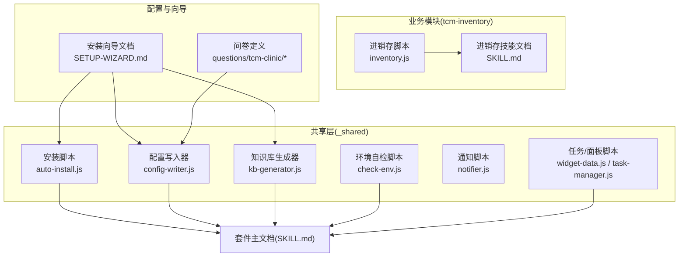
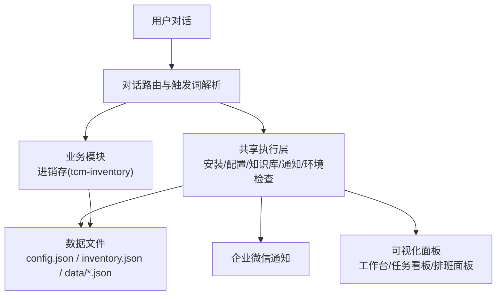
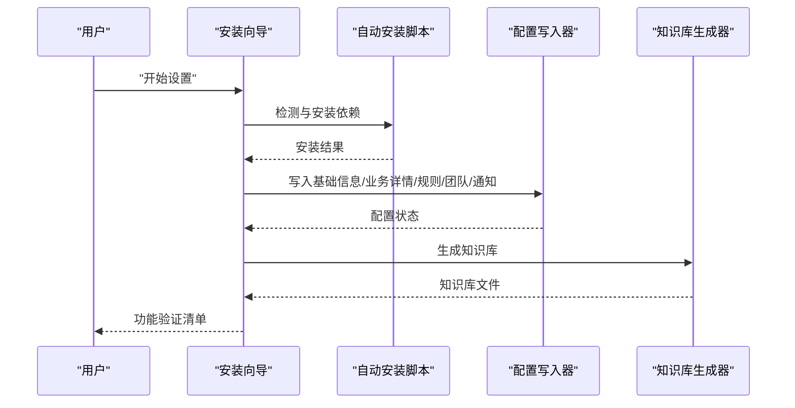
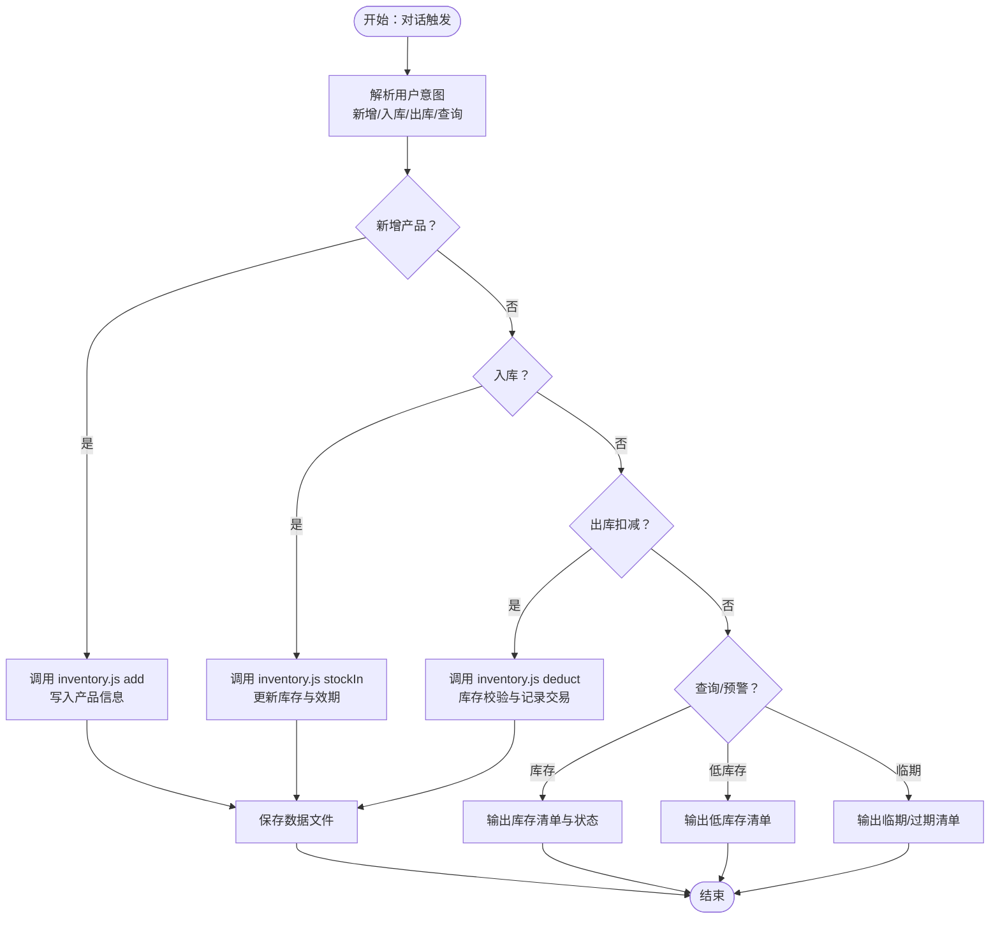
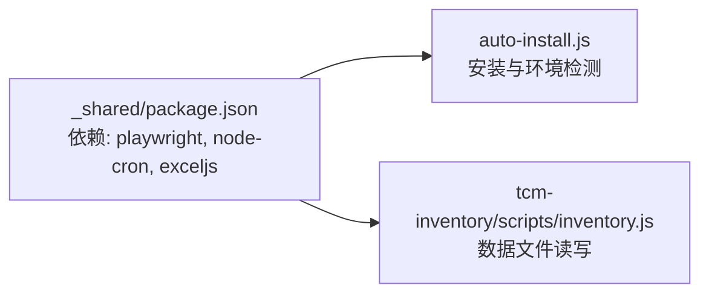

# 项目概述

<cite>
**本文档引用的文件**
- [README.md](file://README.md)
- [SKILL.md](file://SKILL.md)
- [_shared/package.json](file://_shared/package.json)
- [tcm-inventory/SKILL.md](file://tcm-inventory/SKILL.md)
- [_shared/setup/SETUP-WIZARD.md](file://_shared/setup/SETUP-WIZARD.md)
- [_shared/setup/config-writer.js](file://_shared/setup/config-writer.js)
- [_shared/scripts/auto-install.js](file://_shared/scripts/auto-install.js)
- [_shared/scripts/check-env.js](file://_shared/scripts/check-env.js)
- [_shared/setup/kb-generator.js](file://_shared/setup/kb-generator.js)
- [tcm-inventory/scripts/inventory.js](file://tcm-inventory/scripts/inventory.js)
- [_shared/setup/questions/tcm-clinic/services.json](file://_shared/setup/questions/tcm-clinic/services.json)
- [_shared/setup/questions/tcm-clinic/membership.json](file://_shared/setup/questions/tcm-clinic/membership.json)
- [_shared/setup/questions/tcm-clinic/pricing.json](file://_shared/setup/questions/tcm-clinic/pricing.json)
- [_shared/setup/questions/_common/notification.json](file://_shared/setup/questions/_common/notification.json)
</cite>

## 目录
1. [引言](#引言)
2. [项目结构](#项目结构)
3. [核心组件](#核心组件)
4. [架构总览](#架构总览)
5. [详细组件分析](#详细组件分析)
6. [依赖分析](#依赖分析)
7. [性能考虑](#性能考虑)
8. [故障排查指南](#故障排查指南)
9. [结论](#结论)
10. [附录](#附录)

## 引言
Skills 3 中医馆智能运营 Skill 套件是一套面向中医馆/诊所的轻量化、对话式智能运营解决方案。它以“安装即用”为核心理念，通过安装向导完成环境与配置初始化，随后提供无需后台即可使用的即时功能，并支持后续按需激活高级能力。套件围绕“轻量收银、会员管理、微信智能客服、诊疗项目管理、进销存管理”等核心能力构建，帮助中小中医馆实现降本增效与标准化运营。

- 项目版本与定位
  - 套件名称：中医馆智能运营 Skill 套件
  - 版本：v1.1.0（套件整体）
  - 核心功能清单：轻量收银 · 会员管理 · 微信智能客服 · 诊疗项目管理 · 进销存管理
  - 适用对象：中医馆/诊所

- 项目目标
  - 降低技术门槛：无需手工安装命令，自动环境检测与依赖安装
  - 提升运营效率：通过对话完成日常运营动作（收银、排班、通知、面板）
  - 保障可扩展性：即时功能与待激活功能分离，支持后续接入支付、公众号等能力

**章节来源**
- [README.md:1-5](file://README.md#L1-L5)

## 项目结构
项目采用“共享层 + 业务模块”的分层组织方式：
- 共享层（_shared）：提供安装、配置、知识库、通知、环境检查、面板数据等通用能力
- 业务模块（tcm-inventory）：提供中医馆进销存管理能力
- 套件主文档（SKILL.md）：定义触发词、功能行为与使用说明
- 安装向导（SETUP-WIZARD.md）：引导商户完成配置与知识库生成

**图表来源**
- [SKILL.md:1-379](file://SKILL.md#L1-L379)
- [_shared/setup/SETUP-WIZARD.md:1-631](file://_shared/setup/SETUP-WIZARD.md#L1-L631)
- [_shared/setup/config-writer.js:1-603](file://_shared/setup/config-writer.js#L1-L603)
- [_shared/scripts/auto-install.js:1-230](file://_shared/scripts/auto-install.js#L1-L230)
- [_shared/scripts/check-env.js:1-464](file://_shared/scripts/check-env.js#L1-L464)
- [_shared/setup/kb-generator.js:1-573](file://_shared/setup/kb-generator.js#L1-L573)
- [tcm-inventory/SKILL.md:1-210](file://tcm-inventory/SKILL.md#L1-L210)
- [tcm-inventory/scripts/inventory.js:1-178](file://tcm-inventory/scripts/inventory.js#L1-L178)

**章节来源**
- [SKILL.md:1-379](file://SKILL.md#L1-L379)
- [_shared/setup/SETUP-WIZARD.md:1-631](file://_shared/setup/SETUP-WIZARD.md#L1-L631)

## 核心组件
- 安装与环境初始化
  - 自动安装脚本负责 Node.js 版本与磁盘空间检测、npm 依赖安装、按需安装 Playwright 浏览器
  - 通过安装向导完成商户类型预选、基础信息、业务详情、规则与标准、团队与通知配置
- 配置与知识库
  - 配置写入器支持多商户类型字段写入与校验，保证配置一致性
  - 知识库生成器将结构化配置渲染为各类型知识库文件，供客服/问答使用
- 运营功能
  - 轻量收银：通过对话创建消费单据，与进销存联动
  - 会员管理：查询与维护会员信息、权益与消费记录
  - 微信智能客服：基于知识库与对话上下文自动回复
  - 诊疗项目管理：项目目录、定价与医生信息维护
  - 进销存管理：产品/服务目录、入库、出库扣减、库存预警与效期管理
- 面板与通知
  - 任务看板、工作台面板、排班面板等可视化输出
  - 企业微信通知：自动推送任务、订单、日报等

**章节来源**
- [_shared/scripts/auto-install.js:1-230](file://_shared/scripts/auto-install.js#L1-L230)
- [_shared/setup/SETUP-WIZARD.md:1-631](file://_shared/setup/SETUP-WIZARD.md#L1-L631)
- [_shared/setup/config-writer.js:1-603](file://_shared/setup/config-writer.js#L1-L603)
- [_shared/setup/kb-generator.js:1-573](file://_shared/setup/kb-generator.js#L1-L573)
- [tcm-inventory/SKILL.md:1-210](file://tcm-inventory/SKILL.md#L1-L210)

## 架构总览
套件采用“对话驱动 + 共享执行层 + 业务模块”的分层架构：
- 对话层：通过触发词与自然语言交互，路由到相应技能
- 共享执行层：提供安装、配置、知识库、通知、环境检查、面板数据等通用能力
- 业务模块：围绕中医馆运营场景提供具体功能（如进销存）

**图表来源**
- [SKILL.md:1-379](file://SKILL.md#L1-L379)
- [_shared/scripts/auto-install.js:1-230](file://_shared/scripts/auto-install.js#L1-L230)
- [_shared/setup/config-writer.js:1-603](file://_shared/setup/config-writer.js#L1-L603)
- [_shared/scripts/check-env.js:1-464](file://_shared/scripts/check-env.js#L1-L464)
- [tcm-inventory/scripts/inventory.js:1-178](file://tcm-inventory/scripts/inventory.js#L1-L178)

## 详细组件分析

### 安装向导与配置写入器
- 安装向导（SETUP-WIZARD）
  - 首次使用自动触发，支持“预选商户类型（仅中医馆）+ 环境检测与安装 + 5步采集 + 知识库生成 + 功能验证”
  - 支持断点续传、数据修正、功能清单动态查询
- 配置写入器（config-writer）
  - 提供多商户类型字段写入与校验（时间、电话、金额等）
  - 支持添加/删除员工、紧急联系人、通知配置、会员等级、诊疗项目等
  - 通过“读取→合并→写入”模式避免覆盖其他字段

**图表来源**
- [_shared/setup/SETUP-WIZARD.md:1-631](file://_shared/setup/SETUP-WIZARD.md#L1-L631)
- [_shared/scripts/auto-install.js:1-230](file://_shared/scripts/auto-install.js#L1-L230)
- [_shared/setup/config-writer.js:1-603](file://_shared/setup/config-writer.js#L1-L603)
- [_shared/setup/kb-generator.js:1-573](file://_shared/setup/kb-generator.js#L1-L573)

**章节来源**
- [_shared/setup/SETUP-WIZARD.md:1-631](file://_shared/setup/SETUP-WIZARD.md#L1-L631)
- [_shared/setup/config-writer.js:1-603](file://_shared/setup/config-writer.js#L1-L603)

### 进销存模块（tcm-inventory）
- 功能范围
  - 产品/服务目录：新增/修改/删除/查询
  - 入库：支持生产日期与有效期自动计算
  - 出库扣减：与收银联动，库存不足与低库存预警
  - 库存查询与预警：低库存阈值与临期预警（默认30天）
  - 效期管理：过期与临期提醒
- 数据文件
  - 产品清单与交易流水集中存储于共享数据目录，支持按分类与效期查询

**图表来源**
- [tcm-inventory/SKILL.md:1-210](file://tcm-inventory/SKILL.md#L1-L210)
- [tcm-inventory/scripts/inventory.js:1-178](file://tcm-inventory/scripts/inventory.js#L1-L178)

**章节来源**
- [tcm-inventory/SKILL.md:1-210](file://tcm-inventory/SKILL.md#L1-L210)
- [tcm-inventory/scripts/inventory.js:1-178](file://tcm-inventory/scripts/inventory.js#L1-L178)

### 环境自检与通知
- 环境自检（check-env）
  - 10项检查：基础环境、配置状态、功能组件、数据健康等
  - 支持按商户类型调整检查项与提示
- 通知（企业微信）
  - 通过配置写入器设置 Webhook，自检脚本可检测通知配置状态
  - 支持测试消息发送与修复建议输出

**章节来源**
- [_shared/scripts/check-env.js:1-464](file://_shared/scripts/check-env.js#L1-L464)
- [_shared/setup/questions/_common/notification.json:1-12](file://_shared/setup/questions/_common/notification.json#L1-L12)

## 依赖分析
- 共享层依赖
  - Playwright：用于需要浏览器的场景（民宿/酒店，中医馆可选）
  - node-cron：定时任务调度
  - exceljs：数据导出（如报表）
- 安装脚本依赖
  - 自动检测 Node.js 版本与磁盘空间，支持 npm install 重试与 Playwright 安装
- 业务模块依赖
  - 进销存模块依赖共享数据目录与配置文件

**图表来源**
- [_shared/package.json:1-20](file://_shared/package.json#L1-L20)
- [_shared/scripts/auto-install.js:1-230](file://_shared/scripts/auto-install.js#L1-L230)
- [tcm-inventory/scripts/inventory.js:1-178](file://tcm-inventory/scripts/inventory.js#L1-L178)

**章节来源**
- [_shared/package.json:1-20](file://_shared/package.json#L1-L20)
- [_shared/scripts/auto-install.js:1-230](file://_shared/scripts/auto-install.js#L1-L230)

## 性能考虑
- 安装阶段
  - npm install 支持最多3次重试，Playwright 下载超时可手动执行
  - 磁盘空间与 Node.js 版本检测避免后续运行时问题
- 数据访问
  - 进销存模块采用本地 JSON 文件存储，读写前进行存在性与格式校验
  - 查询与预警逻辑按需过滤，避免全量扫描带来的性能压力
- 可视化与通知
  - 面板与通知均为本地生成/推送，减少网络依赖

[本节为通用指导，无需特定文件引用]

## 故障排查指南
- 环境自检
  - 使用环境自检脚本输出10项检查结果，包含“基础环境/配置状态/功能组件/数据健康”四类
  - 根据提示修复依赖、配置、知识库、通知、数据文件等问题
- 常见问题
  - Node.js 版本过低：升级至要求版本以上
  - 依赖安装失败：检查网络与权限，重试或手动执行安装
  - 通知未生效：确认 Webhook 链接格式与有效性，发送测试消息验证
  - 数据文件异常：使用 JSON 修复脚本或重新运行安装向导

**章节来源**
- [_shared/scripts/check-env.js:1-464](file://_shared/scripts/check-env.js#L1-L464)

## 结论
Skills 3 中医馆智能运营 Skill 套件通过“安装即用”的设计与“共享执行层 + 业务模块”的架构，为中医馆提供了从环境初始化到日常运营的全链路支持。其核心优势在于：
- 低门槛：自动安装、向导式配置、无需后台即可使用
- 高效能：对话式收银、会员管理、智能客服、进销存联动
- 可扩展：即时功能与待激活功能分离，支持后续接入支付、公众号等能力

[本节为总结性内容，无需特定文件引用]

## 附录

### 版本与兼容性
- 套件版本：v1.1.0
- Node.js 版本要求：≥ 18
- 磁盘空间：≥ 500MB（可用空间）
- 商户类型：中医馆/诊所（当前默认类型）

**章节来源**
- [README.md:1-5](file://README.md#L1-L5)
- [_shared/scripts/auto-install.js:100-141](file://_shared/scripts/auto-install.js#L100-L141)

### 部署与使用要点
- 首次使用：在对话中说“开始设置”，自动完成安装与向导
- 环境检查：遇到问题时说“检查环境/状态检查/帮我检查/系统正常吗”
- 功能验证：完成向导后输出“功能清单”，查看即时可用与待激活功能
- 通知配置：按引导在企业微信创建群机器人并复制 Webhook 链接

**章节来源**
- [SKILL.md:341-351](file://SKILL.md#L341-L351)
- [_shared/setup/SETUP-WIZARD.md:384-400](file://_shared/setup/SETUP-WIZARD.md#L384-L400)